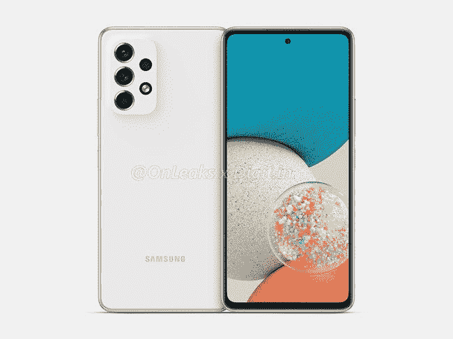

# 三星 Galaxy A53 5G vs 三星 Galaxy S21:买哪款手机？

> 原文：<https://www.xda-developers.com/samsung-galaxy-a53-5g-vs-samsung-galaxy-s21/>

三星 Galaxy A53 5G 对于任何想在美国花不到 500 美元买一部新手机的人来说都物超所值。它的整体设计很好，显示器令人印象深刻，性能可靠，价格合理，还有一套不错的相机。三星在软件方面也做出了一些重大承诺，这很好。所有这些确实使 Galaxy A53 5G 成为美国中端市场上最好的 Android 价值之一。但它如何与一些老旗舰竞争呢？我们先来快速看一下三星 Galaxy A53 5G vs [三星 Galaxy S21](https://www.xda-developers.com/samsung-galaxy-s21/)2022 年哪款手机更好。

Galaxy S21 可能不是三星旗舰系列中的最新手机，但它仍然是一款出色的手机，拥有快速的骁龙 888/Exynos 2100 芯片组和几个主要的 Android 操作系统更新。它可能不像 Galaxy A53 5G 那样在市场上容易买到，但你仍然可以从美国许多可靠的零售商和主要运营商那里买到它，甚至可以在二手设备上买到很多东西。但在 2022 年，这甚至值得考虑吗？或者你应该选择 Galaxy A53 5G 这样的中端机型？让我们找出答案。

**浏览这篇文章:**

## 三星 Galaxy A53 5G 与三星 Galaxy S21:规格

让我们快速浏览一下规格，看看这些器件都有哪些特点:

| 

**规格**

 | 

**三星 Galaxy A53 5G**

 | 

**三星 Galaxy S21**

 |
| --- | --- | --- |
| **构建** | 

*   塑性体
*   大猩猩玻璃 5 前面板
*   IP67 防水/防尘

 | 

*   铝制中框
*   塑料背面
*   大猩猩玻璃 Victus 正面
*   IP68 防水等级

 |
| **尺寸&重量** | 

*   159.6 x 74.8 x 8.1mm 毫米
*   189 克

 | 

*   151.7 x 71.2 x 7.9 毫米
*   171 克

 |
| **显示** | 

*   6.5 英寸 Super AMOLED
*   120 赫兹刷新率
*   无限显示

 | 

*   6.2 英寸 FHD+动态 AMOLED 2X 平板显示器
*   120Hz 可变刷新率
*   48-120 赫兹
*   HDR10+
*   1300 尼特峰值亮度
*   始终显示
*   无限显示

 |
| **SoC** |  | 

*   **国际:** Exynos 2100:
    *   1x ARM Cortex X1 @ 2.9GHz +
    *   3 个 ARM Cortex A78 内核，2.8GHz 以上
    *   4 个 ARM Cortex A55 内核@ 2.2GHz
*   美国:高通骁龙 888:
    *   1 个 Kryo 680 Prime 内核@ 2.84GHz
    *   3 个 Kryo 680 性能内核@ 2.4GHz
    *   4 个 Kryo 680 高效内核@ 1.8GHz

 |
| **风筒&储存** | 

*   6GB/8GB 内存
*   128GB/256GB 内部存储
*   microSD 卡插槽(最高 1TB)

 | 

*   8GB LPDDR5 + 128GB
*   8GB + 256GB

 |
| **电池&充电** | 

*   5000 毫安时电池
*   25W 超级快充
*   不含充电器

 | 

*   4000 毫安时
*   25W USB 供电 3.0 快充
*   15W 无线充电
*   4.5 反向无线充电
*   在大多数地区，包装盒中没有充电器

 |
| **安全** | 指纹传感器 | 超声波显示指纹扫描仪 |
| **后置摄像头** | 

*   64MP f/1.8 Main(带 OIS)
*   12MP f/2.2 超宽
*   5MP f/2.4 深度传感器
*   5MP f/2.4 微距

 | 

*   主镜头:1200 万像素，广角镜头，f/1.8，1/1.76 英寸，1.8 米，OIS，双像素自动对焦
*   次要:12MP，超广角镜头，f/2.2，120 FoV，1/2.55 英寸，1.4 米，定焦
*   第三代:6400 万像素，长焦镜头，f/2.0，1/1.76 英寸，0.8 米，OIS PDAF

 |
| **前置摄像头** | 32MP f/2.2 | 10MP，f/2.2，1.22 m，80 FoV，双像素自动对焦 |
| **港口** | 

*   USB 类型-C
*   没有耳机插孔

 |  |
| **音频** |  | 

*   AKG 的立体声扬声器
*   杜比大气

 |
| **连通性** | 

*   5G
*   长期演进
*   wi-Fi 802.11 a/b/g/n/AC(2.4G+5 GHz)
*   蓝牙 5.1

 | 

*   蓝牙 5.1
*   国家足球联盟
*   无线网络 6
*   5G

 |
| **软件** | One UI 4.1(安卓 12) | 基于 Android 11 的三星 One UI 3.1 |
| **其他特性** | 

*   四年的重大操作系统升级
*   五年的安全更新

 |  |

看看规格表，可以肯定地说，Galaxy A53 5G 在纸面上与 Galaxy S21 相比相当不错。两者之间有一些值得注意的差异，使一个看起来比另一个更好，但主要是 Galaxy A53 5G 似乎在显示器、电池、摄像头等许多领域都比 Galaxy S21 有优势。

## 设计和制造质量

从视觉上看，Galaxy A53 5G 和 Galaxy S21 看起来与 2022 年的任何其他现代手机都一样。Galaxy S21 有金属轨道，流入背面的摄像头凸起，类似于更昂贵的 [Galaxy S21 Ultra](https://www.xda-developers.com/samsung-galaxy-s21-ultra-preview-five-takeaways/) 。然而，值得指出的是，该公司已经用塑料取代了 S21 通常的后玻璃面板。这不一定是一个交易破坏者，因为它仍然看起来和感觉很好。另一方面，Galaxy A53 5G 的背部设计略有不同，摄像头凸起融入了手机机身。A53 5G 的背板和框架也使用了塑料，但令人惊讶的是，它仍然比 Galaxy S21 重。它重 189 克，而 S21 重 171 克。

与 A53 5G 相比，Galaxy S21 也更薄，整体尺寸更小。S21 的厚度为 7.9 毫米，而 A53 5G 的厚度为 8.1 毫米。Galaxy S21 也更短，因为它的正面显示屏更小。两款手机都有大猩猩玻璃来保护显示屏，但 Galaxy A53 5G 使用的是大猩猩玻璃 5，Galaxy S21 使用的是大猩猩玻璃 Victus。大猩猩玻璃 Victus 据说在耐用性方面稍好一些，但我们建议为这两款手机选择一个外壳或至少一个屏幕保护器。说到底，这是玻璃，如果受到严重撞击，它肯定会破碎或被划伤。你可以看看我们收集的[最佳 Galaxy S21 保护套](https://www.xda-developers.com/best-galaxy-s21-cases/)和 [Galaxy A53 5G 保护套](https://www.xda-developers.com/best-samsung-galaxy-a53-cases/)，找到一些不错的选择。

Galaxy S21 在整体耐用性方面也略胜一筹，因为它的防尘防水等级为 IP68。A53 5G 的 IP67 等级并没有落后太多，所以可以肯定地说，这两款手机都可以处理偶尔的水花和暴露在微小的灰尘颗粒中。我们非常喜欢 Galaxy A53 5G 的一点是，它支持通过 microSD 卡进行可扩展存储。它具有一个混合插槽，允许您添加第二张 SIM 卡或 microSD 卡。Galaxy S21 缺乏对可扩展存储的支持，这意味着你必须坚持使用你购买的存储变体。然而，这两款设备都没有耳机插孔，这在 A53 5G 中更令人失望，因为人们仍然在预算空间中错过了这个功能。

## 显示

就显示屏而言，Galaxy A53 5G 的面板比 S21 更大。我们正在为 Galaxy A53 5G 寻找 6.5 英寸的 Super AMOLED，而为 Galaxy S21 寻找 6.2 英寸的 FHD+动态 AMOLED 2X。它可能更小，但 Galaxy S21 的面板支持可变刷新率，而 Galaxy A53 5G 的显示屏则不支持。Galaxy S21 的动态 AMOLED 2X 显示屏可以根据手机上显示的内容从 48 赫兹到 120 赫兹。这应该有助于电池部门的 S21，我们将在本文稍后讨论。

正如你所看到的，这两款手机的显示屏前面都有一个居中对齐的打孔摄像头。Galaxy A53 5G 的挡板稍微大一点，但这不会困扰你，除非你并排比较它们。两款手机都是 AMOLED 面板，所以我们怀疑你是否会注意到两者在质量方面的任何显著差异。两种面板都支持最大 1080 x 2400 像素的屏幕分辨率，这意味着 S21 的每英寸像素(PPI)数量将会更高，因为它的物理尺寸更小。也就是说，当谈到整体锐度时，它们应该几乎没有区别。你还可以在两个设备上获得一个显示指纹扫描仪，所以也没有区别。

## 内部硬件

在内部，Galaxy A53 5G 正在动摇三星的内部 Exynos 1280 芯片组。这是一款八核芯片，具有以性能为导向的 Cortex-A78 内核，主频为 2.4GHz，以及高能效的 Cortex-A55 内核，主频为 2GHz。该芯片组适用于 Galaxy A53 5G 的所有型号，无论您在哪个地区购买。另一方面，Galaxy S21 由美国的骁龙 888 和其他地区的 Exynos 2100 驱动。骁龙 888 和 Exynos 2100 都是八核芯片。骁龙 888 配备了一个主频为 2.84GHz 的 X1 内核，三个主频为 2.40GHz 的 A78 性能内核和四个主频为 1.80GHz 的 A55 节能内核。另一方面，Exynos 2100 还配备了一个主频为 2.9GHz 的 X1 内核，三个主频为 2.8 GHz 的 Cortex-A78 内核和四个主频为 2.2 GHz 的 A55 内核。

这些芯片比 A53 5G 内部的 Exynos 1280 更好吗？如果你关心基准数据，那么是的。理论上，Exynos 1280 可能赶不上骁龙 888 和 Exynos 2100。也就是说，Exynos 1280 完全适合日常使用。事实上，大多数现代手机，包括中档设备，都能够轻松完成基本的日常工作。因此，这归结为个人偏好，以及你是否愿意用旗舰芯片组换取实惠的价格。然而，所有这些手机都支持 5G，所以没有任何区别。

Galaxy A53 5G 的基本版本配有 6GB 内存和 128GB 存储空间。Galaxy S21 的基本版本略好，因为它提供了 8GB 的 LPDDR5 RAM 和 128GB 的存储空间。A53 5G 通过支持可扩展存储弥补了这一不足。正如我们前面提到的，本次比较中的中端手机允许您添加高达 1TB 的 microSD 卡。遗憾的是，Galaxy S21 上没有这个选项，你只能被迫花更多的钱来增加存储空间。即便如此，你也只能拥有 256GB 的存储空间，如果你碰巧拍了很多照片或记录了很多 4K 的镜头，这可能还不够。

就电池而言，Galaxy A53 5G 包装了 5,000 mAh 电池，支持 f0r 25W 快充。S21 配备了 4000 毫安时的电池，在电池方面有点不足。它还支持 25W 快充，但较小的电池肯定会更快耗尽电量。值得指出的是，具有可变刷新率支持的动态 AMOLED 2X 可能会缓解一些电池问题，但我们怀疑它是否能在这里战胜 A53 5G。但值得一提的是，Galaxy S21 既支持无线充电，也支持反向无线充电，这在 Galaxy A53 5G 上完全没有。说到充电，我们要明确一点，这两个盒子里面都没有捆绑充电器，更不用说能快速充电的了。

## 照相机

相机是 Galaxy A53 5G 和 Galaxy S21 之间的另一个主要差异。对于 A53 5G，我们正在考虑一个四摄像头设置，包括一个 64MP 主摄像头，12MP 超宽摄像头和一对 5MP 微距和深度传感器。Galaxy S21 以三摄像头设置加入竞争，包括 12MP f/1.8 主摄像头，12MP f/2.2 超宽摄像头和 64MP f/2.0 长焦镜头。不过，只有 1200 万像素的主镜头和第三代长焦镜头配有 OIS。Galaxy A53 5G 本质上是用长焦镜头换取了两个 5MP 传感器，每个传感器用于微距和深度。至于自拍，Galaxy A53 5G 配备了 32MP 自拍相机，而 S21 配备了 10MP 相机。

理论上，这两款手机都提供了多功能的相机系统，尽管 S21 上的长焦镜头可以说更有用。不过，这并不是说 5MP 微距和深度传感器在 Galaxy A53 5G 上毫无意义。它们也能够捕捉一些你可能会错过的好照片，但我们认为长焦镜头在现实生活中更有意义。遗憾的是，我们还没有机会将这两款手机一起拍照，所以我们没有并排对比照片。也就是说，我们会在下面留下一些在两款手机上拍摄的相机样本，所以当你在这里的时候一定要检查它们。在视频方面，Galaxy S21 支持高达 60fps 的 4K 录制，击败了 A53 5G。Galaxy A53 5G 使用主摄像头的 4K 最高为 30fps，所以请记住这一点。

**三星 Galaxy A53 5G 相机样品**

**三星 Galaxy S21 相机样品**

## 三星 Galaxy A53 5G vs 三星 Galaxy S21:该买哪个？

我们认为这两款设备都有很多优点。与 Galaxy A53 5G 不同，三星 Galaxy S21 的显示屏较小，但支持可变刷新率，峰值亮度更高。它也由旗舰芯片组驱动，尽管已经有一年的历史了。与 A53 5G 相比，S21 的基本型号还能提供更多内存。它可能不是两者中最大的电池，但它支持快速充电和无线充电。我们还认为 Galaxy S21 上的相机设置更实用，因为长焦镜头可能比微距和深度传感器更常用。

然而，Galaxy A53 5G 在上述所有领域也配备齐全。您仍然可以获得相当强大和可靠的 Exynos 1280 芯片组来处理您的日常工作负载。它还通过支持高达 1TB 的可扩展存储弥补了基本版本的内存不足，这是 S21 完全没有的。Galaxy A53 5G 还配备了一块 5000 毫安的大电池，支持快速充电。就相机而言，我们认为 Galaxy A53 5G 也可以从所有相机传感器中捕捉到一些不错的图像。

与规格表所显示的相反，我们认为 Galaxy A53 5G 和 Galaxy S21 在不同的比较领域都保持了自己的优势。但如果我们要选择一款，那么我们会选择三星 Galaxy A53 5G，主要是因为软件支持和价格。Galaxy S21 已经一岁了，只剩下几个主要的 Android 操作系统更新，这意味着 Galaxy A53 5G 有更长的软件支持。三星表示，它将为 mid-ranger 提供四年的主要操作系统升级和五年的安全更新。因此，您不仅可以获得一个体面的硬件包，可以与 S21 这样的旗舰产品抗衡，还可以获得卓越的软件支持。更不用说，在美国和世界许多地方也很容易买到，价格也相对便宜。

我们认为 450 美元的 Galaxy A53 5G 比 2022 年的 Galaxy S21 更值得购买。这也是因为 Galaxy S21 目前在市场上还不容易买到。在撰写本文时，三星只在美国销售 675 美元的认证翻新版手机。你现在可以查看我们的 [Galaxy S21 交易页面](https://www.xda-developers.com/best-galaxy-s21-deals/)来获得一些折扣，但它可能不会低于 600 美元。相比之下，考虑到 Galaxy A53 5G 带来的一切，450 美元是一个惊人的价格。你甚至可以访问我们的 [Galaxy A53 5G 交易页面](https://www.xda-developers.com/best-samsung-galaxy-a53-deals/)，看看你是否能以更低的价格买到这款手机。但是如果你执意要买一部 Galaxy S 旗舰手机，那么考虑看看 Galaxy S21 FE 或者稍微伸展一下你的翅膀，拿一部 [Galaxy S22](https://www.xda-developers.com/samsung-galaxy-s22-review/) 来代替。

 <picture></picture> 

Samsung Galaxy S21

去年的 Galaxy S21 仍然是一款很棒的手机，拥有快速的骁龙 888/Exynos 2100 芯片组和两个主要的 Android 操作系统更新。

 <picture></picture> 

Samsung Galaxy A53 5G

##### 三星 Galaxy A53 5G

Galaxy A53 以实惠的价格提供了现代设计、大屏幕和电池