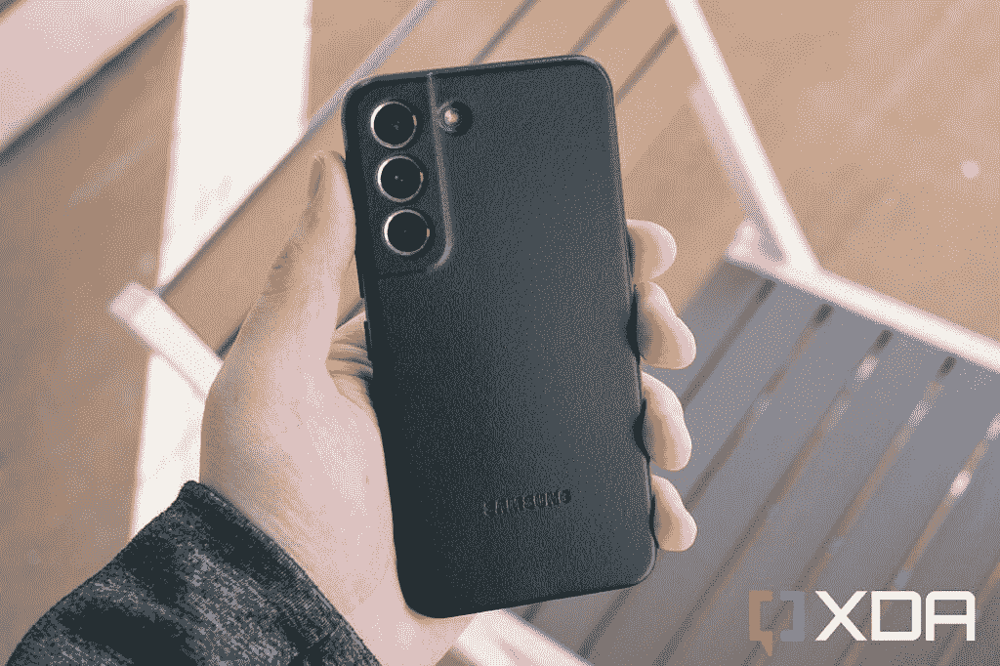
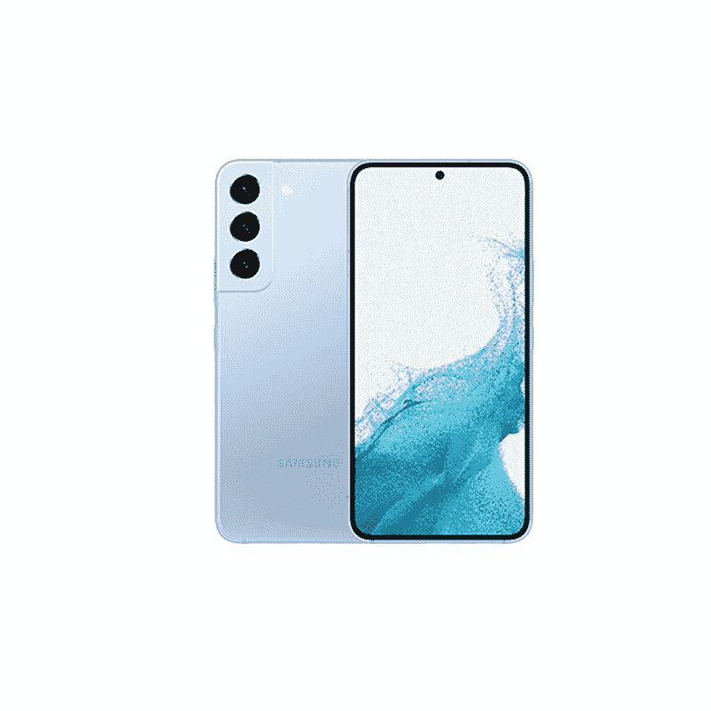

# 三星 Galaxy A53 5G 与三星 Galaxy S22:购买哪个更好？

> 原文：<https://www.xda-developers.com/samsung-galaxy-a53-5g-vs-samsung-galaxy-s22/>

三星的 Galaxy A53 5G 是一款物超所值的设备。正如我们在 [A53 5G 实践文章](https://www.xda-developers.com/samsung-galaxy-a53-5g-hands-on/)中提到的，这是目前在美国可以买到的最好的中型游侠之一。这款手机有很多令人喜欢的地方，包括它的设计、显示屏和 5000 毫安时的大电池。Galaxy A53 5G 借鉴了该公司旗舰 Galaxy S 系列的许多技巧，但它做出了一些妥协，以达到 450 美元的最佳价位。我们已经将 Galaxy A53 5G 与许多其他手机进行了比较，包括去年的 Galaxy S21。现在是时候看看三星 Galaxy A53 5G vs 三星 Galaxy S22 的玩法了，看看 2022 年买哪个更好，为什么？

Galaxy S22 属于三星目前的旗舰手机。在我们的 [Galaxy S22 评测](https://www.xda-developers.com/samsung-galaxy-s22-review/)中，我们解释了它对于 Android 领域的大多数人来说是一个安全的选择。这是一部可靠的手机，你可以在接下来的几年里继续使用。尽管如此，它的价格明显高于 Galaxy A53 5G。那么值得在新的 Galaxy S22 上挥霍吗？如果是，那么你得到了什么额外的功能？让我们找出答案。

**浏览这篇文章:**

## 规范

在我们详细比较之前，让我们先看一下规格表，看看它们在纸面上的对比情况:

| 

**规格**

 | 

**三星 Galaxy A53 5G**

 | 

**三星 Galaxy S22**

 |
| --- | --- | --- |
| **构建** | 

*   塑性体
*   大猩猩玻璃 5 前面板
*   IP67 防水/防尘

 | 

*   铝制中框
*   大猩猩玻璃 Victus+正面和背面
*   IP68 防水等级

 |
| **尺寸&重量** | 

*   159.6 x 74.8 x 8.1mm 毫米
*   189 克

 | 

*   146 x 70.6 x 7.6mm 毫米
*   非毫米波型号为 167 克
*   168g 用于毫米波型号

 |
| **显示** | 

*   6.5 英寸 FHD+ Super AMOLED
*   120 赫兹刷新率
*   无限显示

 | 

*   6.1 英寸 AMOLED 2X
*   2340 x 1080，425 ppi
*   HDR10+认证
*   120 赫兹刷新率

 |
| **SoC** |  | 

*   高通骁龙 8 第 1 代(美国，选择其他地区)
*   三星 Exynos 2200(大多数其他国家)

 |
| **风筒&储存** | 

*   6GB/8GB 内存
*   128GB/256GB 内部存储
*   microSD 卡插槽(最高 1TB)

 | 

*   128/256GB 内部存储
*   8GB LPDDR5 RAM

 |
| **电池&充电** | 

*   5000 毫安时电池
*   25W 超级快充
*   盒子里没有充电器

 | 

*   3700 毫安时电池
*   25W USB PD 3.0 PPS 有线充电
*   快速无线充电 2.0(仅适用于三星超快速无线充电器和超快速无线充电器 Duo)
*   无线 PowerShare(反向无线充电)

 |
| **安全** | 指纹传感器 | 超声波指纹传感器 |
| **后置摄像头** | 

*   64MP f/1.8 Main(带 OIS)
*   12MP f/2.2 超宽
*   5MP f/2.4 深度传感器
*   5MP f/2.4 微距

 | 

*   50MP 干线(F/1.8，1.0μm，85 FOV)，装箱
*   12MP 超宽(F/2.2/1.4 μm/120 FOV)
*   10MP 长焦(2.4/1.0 μm/36 FOV)

 |
| **前置摄像头** | 32MP f/2.2 | 100 万像素(2.2 微米/1.22 微米/80 FOV) |
| **港口** | 

*   USB 类型-C
*   没有耳机插孔

 | 

*   USB 类型-C
*   没有耳机插孔
*   没有 microSD 卡插槽

 |
| **音频** |  | 

*   立体声扬声器
*   蓝牙双音频

 |
| **连通性** | 

*   5G
*   长期演进
*   wi-Fi 802.11 a/b/g/n/AC(2.4G+5 GHz)
*   蓝牙 5.1

 | 

*   5G:非独立(NSA)，独立(SA)，Sub6 / mmWave
*   LTE:增强型 4×4 MIMO，最高 7CA，LTE Cat.20
*   wi-Fi 802.11 a/b/g/n/AC/ax(2.4/5/6 GHz)
*   蓝牙 v5.2
*   国家足球联盟
*   GPS，伽利略，格洛纳斯，北斗

 |
| **软件** | One UI 4.1(安卓 12) | 带有一个 UI 4.1 的 Android 12 |
| **其他功能** | 

*   四年的重大操作系统升级
*   五年的安全更新

 | 

*   承诺四大 Android 操作系统更新
*   五年的安全补丁

 |

## 设计和制造质量

Galaxy S22 是三星目前的旗舰产品，它采用优质的建筑材料进行更复杂的构建。在 Galaxy S21 的“glasstic”后面板外观之后，玻璃面板已经回归，现在整个东西感觉更加坚实。三星使用 Gorilla Glass Victus Plus 作为背板，而框架由铝制成。对于那些想知道的人来说，摄像头凸起不再无缝地融入轨道。尽管背板使用了玻璃，但 Galaxy S22 仍然比 Galaxy A53 5G 轻。

另一方面，三星 Galaxy A53 5G 大部分是由塑料制成的。这款手机的背板和框架都使用了塑料。三星在正面使用大猩猩玻璃 5 来保护显示屏。对于像 Galaxy A53 5G 一样昂贵的手机来说，设计和制造质量通常是事后才想到的，但谢天谢地这里不是这样。Galaxy A53 5G 的大部分外观和手感都很棒。它的低调和低调的方式有点不那么花哨，但它的设计和制造质量仍然有很多值得喜欢的地方。背面的摄像头模块融入了手机的机身，看起来与其他设备不同。

如果你倾向于购买更薄更轻的手机，那么你必须选择 Galaxy S22。厚度 7.6 毫米，重量 168 克。另一方面，Galaxy A53 5G 的厚度为 8.1 毫米，重量为 189 克。值得注意的是，Galaxy S22 的整体尺寸也更小。事实上，这是目前市场上为数不多的“紧凑型”安卓手机之一。

Galaxy S22 的防尘防水等级为 IP68，而 Galaxy A53 5G 的防护等级为 IP67。由于更好的 IP 等级，它在纸面上稍微更耐用，但它的正面和背面都使用了玻璃面板，这意味着它更容易破裂。我们建议使用[高质量的 Galaxy S22 保护套](https://www.xda-developers.com/best-samsung-galaxy-s22-cases/),以免您在跌落时前往服务中心。A53 5G 采用塑料背板，但你可能也想考虑为它使用一个外壳，所以从我们收集的[最佳 Galaxy A53 5G 外壳](https://www.xda-developers.com/best-samsung-galaxy-a53-cases/)中挑选一个。

 <picture></picture> 

Leather Case

这两款手机在底部都有一个 USB Type-C 端口和扬声器格栅。这两个都没有耳机插孔，所以在做出购买决定时要记住这一点。这意味着你将不得不依赖 USB Type-C 转 3.5 毫米适配器或无线耳塞来获取音频。Galaxy S22 也没有 microSD 卡插槽，但至少你可以在 Galaxy A53 5G 上保留它。

可以肯定地说，Galaxy A53 5G 和 Galaxy S22 看起来都很现代，整体构建质量也很好。但如果我们要选择一个，那么我们会选择 Galaxy S22，因为它的构建质量更高。由于其紧凑的外形，它对许多人来说也更有吸引力，但你可能会对此有不同的看法，因为许多人更喜欢使用塑料背的大手机。因此，我们将让您根据上面提到的几点来决定您最喜欢哪一个。

## 显示

至于显示屏，两款手机都采用了三星所谓的“Infinity-O”显示屏。这款手机的整个正面都被显示屏占据，显示屏有细长的边框，顶部中央有一个用于自拍相机的穿孔。Galaxy A53 5G 的边框明显更大，因为它底部的下巴也略大。然而，只要你不把这两款设备放在一起比较，这并不一定是一个障碍。Galaxy A53 5G 配备了 6.5 英寸 FHD+ Super AMOLED 面板，而 Galaxy S22 配备了 6.1 英寸 AMOLED 2X 显示屏，分辨率为 FHD+。Galaxy S22 的显示屏是两个分辨率相同的显示屏中较小的一个，在纸面上具有更高的每英寸像素(PPI)数。也就是说，它们在清晰度方面应该是完全相同的。

三星在 Galaxy S22 上使用了 AMOLED 2X，这意味着它覆盖了 48-120 Hz 的刷新率范围。然而，Galaxy A53 5G 不支持可变刷新率，因此固定在 120Hz。可变刷新率功能根据正在查看的内容调整屏幕刷新率。它有助于延长电池寿命，我们将在接下来的章节中详细讨论这一点。两者都是支持 HDR10+的 AMOLED 面板，所以你可以期待它们彼此并驾齐驱。三星因其智能手机使用高质量显示屏而闻名，我们预计这些设备也不会减少。这次比较中的两款手机都有一个平板显示器和一个相当可靠的显示指纹扫描仪，所以也要记住这一点。

## 内部硬件

Galaxy S22 在内部硬件方面更胜一筹，尽管这并不令人惊讶，因为它是一款旗舰手机。它由高通的骁龙 8 代 1 芯片组或 Exynos 2200 驱动，具体取决于地区。这两者之间没有太大的区别，但我们建议查看我们的 [Galaxy S22 Ultra 骁龙与 Exynos 变体比较](https://www.xda-developers.com/samsung-galaxy-s22-ultra-snapdragon-vs-exynos/)以了解更多信息。如果你关心基准数据，那么 Galaxy A53 5G 可能不适合你。这是因为它由三星内部的中端芯片组 Exynos 1280 驱动。

Exynos 1280 可能不是最快的芯片组，但它绝对足以为您的日常使用提供流畅的体验。Galaxy A53 5G 还具有 120Hz 的显示屏，这意味着用户体验将与 Galaxy S22 一样流畅和灵敏，前提是你不会将其推向极限。但如果你倾向于在性能方面获得不折不扣的体验，那么我们认为你应该坚持使用昂贵的旗舰产品。

Galaxy A53 5G 的基本型号配备了 6GB 的内存和 128GB 的存储空间，而 Galaxy S22 将在所有型号上为您提供 8GB 的内存。你还可以选择每款手机的 8GB + 256GB 版本，但只有 Galaxy A53 5G 支持通过 microSD 卡插槽进行可扩展存储。你可以给你的 Galaxy A53 5G 增加多达 1TB 的额外存储，但遗憾的是，Galaxy S22 上没有这个选项。这对许多人来说可能是一个障碍，尤其是那些倾向于使用大量应用程序和游戏，用手机拍摄大量照片和录制 4K 视频的人。能够为 A53 5G 添加 microSD 卡，即使这是以不能使用第二 SIM 卡为代价，也是存储部门的一个更好的选择。

谈到电池，Galaxy A53 5G 配备了 5000 毫安时电池，支持高达 25W 的快速充电。相比之下，Galaxy S22 的 3，700 mAh 电池感觉非常娇小，但它也可以快速充电，并支持无线充电。当然，S22 的显示屏相对较小，支持可变刷新率，但它仍然不会像 Galaxy A53 5G 的电池那样持续很长时间。根据你的使用情况，你很可能会在一天结束前为 Galaxy S22 充电。Galaxy A53 5G 显然是这一领域的赢家，尽管这款手机充满电可能需要更长时间。既然我们谈到了充电这个话题，我们认为这是一个很好的时机来提醒你，这两款手机都没有在包装盒内捆绑充电器。如果你没有备用充电器，你将不得不单独购买一个。

## 摄像机

三星 Galaxy A53 5G 配备了四后置摄像头设置，包括 64MP f/1.8 主摄像头、12MP f/2.2 超宽摄像头、5MP f/2.4 深度摄像头和 5MP f/2.4 微距摄像头。相比之下，Galaxy S22 采用了三摄像头设置，包括一个 50MP 主传感器(装箱)，以及两个用于超宽和长焦的 12MP 传感器。这里的长焦相机能够进行 3 倍光学变焦。所以 Galaxy A53 5G 本质上是用长焦镜头换来了深度和微距传感器。

我们还没有机会并排测试 Galaxy A53 5G 和 Galaxy S22 的相机，但我们会在这一部分的结尾留下一些相机样本供您查看。在光线充足的情况下，两款手机的相机样本都非常清晰和细致。然而，Galaxy A53 5G 在弱光下有点挣扎。另一方面，S22 在所有条件下都能胜任工作，无论是室内、室外还是弱光环境等。正如我们在 Galaxy S22 的评测中提到的，其低光相机性能与 Galaxy S22 Ultra 相当。S22 的长焦镜头上的 3 倍光学变焦不如 S22 Ultra 的好，但至少它是一个可供选择的选项。A53 5G 没有长焦相机，所以你完全错过了这些镜头。

总的来说，我们认为这两款手机都有一套非常通用的相机，但 S22 有我们所说的稍微更先进的系统。与微距和深度传感器相比，长焦相机在日常使用中也更有用。至于自拍，Galaxy A53 5G 上有一个 32MP 前置摄像头，S22 上有一个 10MP 摄像头。在视频方面，Galaxy S22 的主摄像头可以录制 8K@24fps 和 4K@60fps 的视频。Galaxy A53 5G 仅限于 4K@30fps 视频录制，所以请记住这一点。

**三星 Galaxy A53 5G 相机样品**

**三星 Galaxy S22 相机样品**

## 应该买哪个？

坦白地说，这个问题的答案很简单。两款手机在各自的细分市场都提供了非常好的体验。Galaxy A53 5G 可能不会在所有领域击败 Galaxy S22，但我们认为它在中端市场仍然物有所值。你会得到一部外观漂亮的手机，防护等级为 IP67，正面为 Gorilla Glass 5。它也有一个奇妙的显示屏，一个巨大的 5000 毫安时电池，可靠性能的体面内部，以及价格合理的多功能相机。对 Galaxy A53 5G 没有太多抱怨，但它缺乏 Galaxy S22 的技巧，并错过了一些关键领域。

有了 Galaxy S22，您可以获得三星的旗舰体验，它具有一流的设计和制造质量、出色的显示屏、一组出色的摄像头等等。与 A53 5G 相比，它更薄更轻，并且通过骁龙 8 Gen 1/Exynos 2200 芯片组获得了旗舰级的性能。然而，这两款手机在软件方面具有同等的地位，因为三星承诺为它们提供四个主要的 Android 操作系统更新和长达五年的安全更新。

所以这一切都归结于这些手机的价格和可用性。Galaxy A53 5G 和 Galaxy S22 在美国和许多其他地区都可以买到。但 Galaxy S22 显然更贵，是旗舰设备。如果你不介意现在花 800 美元买一部智能手机，那么我们认为你绝对应该选择 Galaxy S22。请记住，它的尺寸更小，因此您应该习惯使用它，或者至少愿意适应它带来的所有挑战。如果没有，那就考虑一下 [Galaxy S22 Plus](https://www.xda-developers.com/samsung-galaxy-s22-plus-review/) 吧。

但是，如果你希望物有所值，并且不介意用一些功能换取实惠的价格，那么 Galaxy A53 5G 不会让你失望。除了 Galaxy A53 5G，在美国以外的市场上，您可能还有其他一些中端选择可以考虑。但如果你在美国购买手机，那么 Galaxy A53 5G 确实物有所值。

不管你买的是哪一个，一定要停下来看看我们收集的[最佳 Galaxy S22 交易](https://www.xda-developers.com/best-samsung-galaxy-s22-deals/)和[最佳 Galaxy A53 5G 交易](https://www.xda-developers.com/best-samsung-galaxy-a53-deals/)页面，看看你是否能在购买时节省一些钱。你可以用这些节省下来的钱为 S22 买一个[屏幕保护器，或者为 Galaxy A53 5G](https://www.xda-developers.com/best-samsung-galaxy-s22-screen-protectors/) 买一个[配件。](https://www.xda-developers.com/best-samsung-galaxy-a53-chargers/)

 <picture></picture> 

Samsung Galaxy S22

三星 Galaxy S22 是 2022 年的入门级旗舰产品，以适合许多口袋和预算的形式带来了顶级的性能和相机功能。

 <picture></picture> 

Samsung Galaxy A53

##### 三星 Galaxy A53 5G

Galaxy A53 以实惠的价格提供了现代设计、大屏幕和电池