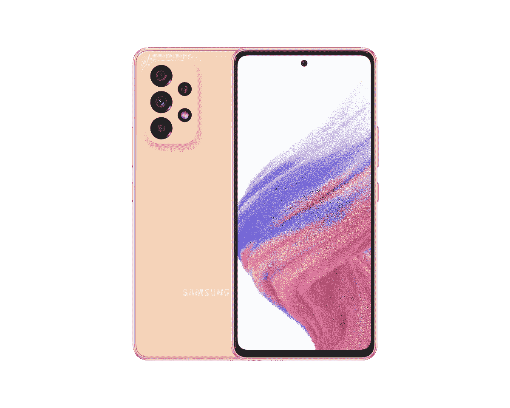

# 三星 Galaxy A53 5G 有双 SIM 卡支持吗？

> 原文：<https://www.xda-developers.com/samsung-galaxy-a53-dual-sim/>

三星 Galaxy A53 5G 是美国中端智能手机领域的顶级竞争者之一。正如我们在 [Galaxy A53 5G 实践](https://www.xda-developers.com/samsung-galaxy-a53-5g-hands-on/)中提到的，这是一款非常棒的设备，为这个价格范围内的经济型购物者提供了大量价值。这款设备有很多令人喜欢的地方，包括其巨大的 5，000 毫安时电池、适合日常使用的可靠 SoC、高质量的显示屏等等。现在，你可能想知道 Galaxy A53 5G 是否支持双 SIM 卡。嗯，你很幸运，因为你可以买到一款支持双 SIM 卡的三星 Galaxy A53 5G。

## 三星 Galaxy A53 5G 支持双卡

三星 Galaxy A53 5G 的所有解锁版本都支持双 SIM 卡。然而，运营商锁定的版本仅限于一张 SIM 卡。在未锁定型号的情况下，位于手机底部的 SIM 卡插槽可以接受两张 Nano-SIM 卡。第一个插槽接受标准的 Nano-SIM 卡，而第二个插槽是混合插槽，可以接受 Nano-SIM 卡或 microSD 卡。我们以前在许多其他智能手机中见过这种类型的混合 SIM 卡插槽，所以这不一定是新的。另外值得指出的是，Galaxy A53 5G 支持双卡双待(DSDS)，这意味着你可以在两张 SIM 卡上接收电话和消息。如今大多数双卡智能手机都支持双卡双待功能，所以这也不是什么新鲜事。

对于那些想知道的人，是的，三星 Galaxy A53 5G 也支持 microSD 卡进行扩展。您可以添加多达 1TB 的 microSD 卡，以进一步增加设备的整体存储容量。然而，值得指出的是，您可以在混合插槽上添加第二张 SIM 卡或 microSD 卡，而不是两者都添加。这意味着，如果你还想扩大手机的存储空间，你就不能利用双卡功能。如今，许多手机都支持 eSIM 作为一种变通方法，因为它不占用手机的物理空间，但这不是一个选项。

## 结束语

所以，问题的简短答案是，是的，三星 Galaxy A53 5G 支持双 SIM 卡，但只支持解锁版本。美国威瑞森、T-Mobile 和美国电话电报公司等公司的运营商锁定型号只有一张 SIM 卡和一个 microSD 卡插槽。这不是一个交易破坏者，但只是记住这一点，而作出购买决定。同样值得一提的是，三星尚未讨论 Galaxy A53 的 4G 版本。由于前代有 4G 版本，我们希望在未来的某个时候能看到一个。我们将密切关注 4G 版本，如果/当它正式发布时，我们将在本文中添加相关细节。

 <picture></picture> 

Samsung Galaxy A53 5G

##### 三星 Galaxy A53 5G

Galaxy A53 以实惠的价格提供了现代设计、大屏幕和电池

与此同时，如果你有兴趣购买 Galaxy A53 5G，那么一定要访问我们的[最佳三星 Galaxy A53 5G 交易](https://www.xda-developers.com/best-samsung-galaxy-a53-deals/)页面。我们还建议您查看我们收集的[最佳 Galaxy A53 保护套](https://www.xda-developers.com/best-samsung-galaxy-a53-cases/)，以保护它免受日常磨损。