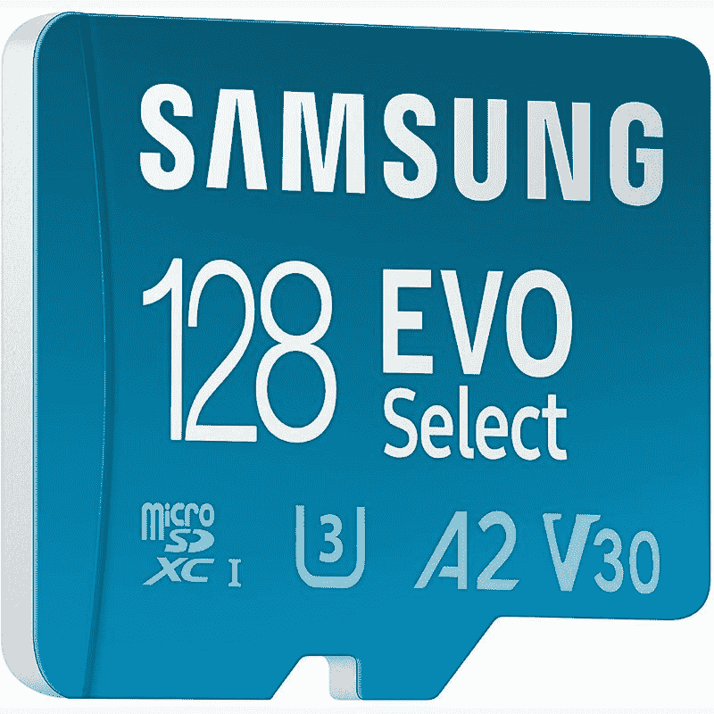

# 三星 Galaxy A53 5G 有 microSD 卡槽吗？

> 原文：<https://www.xda-developers.com/samsung-galaxy-a53-microsd/>

三星 Galaxy A53 在美国提供了足够的价值。它有一个令人印象深刻的规格表，包括许多伟大的功能，包括充满活力的显示屏，大电池，足够强大的 SoC，等等。但是三星 Galaxy A53 有 microSD 卡槽吗？是的，A53 5G 配备了一个 SD 卡插槽，用于可扩展存储。

## 三星 Galaxy A53: MicroSD 卡插槽

如今市场上的许多智能手机都缺少一些我们过去认为的“必需品”。我们谈论的功能包括 3.5 毫米耳机插孔、红外发射器和存储扩展等。这甚至适用于 2022 年的旗舰设备。然而，三星 Galaxy A53 5G 在存储方面是一个例外。它具有一个 microSD 卡插槽，您可以通过它为您的设备添加更多存储空间。microSD 卡的位置在 SIM 卡的对面。因此，您实际上是使用 SIM 弹出工具来弹出 SIM 托盘，以便添加 microSD 卡。

快速浏览一下三星 Galaxy A53 5G 的规格表就会知道，它支持高达 1TB 的可扩展存储。这是上限，这意味着你还可以添加 32，64，128，256 或 512GB 的 microSD 卡。这里有一个体面的 64GB 的 microSD 卡，我们建议挑选额外的存储空间。

 <picture></picture> 

SAMSUNG EVO Select Micro SD

##### 三星 EVO Select microSD

如果你正在寻找三星制造的东西，三星 EVO Select 是一个很好的选择。这种特殊的 microSD 卡容量高达 512GB，传输速度高达 130MB/s。

Galaxy A53 5G 不一定要用三星 microSD 卡。SanDisk、PNY 等厂商的其他卡。会工作得很好。

## 结束语

三星 Galaxy A53 5G 有两种存储配置——128 GB 和 256GB。我们认为 128GB 对大多数用户来说也足够了，他们只有几十个应用程序，并从网上或云端获得媒体修复。但如果你喜欢下载大量游戏，用手机拍摄大量照片和视频，那么你可能需要额外购买一张 microSD 卡。只要你可以选择添加一个 microSD 卡来扩展存储空间，你应该没有问题。正如我们前面提到的，许多智能手机不允许你添加 microSD 卡，并迫使你为存储容量更大的版本支付额外费用。我们很高兴三星为您提供了添加 microSD 卡的选项，至少在其预算产品中是如此。

 <picture></picture> 

Samsung Galaxy A53 5G

##### 三星 Galaxy A53 5G

三星 Galaxy A53 5G 带有一个 microSD 卡插槽。您可以添加多达 1TB 的 microSD 卡，以增加手机的整体存储容量。

如果你想买三星 Galaxy A53 5G，那么一定要看看其他一些收藏文章，包括[最佳 Galaxy A53 5G 交易](https://www.xda-developers.com/best-samsung-galaxy-a53-deals/)。你也可以考虑为 Galaxy A53 买一个[充电器](https://www.xda-developers.com/best-samsung-galaxy-a53-chargers/)和一个[外壳](https://www.xda-developers.com/best-samsung-galaxy-a53-cases/)。