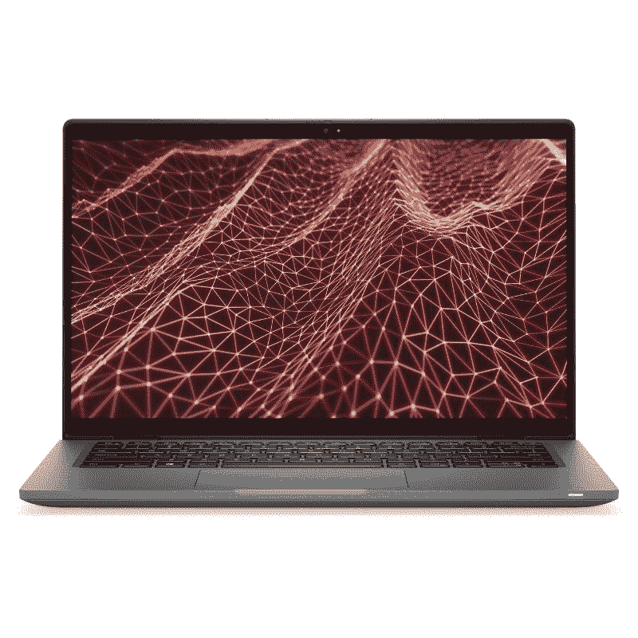

# 三星 Galaxy Book 2 商务版 vs 戴尔 Latitude 7430

> 原文：<https://www.xda-developers.com/samsung-galaxy-book-2-business-vs-dell-latitude-7430/>

三星 Galaxy Book 2 商务版是 2022 年进入商用笔记本电脑领域的最新选择之一。它采用英特尔新的第 12 代 Alder Lake 移动处理器，配有 14 英寸全高清显示屏、1080p 网络摄像头等。我们已经将这款笔记本电脑与市场上的其他商用笔记本电脑进行了比较。在本文中，我们将看看三星 Galaxy Book 2 Business 与戴尔 Latitude 7430 的对比，了解它们之间的竞争情况。Dell Latitude 7430 也将在 2022 年成为一款出色的商用笔记本电脑。它有翻盖式和二合一两种版本，也采用了英特尔新的第 12 代 Alder Lake 移动处理器。

**浏览本文:**

## 三星 Galaxy Book 2 商务版与戴尔 Latitude 7430:规格

在我们开始比较之前，让我们先来看看这些笔记本电脑的规格，看看它们带来了什么:

| 

规格

 | 

三星 Galaxy Book 2 商务

 | 

戴尔 Latitude 7430

 |
| --- | --- | --- |
| 中央处理器 | 

*   采用第 12 代英特尔酷睿 i5 或 i7 P 系列处理器的英特尔博锐处理器
*   特定地区的非博锐第 12 代英特尔酷睿 i3、i5 和 i7 型号

 | 

*   最高可配第 12 代英特尔酷睿 i7 博锐处理器、U15 处理器和 P 系列处理器

 |
| 制图法 | 

*   英特尔 UHD 显卡
*   英特尔 Iris Xe 显卡
*   NVIDIA GeForce MX570

 | 

*   英特尔 Iris Xe(集成)

 |
| 随机存取存储 | 

*   8GB，最高 64GB DDR4 (2 个插槽)

 | 

*   高达 32GB LPDDR5 4800MHz 双通道
*   高达 32GB DDR4 3200MHz 双通道

 |
| 储存；储备 | 

*   256GB，最高 1TB PCIe 第四代

 |  |
| 显示 | 

*   14 英寸，全高清，防眩光

 | 

*   **笔记本电脑/翻盖**
    *   14 英寸 16:9 FHD (1920 x 1080)，防眩光，250 尼特，45% NTSC
    *   14 英寸 16:9 FHD (1920 x 1080)，防眩光，300 尼特，72% NTSC
    *   14 英寸 16:9 FHD (1920 x 1080)，防眩光，300 尼特，72% NTSC，安全屏幕
    *   14 英寸 16:9 FHD (1920 x 1080)，防眩光，400 尼特，100% sRGB，超低功耗，低蓝光，ComfortView Plus
*   **二合一**
    *   14 英寸 16:9 FHD (1920 x 1080)，防反光，防脏，300 尼特，100% sRGB，超低功耗，康宁大猩猩玻璃 6 DX，支持触摸和笔

 |
| 电池 |  | 

*   3 芯 41 瓦时电池
*   4 芯 58 瓦时电池
    *   高达 90W 的 USB Type-C 电源适配器

 |
| 港口 | 

*   1 个雷电 4
*   1 个 USB Type-C
*   2 个 USB 类型 A
*   1 个 HDMI 2.0 接口
*   RJ45
*   3.5 毫米耳机插孔
*   SIM 卡插槽(在部分地区)

 | 

*   2 个 Thunderbolt 4(USB C 型)
*   1 个 USB 3.2 第 1 代 A 型
*   1 个 HDMI 2.0 接口
*   3.5 毫米耳机插孔
*   microSD 读卡器
    *   可选:Nano-SIM 卡插槽
    *   可选项:智能卡读卡器(已联系)

 |
| 声音的 | 

*   立体声扬声器，杜比全景声

 | 

*   带 Waves MaxxAudio Pro 的双扬声器
*   双降噪麦克风

 |
| 网络摄像头 |  | 

*   带相机快门的 720p 高清网络摄像头
*   1080p 全高清+红外摄像头，带戴尔快速登录、智能隐私、环境光传感器和摄像头快门

 |
| 安全性 | 

*   红外照相机
*   指纹电源键

 | 

*   红外网络摄像头(可选)
*   指纹传感器(可选)

 |
| 连通性 | 

*   Wi-Fi 6E
*   蓝牙 5.2
*   LTE(在特定地区)

 | 

*   英特尔无线 6E
*   蓝牙 5.2
*   蜂窝选项:
    *   5G 子 6
    *   4G LTE 16 类/9 类

 |
| 尺寸(宽高比) | 

*   326.4 x 213.8 x 19.92 毫米(12.85 x 8.41 x 0.78 英寸)

 | 

*   321.35 x 208.69 x 17.27 毫米(12.65 x 8.22 x 0.68 英寸)

 |
| 重量 | 

*   起始重量为 1.51 千克(3.32 磅)

 | 

*   笔记本电脑:起始重量为 1.22 千克(2.69 磅)
*   2 合 1 设备:起始重量为 1.35 千克(2.97 磅)

 |
| 价格 |  |  |

## 表演

三星 Galaxy Book 2 Business 和戴尔 Latitude 7430 笔记本电脑都采用了英特尔新的第 12 代处理器。虽然三星正在为 Galaxy Book 2 业务使用 Alder Lake P 系列芯片，但戴尔 Latitude 7430 可以配置 U 系列(15W)和 P 系列芯片。还值得指出的是，一些地区可能会获得采用非博锐芯片的 Galaxy Book 2 业务。

我们不希望看到英特尔新的 P 系列和 U 系列移动芯片之间的性能有巨大差异。迄今为止，它们都比我们从英特尔看到的任何东西都有显著的改进。所有新的 Alder Lake 移动芯片都采用混合内核架构，结合了性能(P)内核和效率(E)内核，在性能和能效之间实现了良好的平衡。与 15W U 系列芯片相比，28W P 系列芯片的性能肯定会稍好一些，所以在做出购买决定时请记住这一点。我们建议您查看我们的 [P 系列与 U 系列对比](https://www.xda-developers.com/intel-12th-gen-p-vs-u-series/),了解它们之间的差异。

关于 Galaxy Book 2 业务还有一点值得指出的是，它还可以配置 NVIDIA GeForce MX570 独立显卡。除此之外，英特尔 UDH 和英特尔 Iris Xe 显卡是英特尔处理器的标准选项。另一方面，Dell Latitude 7430 只配备了英特尔 Iris Xe 显卡。话虽如此，你将不得不花费更多，并获得 Galaxy Book 2 业务的高端版本，以获得 MX570 升级。

至于内存和存储，您为 Galaxy Book 2 Business 配置了高达 64GB 的 DDR4 内存，而 Latitude 7430 只配备了高达 32GB 的 RAM。但是，您可以选择 LPDDR5 或 DDR4 内存模块。如果您的预算允许，我们建议您选择 LPDDR5 内存，尽管您也不会错过太多 DDR4 内存。说到存储，这两款笔记本电脑都可以购买高达 1TB 的 PCIe 第四代固态硬盘，因此没有区别。

谈到电池寿命，三星 Galaxy Book 2 Business 配备了 51.5 瓦时的电池，而戴尔 Latitude 7430 配备了 41 瓦时或 58 瓦时的电池。很难评论这些笔记本的电池寿命，因为我们还没有机会使用它们，但你可以期待它们是不相上下的。如果您选择 15W 处理器，Latitude 7430 的电池续航时间可能会更长。还值得一提的是，Latitude 7430 捆绑了 90W USB Type-C 充电器，而 Galaxy Book 2 Business 捆绑了 65W USB Type-C 充电器。

## 显示

三星 Galaxy Book 2 商务版配备 14 英寸全高清 LED 显示屏，长宽比为 16:9。这是 Galaxy Book 2 业务的唯一显示选项，无论您购买的是哪种型号。另一方面，Dell Latitude 7430 将允许您在一系列支持不同峰值亮度和色域覆盖的 14 英寸 FHD 显示器之间进行选择。事实上，您还可以选择康宁大猩猩玻璃 6 DX 和笔支持。我们必须将 Latitude 7430 作为首选，因为您有更多的选项可供选择。

我们想指出的另一点是，这两款笔记本电脑都有 16:9 的宽高比面板，而不是更现代的 16:10 宽高比。如果有更高的长宽比就更好了，因为它更适合生产力。然而，这两种机器都没有这个选项。如果你有兴趣购买一台 16:10 面板的笔记本电脑，你必须看看其他一些设备，如 HP EliteBook 840 G9。

 <picture></picture> 

Samsung Galaxy Book 2 Business

Galaxy Book 2 Business 和 Dell Latitude 7430 笔记本电脑都可以购买带有红外支持的 1080p 网络摄像头。虽然这是 Galaxy Book 2 业务所有型号的标准选项，但 Latitude 7430 的基本型号上只有一个 720p 高清摄像头。你必须升级到 1080p 网络摄像头才能获得红外摄像头，所以记住这一点。然而，Latitude 7430 配备了一系列其他隐私功能，包括相机快门。本次比较中的两款笔记本电脑都有一个指纹扫描仪作为额外的身份验证方法，尽管它在 Latitude 7430 上只是一个可选功能，而 Galaxy Book 2 Business 的所有型号都默认具有该功能。

## 设计和端口

看一下规格表，可以肯定地说 Latitude 7430 是两者中更薄更轻的笔记本。它的厚度为 0.68 英寸，起始重量为 1.22 克。Galaxy Book 2 Business 的厚度为 0.78 英寸，重量为 1.51 千克。就整体外形而言，两者之间没有显著差异，但如果你关心厚度和重量，你应该知道应该买哪一款。正如我们前面提到的，戴尔 Latitude 7430 有翻盖式和 2 合 1 可转换版本，而 Galaxy Book 2 Business 只有翻盖式笔记本电脑。因此，如果你正在寻找一台 2 合 1 商务笔记本电脑，那么 Galaxy Book 2 业务将自动退出竞争。

至于审美，我们会说这是一场势均力敌的竞争。戴尔的 Latitude 笔记本电脑在整体设计方面取得了很大进步，Latitude 7430 看起来当然更现代。它还有两种表面可选——铝(银色)和碳纤维(黑色)。Galaxy Book 2 Business 也有一个最小的设计，但它只有一种颜色可供选择，即石墨色。

接下来是端口，Galaxy Book 2 Business 配备了一个 Thunderbolt 4 端口、一个 USB Type-C 端口、两个 USB Type-A 端口、一个 HDMI 2.0 端口、一个 RJ45 以太网端口、一个 3.5 毫米耳机插孔和一个可选的 SIM 卡插槽。Dell Latitude 7430 具有两个 Thunderbolt 4 USB Type-C 端口、一个 USB 3.2 Gen 1 Type-A 端口、一个 HDMI 2.0 端口、一个 3.5 毫米耳机插孔、一个 microSD 读卡器以及一个可选的 SIM 卡和智能卡读卡器。Latitude 7430 实际上是用 RJ45 以太网端口换了一个 microSD 卡，这取决于您的个人偏好。关于 Galaxy Book 2 业务需要注意的一点是，SIM 卡插槽仅在欧洲等特定地区可用。即使这样，你也只能获得对 4G LTE 的支持，而不是 5G。因此，如果您在美国购买这些笔记本电脑，那么如果您需要 5G 或 4G LTE 连接，您可能最好购买 Dell Latitude 7430。除此之外，这两款笔记本电脑都支持 WiFi 6E 和蓝牙 5.2 作为标准连接选项。

## 三星 Galaxy Book 2 商务 vs 戴尔 Latitude 7430:该买哪个？

这又是两款不错的 14 寸笔记本之间的一次势均力敌。本次比较中的两款笔记本电脑都采用了全新的第 12 代英特尔酷睿处理器，非常出色。我们也喜欢戴尔为那些不一定需要超级强大的笔记本来处理工作负载的人提供 U 系列机型的方式。但是如果性能对你来说很重要，那么请考虑 Galaxy Book 2 Business，因为你也可以为它配置 MX570 图形单元。Dell Latitude 7430 因拥有更多显示器选项而赢得了一些好感。你也可以买一个触摸屏面板，这是 Galaxy Book 2 业务中完全没有的东西。

就端口而言，我们认为这两款笔记本电脑都提供了很好的选择，但 Latitude 7430 有两个 Thunderbolt 4 端口，而不是 Galaxy Book 2 Business 上的一个。值得注意的是，Latitude 7430 还提供 4G LTE 和 5G 连接的可选支持。另一方面，Galaxy Book 2 业务只能在特定地区获得 4G LTE 连接。

[sc name = " nano-product-box " product link = " https://shop-links . co/1772353728711391372？u1 = 466 f 2015-1 ace-4899-8a7d-9088996 c8b 67 " data-lnk orig = " https://www . Samsung . com/us/Business/computing/Galaxy-books/Galaxy-book2-Business/Galaxy-book2-Business-14-Intel-core-i5vp-256 GB-NP 641 bef-ka1us/" product name = " Samsung Galaxy Book 2 Business " product image = " https://static 1 . xdai

" buttontext= "看三星"]

 <picture></picture> 

Dell Latitude 7430

##### 戴尔 Latitude 7430

Latitude 7430 是戴尔新推出的商用笔记本电脑之一，采用英特尔新的第 12 代处理器和一系列其他令人兴奋的功能。

这两款笔记本现在都可以购买，所以一定要检查所有的配置，看看你喜欢哪一款。Galaxy Book 2 商务版起价 1850 美元，戴尔 Latitude 7430 起价 1969 美元。如果这两款笔记本电脑都没有引起你的注意，那么你还可以看看我们对[最佳三星笔记本电脑](https://www.xda-developers.com/best-samsung-galaxy-laptops/)和[最佳戴尔笔记本电脑](https://www.xda-developers.com/best-dell-laptops/)的综述。