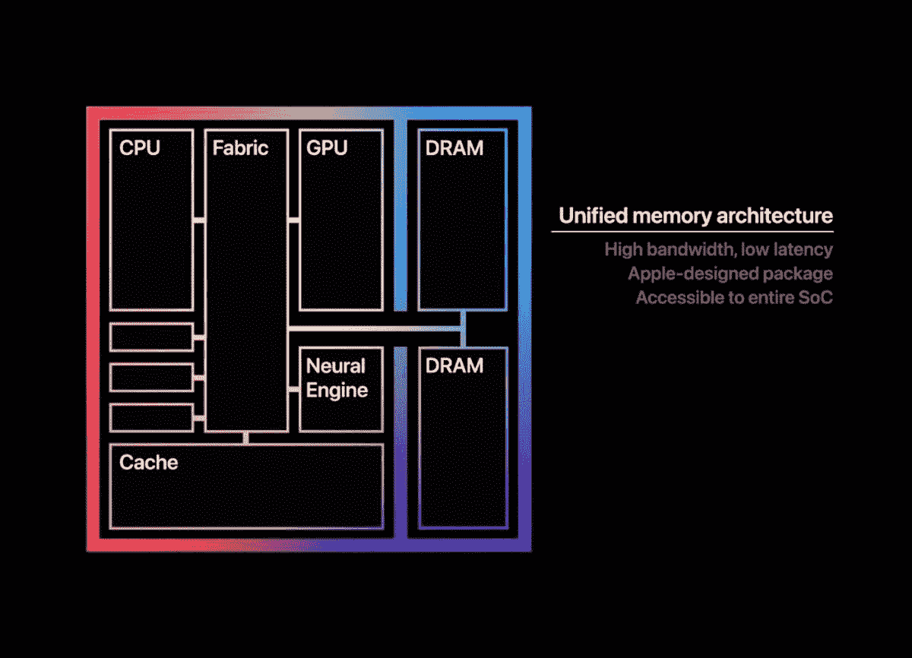
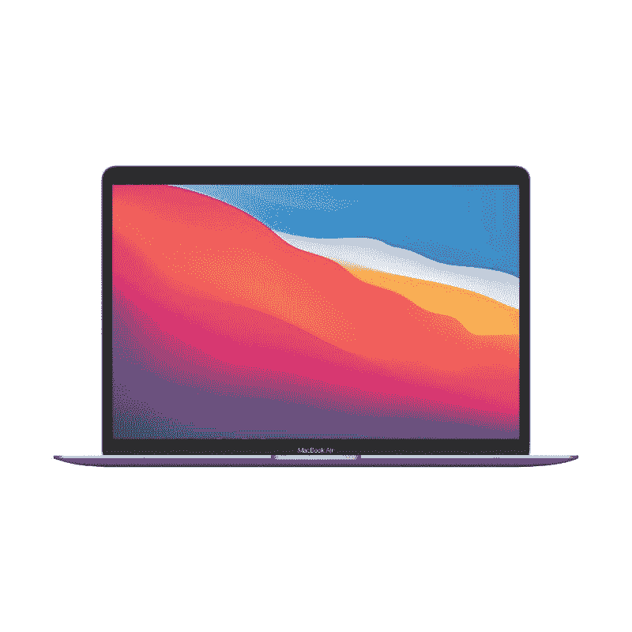

# 三星 Galaxy Book 2 商务 vs MacBook Air:买哪个？

> 原文：<https://www.xda-developers.com/samsung-galaxy-book-2-business-vs-macbook-air/>

三星 Galaxy Book 2 业务现已正式发布，它带来了许多有趣的规格和功能。它采用英特尔新的第 12 代 Alder Lake 移动处理器，配备 14 英寸全高清显示屏和 1080p 网络摄像头。它将成为市场上最好的商务笔记本之一，但我们想看看它如何与苹果的 MacBook 选项相抗衡，后者由苹果芯片[驱动。在这篇文章中，我们将看看三星 Galaxy Book 2 Business 与 MacBook Air，看看 2022 年买哪个更好。](https://www.xda-developers.com/apple-silicon/)

**浏览这篇文章:**

## 三星 Galaxy Book 2 Business vs MacBook Air:规格

在我们开始比较之前，让我们快速浏览一下每款笔记本电脑的规格，了解它们各自的特点:

| 

规格

 | 

**三星 Galaxy Book 2 商务**

 | 

**苹果 MacBook Air 搭配 M1**

 |
| --- | --- | --- |
| **CPU** | 

*   英特尔博锐处理器，最高可配第 12 代英特尔酷睿 i7 P 系列处理器
*   特定地区的非博锐第 12 代英特尔酷睿 i3、i5 和 i7 型号

 | 

*   苹果 M1 (8 核，最高 3.2GHz)

 |
| **图形** | 

*   英特尔 UHD 显卡
*   英特尔 Iris Xe 显卡
*   NVIDIA GeForce MX570

 |  |
| **闸板** | 

*   8GB，最高 64GB DDR4 (2 个插槽)

 | 

*   高达 16GB 的统一内存

 |
| **存储** |  | 

*   256 GB 固态硬盘
*   512GB 固态硬盘
*   1TB 固态硬盘
*   2TB 固态硬盘

 |
| **显示** |  | 

*   13.3 英寸 LED 背光显示屏(2560 x 1600) 16:10，采用 IPS 技术，非触摸，400 尼特，True Tone 技术

 |
| **电池** |  |  |
| **端口** | 

*   1 个雷电 4
*   1 个 USB Type-C
*   2 个 USB 类型 A
*   1 个 HDMI 2.0 接口
*   RJ45
*   SD 读卡器
*   3.5 毫米耳机插孔
*   SIM 卡插槽(在部分地区)

 | 

*   2 个 USB 4 / Thunderbolt (USB-C)
*   3.5 毫米耳机插孔

 |
| **音频** | 

*   立体声扬声器，杜比全景声

 | 

*   支持杜比全景声的立体声扬声器
*   3 麦克风阵列

 |
| **网络摄像头** |  |  |
| **安全** | 

*   红外照相机
*   指纹电源键

 | 

*   触控 ID 按下电源按钮

 |
| **连通性** | 

*   Wi-Fi 6E
*   蓝牙 5.2
*   LTE(在特定地区)

 |  |
| **尺寸(WxDxH)** | 

*   326.4 x 213.8 x 19.92 毫米(12.85 x 8.41 x 0.78 英寸)

 | 

*   304.1 × 212.4 × 16.1 毫米(11.97 × 8.36 × 0.63 英寸)

 |
| **重量** | 

*   起始重量为 1.51 千克(3.32 磅)

 |  |
| **价格** |  |  |

## 表演

你可能已经知道，M1 芯片不再是苹果硅产品线中最强大的选择。也就是说，它的性能仍然优于市面上的许多 Windows 笔记本电脑。苹果公司成功推出了一款出色的 SoC，在性能和效率之间取得了良好的平衡，在推出时提供了比大多数其他英特尔和 AMD 芯片更好的整体性能。众所周知，M1 芯片轻松击败了英特尔的第 11 代移动芯片，同时提供了更高的能效。

然而，新的三星 Galaxy Book 2 商务笔记本电脑采用了新的第 12 代 Alder Lake 移动芯片，而不是旧的第 11 代处理器。事实上，三星正在使用第 12 代 P 系列，您可以为其配置最高支持或不支持博锐的酷睿 i7 处理器。如果你不知道，英特尔的新 P 系列 Alder Lake 处理器也有一个混合架构，它结合了性能核心和高效核心。虽然我们还没有机会测试 Galaxy Book 2 业务的性能，因为它现在还不能购买，但我们确实有一些 Geekbench 数字，让你了解你可以期望从这些机器中看到的性能。来，看一看:

|  | 

英特尔酷睿 i7-1280P( [参见测试](https://browser.geekbench.com/v5/cpu/13331030))

 | 

英特尔酷睿 i7-1265U( [参见测试](https://browser.geekbench.com/v5/cpu/12860514))

 | 

英特尔酷睿 i5-1250P( [参见测试](https://browser.geekbench.com/v5/cpu/13897072))

 | 

英特尔酷睿 i5-1245U( [参见测试](https://browser.geekbench.com/v5/cpu/13777559))

 | 

苹果 MacBook Air(普通)

 |
| --- | --- | --- | --- | --- | --- |
| Geekbench 5 分数 | 1,790 / 9,312 | 1,232 / 6,336 | 1,522 / 9,142 | 1,560 / 5,414 | 1,705 / 7,417 |

正如你所看到的，M1 芯片不如英特尔新的第 12 代芯片强大，但它确实保持了自己的优势，特别是其单核性能。例如，在这个以 CPU 为中心的工作负载中，它的得分超过了英特尔新的 U 系列芯片，甚至接近击败了酷睿 i7-1280P 的单核得分。当然，当你在 Galaxy Book 2 商用笔记本电脑上进行测试时，Geekbench 的数字可能会有所不同，但这应该会让你对苹果的 M1 芯片目前在竞争中的地位有一个大致的了解。尽管 Galaxy Book 2 业务没有使用 U 系列处理器，但我们希望添加这些数字，让您了解 M1 芯片目前的状况。

众所周知，苹果的 M1 芯片在图形部门的表现优于其他移动芯片。M1 的图形处理器已经显示出击败许多强大的英特尔和 AMD 芯片的巨大潜力。但与市场上的许多其他商务笔记本不同，Galaxy Book 2 商务版配备了可选的 NVIDIA GeForce MX570 独立显卡芯片，我们认为它应该能够与 M1 的图形能力相抗衡。但你必须花更多的钱才能在 Galaxy Book 2 业务中获得独立 GPU，至少在撰写本文时它似乎还不可用。配备 M1 的 MacBook Air 基本型号应该能够击败配备英特尔 UHD 或 Iris Xe 显卡的 Galaxy Book 2 基本型号。

至于内存，我们正在考虑在 Galaxy Book 2 业务中使用高达 64GB 的 DDR4 RAM。然而，基本版本只有 8GB 内存。以后可以自己升级 RAM，但是还是挺少的。另一方面，配备 M1 的 MacBook Air 可以购买高达 16GB 的内存。然而，值得注意的是，M1 芯片使用统一内存技术，这意味着你可以期待看到明显更快的速度和更低的延迟。这是因为内存模块是内置在芯片中的。如果你不知道，统一内存意味着 M1 图形处理器也将它用于相关工作负载。

在存储方面，你可以在 Galaxy Book 2 Business 上获得高达 1TB 的存储空间，而你可以购买高达 2TB SSD 的 MacBook Air。如果你想有更多的存储空间，而不必处理外部驱动器，那么 MacBook Air 可能就是合适的选择。

 <picture></picture> 

Unified Memory Architecture on Apple's M1 chip

最后，还有电池寿命。我们正在寻找 Galaxy Book 2 业务中的 51.5 瓦时电池和 MacBook Air 中的 49 瓦时电池。尽管电池略小，但我们认为 MacBook Air 将凭借 M1 芯片提供更长的电池寿命。众所周知，与英特尔第 12 代芯片相比，这款处理器的性能功耗比更高。此外，您还必须考虑影响电池续航时间的其他因素，包括统一内存、软硬件集成等。一旦我们有机会并排测试这些笔记本电脑，我们将有更多机会谈论它们的性能和电池寿命，请继续关注。

## 显示

三星 Galaxy Book 2 Business 配备了 14 英寸的全高清显示屏，而苹果 MacBook Air 配备了 13 英寸的面板。MacBook Air 的 LED 背光显示屏分辨率为 2560 x 1600，但 Book 2 Business 的分辨率较低，为 1920 x 1080。还值得指出的是，MacBook Air 的显示屏为 16:10，而三星只增加了 16:9 的显示屏。16:10 宽高比显示器通常是提高工作效率的首选，因为它可以让您看到更多正在编辑的网页或文稿。16:9 是一个更传统的宽高比，但如果三星在 Galaxy Book 2 业务中使用 16:10 的面板，那就太好了。

 <picture></picture> 

Samsung Galaxy Book 2 Business

此次比较的两款笔记本电脑都在显示屏顶部安装了网络摄像头，因此您不必担心购买外部摄像头来处理视频通话和会议。苹果仍在使用高清 FaceTime 摄像头，而 Galaxy Book 2 商务版配备了 1080p 摄像头。MacBook Air 上的高清 FaceTime 摄像头现在已经开始显示出它的年龄，所以可以肯定地说，Galaxy Book 2 Business 上的 1080p 摄像头可能会给你带来更好的体验。值得注意的是，Book 2 Business 还配备了一个用于 Windows Hello 身份验证的红外摄像头，而 MacBook Air 没有这个选项。不过，你确实可以在 MacBook Air 的电源按钮上安装触控 ID 指纹扫描仪。

## 设计和端口

如果你想买一台更薄更轻的笔记本，我们建议你选择苹果 MacBook Air。正如你在规格表中看到的，MacBook Air 的厚度为 16.1 毫米，而 Galaxy Book 2 Business 的厚度为 19.92 毫米。MacBook Air 的重量也比三星笔记本轻，所以也值得考虑。就外观而言，MacBook Air 的设计多年来一直保持不变。MacBook Air 的设计没有什么新意，但很多人似乎喜欢它的简约设计。MacBook Air 有三种颜色可供选择，整体看起来都很棒。三星 Galaxy Book 2 业务似乎也有一个柔和的整体设计，但它只有一种颜色可供选择——石墨。

在端口方面，Galaxy Book 2 Business 是更好的选择，因为它提供了更好的端口选择。你有一个 Thunderbolt 4 端口、一个 USB Type-C 端口、两个 USB Type-A 端口、一个 HDMI 2.0 端口、一个 RJ45 以太网端口、一个 SD 读卡器和一个 3.5 毫米音频组合插孔。另一方面，MacBook Air 只配有两个 Thunderbolt/USB 4 端口和一个 3.5 毫米耳机插孔。你必须依靠适配器和坞站来添加更多的外围设备。我们需要指出的是，MacBook Air 只能通过 Thunderbolt 端口支持一个外部显示器。

尽管三星在其规格表中没有提到 SIM 卡插槽，但 Galaxy Book 2 业务在欧洲等一些地区配备了一个支持 4G LTE 的 SIM 卡插槽。因此，可以肯定地说，4G 连接在 Galaxy Book 2 上是可选的，而在 MacBook Air 上则完全没有。MacBook Air 支持 WiFi 6 和蓝牙 5，而 Galaxy Book 2 Business 支持 WiFi 6E 和蓝牙 5.2。

## Windows 还是 macOS？

每当你将 Windows 电脑与苹果 MacBook 进行比较时，操作系统都成为你要考虑的一个关键因素。在这种情况下，Galaxy Book 2 Business 自带 Windows 11，而 MacBook Air 则带有 macOS Monterey。多年来，Windows 已经有了很大的发展，新的操作系统在以前的版本上有了很多改进。Windows 是世界上最流行的操作系统之一，我们认为它是大多数用户的可靠选择。

也就是说，macOS 也是众所周知的非常直观，正如我们之前在很多比较中提到的那样。macOS 也恰好是内容创作者的首选，因为它支持许多创作者友好的应用程序，包括 Final Cut Pro、Adobe Photoshop、Premiere 等。实际上，在 Windows 和 macOS 之间做出选择取决于你的个人偏好。两个操作系统总体来说都很棒，任何一个都不会错。

## 三星 Galaxy Book 2 商务 vs MacBook Air:该买哪个？

如果您关心这些笔记本电脑的原始性能，Galaxy Book 2 商务版是您的不二之选。相对于其他处理器，M1 芯片仍然表现不错，但不可否认的是，英特尔新的第 12 代芯片总体来说相当不错。我们建议选择配备 MX570 独立显卡的 Galaxy Book 2 商务版，以获得最佳的图形性能。M1 的图形处理器很可能会击败英特尔的集成显卡。

即使在性能之外，Galaxy Book 2 业务也有许多其他有利因素。它有一个支持 Windows Hello 的红外网络摄像头，并且您还可以获得更多端口，因此您不必担心使用加密狗。Galaxy Book 2 业务在某些地区也可以获得 4G 连接，但这在 MacBook Air 上完全没有。但如果你倾向于 MacBook Air，那么你将获得更清晰的显示屏，更便携的外形，以及更多的颜色选择。最后，操作系统在决定购买哪台笔记本电脑时也起着很大的作用，所以也要考虑到这一点。

 <picture></picture> 

MacBook Air (M1)

##### 苹果 MacBook Air (M1，2020 年)

采用 M1 芯片的 MacBook Air 仍然是苹果产品线中最受欢迎的笔记本电脑之一。

 <picture></picture> 

Samsung Galaxy Book 2 Business

##### 三星 Galaxy Book 2 商务版

Galaxy Book 2 商务笔记本电脑是市场上采用英特尔新的第 12 代 Alder Lake 移动芯片的笔记本电脑之一。

三星 Galaxy Book 2 Business 目前还不能购买，因此我们将在它上市后添加一个购买链接。与此同时，你可以看看我们关于[最佳苹果电脑](https://www.xda-developers.com/best-macs/)或[最佳三星笔记本电脑](https://www.xda-developers.com/best-samsung-galaxy-laptops/)的综述。或者，如果你不介意购买其他品牌的笔记本电脑，你甚至可以考虑看看[最佳商务笔记本电脑](https://www.xda-developers.com/best-business-laptops/)。