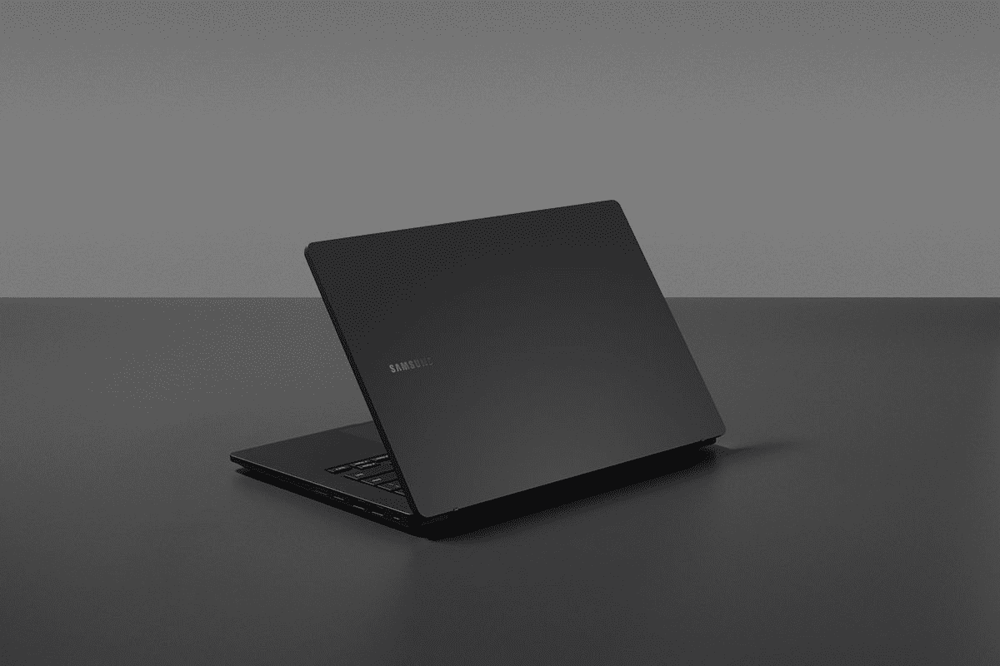

# 三星 Galaxy Book 2 Business:发布日期、价格等

> 原文：<https://www.xda-developers.com/samsung-galaxy-book-2-business/>

三星最近在其 [Galaxy Book 2](https://www.xda-developers.com/samsung-galaxy-book-2/) 和 [Galaxy Book 2 Pro](https://www.xda-developers.com/samsung-galaxy-book-2-pro/) 系列下推出了一系列新的[优质轻量级超极本](https://www.xda-developers.com/best-lightweight-laptops/)。除了该系列中的这些高端笔记本电脑，该公司还宣布了 Galaxy Book 2 业务，这与该系列中其他规格不同的笔记本电脑明显不同。三星 Galaxy Book 2 Business 是一款企业笔记本电脑，采用英特尔全新第 12 代 Alder Lake 博锐处理器。它配备了一套面向企业的高级安全和生产力功能。

如果你想买一台可靠的工作用电脑，新款三星 Galaxy Book 2 Business 可能是你的下一台笔记本电脑。如果你想了解关于 Galaxy Book 2 业务的一切，那么你来对地方了。在本文中，我们将了解规格、发布日期、定价信息等，以帮助您在一个地方找到与 Galaxy Book 2 业务相关的所有信息。

## 规范

下面快速看一下三星 Galaxy Book 2 商务笔记本的规格。请记住，SKUs 确切配置可能因市场而异。

| 

规格

 | 

**三星 Galaxy Book 2 商务**

 |
| --- | --- |
| **CPU** | 

*   采用第 12 代英特尔酷睿 i5 或 i7 处理器的英特尔博锐处理器
*   特定地区的非博锐第 12 代英特尔酷睿 i3、i5 和 i7 型号

 |
| **图形** | 

*   英特尔 UHD 显卡
*   英特尔 Iris Xe 显卡
*   Nvidia GeForce MX570

 |
| **闸板** |  |
| **存储** |  |
| **显示** |  |
| **电池** |  |
| **港口** | 

*   1 个雷电 4
*   1 个 USB Type-C
*   2 个 USB 类型 A
*   1 个 HDMI 2.0 接口
*   RJ45
*   SD 读卡器
*   3.5 毫米耳机插孔

 |
| **音频** | 

*   立体声扬声器，杜比全景声

 |
| **网络摄像头** |  |
| **安全** | 

*   红外照相机
*   指纹电源键

 |
| **连通性** |  |
| **尺寸(WxDxH)** | 

*   326.4 x 213.8 x 19.92 毫米(12.85 x 8.41 x 0.78 英寸)

 |
| **重量** | 

*   起始重量为 1.51 千克(3.32 磅)

 |
| **价格** |  |

值得指出的是，这个特定的规格表仅反映了我们在撰写本文时获得的关于 Galaxy Book 2 业务的信息。我们将不断更新，以填补任何缺失的信息。

## 三星 Galaxy Book 2 商务发布日期

与 Galaxy Book 2 系列中的其他笔记本电脑不同，Galaxy Book 2 商务笔记本尚未上市。最初说它将于本月在特定市场上市，现在我们听说它将于 4 月 20 日上市。三星还将举办“Samsung Together 2022”虚拟活动，在活动中，它将更多地谈论 Galaxy Book 2 业务及其带来的一切。值得一提的是，Galaxy Book 2 业务将仅在选定市场提供，因此它可能会在我们的地区提供，也可能不会提供。

 <picture></picture> 

Samsung Galaxy Book 2 Business

也就是说，我们预计它将在美国和印度上市，因为 Galaxy Book 2 商业页面将在这些地区的网站上发布。在三星 Together 2022 虚拟活动之后，一旦我们对 Galaxy Book 2 商务笔记本电脑的发布日期有了更多的了解，我们将尝试用更多的信息更新这篇文章。

## 三星 Galaxy Book 2 商务定价

正如我们前面提到的，三星 Galaxy Book 2 业务尚未上市。不过，它将很快在美国上市，起价为 1850 美元。在印度，三星 Galaxy Book 2 业务始于₹1,04,990.这个价格是笔记本电脑的基本型号，可能采用第 12 代酷睿 i5 处理器。一旦它上市，我们将有更多的时间来讨论它的定价，我们还会知道其他型号的价格，所以请继续关注。

 <picture></picture> 

Samsung Galaxy Book 2 Business

##### 三星 Galaxy Book 2 商务版

三星 Galaxy Book 2 Business 是一款商务笔记本电脑，采用支持博锐技术的英特尔第 12 代 P 系列处理器，16GB 内存和高达 1TB 的存储容量。

## 三星 Galaxy Book 2 商务功能

新的三星 Galaxy Book 2 Business 与常规的 Galaxy Book 2 和 Book 2 Pro 笔记本在阵容上略有不同。以下是我们认为值得强调的一些功能的简要概述:

### 传统翻盖设计

看看三星 Galaxy Book 2 业务，可以肯定地说，在产品线中，这款笔记本电脑作为轻薄的超高端笔记本电脑的关注度较低。它的尺寸不到 20 毫米，所以它比 Galaxy Book 2 Pro 厚得多。它还重约 1.50 千克，这意味着它也不是该系列中最轻的产品。

Galaxy Book 2 业务没有二合一外形，也没有触摸屏选项，所以请记住这一点。虽然我们还没有机会深入了解 Book 2 业务，但它看起来并不像其他 Galaxy 笔记本电脑或其他许多商用笔记本电脑那样高端。

Galaxy Book 2 业务有一点我们不能抱怨，那就是端口选择。它们更符合业务需求。你有一个 USB C 类端口，一个 Thunderbolt 4 端口以及两个 USB A 类端口。还有一个 HDMI 2.0 端口，一个 RJ-45 以太网端口，一个 SD 读卡器和 Kensington Lock。连接选项包括 WiFi 6E、蓝牙 5.2 和某些地区的 4G LTE。

### 具有安全特性的第 12 代英特尔酷睿博锐处理器

三星 Galaxy Book 2 业务还支持英特尔全新的第 12 代博锐处理器。这些芯片包括一套面向企业的高级安全和生产力功能。在企业笔记本电脑中，安全功能优先于许多其他东西，当谈到 Galaxy Book 2 业务时，三星在这方面为您提供了保障。它自带英特尔硬件保护，提供多种安全技术。

对于 Galaxy Book 2 业务，我们正在考虑篡改警告功能，BIOS 自动恢复使用基于硬件的信任根来验证 BIOS，等等。这款特殊的笔记本电脑还符合微软的安全核心电脑标准，以尽可能保护您的敏感数据。三星没有提到第 12 代 Alder Lake 系列的确切处理器型号。但看看该系列中的其他笔记本电脑，我们预计 Galaxy Book 2 业务将由第 12 代 P 系列处理器提供支持。

如果你不知道，Alder Lake 系列中的 P 系列处理器是专为新一代超极本设计的 28W 芯片。您可以查看我们的 [Alder Lake P 系列与 U 系列对比](https://www.xda-developers.com/intel-12th-gen-p-vs-u-series/)以了解更多关于这些处理器的信息，并了解它们如何与产品线中的低性能处理器相抗衡。

Galaxy Book 2 Business 的规格表显示，这款特殊的笔记本电脑采用了 Nvidia MX570 独立显卡，尽管尚不完全清楚它将与哪种处理器配对，也不清楚该型号是否将在全球范围内购买。三星还提到了高达 64GB 的内存，但它是否使用 DDR4、DDR5 或其他类型的内存仍有待观察。至于存储，可以配置 Galaxy Book 2 商务版，最高 1TB SSD。

### 全高清显示屏和网络摄像头

三星 Galaxy Book 2 Business 的显示屏也不同于 Book 2 和 Book 2 Pro 系列。这款商务笔记本采用 14 英寸全高清面板，周围明显有更多边框。它的分辨率为 1920 x 1080，这意味着它的长宽比为 16:9，而不是更现代的 16:10。这是相当令人失望的，因为我们现在已经开始看到许多 16:10 面板的商务笔记本电脑，它们更高，因此提供更多的垂直屏幕空间。为了提高工作效率，高显示器通常是首选，因为它允许您阅读更多的网页或正在编辑的 word 文档。

 <picture></picture> 

Samsung Galaxy Book 2 Business

它不像该系列中其他笔记本电脑上的超级 AMOLED，所以请记住这一点。它带有防眩光涂层，应该有助于户外能见度。14 英寸的 FHD 面板是 Galaxy Book 2 Business 唯一可用的选项，所以如果你想要更大或高分辨率的屏幕，你必须看看市场上的其他选项。Galaxy Book 2 Business 在显示屏顶部配备了一个全高清网络摄像头，与该系列中的其他笔记本电脑不相上下。这款全高清摄像头还配有一个用于 Windows Hello 面部识别的红外传感器。值得强调的是，这是除了物理指纹扫描仪之外，唯一一款使用 Windows Hello 面部识别(IR)的三星笔记本电脑。三星其余的 Galaxy Book 笔记本电脑只使用指纹进行认证。

## 三星 Galaxy Book 2 业务哪里买

正如我们之前提到的，三星 Galaxy Book 2 业务目前还不能购买。它可能会在 4 月 20 日上市。一旦上线，我们将添加一个购买该笔记本电脑的链接。如果你不想等待，我们建议你现在就去看看我们收集的最好的三星笔记本电脑。如果你不介意探索其他制造商的笔记本电脑，我们也有一份[最佳笔记本电脑](https://www.xda-developers.com/best-laptops/)和[最佳商务笔记本电脑](https://www.xda-developers.com/best-business-laptops/)的列表。