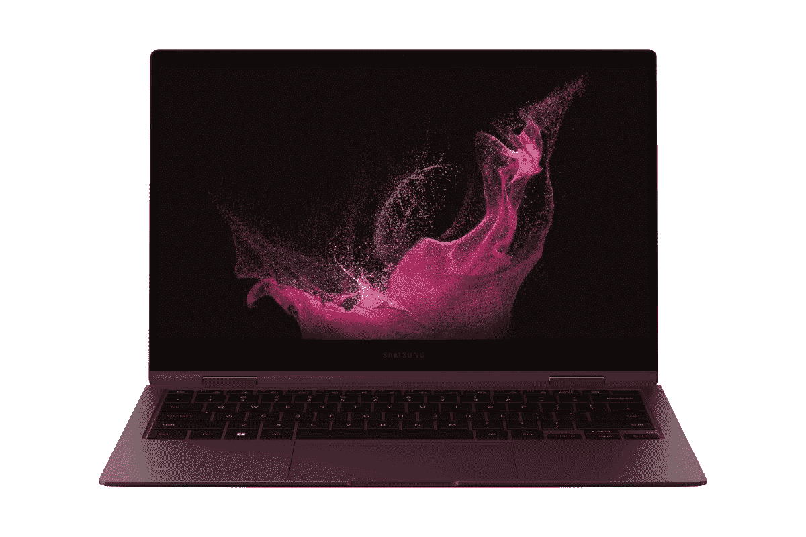

# 三星的 Galaxy Book 2 预购带有一个免费的游戏显示器

> 原文：<https://www.xda-developers.com/samsung-galaxy-book-2-pre-orders-free-gaming-monitor/>

三星已经正式开放 Galaxy Book 2 和 Galaxy Book 2 Pro 系列的预购。为了让已经很棒的笔记本电脑变得更有吸引力，当您预订任何新的 Galaxy Book 型号时，都可以免费获得一台游戏显示器。您获得的显示器取决于您购买的笔记本电脑，Galaxy Book 2 Pro 型号自然会获得更好的显示器。

## 三星 Galaxy Book 2 Pro (360)和奥德赛 G35T 显示器

如果你购买三星的高端型号之一，无论是翻盖版(Galaxy Book 2 Pro)还是可转换版(Galaxy Book 2 Pro 360)，你都可以获得三星奥德赛 G35T 游戏显示器。这是一款 32 英寸全高清显示器，刷新率为 165Hz，支持 AMD FreeSync Premium。这是一个弯曲的 VA 面板(1500R 曲率)，对比度为 3，000:1，对于液晶显示器来说相当不错。它的官方定价为 329.99 美元，所以这是一个相当慷慨的预购奖金。

 <picture></picture> 

Samsung Galaxy Book 2 Pro

##### 三星 Galaxy Book 2 Pro

三星 Galaxy Book 2 Pro 是目前最薄最轻的笔记本电脑之一，但它仍然拥有强大的英特尔处理器和令人惊叹的 AMOLED 屏幕。如果你预购，你甚至可以获得一台三星奥德赛 G35T 游戏显示器。

 <picture></picture> 

Samsung Galaxy Book 2 Pro 360 + Samsung Odyssey G35T

##### 三星 Galaxy Book 2 Pro 360

三星 Galaxy Book 2 Pro 360 是一款极其轻便的敞篷车，配有英特尔 P 系列处理器和 AMOLED 触摸屏。预购还附赠一台免费的三星奥德赛 G35T 游戏显示器。

笔记本电脑本身配备了英特尔新的第 12 代酷睿处理器，最高可达酷睿 i7-1260P。这些处理器有 12 个内核(4P + 8E)和 16 个线程，酷睿 i7 型号的速度最高可达 4.7GHz。如果您想要更强的游戏性能，三星 Galaxy Book 2 Pro(翻盖)有一个可选的英特尔 Arc 独立 GPU，可以帮助您充分利用这款游戏显示器。如果您想进行视频通话和会议，您还可以获得高达 32GB 的 LPDDR5 RAM，以及令人惊叹的全高清 AMOLED 显示屏和全高清网络摄像头。

如果你搭配 Galaxy Book 2 Pro 360，显示器也支持触控和 S Pen，你可以将其用作平板电脑。考虑到尺寸，这两款笔记本电脑都非常轻薄，因此无论您去哪里，它们都易于携带。虽然它们本身并不是真正的游戏笔记本电脑，但它们支持 Thunderbolt 4，所以你可以连接一个[外部 GPU](https://www.xda-developers.com/best-external-gpus-for-your-laptop/) 并使用这款游戏显示器。

三星 Galaxy Book 2 Pro 360 起价 1249 美元，或 749.99 美元(含符合条件的以旧换新)。三星 Galaxy Book 2 Pro 的起价为 1049.99 美元或 599.99 美元，以旧换新。此外，您的笔记本电脑还可以享受 30%的 Samsung Care+折扣。

## 三星 Galaxy Book 2 360 和三星 CRG5 显示器

另一方面，如果你想要更实惠的三星 Galaxy Book 2 360，预购会额外赠送一台三星 CRG5 游戏显示器。这是一台 24 英寸的显示器，具有全高清分辨率和 144Hz 的刷新率，加上 AMD FreeSync 支持。这是一个曲率为 1800R 的曲面显示器，它有一个 VA 面板，3000:1 的对比度，它的价值为 259.99 美元，所以它仍然是一个非常好的礼物。

 <picture></picture> 

Samsung Galaxy Book 2 360 + Samsung CRG5 Monitor

##### 三星 Galaxy Book 2 360

三星 Galaxy Book 2 360 采用第 12 代英特尔酷睿处理器和全高清 AMOLED 触摸屏，设计轻薄。预购时会免费赠送价值 260 美元的三星 CRG5 游戏显示器。

三星 Galaxy Book 2 360 也配备了第 12 代英特尔酷睿处理器，但来自 U 系列，这意味着它的 TDP 更低，为 15W。不过，在酷睿 i7-1255U 型号上，您可以获得 10 个内核(2P + 8E)、12 个线程和高达 4.7GHz 的速度。它配备了高达 16GB 的内存，1TB 的存储空间，以及这个价格很少见到的 AMOLED 显示屏。虽然它不像 Pro 机型那样轻薄，但仍然非常便携。它也仍然支持 Thunderbolt 4。

三星 Galaxy Book 2 360 起价为 899.99 美元，如果符合以旧换新条件，价格仅为 549.99 美元。还可以获得三星 Care+7 折优惠。