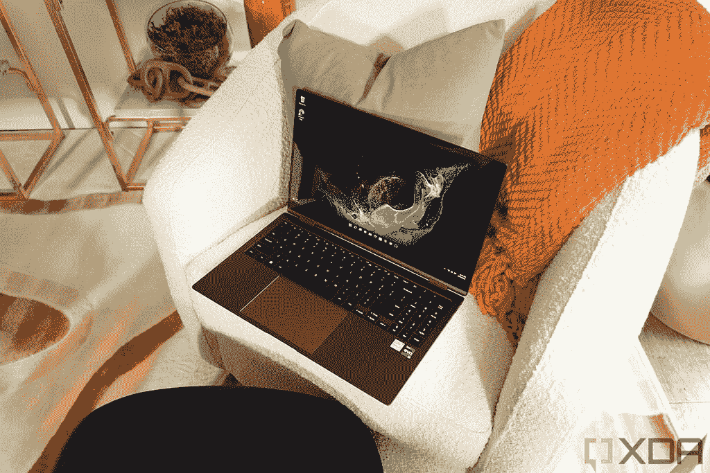
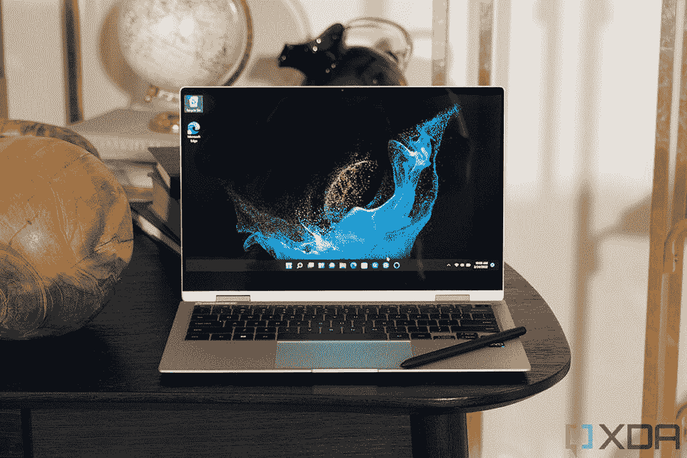
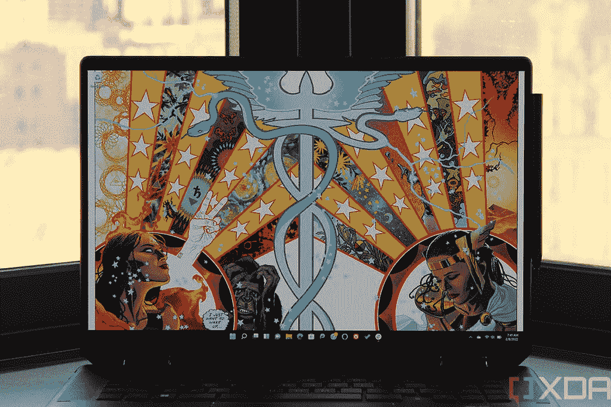
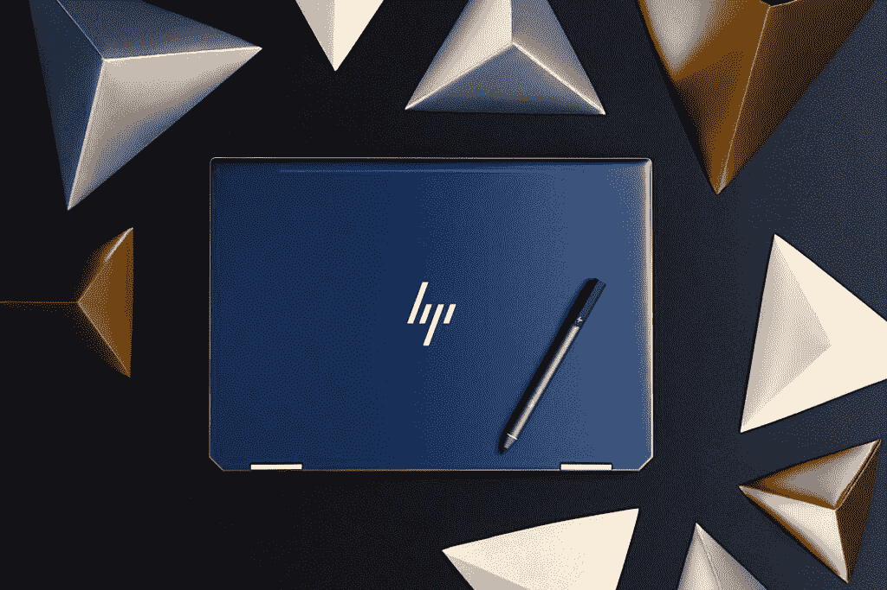

# 三星 Galaxy Book 2 Pro 360 vs 惠普 Spectre x360

> 原文：<https://www.xda-developers.com/samsung-galaxy-book-2-pro-360-vs-hp-spectre-x360/>

三星最近推出了 [Galaxy Book 2 Pro](https://www.xda-developers.com/samsung-galaxy-book-2-pro/) 系列，其中包括 Galaxy Book 2 Pro 360，这是目前最轻的敞篷车之一。最初的三星 Galaxy Book Pro 360 已经是一款[梦幻般的轻型笔记本电脑](https://www.xda-developers.com/best-lightweight-laptops/)，但如果你正在考虑它的继任者，那么了解它与市场上其他设备的比较是很重要的。[惠普 Spectre x360](https://www.xda-developers.com/hp-spectre-x360/) 是惠普产品线中[最好的笔记本电脑之一，所以我们将它与三星 Galaxy Book 2 Pro 360 进行比较，看看你应该选择哪一款。](https://www.xda-developers.com/best-hp-laptops/)

我们将在几个不同的类别中比较这两者，以帮助您决定应该选择哪一个。值得注意的是，这两款笔记本电脑的尺寸不同，这可能会影响规格。三星 Galaxy Book 2 Pro 360 的尺寸几乎相同，但 Spectre x360 的型号之间有一些很大的差异。

## 三星 Galaxy Book 2 Pro 360 与惠普 Spectre x360:规格

|  | 

三星 Galaxy Book 2 Pro 360

 | 

惠普 Spectre x360

 |
| --- | --- | --- |
| **CPU** | 

*   第 12 代 28W 英特尔酷睿 i5-1240P (12 个内核，16 个线程，最高 4.4GHz，12MB 高速缓存)
*   第 12 代 28W 英特尔酷睿 i7-1260P (12 个内核，16 个线程，最高 4.7GHz，18MB 高速缓存)

 | 

*   **Spectre x360 13，14，15**
    *   第 11 代 15W 英特尔酷睿 i5-1135G7 (4 核、8 线程、最高 4.2GHz、8MB 高速缓存)
    *   第 11 代 15W 英特尔酷睿 i7-1165G7 (4 核、8 线程、最高 4.6GHz、12MB 高速缓存)
    *   第 11 代 15W 英特尔酷睿 i7-1195G7 (4 核、8 线程、最高 5GHz、12MB 高速缓存)(仅限 Spectre x360 14)
*   **Spectre x360 16**
    *   第 11 代 35W 英特尔酷睿 i7-11390H (4 核、8 线程、最高 5GHz、12MB 高速缓存)

 |
| **图形** |  | 

*   **综合:**
*   **离散(仅限 Spectre x360 16):**
    *   NVIDIA GeForce RTX 3050 笔记本电脑

 |
| **储存** |  | 

*   256 GB 固态硬盘(Spectre x360 13、14、15)
*   512GB 固态硬盘
*   1TB 固态硬盘
*   2TB 固态硬盘

 |
| **闸板** | 

*   8GB LPDDR5
*   16GB LPDDR5
*   32GB LPDDR5

 | 

*   8GB LPDDR4 (Spectre x360 13、14)
*   16GB LPDDR4
*   32GB LPDDR4 (Spectre x360 16)

 |
| **显示** | 

*   **13.3 英寸**
    *   全高清(1920 x 1080) Super AMOLED，16:9，120% DCI-P3，500 尼特(适用于 HDR)，触控
*   **15.6 英寸**
    *   全高清(1920 x 1080) Super AMOLED，16:9，120% DCI-P3，500 尼特(适用于 HDR)，触控

 | 

*   **Spectre x360 13**
    *   13.3 英寸 IPS，全高清(1920 x 1080)，HP Sure View，触控
    *   13.3 英寸 4K 有机发光二极管(3840 x 2160)，400 尼特
*   **Spectre x360 14**
    *   13.5 英寸 IPS，全高清+ (1920 x 1280)，触控，400 尼特
    *   13.5 英寸 IPS，全高清+ (1920 x 1280)，惠普 Sure View，触控，1000 尼特
    *   13.5 英寸有机发光二极管，3K2K (3000 x 2000)，触控，400 尼特
*   **Spectre x360 15**
    *   15.6 英寸 AMOLED，4K (3840 x 2160)，触摸屏，400 尼特
*   **Spectre x360 16**
    *   16 英寸 IPS，3K+ (3072 x 1920)，触摸屏，可选抗反射涂层
    *   16 英寸 AMOLED，4K+ (3840 x 2400)，防反射，触摸

 |
| **电池** |  | 

*   **厉鬼 x360 13**
*   **Spectre x360 14**
*   **Spectre x360 15**
*   **Spectre x360 16**

 |
| **端口** | 

*   1 个 Thunderbolt 4 / USB Type-C
*   2 个 USB 型
*   3.5 毫米耳机插孔
*   microSD 读卡器

 | 

*   2 个 Thunderbolt 4 端口
*   1 个 USB 类端口
*   HDMI 2.0b (Spectre x360 15、16)
*   3.5 毫米耳机插孔
*   microSD 读卡器

 |
| **音频** | 

*   **13.3 英寸**
    *   双立体声 AKG 扬声器(4W total)，杜比全景声
*   **15.6 英寸**
    *   双立体声 AKG 扬声器(总共 5W)，杜比全景声

 | 

*   **厉鬼 x360 13**
    *   Bang & Olufsen 双立体声扬声器
*   **Spectre x360 14，15，16**
    *   Bang & Olufsen 的四声道立体声扬声器

 |
| **网络摄像头** |  | 

*   **Spectre x360 13，14，15**
    *   带 Windows Hello 的 720p 高清网络摄像头
*   **厉鬼 x360 16**
    *   带 Windows Hello 的 5MP/1080p 摄像头

 |
| **Windows Hello** | 

*   指纹识别器(在电源按钮中)

 | 

*   指纹读取器
*   使用红外摄像头进行面部识别

 |
| **连通性** |  | 

*   英特尔 Wi-Fi 6E (AX210)
*   蓝牙 5.2

 |
| **颜色** |  | 

*   天然银(Spectre x360 13，14)
*   海神蓝(Spectre x360 13，14，15)
*   夜曲蓝(Spectre x360 16)
*   夜幕降临

 |
| **尺寸(WxDxH)** | 

*   **13.3 英寸**
    *   302.5 x 202 x 11.5 毫米(11.91 x 7.95 x 0.45 英寸)
*   **15.6 英寸**
    *   354.85 x 227.97 x 11.9 毫米(13.97 x 8.98 x 0.47 英寸)

 | 

*   **厉鬼 x360 13**
    *   12.08 x 7.66 x 0.67 英寸(306.8 x 194.6 x 17 毫米)
*   **Spectre x360 14**
    *   11.75 x 8.67 x 0.67 英寸(298.5 x 220.2 x 17mm 毫米)
*   **Spectre x360 15**
    *   14.17 x 8.91 x 0.79 英寸(359.9 x 226.3 x 20mm 毫米)
*   **Spectre x360 16**
    *   14.09 x 9.66 x 0.78 英寸(357.89 x 245.26 x 19.81 毫米)

 |
| **起始重量** |  | 

*   **Spectre x360 13**
*   **Spectre x360 14**
*   **Spectre x360 15**
*   **Spectre x360 16**

 |
| **价格** | 起价 1249.99 美元 | 900.99 美元(Spectre x360 13) |

这里值得注意的是，惠普 Spectre x360 的许多型号都已超过一年，而且其中许多型号越来越难找到。这些信息包括以前存在的模型，但是您今天可能无法找到所有的模型。很可能在接下来的几个月里，Spectre 系列的一些成员将会看到一个重大的更新。

## 性能:三星 Galaxy Book 2 Pro 配备了英特尔第 12 代处理器

这里要注意的第一件大事是，三星 Galaxy Book 2 Pro 360 将采用英特尔的第 12 代 Alder Lake 处理器，这对性能有很大影响。新的英特尔处理器采用混合架构，将高性能内核与高效内核相结合，以实现性能和电池寿命的完美平衡。此外，三星正在使用全新系列的英特尔处理器，P 系列。与大多数 HP Spectre x360 系列相比，这些 CPU 具有更高的 28W TDP。唯一的例外是 Spectre x360 16，它有一个 35W 的 H 系列 CPU。

 <picture></picture> 

Samsung Galaxy Book 2 Pro 360 in Burgundy

不过，您会发现第 11 代和第 12 代处理器的最大内核和线程数量有很大差异。比较性能并不完全准确，但是我们可以使用 Geekbench 来了解如何进行比较。因为被比较的两个处理器没有出现在 Geekbench 的处理器图表上，所以我们使用我们自己的测试而不是平均值。

您可以看到，第 12 代处理器的内核数量确实物有所值，尽管该数据并不总是衡量整体性能的良好指标。在 Galaxy Book 2 Pro 360 内部的英特尔酷睿 i7-1260P 上，多核性能明显更好，甚至单核性能也有所提高。另外值得一提的是，Geekbench 5 是一个相对较短的测试，处理器在升温时可能会开始减速。

对于显卡，所有笔记本电脑都有英特尔 Iris Xe 显卡，它们都非常相似。酷睿 i5 型号有 80 个执行单元，酷睿 i7 型号有 96 个。在这里，如果你想用 16 英寸的型号，Spectre x360 可能会有优势。这是这里唯一一款拥有独立 GPU 的笔记本电脑，NVIDIA GeForce RTX 3050，因此它可以比其他电脑更好地处理一些轻度游戏。当然，与三星的设备相比，这是一款更大更重的笔记本电脑。

惠普 Spectre x360 16 是这里唯一一款拥有独立 GPU 的笔记本电脑。

否则三星 Galaxy Book 2 Pro 360 相比惠普 Spectre x360 还有一个优势，那就是 RAM。英特尔第 12 代处理器支持 LPDDR5 RAM，比 Spectre x360 中使用的 LPDDR4 RAM 更快。虽然应用程序必须针对它进行更多优化，但这应该会降低内存密集型任务的延迟，因此性能可能会大幅提升。

## 显示和声音:两台笔记本电脑都有出色的屏幕

至于显示屏，这两款笔记本电脑都有可取之处。不过，三星 Galaxy Book 2 Pro 360 很特别，因为它做了其他笔记本电脑没有做到的事情:将 AMOLED 带到一个更合理的价格点。三星 Galaxy Book 2 Pro 360 唯一的配置选项是全高清(1920 x 1080) AMOLED 面板，这意味着它看起来很棒，而不会对电池寿命造成巨大影响。大多数笔记本电脑，包括惠普 Spectre x360，只在非常高端的显示选项中使用 AMOLED，如 4K，但 Galaxy Book 2 Pro 使其更容易使用。这意味着你可以以更低的价格获得有机发光二极管的好处，如真正的黑色和更高的对比度。

 <picture></picture> 

Samsung Galaxy Book 2 Pro 360

另一方面，这也意味着您可以借助 HP Spectre x360 走得更远。这些型号大多配备了高达 4K 有机发光二极管显示器，看起来绝对惊人，尤其是在更大的显示器。三星限制你使用全高清，这对大多数用户来说应该是可行的，但如果你想要超高级的体验，Spectre x360 可以更好地为你服务。

HP Spectre x360 的另一个优势是长宽比，至少在某些型号中是如此。三星 Galaxy Book 2 Pro，以及 Spectre x360 13 和 15 都有典型的 16:9 宽高比，但 Spectre x360 14 和 16 的屏幕更高。具体来说，Spectre x360 14 的长宽比为 3:2，而 Spectre x360 16 的面板为 16:10。更高的显示器在高端笔记本电脑中越来越常见，因为额外的垂直空间对生产力有很大的好处。这些屏幕可以在网页上容纳更多的文本，或者在 Photoshop 等复杂应用程序中容纳更多的 UI 元素，而不必滚动或移动窗口，这是非常好的。

 <picture></picture> 

HP Spectre x360 16 display

对于音频，所有的笔记本电脑应该提供一个坚实的整体体验。三星 Galaxy Book 2 Pro 360 在两种型号中都有双扬声器设置，它们的功率都高达 5W。惠普 Spectre x360 13 也有两个扬声器，但所有其他型号都有一个四扬声器设置，所以你应该可以从它们那里获得更响亮和更详细的音频，对于更大的型号来说更是如此(尽管惠普没有说明)。

Galaxy Book 2 Pro 360 有一个 1080p 网络摄像头，只有 Spectre x360 16 才能与之媲美。

与显示器一样重要的是它上面的东西，在这里，三星 Galaxy Book 2 Pro 360 击败了惠普 Spectre x360 的大多数型号。三星使用的是全高清 1080p 网络摄像头，具有更宽的视野和自动取景功能，这比惠普在大多数 Spectre 型号中使用的小型 720p 摄像头要好得多。Spectre x360 16 是一个例外，它拥有同类产品中最好的网络摄像头，分辨率为 5MP，视频分辨率为 1080p，并具有自动取景和光线校正等智能功能。不过，考虑到这是一款更贵更重的笔记本电脑，我们会说三星赢了这一轮。

## 设计:三星 Galaxy Book 2 Pro 360 极其轻薄

三星 Galaxy Book2 Pro 360 几乎不可否认的一个优势是设计，至少从实用的角度来看是如此。这是一款非常轻薄的敞篷车，13.3 英寸的型号厚度仅为 11.5 毫米，而 15.6 英寸的版本厚度高达 11.9 毫米。相比之下，最紧凑的 SPectre x360 厚度为 17 毫米，最厚的型号为 20 毫米。

至于重量，Galaxy Book 2 Pro 360 英寸的重量为 2.29 磅，15.6 英寸的重量为 3.1 磅。相比之下，Spectre x360 13 的重量为 2.8 磅，Spectre x360 15 的重量为 4.23 磅，毫无疑问，三星 Galaxy Book 2 Pro 360 的便携性远远高于 Spectre x360。

惠普的笔记本电脑可能会在外观方面胜出，这取决于你的喜好。三星 Galaxy Book 2 Pro 360 有石墨色、银色和酒红色三种颜色，最后一种颜色很容易脱颖而出。即便如此，它还是相当低调，但它确实更加鹤立鸡群。

 <picture></picture> 

HP Spectre x360 in Poseidon Blue

惠普 Spectre x360 在其一些变体中也有乏味的银色，但像夜幕黑和海神蓝这样的选项使用了令人惊叹的双色外观。夜幕黑将黑色与铜色口音结合在一起，而海神蓝使用深蓝色与金色口音。Spectre x360 16 还有一种夜曲蓝变体，只是蓝色，尽管一些边缘使用了更淡的蓝色，使它们更加流行。

## 端口:HP Spectre x360 具有更强大的连接能力

最后，我们来看看端口和连接，这是 HP Spectre x360 明显领先的地方。与它一样薄，三星 Galaxy Book 2 Pro 几乎完全依赖于它的三个 USB Type-C 端口，其中一个支持 Thunderbolt 4。否则，你会得到一个 3.5 毫米耳机插孔和一个 microSD 读卡器。这意味着你可能需要一个 [Thunderbolt dock](https://www.xda-developers.com/best-thunderbolt-docks/) 或 [USB-C hub](https://www.xda-developers.com/best-usb-c-hub/) 来添加通用端口，如 USB Type-A 或 HDMI。

从这个意义上来说，惠普 Spectre x360 更加通用。首先，它有两个 Thunderbolt 4 端口，因此您可以连接更多利用高速连接的外设。你也有一个 USB 型端口，所以你可以连接鼠标之类的东西，而不需要适配器。此外，如果您使用 Spectre x360 15 或 16，您还可以获得一个 HDMI 端口，从而更容易连接外部显示器。总的来说，您可以获得更多的功能。

 <picture></picture> 

USB Type-A and HDMI ports on the Spectre x360 16

这两款笔记本电脑支持相同的无线标准，包括 Wi-Fi 6E 和蓝牙 5.2，所以没有太大的区别。这两款手机都不提供蜂窝连接，尽管惠普曾表示将推出 Spectre x360 14 的 5G 版本。

## 最后的想法

和往常一样，你更喜欢三星 Galaxy Book 2 Pro 360 还是惠普 Spectre x360 最终取决于你，但有些事情显然会使事情偏向于其中一个。三星 Galaxy Book 2 Pro 360 显然是一款更加便携的笔记本电脑，所以如果你想要一款可以经常在旅途中携带的东西，它显然是最佳选择。由于采用了全高清 AMOLED 面板，它也为大多数用户提供了最佳的显示效果。

此外，由于它配备了 28W 英特尔第 12 代处理器，因此功能也更加强大。但这种优势只是时间问题。惠普肯定会在 2022 年的某个时候更新 Spectre x360 系列，这将平衡天平。

至于你为什么更喜欢 Spectre x360，有几个原因。这种设计给人的感觉要高级得多，而且它的双色外观看起来令人惊叹。如果你想要显示器方面的精华，Spectre x360 有一些令人惊叹的 4K 有机发光二极管配置，这些配置远远领先于三星提供的配置——只要你愿意付钱。此外还有连接性，Spectre x360 上的 USB Type-A 和 HDMI 端口使其功能更加丰富。

三星的笔记本电脑更轻，功能更强，但 Spectre x360 有一些更高级的功能。

如果让我自己选择，我可能最终会选择 HP Spectre x360，因为这些端口和它们提供的便利。但三星 Galaxy Book 2 Pro 360 的便携性和 AMOLED 显示屏真的可以推动我走向它，因为我已经有了一个 USB Type-C 适配器。如果你确实更喜欢惠普的产品，也许值得等待，看看是否很快会有更新版本。无论如何，你可以购买下面的这两款笔记本电脑，不过值得注意的是，Spectre x360 13 和 15 现在很难找到。如果你想探索其他选择，请查看我们的[最佳笔记本电脑](https://www.xda-developers.com/best-laptops/)综合报道。

 <picture></picture> 

Samsung Galaxy Book 2 Pro 360

##### 三星 Galaxy Book 2 Pro 360

三星 Galaxy Book 2 Pro 360 是一款非常轻薄的笔记本电脑，但它仍然配备了强大的第 12 代英特尔处理器和令人惊叹的 AMOLED 显示屏。

 <picture></picture> 

HP Spectre x360 14

##### 惠普 Spectre x360 14

HP Spectre x360 14 是 Spectre x360 13 的更高版本，带有可选的 3K2K 有机发光二极管显示屏以及英特尔的第 11 代 Tiger Lake CPUs。它还有漂亮的双色设计。

 <picture></picture> 

HP Spectre x360 16

##### 惠普 Spectre x360 16

HP Spectre x360 16 是 Spectre 家族的最新成员，具有 16:10 宽高比的 16 英寸大显示屏、35 瓦英特尔处理器、可选的 NVIDIA 显卡和 500 万像素网络摄像头。