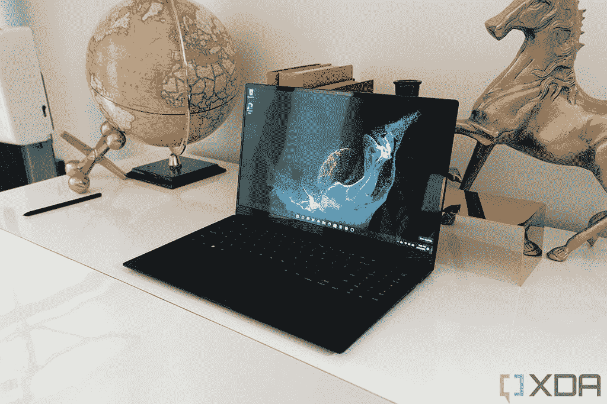
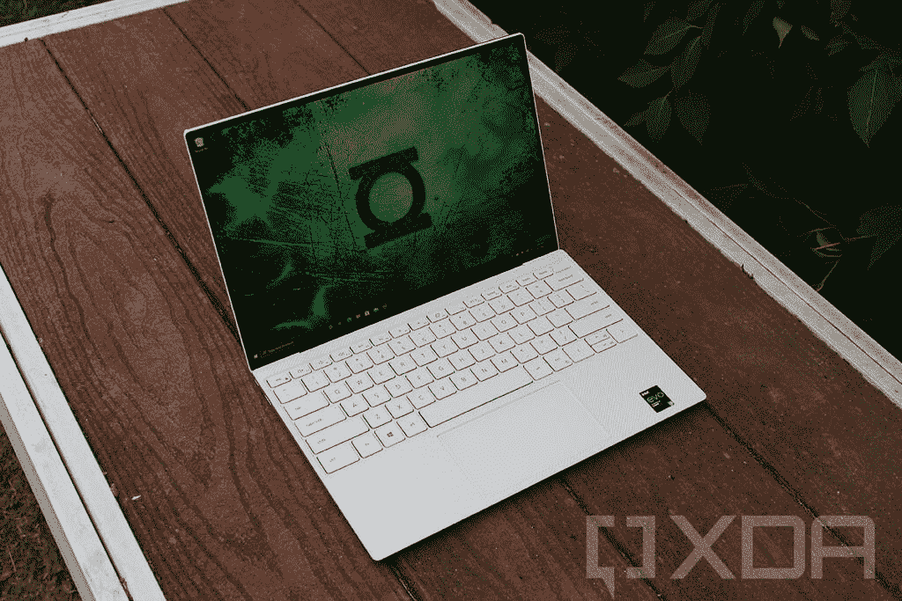
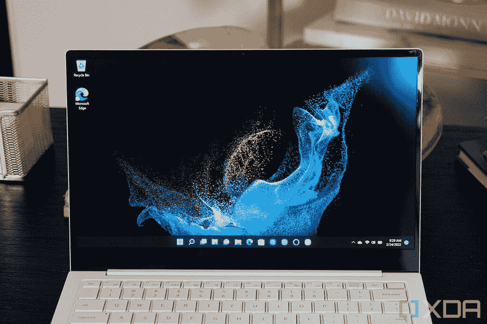
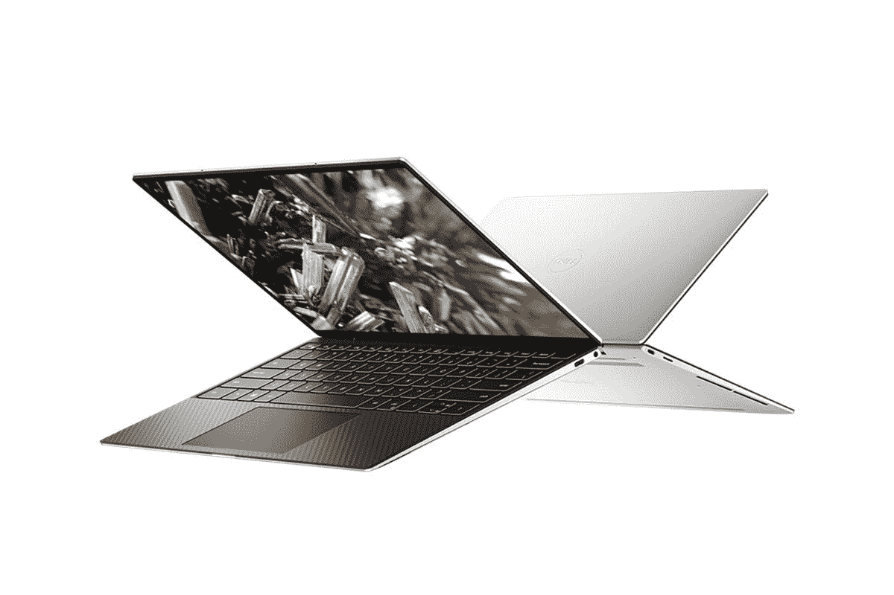

# 三星 Galaxy Book 2 Pro vs 戴尔 XPS 13:哪个更好？

> 原文：<https://www.xda-developers.com/samsung-galaxy-book-2-pro-vs-dell-xps-13/>

三星最近推出了 Galaxy Book 2 Pro 系列，并进行了一些重大改进。最值得注意的是，新的第 12 代英特尔处理器和改进的网络摄像头。没有改变的是让首款 Galaxy Book Pro 成为热门话题的超薄轻巧设计。那么，如果三星正在打造其最好的笔记本电脑之一，那么新的 Galaxy Book 2 Pro 与另一款顶级笔记本电脑戴尔 XPS 13 相比如何呢？

在过去几年中，戴尔的 XPS 系列一直是最知名的笔记本电脑品牌之一，并且是[最好的戴尔笔记本电脑](https://www.xda-developers.com/best-dell-laptops/)之一。所有 XPS 型号都出奇地紧凑，并在那个小小的机箱中安装了大量的电源。另外，他们也有很棒的展示。Galaxy Book 2 Pro 和 XPS 13 各有利弊，所以让我们仔细看看你可能会选择哪一款。

## 三星 Galaxy Book 2 Pro 与戴尔 XPS 13:规格

|  | 

三星 Galaxy Book 2 Pro

 | 

戴尔 XPS 13

 |
| --- | --- | --- |
| **CPU** | 

*   第 12 代 28W 英特尔酷睿 i5-1240P (12 个内核，16 个线程，最高 4.4GHz，12MB 高速缓存)
*   第 12 代 28W 英特尔酷睿 i7-1260P (12 个内核，16 个线程，最高 4.7GHz，18MB 高速缓存)

 | 

*   第 11 代 15W 英特尔酷睿 i3-1115G4(双核、四线程、高达 4.1GHz ，6 MB 高速缓存)
*   第 11 代 15W 英特尔酷睿 i5-1135G7 (4 核、8 线程、最高 4.2 GHz、8 MB 高速缓存)
*   第 11 代 15W 英特尔酷睿 i7-1165G7 (4 核、8 线程、最高 4.7 GHz、12MB 高速缓存)
*   第 11 代 15W 英特尔酷睿 i7-1185G7 (4 核、8 线程、最高 4.8GHz、12MB 高速缓存)
*   第 11 代 15W 英特尔酷睿 i7-1195G7 (4 核、8 线程、最高 5GHz、12MB 高速缓存)

 |
| **图形** | 

*   **13.3 英寸**:
    *   英特尔 Iris Xe(集成)
*   **15.6 英寸:**
    *   英特尔 Iris Xe(集成)
    *   可选:英特尔 Arc(独立)

 | 

*   英特尔 UHD 显卡(酷睿 i3)
*   英特尔 Iris Xe 显卡

 |
| **存储** |  | 

*   256 GB 固态硬盘
*   512GB 固态硬盘
*   1TB 固态硬盘
*   2TB 固态硬盘

 |
| **闸板** | 

*   8GB LPDDR5
*   16GB LPDDR5
*   32GB LPDDR5

 | 

*   8GB LPDDR4
*   16GB LPDDR4
*   32GB LPDDR4

 |
| **显示** | 

*   **13.3 英寸**
    *   全高清(1920 x 1080) Super AMOLED，16:9，120% DCI-P3，500 尼特(适用于 HDR)
*   **15.6 英寸**
    *   全高清(1920 x 1080) Super AMOLED，16:9，120% DCI-P3，500 尼特(适用于 HDR)

 | 

*   13.4 英寸 FHD+ (1920 x 1200) InfinityEdge 非触摸，500 尼特，防反光
*   13.4 英寸 FHD+(1920 x 1200)infinity edge touch，500 尼特，防反光
*   13.4 英寸 UHD+(3840 x 2400)infinity edge touch，500 尼特，防反光
*   13.4 英寸 3.5K (3456 x 2160) InfinityEdge 有机发光二极管触控，DisplayHDR 500，400 尼特，100% DCI-P3 色域，防反光

 |
| **电池** |  |  |
| **端口** | 

*   1 个 Thunderbolt 4 / USB Type-C
*   1 个 USB Type-C
*   1 个 USB 类型 A (USB 3.2)
*   3.5 毫米耳机插孔
*   microSD 读卡器
*   1 个 HDMI 接口(15.6 英寸型号)

 | 

*   2 个 Thunderbolt 4 端口
*   1 个耳机(耳机和麦克风组合)端口
*   microSD 读卡器

 |
| **音频** | 

*   **13.3 寸**
    *   双立体声 AKG 扬声器(4W total)，杜比全景声
*   **15.6 寸**
    *   双立体声 AKG 扬声器(总共 5W)，杜比全景声

 | 

*   立体声扬声器(2.5W x 2 = 4W 峰值)
*   Waves MaxxAudio Pro

 |
| **网络摄像头** |  |  |
| **Windows Hello** | 

*   指纹识别器(在电源按钮中)

 | 

*   指纹读取器
*   使用红外摄像头进行面部识别

 |
| **连通性** |  | 

*   英特尔黑仔 Wi-Fi 6 AX1650 (2 x 2)
*   蓝牙 5.1

 |
| **颜色** |  | 

*   铂金银配黑色碳纤维掌托
*   霜用北极白玻璃纤维编织的掌托

 |
| **尺寸(WxDxH)** | 

*   **13.3 英寸**
    *   304.4 x 199.8 x 11.2 毫米(11.98 x 7.87 x 0.44 英寸)
*   **15.6 英寸**
    *   集成显卡:355.4 x 225.8 x 11.7 毫米(13.99 x 8.89 x 0.46 英寸)
    *   独立显卡:355.4 x 225.8 x 13.2 毫米(13.99 x 8.89 x 0.52 英寸)

 | 

*   295.7×198.7×14.8 毫米(11.64×7.82×0.58 英寸)

 |
| **起始重量** | 

*   **13.3 英寸**
*   **15.6 英寸**
    *   集成显卡:1.11 千克(2.45 磅)
    *   独立显卡:1.17 千克(2.58 磅)

 |  |
| **价格** | 起价 1049.99 美元 | 起价 949 美元 |

我们已经包括了三星 Galaxy Book 2 Pro 的 13 英寸和 15 英寸版本的规格，但自然我们将更多地关注较小的型号，因为它与 XPS 13 更接近。无论如何，这两个尺寸在许多方面几乎相同。

## 性能:Galaxy Book 2 Pro 采用英特尔 Alder Lake 处理器

在上面的规格表中，您会注意到的第一件事是，三星 Galaxy Book 2 Pro 已经更新了英特尔的第 12 代 Alder Lake 处理器。这些新处理器拥有全新的混合架构，混合了高性能和高效内核。这导致内核和线程数量显著增加，进而意味着更高的性能。

 <picture></picture> 

Samsung Galaxy Book 2 Pro (15.6-inch)

但这还不是全部。Galaxy Book 2 Pro 还使用了英特尔新的 P 系列处理器，TDP 为 28W，而戴尔 XPS 13 中的处理器为 15W。得益于更高的功耗预算，这些处理器拥有更多的内核和线程。最终，Galaxy Book 2 Pro 中的英特尔酷睿 i7-1260P 处理器拥有 12 个内核和 16 个线程，而 Dell XPS 13 中的酷睿 i7-1195G7 处理器只有 4 个内核和 8 个线程。

三星 Galaxy Book 2 Pro 有 12 个内核和 16 个线程。

在 GeekBench 上比较这两个 CPU，您可以了解第 12 代处理器的速度有多快。基准测试结果不一定代表真实的性能，但它们为我们提供了两者之间的一些可衡量的比较:

|  | 

英特尔酷睿 i7-1195G7(平均)

 | 

英特尔酷睿 i7-1260P( [参见测试](https://browser.geekbench.com/v5/cpu/11182383))

 |
| --- | --- | --- |
| Geekbench 5 分数 | 1,448 / 4,865 | 1,445 / 5,953 |

您可以看到新处理器的速度有多快，尤其是在多核性能方面。两代处理器之间没有太大变化的一点是集成显卡，第 11 代和第 12 代处理器之间基本相同。如果你选择 15.6 英寸的 Galaxy Book 2 Pro，你可以选择英特尔 Arc 独立显卡，尽管你会牺牲一些便携性。

 <picture></picture> 

Dell XPS 13

除了新的处理器，新的三星 Galaxy Book 2 Pro 还支持更快的 LPDDR5 RAM，这是与戴尔 XPS 13 相比的另一个优势。这两款笔记本电脑都有高达 32GB 的内存，但 Galaxy Book 2 Pro 的速度应该更快，特别是软件针对更高的速度进行了优化。

## 显示器和声音:Dell XPS 13 的宽高比为 16:10

三星 Galaxy Book 2 Pro 仍落后的一个领域是显示屏。值得称赞的是，三星几乎是唯一一家提供全高清(1920 x 1080)AMOLED 显示屏的公司。包括 XPS 13 在内的大多数笔记本电脑都只有非常昂贵的高端配置的有机发光二极管显示屏，所以如果不花相当多的钱，你就无法获得有机发光二极管的好处。三星 Galaxy Book 2 Pro 像它的前辈一样，打破了这一规则，使有机发光二极管显示器更容易接近，这很好。

 <picture></picture> 

Samsung Galaxy Book 2 Pro (13-inch)

然而，它仍然使用 16:9 的纵横比，戴尔使用更高的 16:10 显示屏。近年来，这种更高的纵横比出现在越来越多的高端笔记本电脑中，这是有充分理由的。额外的垂直空间有助于提高生产率，并且会产生更大的表面积。这样，你可以在网页上看到更多的文本，或者在视频编辑器等应用程序中看到更多的 UI 元素。它需要更少的滚动，所以你可以更有效地工作。

三星仍然使用典型的 16:9 宽高比。

此外，虽然戴尔的基本配置包括全高清+ (1920 x 1200)液晶屏，但您可以升级到 3.5K (3456 x 2160) OLED 面板或超高清+ (3840 x 2400)液晶屏。三星有更好的入门级配置，但这是你唯一的配置。还有，戴尔 XPS 13 的大部分型号都支持触控，而 Galaxy Book 2 Pro 则不支持。为此你需要一辆敞篷车。

然而，当涉及到网络摄像头时，情况就不同了。三星的 Galaxy Book 2 Pro 配备了升级的全高清(1080p)网络摄像头，具有更宽的 87 度视野和自动取景等功能。与此同时，戴尔 XPS 13 拥有最差的网络摄像头之一，分辨率为 720p，传感器尺寸仅为 2.25 毫米，这意味着它无法捕捉更多的光线，因此图像质量往往更加嘈杂和粗糙。

这两款笔记本电脑都有类似的立体声扬声器设置，最大限度地发挥了 4W 的力量，这对于 13 英寸的笔记本电脑来说是稳固的。

## 设计:两种不同的便携性

三星 Galaxy Book 2 Pro 都以便携性著称，但两款笔记本电脑实际上在设计理念上有很大不同。Dell XPS 13 非常紧凑，但就面积而言更是如此，这要归功于显示屏周围非常小的挡板。它还相当薄，只有 14.8 毫米，2.64 磅，与你对这种尺寸的铝制笔记本电脑的预期一样重。

另一方面，三星 Galaxy Book 2 Pro 专注于极致轻薄。它的宽度和深度都比戴尔 XPS 13 大，即使 XPS 13 的显示屏更高，但它的厚度仅为 11.2 毫米，是目前最薄的笔记本电脑之一-特别是考虑到内部的 28W 处理器。重量仅为 1.92 磅(13 英寸机型)，也是你能买到的最轻的笔记本电脑之一。即使是 15.6 英寸的型号也比 XPS 13 更薄更轻。

我们认为重量对整体便携性更重要，但更小的面积也有助于将笔记本电脑放入背包或包中，所以你更喜欢三星的方法还是戴尔的方法取决于你。不过，这两款笔记本电脑本身都非常小巧。

就美学而言，这两款笔记本电脑有点相似，它们都采用了双色设计。至少在某种程度上。戴尔 XPS 13 有两种版本:一种是深银色外壳和黑色碳纤维内饰，另一种是浅银色外壳和白色玻璃纤维复合内饰。

三星 Galaxy Book 2 Pro 的银色型号与 XPS 13 相似，都有银色的外部和白色的内部，以及颜色匹配的键盘。然而，石墨版本基本上都是黑色的，所以没有双色外观。

## 端口:三星 Galaxy Book 2 Pro 拥有更多端口

最后，在端口方面，两款笔记本电脑相距并不太远，但 Galaxy Book 2 Pro 的通用性更强一些。它配有一个 Thunderbolt 4 端口，一个常规 USB-C 端口，一个 USB Type-A，一个耳机插孔和一个 microSD 读卡器。如果你有更大的 15.6 英寸型号，你还会得到一个 HDMI 端口。

与此同时，戴尔 XPS 13 只有两个 Thunderbolt 4 端口、一个耳机插孔和一个 microSD 读卡器。诚然，Thunderbolt 可以让你使用 [Thunderbolt dock](https://www.xda-developers.com/best-thunderbolt-docks/) 连接任何东西，但你仍然错过了对一些没有内置 USB 型端口的外设的支持。特别奇怪的是，Galaxy Book 2 Pro 是一款更薄的笔记本电脑，因此它应该有更小的空间来容纳更大的端口。

最后，对于无线通信，两款笔记本电脑都有蓝牙和 Wi-Fi，尽管 Galaxy Book 2 Pro 支持更新的 Wi-Fi 6E 和 6GHz 频段。

## 最后的想法

很明显，三星 Galaxy Book 2 Pro 在性能方面击败了戴尔 XPS 13，但这只是由于升级到了更新的英特尔处理器。在这方面，将 Galaxy Book 2 Pro 与新的[戴尔 XPS 13 Plus](https://www.xda-developers.com/dell-xps-13-plus/) 进行比较会更公平，因为它也有更新的处理器。如果性能是您最关心的问题，您可能想等等看戴尔是否会很快用新处理器更新标准 XPS 13。

三星的笔记本电脑在便携性方面也胜出一筹，这得益于其超轻薄的设计，使其成为 T2 最好的轻型笔记本电脑之一。此外，尽管如此，它比戴尔的笔记本电脑有更多的端口，这很好。Galaxy Book 2 Pro 还提供了更好的网络摄像头。

然而，三星仍然没有意识到更高的显示器对用户越来越重要，戴尔在这方面领先。它有一个更高的屏幕，而且如果你想的话，你可以升级以获得更高级的体验。这也是前面提到的 Dell XPS 13 Plus 所具备的，因此值得看一看该型号。

最终，你更喜欢三星 Galaxy Book 2 Pro 还是戴尔 XPS 13，这取决于你。如果您重视性能，三星的笔记本电脑适合您，但如果您想要更高的显示屏或升级到高级选项之一，戴尔 XPS 13 是更好的选择。不管你喜欢什么，一旦你做出选择，你可以在下面购买。否则，你可以看看你现在能买到的[最好的笔记本电脑](https://www.xda-developers.com/best-laptops/)。

 <picture></picture> 

Samsung Galaxy Book 2 Pro

##### 三星 Galaxy Book 2 Pro

三星 Galaxy Book 2 Pro 是一款非常轻薄的笔记本电脑，但它仍然配备了强大的第 12 代英特尔处理器和令人惊叹的 AMOLED 显示屏。

 <picture></picture> 

Dell XPS 13 (9310)

##### 戴尔 XPS 13 9310

Dell XPS 13 是 2021 年最好的超极本之一，具有紧凑的设计、高端的规格和出色的显示选项可供选择。