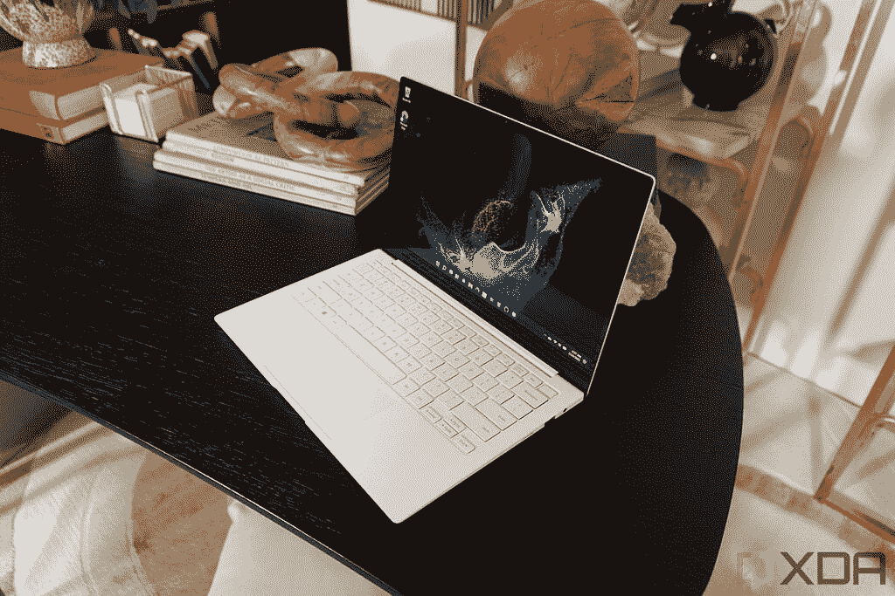
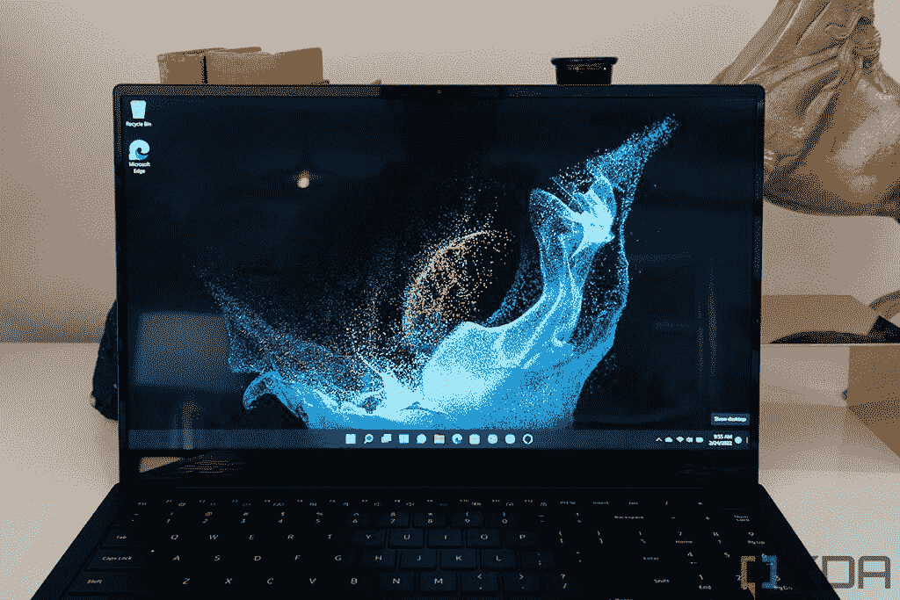
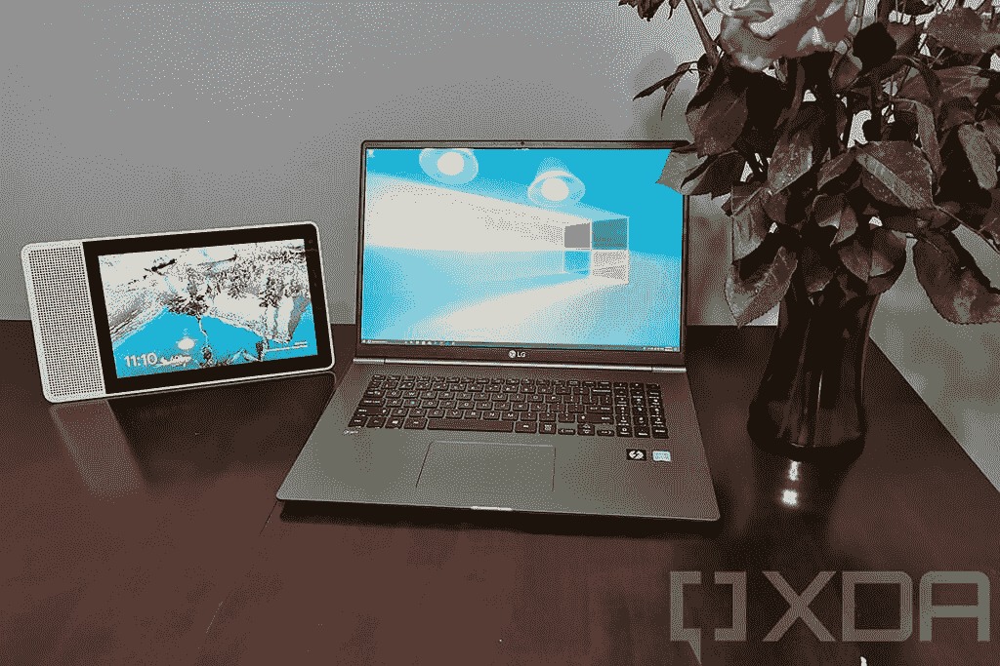
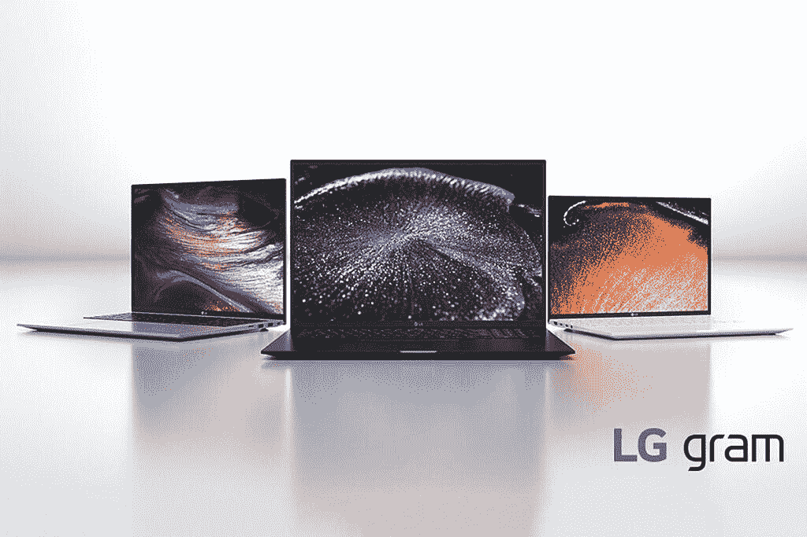
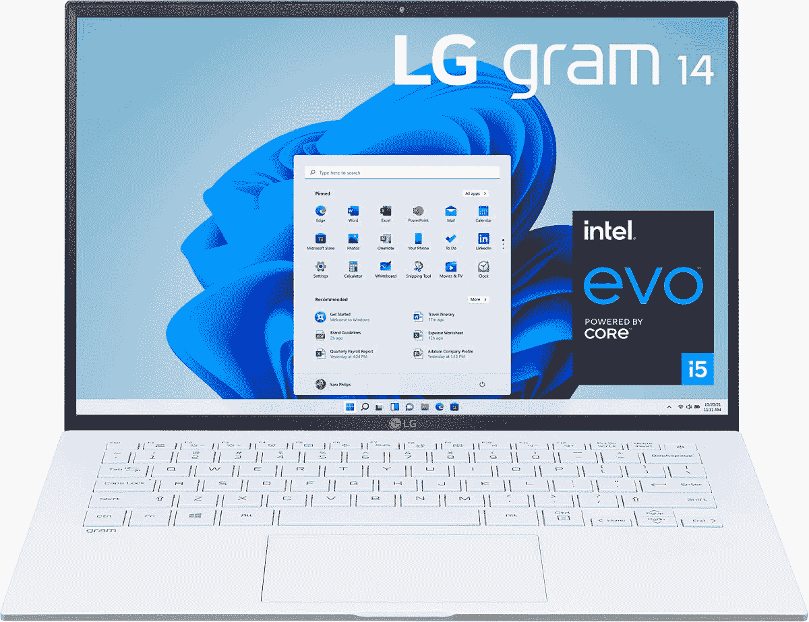
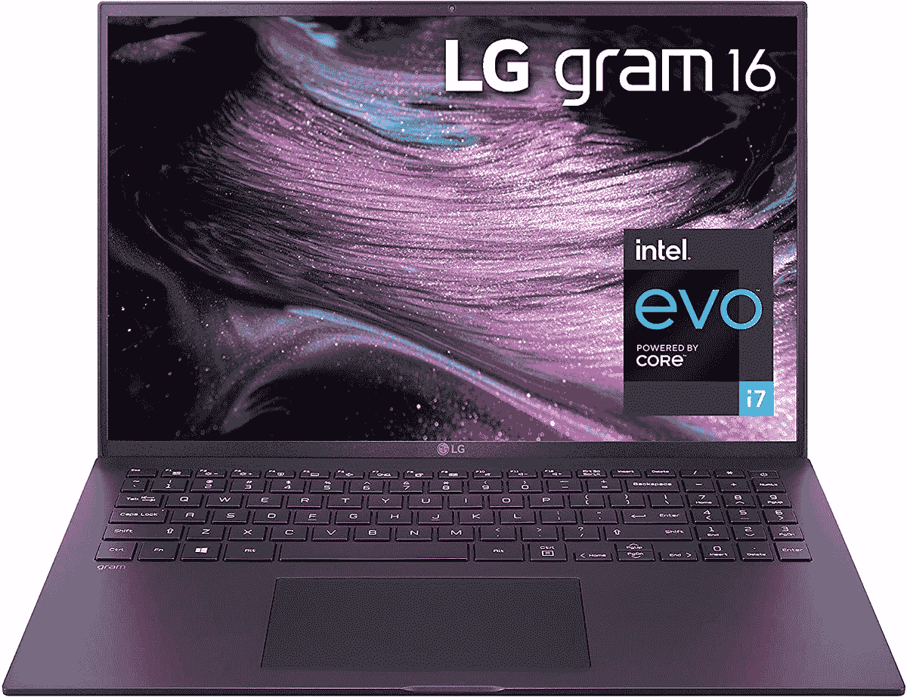
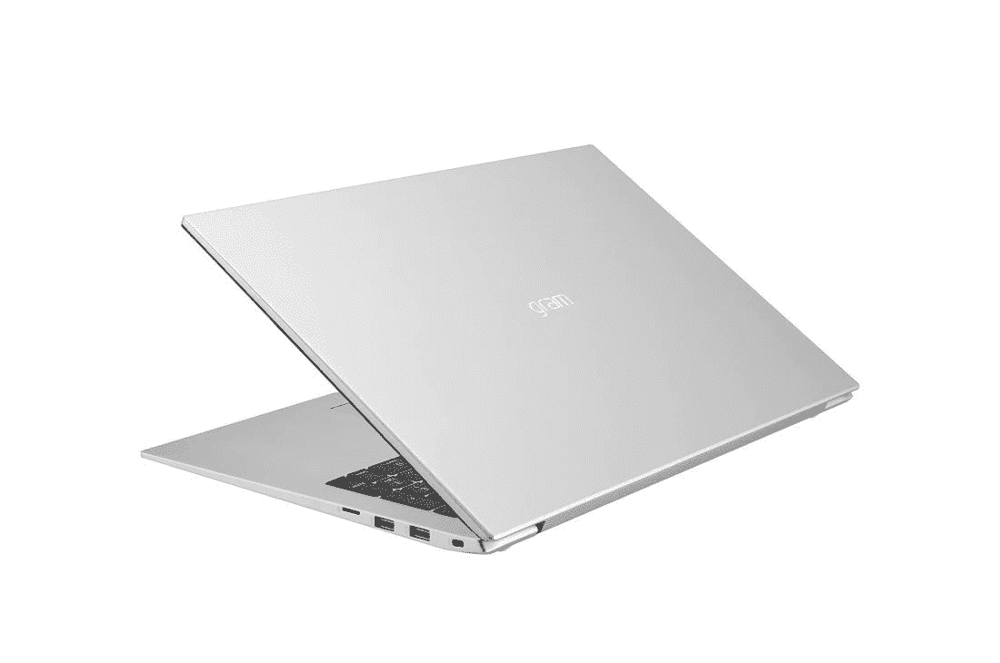

# 三星 Galaxy Book 2 Pro vs LG gram:最好的超轻笔记本电脑是什么？

> 原文：<https://www.xda-developers.com/samsung-galaxy-book-2-pro-vs-lg-gram/>

三星的 Galaxy Book 2 Pro 系列有望成为 2022 年最好的轻型笔记本电脑之一。Galaxy Book 2 Pro 与其前代产品非常相似，都是为了轻薄，但三星并不是第一个利用这一设计特点的公司。LG 的 gram 阵容也非常注重拥有一个非常轻便的机箱，LG 做的时间更长。Galaxy Book 2 Pro 能抢 LG gram 的风头吗？我们来对比一下，一探究竟。

公平地说，LG 尚未用英特尔的第 12 代处理器更新其 gram 阵容，因此三星立即拥有了重大优势。尽管如此，我们还是会将 Galaxy Book 2 Pro 与 2021 年的 LG gram 系列进行比较，因为还有一些其他差异值得记住。让我们来看看。

## 三星 Galaxy Book 2 Pro vs LG gram:规格

|  | 

三星 Galaxy Book 2 Pro

 | 

1g 克

 |
| --- | --- | --- |
| **CPU** | 

*   第 12 代 28W 英特尔酷睿 i5-1240P (12 个内核，16 个线程，最高 4.4GHz，12MB 高速缓存)
*   第 12 代 28W 英特尔酷睿 i7-1260P (12 个内核，16 个线程，最高 4.7GHz，18MB 高速缓存)

 | 

*   最高可配第 11 代 15W 英特尔酷睿 i7-1195G7 (4 核、8 线程、最高 5GHz、12MB 高速缓存)

 |
| **图形** | 

*   **13.3 寸**:
    *   英特尔 Iris Xe(集成)
*   **15.6 英寸:**
    *   英特尔 Iris Xe(集成)
    *   可选:英特尔 Arc(独立)

 |  |
| **存储** |  | 

*   256 GB 固态硬盘
*   512GB 固态硬盘
*   1TB 固态硬盘
*   2TB 固态硬盘

 |
| **闸板** | 

*   8GB LPDDR5
*   16GB LPDDR5
*   32GB LPDDR5

 | 

*   8GB LPDDR4
*   16GB LPDDR4
*   32GB LPDDR4

 |
| **显示** | 

*   **13.3 英寸**
    *   全高清(1920 x 1080) Super AMOLED，16:9，120% DCI-P3，500 尼特(适用于 HDR)
*   **15.6 英寸**
    *   全高清(1920 x 1080) Super AMOLED，16:9，120% DCI-P3，500 尼特(适用于 HDR)

 | 

*   **LG 克 14**
    *   14 英寸全高清+ (1920 x 1200) IPS，16:10，99% DCI-P3
*   **LG 克 16**
    *   16 英寸四核高清+ (2560 x 1600) IPS，16:10，99% DCI-P3
*   **LG 克 17**
    *   17 英寸四核高清+ (2560 x 1600) IPS，16:10，99% DCI-P3

 |
| **电池** |  | 

*   **LG 克 14**
*   **LG 克 16 和 17**

 |
| **端口** | 

*   1 个 Thunderbolt 4 / USB Type-C
*   1 个 USB Type-C
*   1 个 USB 类型 A (USB 3.2)
*   3.5 毫米耳机插孔
*   microSD 读卡器
*   1 个 HDMI 接口(15.6 英寸型号)

 | 

*   2 个 Thunderbolt 4(USB C 型)
*   2 个 USB 3.2 Gen 2 x 1(A 型)
*   高清晰度多媒体接口
*   微型 SD/UFS 读卡器
*   3.5 毫米耳机/麦克风组合插孔

 |
| **音频** | 

*   **13.3 英寸**
    *   双立体声 AKG 扬声器(4W 总计)
    *   杜比大气
*   **15.6 英寸**
    *   双立体声 AKG 扬声器(总共 5W)
    *   杜比大气

 | 

*   立体声扬声器(2 个 1.5 瓦)
*   DTS X Ultra

 |
| **网络摄像头** |  |  |
| **Windows Hello** | 

*   指纹识别器(在电源按钮中)

 |  |
| **连通性** |  | 

*   英特尔黑仔 Wi-Fi 6 AX201 (2 x 2)
*   蓝牙 5.1

 |
| **颜色** |  |  |
| **尺寸(WxDxH)** | 

*   **13.3 英寸**
    *   304.4 x 199.8 x 11.2 毫米(11.98 x 7.87 x 0.44 英寸)
*   **15.6 英寸**
    *   集成显卡:355.4 x 225.8 x 11.7 毫米(13.99 x 8.89 x 0.46 英寸)
    *   独立显卡:355.4 x 225.8 x 13.2 毫米(13.99 x 8.89 x 0.52 英寸)

 | 

*   **LG 克 14**
    *   313.4 x 215.2 x 16.8 毫米(12.34 x 8.47 x 0.66 英寸)
*   **LG 克 16**
    *   355.9 x 243.4 x 16.8 毫米(14.01 x 9.58 x 0.66 英寸)
*   **LG 克 17**
    *   380.2 x 260.1 x 17.8 毫米(14.97 x 10.24 x 0.7 英寸)

 |
| **起始重量** | 

*   **13.3 英寸**
*   **15.6 英寸**
    *   集成显卡:1.11 千克(2.45 磅)
    *   独立显卡:1.17 千克(2.58 磅)

 | 

*   **LG 克 14**
*   **LG 克 16**
*   **LG 克 17**

 |
| **价格** | 起价 1049.99 美元 | 起价 1199 美元 |

## 性能:英特尔第 12 代处理器大有作为

三星的 Galaxy Book 2 Pro 是首批配备英特尔新 Alder Lake 处理器的笔记本电脑之一，与之前的产品相比，它们有一些很大的优势。这些新的 CPU 具有混合架构，混合了高性能核心和高效核心，并且整体核心数量更高。此外，三星正在使用 28W TDP 的 P 系列处理器，而 LG gram 的 U 系列处理器的额定功率为 15W。

 <picture></picture> 

Samsung Galaxy Book 2 Pro

正如你可能预料的那样，这意味着 Galaxy Book 2 Pro 的性能有了很大的提升。让我们看看这些处理器在 Geekbench 5 中是如何相互比较的:

|  | 

英特尔酷睿 i5-1135G7(平均)

 | 

英特尔酷睿 i5-1240P( [参见测试](https://browser.geekbench.com/v5/cpu/13546373))

 | 

英特尔酷睿 i7-1195G7(平均)

 | 

英特尔酷睿 i7-1260 处理器([参见测试](https://browser.geekbench.com/v5/cpu/13288760))

 |
| --- | --- | --- | --- | --- |
| Geekbench 5 分数 | 1,244 / 4,192 | 1,490 / 6,548 | 1,450 / 4,861 | 1,500 / 9,896 |

请记住，Geekbench 还没有第 12 代处理器的平均分，所以这些是单一测试的结果，可能会有这样或那样的偏差。不过，这应该会让您对这些新 CPU 有所期待，这是一个很大的改进。您可以看到，内核数量的增加清楚地反映在多核性能上。

就图形而言，集成的英特尔 Iris Xe 在第 11 代和第 12 代处理器之间的性能大致相同。不过，由于可选的英特尔 Arc 独立显卡选项，三星 Galaxy Book 2 Pro 确实有优势。它只有 15 英寸的型号，但如果你想为一些轻度游戏提供额外的动力，三星给你提供了选择。

三星 Galaxy Book 2 Pro 支持新的更快的 LPDDR5 RAM。

除了第 12 代英特尔处理器，您还可以获得其他优势，如支持新的 LPDDR5 RAM，这是 Galaxy Book 2 Pro 的另一个优势。不过，这一切都在意料之中，因为三星的笔记本电脑更新了很多，LG 还没有用今年的处理器更新 gram 系列。

## 显示屏:三星 Galaxy Book 2 Pro 配有 AMOLED

可以说，三星 Galaxy Book 2 Pro 最棒的事情之一就是它的显示屏，这是因为它给了你一个 AMOLED 面板作为标准配置。这在笔记本电脑中很少见，但更有趣的是，它是全高清(1920 x 1080)显示屏。通常，一些高端笔记本电脑会给你提供有机发光二极管显示器的选项，但这是一个非常高端的配置，比如 4K 分辨率。这意味着你必须支付更多的费用，此外，如果你想要有机发光二极管屏幕的额外好处，你的电池寿命也会受到影响。

 <picture></picture> 

Samsung Galaxy Book 2 Pro

使用 Galaxy Book 2 Pro，您可以获得那些真实的黑色和生动的颜色，而无需支付大量的金钱。另一方面，全高清是你唯一的选择，所以如果你想要更清晰的显示，你就没那么幸运了。此外，这是 16:9 的宽高比，而许多高端笔记本电脑已经转换到 16:10 或 3:2。

与此同时，LG gram 仍然使用 IPS 面板，但它有自己的一些额外好处。首先，三款机型的长宽比为 16:10。这种更高的格式意味着您可以获得更多的垂直空间和更大的表面积，因此如果您正在阅读一个文档，您可以在不滚动的情况下看到更多的文本。或者，如果您正在编辑视频，您可以在时间线上看到更多轨道。这是一个巨大的生产力提升。

 <picture></picture> 

LG gram 17

LG 在分辨率上还有一个优势。gram 14 有一个全高清+ (1920 x 1200)显示屏，但 gram 16 和 gram 17 都有一个清晰的四高清+ (2560 x 1600)面板，在这样的大显示屏下看起来更好看。此外，增加的像素密度还可以通过缩小 Windows 中 UI 元素的大小来帮助您在屏幕上获得更多空间。总的来说，这只是一个更好的显示器来完成工作，而三星的更适合媒体消费。

Galaxy Book 2 Pro 配有全高清网络摄像头。

不过，三星在摄像头方面确实有明显的优势。Galaxy Book 2 Pro 配备了升级的 1080p 网络摄像头，而不是 LG gram 上的 720p 摄像头。这款升级的相机还包括自动取景和三星的工作室模式，具有一些 LG gram 上没有的额外功能。

至于音频，这两款笔记本电脑都有双扬声器立体声设置，尽管你应该能够从 Galaxy Book 2 Pro 获得更大的功率。

## 设计:两台极其轻便的笔记本电脑

不管你在这两者之间选择哪一种型号，有一点是肯定的:你将得到一台便于随身携带的笔记本电脑。不过，三星 Galaxy Book 2 Pro 确实赢得了这场比赛，部分原因是其较小的 13 英寸机型。重量仅为 1.92 磅，略低于 gram 14 的 2.18 磅。下一个尺寸的情况类似，15 英寸的 Galaxy Book 2 Pro 重 2.45 磅或 2.58 磅(取决于你是否有独立的 GPU)，超过了 LG gram 16 的 2.62 磅。尽管这是一个很小的差异，但就其尺寸而言，它们都非常轻。

三星在薄度方面有更明显的胜利，Galaxy Book 2 Pro 在 13 英寸机型上的尺寸仅为 11.2 毫米，在 15 英寸机型上为 11.7 毫米，如果你选择获得独立的英特尔 Arc GPU，则为 13.2 毫米。相比之下，LG gram 14 和 16 的厚度为 16.8 毫米。

至于外观，三星 Galaxy Book 2 Pro 有两种颜色可选:银色和石墨色。除此之外，银色更有趣，因为虽然它的外表是银色的，但内部是白色的，键盘按键也是颜色匹配的。石墨选项里里外外都是黑色的，所以看起来光滑柔和。

 <picture></picture> 

All three colors of the LG gram lineup

与此同时，LG gram 有三种颜色可供选择:银色、黑色或白色。然而，并不是每种颜色都适用于每种配置，所以很难找到一种特定的颜色。白色和黑色型号有颜色匹配的键盘，但银色型号也有黑色键，所以看起来有点不太有趣。无论哪种方式，这两款笔记本电脑看起来都很优雅和时尚，如果不是非常有趣的话。

## 港口:你得到更多的 LG 克

最后，我们来到端口，在这里 LG 通过提供更多的连接选项来弥补其略厚的机箱。LG gram 的三个型号都有相同的端口:两个 Thunderbolt 4、两个 USB Type-A、HDMI、一个耳机插孔和一个 microSD 读卡器。这是一个非常可靠的设置，如果你买的是 LG gram 14，这一点尤其令人印象深刻。大多数这种尺寸的笔记本电脑没有那么多端口。

同时，三星 Galaxy Book 2 Pro 有一个 Thunderbolt 4 端口，一个标准 USB Type-C 端口，一个 USB Type-A，一个耳机插孔和一个 microSD 卡插槽。你也可以得到 HDMI，但只能在 15 英寸的型号上。你错过了一个额外的 USB Type-A 端口和 HDMI，这可能是因为这种超薄设计。再加上三星不管什么原因只有一个 USB Type-C 口有 Thunderbolt 4。无论哪种方式，你都可以通过一个 [Thunderbolt dock](https://www.xda-developers.com/best-thunderbolt-docks/) 来扩展笔记本电脑上的端口。

三星 Galaxy Book 2 Pro 有一个支持 5G 的模型，但仅在部分市场上提供。

在无线标准方面，三星 Galaxy Book 2 Pro 支持 Wi-Fi 6E 和蓝牙 5.2，这使其比 LG gram 及其 Wi-Fi 6 支持更具优势。此外，如果你想在旅途中保持联系，Galaxy Book 2 Pro 将在一些市场推出 5g 模式(但不是美国，至少目前是这样)。

## 最后的想法

很明显，如果你想要更高的性能，三星 Galaxy Book 2 Pro 是介于这两者之间的选择。这只是一个更新的笔记本电脑，所以这正是你所期望的。你可能没有想到的是，它获得了比 LG gram 更薄更轻的性能。此外，如果你是 AMOLED 显示屏的粉丝，三星笔记本电脑是唯一提供这种显示屏的产品，而且价格合理。

另一方面，LG gram 确实有一个更高的显示屏，这对生产力更好，如果你想要一个更大的型号，你也可以获得更高分辨率的面板。最重要的是，您可以获得更多端口来连接外围设备，而无需适配器或坞站。

不过，如果你确实更喜欢 LG gram，我们建议等待 LG 发布新机型，这些机型几乎肯定会采用英特尔的新处理器。当第 12 代型号开始推出时，购买采用第 11 代处理器的高端笔记本电脑可能没有太大意义。

不管怎样，如果你想买其中任何一个，你可以使用下面的链接。否则，你可以看看我们列出的你现在能买到的[最好的三星笔记本电脑](https://www.xda-developers.com/best-samsung-galaxy-laptops/)，或者如果你不想要某个特定的品牌，也许可以看看[最好的笔记本电脑](https://www.xda-developers.com/best-laptops/)。

 <picture></picture> 

Samsung Galaxy Book 2 Pro

##### 三星 Galaxy Book 2 Pro

三星 Galaxy Book 2 Pro 是一款非常轻薄的笔记本电脑，但它仍然配备了第 12 代英特尔处理器。

 <picture></picture> 

LG gram 14

##### LG 克 14

LG gram 14 是一款轻型 14 英寸笔记本电脑，采用 16:10 显示屏和第 11 代英特尔处理器。

 <picture></picture> 

LG gram 16

##### LG 克 16

LG gram 16 是一款轻型 16 英寸笔记本电脑，采用 QHD+分辨率的 16:10 显示屏，外加第 11 代英特尔处理器。

 <picture></picture> 

LG gram 17

##### LG Gram 17

LG gram 17 对于 17 英寸的笔记本电脑来说轻得惊人，此外它还配备了四核高清+ 16:10 显示屏和第 11 代英特尔处理器。