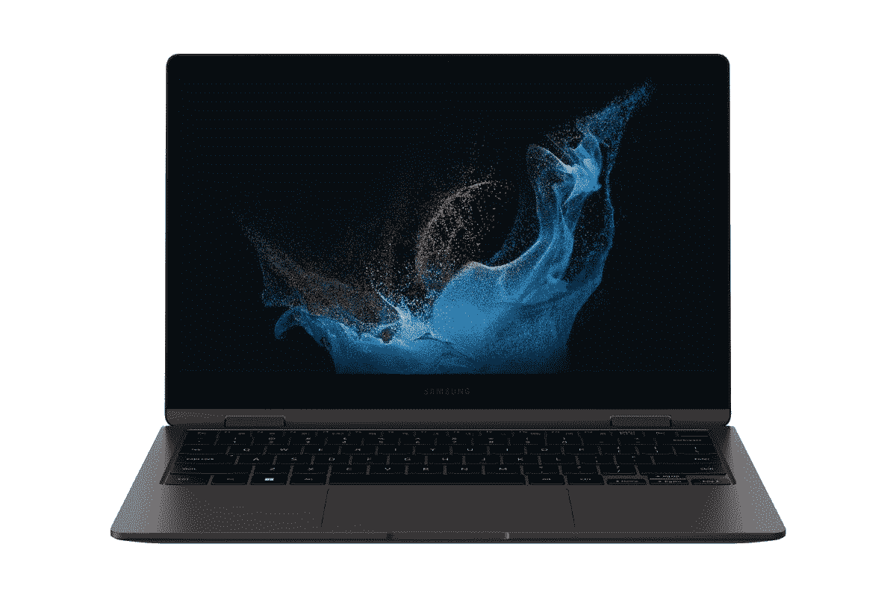

# 三星 Galaxy Book 2:发布日期、价格和你需要知道的一切

> 原文：<https://www.xda-developers.com/samsung-galaxy-book-2/>

三星最近推出了 Galaxy Book 2 Pro 系列，这是其[优质轻量级超极本](https://www.xda-developers.com/best-lightweight-laptops/)的阵容。这些很可能会得到大多数的关注，但如果你不想花超过 1000 美元买一台笔记本电脑，新的三星 Galaxy Book 2 360 可能是你更好的选择。

这是一款更主流的敞篷车，它很有趣，因为它是去年 Galaxy Book 的后续产品，当时没有敞篷车。今年似乎正朝着相反的方向发展。三星只在美国发布了 Galaxy Book 2 360，尽管在一些市场上还有一款典型的翻盖手机。

如果你想知道关于新的 Galaxy Book 2 系列的一切，你来对地方了。我们有规格、发布日期和价格信息来帮助您。请记住，可用配置可能因市场而异。

## 规范

|  | 

三星 Galaxy Book 2

 | 

三星 Galaxy Book 2 360

 |
| --- | --- | --- |
| **CPU** | 

*   第 12 代英特尔赛扬
*   第 12 代英特尔奔腾
*   第 12 代 U 系列英特尔酷睿 i3
*   第 12 代 U 系列英特尔酷睿 i5
*   第 12 代 U 系列英特尔酷睿 i7

 | 

*   第 12 代英特尔赛扬(仅在部分市场)
*   第 12 代英特尔奔腾(仅在部分市场)
*   第 12 代 U 系列英特尔酷睿 i3(仅在部分市场)
*   第 12 代 U 系列英特尔酷睿 i5
*   第 12 代 U 系列英特尔酷睿 i7

 |
| **图形** | 

*   英特尔 UHD 显卡(赛扬、奔腾、酷睿 i3)
*   英特尔 Iris Xe(酷睿 i5/i7)

 | 

*   英特尔 UHD 显卡(赛扬、奔腾、酷睿 i3)
*   英特尔 Iris Xe(酷睿 i5/i7)

 |
| **储存** |  |  |
| **撞锤** | 

*   固态硬盘型号:
*   硬盘型号:
    *   4GB DDR4 3200MHz
    *   8GB DDR4 3200MHz
    *   16GB DDR4 3200MHz

 |  |
| **显示** | 

*   15.6 英寸全高清(1920 x 1080)

 | 

*   13.3 英寸 AMOLED，全高清(1920 x 1080)，500 尼特，HDR，触控

 |
| **电池** | 

*   54 瓦时电池(固态硬盘型号)
*   43Wh(硬盘型号)

 |  |
| **端口** | 

*   2 个 USB 型
*   2 个 USB 类型 A (USB 3.2)
*   高清晰度多媒体接口
*   3.5 毫米组合音频插孔
*   microSD 读卡器

 | 

*   1 个 Thunderbolt 4 / USB Type-C
*   1 个 USB Type-C
*   1 个 USB 类型 A (USB 3.2)
*   高清晰度多媒体接口
*   3.5 毫米组合音频插孔
*   microSD 读卡器

 |
| **音频** | 

*   带杜比全景声的双扬声器

 | 

*   带杜比全景声的双扬声器

 |
| **网络摄像头** |  |  |
| **Windows 你好** | 

*   电源按钮中的指纹识别器(可选)

 | 

*   电源按钮中的指纹识别器

 |
| **连通性** |  |  |
| **颜色** |  |  |
| **尺寸(WxDxH)** | 

*   固态硬盘型号:
    *   356.6 x 229.1 x 15.4 毫米(14.04 x 9.02 x 0.61 英寸)

*   硬盘型号:
    *   358.16 x 236.85 x 18.5mm 毫米(14.1 x 9.32 x 0.73 英寸)

 | 

*   304.4 x 202.0 x 12.9mm 毫米(11.98 x 7.95 x 0.5 英寸)

 |
| **起始重量** |  |  |
| **价格** | TBD | 起价 899.99 美元(配备英特尔酷睿 i5) |

虽然三星已经在其全球网站上列出了这些规格，但没有迹象表明 Galaxy Book 2 将进入美国。此外，在美国仅宣布了 Galaxy Book 2 360 的英特尔酷睿 i5 或 i7 型号。

## 三星 Galaxy Book 2 发布日期

三星 Galaxy Book 2 360 的预购于 3 月 17 日开放，销售于 4 月 1 日正式开始。这适用于美国，因此其他市场的日期可能会有所不同。如上所述，这还仅包括酷睿 i5 和酷睿 i7 型号。

至于标准版的 Galaxy Book 2，在美国根本买不到。它确实存在于一些市场，但具体的发布日期尚不清楚。事实上，这款机型的大部分发布细节都不为人知，这显然不是三星的主要关注点。

## 三星 Galaxy Book 2 价格

如果你想成为首批购买新款 Galaxy Book 2 360 的人之一，你可以预计在美国至少支付 899.99 美元。这是基本配置的价格，包括英特尔酷睿 i5、8GB 内存和 256GB 存储。如果你想升级，你可以花 1099.99 美元买一个英特尔酷睿 i7，16GB 内存和 512GB 固态硬盘。这是仅有的两种选择，三星倾向于简化笔记本电脑的配置选项。

同样，标准 Galaxy Book 2 的情况还不清楚。它在美国或大多数其他主要市场都没有销售，价格也不清楚。不过，它可能会便宜得多，特别是一些配置，包括硬盘存储和 4GB 内存。

## 三星 Galaxy Book 2 系列有什么新功能

新的三星 Galaxy Book 2 自然是去年 Galaxy Book 的继任者，所以它有一些升级。最大的消息是 Galaxy Book 2 360，这是一种新的外形，有一些更显着的升级。标准的 Galaxy Book 2 实际上只有更新的处理器和更便宜的带硬盘的型号。我们将重点比较 Galaxy Book 2 360 和原始 Galaxy Book。

### 可转换的外形

最初的 Galaxy Book 采用翻盖式外形，这是唯一的选择，除非你选择专业型号。对于 Galaxy Book 2 系列，翻盖外形实际上已经被推到了一边，几乎没有人在任何地方提到它。

相反，现在的重点是 Galaxy Book 2 360。这是一个可转换的笔记本电脑，这意味着铰链可以旋转 360 度。你可以把它当作普通的笔记本电脑使用，但你也可以把它旋转成平板电脑，或者在“帐篷模式”下看电影和视频。

### 更小更好的显示器

Galaxy Book 2 360 上的显示屏也是一个非常值得注意的升级。它现在使用 Super AMOLED 面板，与去年的型号相比，为您提供明亮、生动的颜色、真实的黑色和高对比度。显示屏现在也更小了，为 13.3 英寸，实际上更适合面板的全高清分辨率。此外，更小的尺寸使其更易于管理，因此您可以更容易地切换到平板电脑模式。

标准的 Galaxy Book 2 使用了与去年型号相同的显示屏。这是一个 15.6 英寸的全高清面板，虽然三星没有透露具体细节，但它很可能又是一个 TFT 面板。

### 第 12 代英特尔处理器

最后一个重大升级是处理器，它已经升级到英特尔的最新产品。第 12 代英特尔处理器采用混合架构，P 内核专注于高性能，E 内核旨在提高效率。总的来说，与第 11 代 CPU 的最多 4 个内核和 8 个线程相比，第 12 代处理器最多可支持 10 个内核和 12 个线程。

与 Pro 系列不同，Galaxy Book 2 仍然使用 15W TDP 的 U 系列处理器，而不是 28W 单元。不过，如果你关心性能，这是一个重要的升级，它也应该有助于提供更好的电池寿命。

虽然这些新处理器将支持 LPDDR5 RAM，但三星仍坚持使用 LPDDR4x。此外，Galaxy Book 2 360 没有独立显卡选项，而去年的 Galaxy Book 可以提供独立显卡。

## 在哪里购买三星 Galaxy Book 2

如果你有兴趣购买三星 Galaxy Book 2 360，可以在下面直接从三星购买。翻盖式 Galaxy Book 2 不打算在美国推出。如果你不想等待，你可以随时查看你现在能买到的最好的三星笔记本电脑。如果你不喜欢三星设备，我们也有一份 T2 最佳笔记本电脑列表。

 <picture></picture> 

Samsung Galaxy Book 2 360

##### 三星 Galaxy Book 2 360

三星 Galaxy Book 2 Pro 360 是一款相当轻便的敞篷车，采用第 12 代英特尔处理器，配备全高清 AMOLED 显示屏。