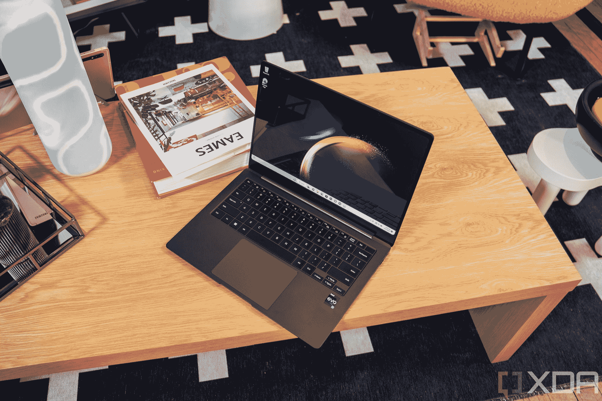

# 三星 Galaxy Book 3 Pro vs Surface Laptop 5:哪款优质笔记本电脑符合你的需求？

> 原文：<https://www.xda-developers.com/samsung-galaxy-book-3-pro-vs-surface-laptop-5/>

2023 年不会缺少[高级笔记本电脑](https://www.xda-developers.com/best-laptops/)，但其中两个最好的包括 [Surface Laptop 5](https://www.xda-developers.com/surface-laptop-5-review/) 和新的[三星 Galaxy Book 3 Pro](https://xda-developers.com/samsung-galaxy-book-3-pro/) 系列。Galaxy Book 3 Pro 与过去的机型相比有很多变化，比如转向更大的 16:10 宽高比 AMOLED 屏幕，而微软的 Surface Laptop 5 也提供了非常新的颜色和对 Surface Pen 的支持。甚至这些设备的屏幕尺寸也有所不同，三星提供 14 和 16 英寸的选择，微软则倾向于经典的 13 和 15 英寸机型。

如果你想知道这些设备如何比较，并希望从三星或微软获得一款出色的新款旗舰笔记本电脑，我们可以帮助你做出购买决定。

*   ##### 微软 Surface Laptop 5

    Surface Laptop 5 采用了圆滑的设计，运行 Windows 11，拥有触摸屏。就价格而言，它是目前最好的笔记本电脑之一，就 15 英寸机型而言，它是最轻的一款。

    T13
*   ##### 三星 Galaxy Book 3 Pro

    三星 Galaxy Book 3 Pro 是一款高端铝制笔记本电脑，配备第 13 代英特尔酷睿处理器，并有 14 英寸或 16 英寸屏幕可选。

## 三星 Galaxy Book 3 Pro 与 Surface Laptop 5:价格和可用性

三星 Galaxy Book 3 Pro 起价 1449.99 美元，将于 2023 年 2 月 17 日开始销售。你现在可以通过 Samsung.com 预订，一旦可以，也可以通过其他零售商如百思买和亚马逊预订。它配备了第 13 代英特尔酷睿 CPU，初始存储容量为 256GB，内存为 8GB，尺寸为 14 或 16 英寸。Galaxy Book 3 Pro 系列还采用了 Galaxy Book 3 Pro 360，这是一款 2 合 1 可转换产品，但我们将在本文中重点关注翻盖机型。

与此同时，Surface Laptop 5 的 13 英寸机型起价为 999 美元，15 英寸机型起价为 1，300 美元。这款 13 英寸的 Surface Laptop 5 配备了 Alcantara 面料、8GB 内存、256GB 固态硬盘和英特尔酷睿 i5 CPU。15 英寸型号有金属表面，8GB 内存，256GB 固态硬盘存储，英特尔酷睿 i7 CPU。你可以通过微软、百思买、亚马逊和其他零售商购买。

## 三星 Galaxy Book 3 Pro vs Surface Laptop 5:规格

|  | 

三星 Galaxy Book 3 Pro

 | 

Surface 笔记本电脑 5

 |
| --- | --- | --- |
| 

**操作系统**

 |  | 

*   Windows 11 家庭版(消费者)
*   Windows 11/10 专业版(企业版)

 |
| 

**CPU**

 | 

*   第 13 代英特尔酷睿 i5 或英特尔酷睿 i7 CPUs

 | 

*   **13.5 寸**
    *   消费者
        *   第 12 代英特尔酷睿 i5-1235U(最高 4.4GHz，10 个内核，12 个线程)
        *   第 12 代英特尔酷睿 i7-1255U(最高 4.7GHz，10 个内核，12 个线程)

    *   商业
        *   第 12 代英特尔酷睿 i5-1245U(最高 4.4GHz，10 个内核，12 个线程)
        *   第 12 代英特尔酷睿 i7-1265U(最高 4.8GHz，10 个内核，12 个线程)

*   **15 英寸:**
    *   消费者
        *   第 12 代英特尔酷睿 i7-1255U(最高 4.7GHz，10 个内核，12 个线程)

    *   商业
        *   第 12 代英特尔酷睿 i7-1265U(最高 4.8GHz，10 个内核，12 个线程)

 |
| 

**图形**

 |  |  |
| 

**显示**

 | 

*   **14 英寸**
    *   14 英寸动态 AMOLED 2x，16:10 宽高比，2880 x 1800，120 赫兹，400 尼特

*   **16 英寸**
    *   16 英寸动态 AMOLED，16:10 宽高比，2880 x 1800，120 赫兹，400 尼特

 | 

*   **13.5 英寸**
    *   13.5 英寸 PixelSense 显示屏，3:2 宽高比，2256 x 1504，201 PPI，触摸屏
    *   杜比视觉智商

*   **15 英寸**
    *   15 英寸 PixelSense 显示屏，3:2 宽高比，2496 x 1664，201 PPI，触摸屏

 |
| 

**存储(SSD)**

 |  |  |
| 

**闸板**

 | 

*   8GB LPDDR5
*   16GB LPDDR5
*   32GB LPDDR5

 | 

*   8GB LPDDR5x
*   16GB LPDDR5x
*   32GB LPDDR5x

 |
| 

**电池**

 | 

*   **14 英寸:** 63Wh
*   **16 英寸:** 76Wh

 | 

*   **13.5 英寸:**长达 19 小时的典型设备使用时间(实际容量不详)
*   **15 英寸:**长达 18 小时的典型设备使用时间(实际容量未指定)

 |
| 

**端口**

 | 

*   2 x 雷电 4
*   1 个 USB 类型 A
*   3.5 毫米耳机插孔
*   HDMI 1.4
*   microSD 卡插槽

 | 

*   1 个 Thunderbolt 4/USB 4(C 型)端口
*   1 个 USB 3.1 类型 A
*   3.5 毫米耳机插孔
*   表面连接端口

 |
| 

**音频**

 | 

*   AKG 四扬声器(低音扬声器最大 5W x 2，高音扬声器 2W x 2)，智能放大器
*   杜比大气
*   录音室品质双麦克风

 | 

*   配有杜比 Atmos 的 Omnisonic 扬声器
*   双通道远场录音室话筒

 |
| 

**摄像机**

 |  | 

*   前置 720p 高清摄像头

 |
| 

**Windows Hello**

 | 

*   电源键上的指纹识别器

 |  |
| 

**连通性**

 | 

*   Wi-Fi 6E (Gig+)，802.11 ax 2x2，
*   蓝牙 v5.1

 | 

*   Wi-Fi 6 802.11ax
*   蓝牙 5.1

 |
| 

**颜色**

 |  | 

*   **13.5 英寸**
    *   铂金搭配 Alcantara 面料
    *   哑光黑色(金属)
    *   鼠尾草(金属)
    *   砂岩(金属)

*   **15 英寸**
    *   铂(金属)
    *   哑光黑色(金属)

 |
| 

**尺寸(WxDxH)**

 | 

*   **14 英寸:** 12.3 x 8.81 x 0.44 英寸(312.3 x 223.8 x 11.3mm 毫米)
*   **16 英寸:** 13.99 x 9.86 x 0.49 英寸(355.4 x 250.4 x 12.5mm 毫米)

 | 

*   **13.5 英寸:** 12.1 x 8.8 x 0.57 英寸(308 x 223 x 14.5mm 毫米)
*   **15 英寸:** 13.4 x 9.6 x 0.58 英寸(340 x 244 x 14.7mm 毫米)

 |
| 

**重量**

 | 

*   **14 英寸:** 2.58 磅
*   **16 英寸:** 3.4 磅

 | 

*   **13.5 英寸(Alcantara 面料):** 2.8 磅
*   **13.5 英寸(金属):** 2.86 磅
*   **15 英寸:** 3.44 磅

 |

## 显示屏:三星有更好的 AMOLED 显示屏

如果你只考虑这些笔记本电脑的显示屏作为你购买选择的一部分，那么毫无疑问，你会想要购买 Galaxy Book 3 Pro，因为它的尺寸更大，像素更高，并且采用了 AMOLED 技术。这三个特点结合在一起，使三星的笔记本电脑比微软的日常使用更加充满活力和身临其境。然而，Surface Laptop 5 提供了触摸支持和对 Surface Pen 的支持，这是相对于 Galaxy Book 3 Pro 的一个优势。如果你想要 Galaxy Book 3 Pro 系列的触摸支持，你需要看看 Galaxy Book 3 Pro 360。

具体来说，Galaxy Book 3 Pro 的显示屏分辨率为 2880 x 1800，分为 14 英寸和 16 英寸两种型号。不仅屏幕更大，而且分辨率也比 13 英寸 Surface Laptop 5 的 2256 x 1504 分辨率显示器或 15 英寸 2496 x 1664 分辨率显示器高得多。

同样值得注意的是 Galaxy Book 3 Pro 的 16:10 比例和 Surface Laptop 5 的 3:2 比例。对于多任务处理和并排堆叠窗口的显示器来说，两者都是很好的纵横比。然而，Surface Laptop 5 的 3:2 宽高比略高于 Galaxy Book 3 Pro 系列的 16:10 宽高比显示屏，所以你可以看到更多的网页。

Galaxy Book 3 Pro 系列的显示屏比 Surface Laptop 5 的显示屏更加生动

三星称他们使用的显示器是“动态 AMOLED 2X 显示器”。那只是一个营销术语，但它的意思是，你获得了流畅的、生活化的观看体验。AMOLED 面板可以更准确地再现颜色，并推出更暗的黑色和更亮的白色。这意味着游戏和屏幕上的其他内容将比 Surface Laptop 5 更加丰富多彩。

值得注意的是 Galaxy Book 3 Pro 系列的 120Hz 刷新率。比 Surface Laptop 5 上的刷新率还高。对于现实世界的任务，这意味着滚动网页，甚至视频编辑或轻度游戏在 Galaxy Book 3 Pro 系列上应该会流畅得多。

不过，我们很欣赏 Surface Laptop 5 的触摸和墨迹支持，以及 Surface Pen。你不会在 Galaxy Book 3 Prol 上获得触摸或笔的支持；三星的 S Pen 只在 Galaxy Book 3 Pro 360 上支持。因此，如果你打算画画和涂墨水，Surface Laptop 5 将更适合你。

那些显示器上的摄像头呢？我们把胜利给了三星，它有 1080p 网络摄像头，而微软仍然使用 720p Windows Hello 网络摄像头。Galaxy Book 3 Pro 上的视频通话效果会更好，因为它有更高质量的传感器和 Studio Mode 等功能，可以使背景变暗，并提供自动取景或目光接触校正。请记住，您无法在三星笔记本电脑上安装 Windows Hello 摄像头，您必须使用指纹登录您的电脑。

## 设计:翻盖式笔记本电脑，但 Surface Laptop 5 有一个织物选项

这两款笔记本电脑都是翻盖式笔记本电脑，但有两个不同之处。Surface Laptop 5 有一个织物表面的选项，它在技术上更小，更便携。

先说尺寸。Surface Laptop 5 有 13 英寸或 15 英寸两种尺寸，而 Galaxy Book 3 Pro 系列也有 14 英寸或 16 英寸两种尺寸。虽然三星的显示屏在技术上要大一英寸，但实际尺寸只相差几毫米，所以你随身携带任何一款都不会有任何问题。

14 英寸的 Galaxy Book 3 Pro 重 2.58 磅，比 13 英寸的 Surface Laptop 5 的 Alcantara 型号轻，后者重 2.8 磅。它也比金属模型轻，2.86 磅。不过，16 英寸的 Galaxy Book 3 Pro 与 15 英寸的 Surface Laptop 5 重量约为 3.4 磅。

你可以在 Surface Laptop 5 13 英寸机型上获得更豪华的织物键盘表面，但 15 英寸机型只有金属表面，类似于 Galaxy Book 3 Pro 系列的铝表面。

## 性能:三星集成了更新的英特尔 CPU

关于这两款笔记本电脑在现实世界中的表现，我们有一个注意事项。由于 Galaxy Book 3 Pro 系列较新，它拥有[第 13 代英特尔 CPU](https://www.xda-developers.com/intel-entire-13th-gen-lineup-is-here/)。Surface Laptop 5 于 2022 年底发布，因此它拥有我们现在称为“去年”的第 12 代英特尔 CPU。

但不要让这愚弄了你。这两个系统对于网页浏览等日常任务应该表现良好，因为第 12 代和第 13 代英特尔 CPU 都非常快。然而，如果你想让你的笔记本电脑适应未来，最好是购买一台配备新 CPU 的设备，在这种情况下，就是 Galaxy Book 3 Pro 系列。

我们可以进一步挑选东西，因为这里使用的 CPU 部件是不同的，微软使用 U 系列 CPU，三星坚持使用 P 系列 CPU。这一代 CPU(和笔记本电脑)都有性能和效率内核，有助于多任务处理，但 P 系列芯片的运行功率为 28 瓦，而 Surface Laptop 5 上的 U 系列 CPU 为 15 瓦。P 系列芯片的内核数量(总共 12 个)也比 U 系列芯片的 10 个内核多，这将使整体系统性能略有不同。

如果你想知道这是如何改变的，这里有一个去年 Surface Laptop 5 和 LG gram 17 之间的比较，LG gram 17 拥有第 12 代 P 系列芯片。

|  | 

Surface 笔记本电脑 5 15 核 i7-1255U

 | 

LG gram 17 (2022)英特尔酷睿 i5-1240P

 |
| --- | --- | --- |
| 

PCMark 10

 | 5,287 | 4,870 |
| 

3DMark:时间间谍

 | 1,772 | 1,406/7,083 |
| 

极客工作台 5

 | 1,662 / 8,711 | 1,585 / 1,477 / 1,764 / 1,419 |
| 

电影院长凳

 | 1,576 / 8,214 | 1,127 |

我们还没有审查一台笔记本电脑来证实这一点，但英特尔已经提到，第 13 代 CPU 将比上一代 CPU 的生产力提高 10%。

## 端口和连接:Galaxy Book 3 Pro 系列有一个 HDMI 端口和 microSD 卡插槽

Galaxy Book 3 Pro 系列和 Surface Laptop 5 有不同的端口和连接选项。这两款设备都有 Thunderbolt 4、USB-A 和耳机插孔。在 Surface 的情况下，除了 Surface Connect 端口之外，它还是这些端口中的一个。与此同时，Galaxy Book 3 Pro 有两个 Thunderbolt 4 端口、HDMI 2.0 和一个 microSD 插槽。我们将永远感谢额外的端口，因为它有助于避免连接显示器的加密狗，有了 microSD 卡，甚至可以快速添加额外的存储空间。不过，这两款笔记本电脑都没有 5G 选项，所以你必须坚持使用 Wi-Fi 或热点。

还值得一提的是 Galaxy Book 3 Pro 与三星生态系统中其他设备的连接功能。您可以使用三星 Multi Control 来控制使用 Galaxy Book 3 系列键盘和触控板的三星平板电脑或智能手机。三星第二屏幕还可以将您的 Galaxy Tab 变成笔记本电脑的第二个显示器。还有其他功能，如单点登录和三星通行证，以享受在三星设备之间传输数据。你不会在 Surface 设备上看到这些三星品牌的功能。

## 三星 Galaxy Book 3 Pro vs Surface Laptop 5:买哪个？

毫无疑问，这两款设备都很棒，但 Galaxy Book 3 Pro 显然是赢家。它拥有比 Surface Laptop 5 更好的屏幕，以及更新的 CPU，外加一个 HDMI 端口和 microSD 卡插槽。不过，Surface Laptop 5 应该只在屏幕和墨水很重要的情况下考虑，如果你想要一个更小的设备，或者你真的很喜欢 Surface 产品。

*   ##### 微软 Surface Laptop 5

    Surface Laptop 5 采用了圆滑的设计，运行 Windows 11，并拥有触摸屏。就价格而言，它是目前最好的笔记本电脑之一，就 15 英寸机型而言，它是最轻的一款。

*   ##### 三星 Galaxy Book 3 Pro

    三星 Galaxy Book 3 Pro 是一款高端铝制笔记本电脑，配备第 13 代英特尔酷睿处理器，并提供 14 英寸或 16 英寸屏幕的选项。

    T17