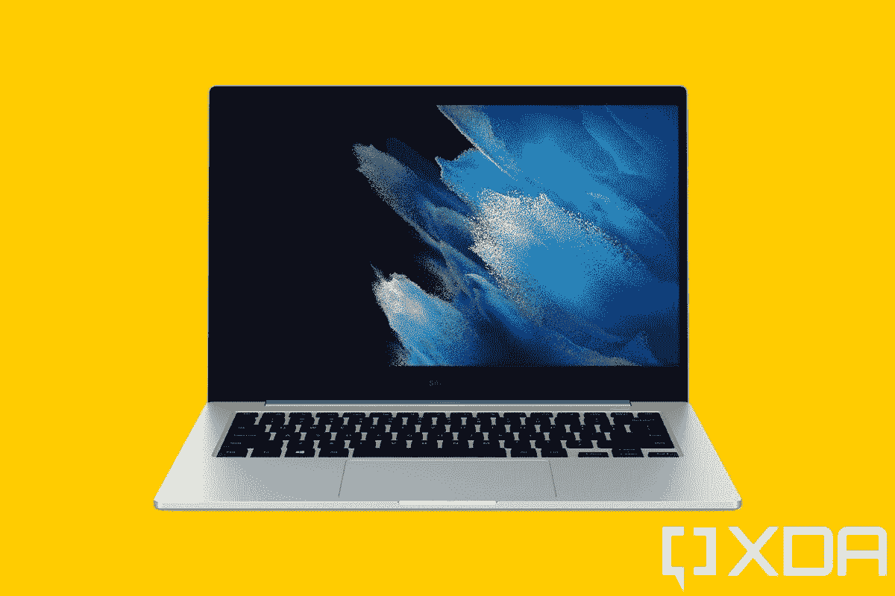

# 三星 Galaxy Book Go 评论:以疯狂的价格获得疯狂的价值

> 原文：<https://www.xda-developers.com/samsung-galaxy-book-go-review/>

我无法告诉你我写这篇评论时有多兴奋。当高通在 2019 年 12 月宣布其骁龙 7c 芯片组时，它真的激起了我的兴趣。它承诺了传统的价值主张，如集成的蜂窝连接，更薄的无风扇设计，更长的电池寿命，但价格肯定不是传统的。低于 500 美元的笔记本电脑市场不是一个好市场，我可以推荐的产品很少，但三星 Galaxy Book Go 提供了其他人没有的东西。

当骁龙 7c 设备首次开始发货时，它们出现在教育设备中，后来出现在 Chromebook 上，如 Acer Chromebook Spin 513。现在，骁龙 7c Gen 2 已经在 Galaxy Book Go 中出现。与骁龙 8cx Gen 2 一样，新芯片组只比其前代产品慢了一点。

不幸的是，三星 Galaxy Book Go 在基本型号中摆脱了集成的蜂窝连接，但其他部分都在那里。这是一台重 3 磅的无风扇个人电脑。事实上，这不是你在售价 349 美元的笔记本电脑上看到的东西。还有 [4G LTE](https://www.xda-developers.com/best-4g-lte-laptops/) 和 5G 等级。

**浏览此评论:**

### 三星 Galaxy Book Go 规格

| 

处理器

 | 高通骁龙 7c 第二代，2.55GHz |
| 

制图法

 | 高通肾上腺素能 |
| 

身体

 | 12.75 英寸 x8.85 英寸 x0.59 英寸，3.04 磅 |
| 

显示

 | 14 英寸，1，920x1，080，220 尼特，LED |
| 

随机存取存储

 | 4GB LPDDR4x |
| 

储存；储备

 | 128GB eUFS |
| 

电池

 | 5，480 毫安时 2 芯锂离子电池 |
| 

港口

 | (2)USB 3.1 Type-C(1)USB 2.0 Type-A(1)3.5 毫米 audioMicroSD 读卡器 |
| 

声音的

 | 2 个 1.5 瓦杜比全景声 |
| 

网络摄像头

 | 720 便士 |
| 

无线的

 | 蓝牙 5.1，802.11ac |
| 

材料

 | 塑料的 |
| 

颜色

 | 银 |
| 

操作系统（Operating System）

 | Windows 10 主页 |
| 

价格

 | $349.99 |

这个模型是高通提供给我的，它是基本模型。将会有更多的变体，例如 5G 模型和骁龙 8cx Gen 2。

## 设计:三星 Galaxy Book Go 看起来和感觉上都很棒

就设计而言，三星 Galaxy Book Go 看起来和感觉上都像是一款高端设备。

在我的职业生涯中，我审查了数百台笔记本电脑，其中许多都是入门级的。所有这些都有一个共同的主题。它们比高端设备更厚更重。事实上，它们通常提供与超极本相同的酷睿 i5 甚至酷睿 i7，具有 8GB 的内存，但你会在其他方面做出妥协。

就三星 Galaxy Book Go 的设计而言，它看起来和感觉上都像是一款高端设备。我的意思是，如果我把它和半打超极本和变形本放在一个架子上，你可能猜不出哪一个的价格是 349 美元。当我说它感觉很高级的时候，我不得不说当我看到它是由塑料制成的时候我很惊讶。仅凭手感，我以为是金属。

它的颜色是银色的，所以没有什么特别突出的。我仍然喜欢比灰色笔记本电脑更好的外观，就像其他的三星笔记本电脑一样。盖子上唯一的标志是闪亮的三星标志。

这实际上是我见过的第一个带有 USB Type-A 端口的 ARM 设备上的 Windows，这很酷。不幸的是，它是 USB 2.0，但你仍然可以用它来连接基本的外围设备，如鼠标。

您还会发现两个 USB Type-C 端口，每侧一个。能够选择将充电器插入哪一侧总是很好的。在左侧，还有一个 3.5 毫米音频插孔和一个 microSD 卡插槽，因此端口确实可以检查正确的框。

## 显示屏:14 英寸的 FHD 屏幕

虽然这个价格的 PC 具有 FHD 分辨率令人印象深刻，但屏幕是你开始记住 Galaxy Book Go 价格的地方。坦白说，就是不好。如果你试图从任何角度看它，都会有明显的颜色失真，这让预算 PC 尖叫。

正如你在我的测试中看到的，色域一点也不令人印象深刻。

没有触摸，这并不奇怪，因为这是一个翻盖笔记本电脑，而不是一个可转换的。挡板和你想象的差不多，侧面窄，顶部大，为网络摄像头腾出空间。可悲的是，那个摄像头是 720p 的，尽管考虑到价格，这也不奇怪。

有一点出奇的好，就是音频质量。两个 1.5W 扬声器位于设备底部，支持杜比全景声。在这台机器上听音乐比我想象的要好得多。

## 键盘:这是一个标准的 Chiclet 式键盘

这款机器最大的一个痛点就是显示屏，不过其他的都挺好的。Chiclet 风格的键盘显然没有赢得任何奖项——它不是惠普 EliteBook 或联想 ThinkPad——但它很坚固。就价格而言，它相当不错，我没有什么可抱怨的。

正如你从上面的图片中看到的，这里没有什么突出的东西。这是你的标准黑色钥匙在银色甲板上。键盘上方是电源按钮，与台面齐平；然而，它不是指纹传感器。事实上，这里没有任何 Windows Hello 生物认证。这是为了达到价格而做出的牺牲，也是合理的牺牲。

touchpad 很好，也很大，至少考虑到房地产的数量，它足够大了。整个输入体验相当好，或者至少没有任何不好的地方。我有过[笔记本电脑](https://www.xda-developers.com/best-laptops/)，价格是键盘的两到三倍，而且很糟糕。我认为这是一场胜利。

## 性能:骁龙 7c Gen 2 没有得到 4GB 内存的帮助

与之前的骁龙 8cx 一样，骁龙 7c Gen 2 的时钟速度比上一代提高了 150MHz。它是为入门级设计的，包括 Chromebooks 和教育市场。三星是第一个将骁龙 7c 放入基于 Windows 的消费者笔记本电脑的公司。

它在日常使用中确实感觉迟钝，而且在大多数情况下，我使用本机应用程序。我的大部分工作是在微软的 Edge 浏览器中完成的，这是 ARM64 的原生版本。其他应用包括 Skype、OneNote 和 Slack，后者在仿真中运行。

需要明确的是，ARM 上的 Windows 可以运行原生 ARM64 应用和模拟的 32 位 x86 应用。Windows 11 将支持 x64，事实上，我在测试过程中安装了 Windows 11 预览版，只是为了看看体验有多大改善。事实上，Windows 11 确实包括了针对 ARM PCs 的各种改进。

Windows 11 也好不到哪里去，因为你能要求的也就这么多了。如果你想全面看看这个价位的英特尔奔腾银或赛扬处理器，性能不会真的变得更好。事实上，可能更糟。

这里真正的瓶颈是三星 Galaxy Book Go 只有 4GB RAM。2021 年的 Windows 个人电脑需要的不止这些。如果你在浏览器中打开了很多标签页，你会发现它必须不时地重新加载页面。

另一方面，Adobe Photoshop 出奇的流畅。当然，这是另一个与 Lightroom 一起原生运行的应用程序。不幸的是，Adobe 不再提供 32 位模拟应用程序，你也不能通过 Creative Cloud 应用程序获得 x64 应用程序。换句话说，Adobe 应用程序的唯一选项是 Photoshop 和 Lightroom。

老实说，我认为 8GB 内存将完全改变 Galaxy Book Go 的体验。应该有配置，但现在这是三星网站上唯一的一个。简而言之，对于这个价位来说，芯片组相当不错，但 4GB RAM 根本不够。

值得记住的是，这是一个非常低的价格点。我这么说是因为即使是那些购买[廉价笔记本电脑](https://www.xda-developers.com/best-cheap-laptops/)的人可能也没有意识到 350 美元能让你得到多么少的东西。这通常是我不会向*任何人*推荐的层级。

对于基准测试，我只使用了 Geekbench，因为这是 ARM 原生支持的所有东西。不幸的是，它没有描绘出全貌。Geekbench 测试是针对 CPU 的，但高通的 SOC 远不止这些，包括 Adreno graphics 和 DSP，它们结合起来用于 AI 引擎。

|  | 

三星 Galaxy Book GoSnapdragon 7c Gen 2

 | 

微软 Surface GoPentium Gold 4415Y

 | 

华为 MateBook ESnapdragon 850

 | 

联想 ThinkPad X1 FoldCore i5-L16G7

 | 

三星 Galaxy Book SSnapdragon 8cx

 |
| --- | --- | --- | --- | --- | --- |
| 

极客工作台

 | 561 / 1,626 | 401 / 909 | 494 / 2,045 | 510 / 1,727 | 726 / 2,909 |
| --- | --- | --- | --- | --- | --- |

续航还好，但是没有达到我对 ARM 上 Windows 的期待。毕竟，这应该是关键的价值支柱之一。我只有大约六个小时的实际使用时间。有时会好一点，但对于全尺寸笔记本电脑，我期望更多。例如，联想 Flex 5G 对我来说超过了 12 个小时。

## 结论:该不该买三星 Galaxy Book Go？

如果你想花 349 美元，三星 Galaxy Book Go 将是我的选择。

现在是大问题。该不该买？答案是，看情况。这完全取决于你愿意花多少钱买一台笔记本电脑。当人们向我寻求笔记本电脑推荐时，我的第一个问题是他们的预算是多少。有时他们会说一些疯狂的话，比如 200 美元。其他的更合理，就像我之前说的，我通常不推荐任何低于 500 美元的东西。但如果你打算花 349 美元，三星 Galaxy Book Go 将是我的选择。

这里有很多价值，而且感觉很好。当我第一次把它从盒子里拿出来的时候，我真的大声地说了一声“哇”，因为我完全没有想到我会得到什么。建造感觉很棒，这是由骁龙芯片实现的。

当然，它并不完美。显示器不是很好，但同样，这个价格点不会让你有一个很好的显示器。更大的问题是它只有 4GB 内存。简而言之，你将需要更多，但当然，这意味着支付更多。

总之，三星 Galaxy Book Go 具有非凡的价值。它有一个价格闻所未闻的设计，整体体验非常好。

 <picture></picture> 

Samsung Galaxy Book Go 5G

##### 三星 Galaxy Book Go

三星的 Galaxy Book Go 是一款入门级笔记本电脑，采用高通处理器，具有独特的价值主张