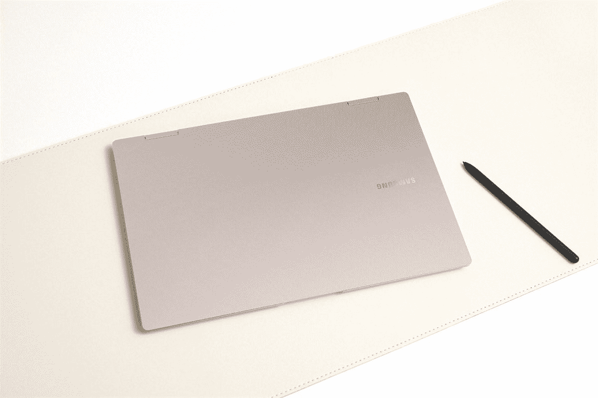

# 三星 Galaxy Book Pro 360 5G 评论:完美的移动笔记本电脑

> 原文：<https://www.xda-developers.com/samsung-galaxy-book-pro-360-5g-review/>

我就直说了。我喜欢三星 Galaxy Book 360 5G。我的手指拖着每一个按键，因为每写下一个字符，我就离把这个令人惊叹的小 [5G 笔记本电脑](https://www.xda-developers.com/best-5g-laptops/)送回三星更近了一点，这让我心碎。

它的厚度只有 11.5 毫米，重量不到 2.5 磅。13.3 英寸的屏幕是 Super AMOLED，所以看起来很漂亮，当然，它配有 5G 连接，所有这些都是 1399.99 美元。有什么不喜欢的？

***关于本次评测:**三星给我们发来了 Galaxy Book Pro 360 5G 进行评测。该公司对此次审查的内容没有任何意见。*

**浏览此评论:**

### 三星 Galaxy Book Pro 360 5G 规格

| 

中央处理器

 | 英特尔酷睿 i5-1130G7 |
| 

制图法

 | 英特尔 Iris Xe |
| 

显示

 | 13.3 英寸，1,920x1,080，Super AMOLED |
| 

身体

 | 302.5 x 202.0 x 11.5 毫米，1.1 千克 |
| 

记忆

 | 8GB LPDDR4x |
| 

储存；储备

 | 256GB NVMe 固态硬盘 |
| 

照相机

 | 720p 高清/双阵列麦克风 |
| 

声音的

 | AKG 的声音，杜比全景声 |
| 

电池

 | 63Wh(典型) |
| 

港口

 | thunderbolt 4(1)USB Type-C(2)3.5 毫米耳机/麦克风 MicroSD nano SIM 卡 |
| 

连通性

 | 5G，Wi-Fi 6E 就绪，Wi-Fi 6 (Gig+)，802.11 ax 2×2 蓝牙 v5.1 |
| 

操作系统（Operating System）

 | Windows 11 主页 |
| 

颜色

 | 神秘的银色 |
| 

价格

 | $1,399.99 |

这里有几点需要注意。还有另一款 5G SKU，它装有酷睿 i7-1160G7、16GB 内存和 512GB 固态硬盘，这将让你多花 200 美元。然而，根据三星的规格表，只有 5G 型号配备了英特尔的 UP4 处理器。只有 Wi-Fi 的配置配备了更强大的 UP3 CPUs。

## 设计:三星 Galaxy Book Pro 360 5G 非常轻薄

当你看三星 Galaxy Book Pro 360 5G 时，你会注意到的第一件事是它非常薄，只有 11.5 毫米。这是一款非常紧凑的设备。然而，与 Galaxy Book S 不同，它有一个英特尔处理器，所以它有一个风扇。

Galaxy Book Pro 360 太轻了，你会忘记它在你的包里。

这是那种你会扔在背包里的笔记本电脑，你出门的时候必须仔细检查，因为它太轻了，感觉好像不在里面。这是非凡的，非常适合外出时使用。

如此薄且由镁制成，它的手感确实有问题。铝制笔记本电脑肯定感觉比这更高级，如果你按下盖子，它只需要很小的压力就可以让它屈服。

这款笔记本电脑的颜色被称为神秘银，这是三星的典型说法...银色的。三星 Galaxy Book Pro 360 确实有其他颜色，坦率地说，我很想看到它们。就像我们看到的智能手机一样，我喜欢看到笔记本电脑有更多的颜色，而不是普通的银色。当然，对银色笔记本电脑有着普遍的需求，就像移动世界中的黑色一样。

你可以看到，它的左侧印有三星的标志，这是该公司笔记本电脑的传统标志。这是在其他全银设计中唯一突出的东西。

这确实是一台英特尔 Evo 笔记本电脑，所以它确实有 [Thunderbolt 4](https://www.xda-developers.com/best-thunderbolt-4-laptops/) 。三个 USB Type-C 端口中只有一个 Thunderbolt 4 端口。也不是你想的那样。如果你认为 Thunderbolt 端口是右侧唯一的 USB Type-C 端口，那你就错了。它是左边两个中的一个，靠近前面的那个。

它确实有 Thunderbolt 标志来标记端口，我不太喜欢笔记本电脑制造商这样做。然而，我要说的是，它远没有当我们混合使用 USB 2.0 和 USB 3.2 端口时那么糟糕，因为那也确实会发生。虽然我不认为用户应该*必须*能够区分 Thunderbolt 端口和 USB 3.2 端口，但我希望任何真正需要 Thunderbolt 端口的人都知道它是哪一个。事实上，你不会在不知道外部 GPU 外壳和显卡插入哪个端口的情况下，花费大量金钱购买它们。

你也猜到了，没有 USB Type-A，我觉得没问题。我更喜欢轻薄的外形，坦率地说，这是令人愉快的。它仍然有一个 3.5 毫米的音频插孔，甚至还有一个 microSD 卡插槽。在右边，有一个 nano-SIM 卡插槽。

## 显示:它有一个美丽的 FHD 有机发光二极管显示

轻薄的设计并不是三星 Galaxy Book Pro 360 5G 令人愉快的唯一原因。13.3 英寸的 FHD [有机发光二极管显示屏](https://www.xda-developers.com/best-oled-laptops/)也是其中很大的一部分。公平地说，这不是唯一一台配备有机发光二极管屏幕的笔记本电脑。事实上，他们有很多。但对大多数人来说，这是一个昂贵的 4K 有机发光二极管选项。在 Galaxy Book Pro 360 上，有机发光二极管是标准配置。

Super AMOLED 屏幕上的黑色非常黑，你看不到屏幕的尽头和边框的起点

有了有机发光二极管的展示，一切看起来都更漂亮了。黑色更黑，颜色更鲜艳。其实可以尝试一个小实验。关掉灯，让你的笔记本电脑处于黑暗的环境中，然后关闭你的笔记本电脑。当 [Windows 11](https://www.xda-developers.com/windows-11/) 在断电时处于黑屏时，请注意屏幕结束和挡板开始的位置。越不明显，你就越接近真正的黑色。像这样的超级 AMOLED 屏幕，你根本看不到边框。

当然，我也运行了我通常的显示测试，不出所料，它得到了惊人的结果。它支持 100% sRGB、94% NTSC、96% Adobe RGB 和 100% P3。这些都是很好的读物，在这个价位的笔记本电脑中你很难找到。你可能会在入门级的戴尔 XPS 13 中看到它，但你仍然不会以那么低的价格买到有机发光二极管。

对比度最高可达 9，650:1，远远高于任何标准 IPS 液晶屏。亮度最大值为 282.8 尼特，可惜有点低。这使得它很难在户外使用，尤其是在阳光直射下。

关于屏幕需要注意的另一件事是，它确实支持触摸，尽管这应该是一个既定的，因为这是一个可转换的。它还附带一支钢笔。

这款笔记本电脑三面都有细长的边框，但由于 16:9 的显示屏，它的下巴很大。顶部挡板装有 720p 网络摄像头，这是一个遗憾。从明年开始，你会看到 1080p 更像是一个标准。

## 键盘和触摸板:键很浅，就像你对如此薄的东西所期望的那样

我发现三星 Galaxy Book Pro 360 5G 上的键盘相当过瘾。然而，它可能并不适合所有人。

事实上，这些键很浅，这是我在其他三星轻薄笔记本电脑上注意到的。就我个人而言，我认为它们需要适度的压力来弥补深度的不足。看起来也很准，这个键盘很少出现意外。我非常喜欢它。

它带有内置在电源按钮中的指纹传感器。有趣的是，该按钮实际上与键盘面板齐平，并不是说这对用户体验有很大影响。虽然没有用于面部识别的红外摄像头，但有指纹传感器还是不错的。

Precision touchpad 速度快，反应灵敏，尽管与一些竞争对手相比，它相对较小。老实说，甲板上真的没有太多空间。也许在未来一代产品中，我们会看到显示器的长宽比更高，这将导致更大的触摸板。目前，这就够了。

## 性能:三星 Galaxy Book Pro 360 5G 采用英特尔第 11 代 UP4 处理器

这有些有趣，但三星 Galaxy Book Pro 360 5G 使用了英特尔的第 11 代 UP4 处理器。这是 9W 的 U 系列的一个变种，专为轻薄设备而设计。在前几代，它被称为 Y 系列。

y 系列的名声不好，这是有原因的。在那些旧的双核、5W 设备上，我甚至不会想象打开 Photoshop 之类的东西。事情变了，UP4 其实挺好的。我很高兴地说，它实际上配得上 U 系列的称号，这不仅仅是英特尔的一些营销伎俩，就像它将其核心 m5 和 m7 更名为 i5 和 i7 时一样，以为我们不会注意到。

然而——这一点很重要——根据三星的规格表，三星 Galaxy Book Pro 360 使用 15W UP3 处理器。换句话说，为了 5G 连接，你实际上牺牲了一点性能。就我个人而言，我认为这完全值得，我会在一周的任何一天选择 5G 型号。我在这台笔记本电脑上编辑了这篇评论的所有照片，还有一些其他的照片。我从来没有希望我有更多的权力。

对于基准测试，我使用了 PCMark 10、Geekbench、Cinebench 和 3DMark。

|  | 

三星 Galaxy Book Pro 360 5G 酷睿 i5-1130G7

 | 

微软 Surface Book 3 酷睿 i7-1065G7，GTX 1650

 | 

微软 Surface Pro 7+酷睿 i5-1135G7

 |
| --- | --- | --- | --- |
| 

PCMark 10

 | 3,815 | 3,805 | 3,963 |
| 

极客工作台

 | 1,333 / 4,745 | 1,318 / 4,775 | 1,358 / 5,246 |
| 

电影院长凳

 | 1,269 / 3,403 | 1,167 / 3,555 | 1,235 / 2,854 |
| 

3DMark:时间间谍

 | 1,115 | 3,191 |  |

如您所见，性能相当稳定，与 U 系列笔记本电脑不相上下。它能完成任务。唯一的问题是你想要 5G 还是更好的 CPU。

电池寿命平均只有五个小时。我把它用在平衡设置上，屏幕亮度适中。结果变化很小，但无论有什么变化都是好的一面。

## 5G:在三星 Galaxy Book Pro 360 中值得吗？

蜂窝连接对于笔记本电脑来说并不是一个便宜的附加配置。事实上，如果你买一个只有 Wi-Fi 的型号，规格相同，但是是酷睿 i7 而不是酷睿 i5，你可以节省 200 美元。尽管如此，我还是非常喜欢任何类型的手机连接。

有了三星 Galaxy Book Pro 360 5G，就不用询问 Wi-Fi 密码，也不用在邮件列表中使用公共 Wi-Fi，或者缓慢而拥挤的酒店网络。

好处是你可以从任何地方连接。再加上这款笔记本电脑的小尺寸和轻重量，它一定会成为赢家。你可以把它带到任何你想去的地方。这款手机内置威瑞森 SIM 卡，我在任何地方都有服务。没有询问 Wi-Fi 密码，注册邮件列表使用公共 Wi-Fi 网络，或缓慢和拥挤的酒店网络。我只要打开笔记本电脑，就可以上网了。

而在 2022 年，我们还能忍受其他任何事情，真是奇迹。我们的手机就是这样工作的，所以我觉得很奇怪，当我们整天使用手机时，人们却可以通过笔记本电脑连接互联网。

也就是说，值得注意的是，这款笔记本电脑只支持低于 6GHz 的 5G，所有基于英特尔技术的 5G 笔记本电脑都是如此。这意味着你将无法获得毫米波 5G 网络的数千兆速度，尽管尚未证明这有多有用。毫米波在室内不起作用，因为即使像窗户一样薄的东西也会阻挡它们。如果毫米波被证明是有用的，笔记本电脑制造商将努力制造所需的额外天线。在那之前，期待看到更多的 sub-6 设备。

## 结论:该不该买三星 Galaxy Book Pro 360 5G？

至于该不该买三星 Galaxy Book Pro 360 5G，你大概能猜到答案。很难回答是。这是我最喜欢的笔记本电脑之一，我已经用了很长时间了。一个建议是额外支付 200 美元购买 16GB 内存的酷睿 i7 型号，因为额外的内存是有用的。

像任何笔记本电脑一样，它并不完美。它仍然有一个 720p 的网络摄像头，这可能是它最大的缺点。此外，电池寿命不是什么值得大书特书的东西，尽管考虑到外形因素，这是可以原谅的。同样令人沮丧的是，没有地方存放钢笔，很容易丢失。

但让我们来谈谈好的方面，因为在 1399.99 美元的合理价格上有这么多。性能卓越，外形轻薄，便于携带。你可以获得 5G 连接，正如我前面提到的，这必须是你真正想要的东西。但我最喜欢的是美丽的有机发光二极管展示。这是 FHD，所以它不会像 4K 屏幕那样消耗电池寿命。它使用起来视觉效果非常好，所以当你工作时，感觉很好。

 <picture></picture> 

Samsung Galaxy Book Pro 360 5G

##### 三星 Galaxy Book Pro 360 5G

三星 Galaxy Book Pro 360 5G 是该公司最新的旗舰笔记本电脑。