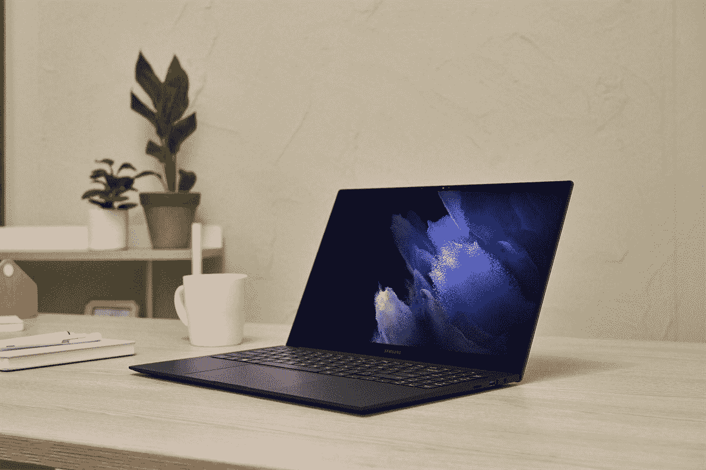
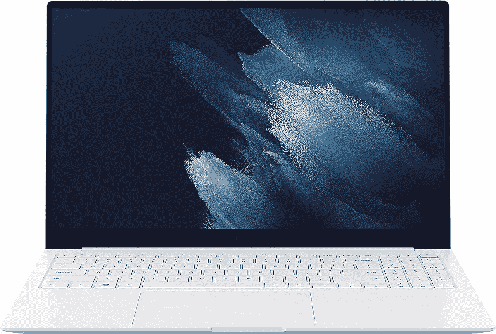

# 售价 899 美元(优惠 200 美元)的三星 Galaxy Book Pro

> 原文：<https://www.xda-developers.com/samsung-galaxy-book-pro-899-200-off/>

# 售价 899 美元(优惠 200 美元)的三星 Galaxy Book Pro

你现在只需花 899.99 美元就可以从 B&H 和亚马逊买到三星 Galaxy Book Pro，总共节省 200 美元。

 <picture></picture> 

Mass Image Compressor Compressed this image. https://sourceforge.net/projects/icompress/ with Quality:100

三星在 4 月份发布了其新的 Galaxy Book Pro 系列[，采用了最新的第 11 代英特尔处理器、有机发光二极管屏幕、轻薄设计，以及一些与三星 Android 设备相同的应用和服务。在过去的几个月里，我们已经看到了其中一些型号的上市和停售，三星 Galaxy Book Pro 是迄今为止你可以买到的最好的三星笔记本电脑之一。你现在可以花 899.99 美元买到一台，比原来 1099.99 美元的要价低了 200 美元。](https://www.xda-developers.com/samsung-galaxy-book-pro-laptops-2021/)

售价 899.99 美元的型号是 15.6 英寸的 Galaxy Book Pro，采用英特尔酷睿 i5 处理器。它的完整规格包括 8GB 的 LPDDR4 内存，512GB 的 SSD，15.6 英寸的 1080p AMOLED 屏幕，Wi-Fi 6E 支持，以及宣传的长达 20 小时的电池寿命。Windows 机器上的 AMOLED 屏幕本身就很罕见，它让从电影和电视节目到 Microsoft Word 的任何东西看起来都更好。

就像其他三星 Galaxy Books 一样，这款笔记本预装了一些三星常用的软件和服务，你可以在他们的智能手机上找到，比如用于发送文件的 Quick Share 和用于智能家居管理的 SmartThings。它还将支持[升级到 Windows 11](https://www.xda-developers.com/cpus-compatible-windows-11/) 版本。

 <picture></picture> 

Samsung Galaxy Book Pro

##### 三星 Galaxy Book Pro

三星 Galaxy Book Pro 是迄今为止最好的三星笔记本电脑之一，配备了第 11 代英特尔 i5、AMOLED 显示屏和 8GB 内存。

对于 899.99 美元，这是一些非常棒的硬件，尽管 8GB 的内存绝对是一个症结。目前持续的芯片短缺意味着价格目前相当膨胀，一些科技公司([如 Sonos](https://www.xda-developers.com/sonos-price-hikes/) )已经承认因此提高了价格。请记住，内存也是不可升级的，所以如果 8GB 的内存让你担心，那么这可能不是你的笔记本电脑。