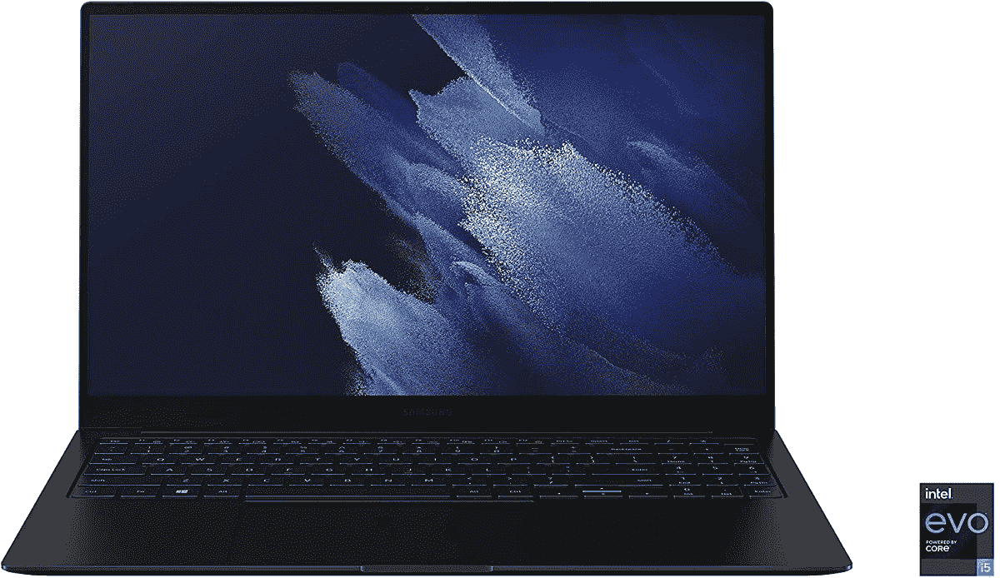

# 花 949 美元买一台 Galaxy Book Pro(优惠 150 美元)，外加 50 美元免费亚马逊信用

> 原文：<https://www.xda-developers.com/samsung-galaxy-book-pro-now-on-sale-for-949-150-off-with-50-amazon-credit-included/>

# 三星 Galaxy Book Pro 现在售价 949 美元(优惠 150 美元)，内含 50 美元亚马逊信用

三星配备 512GB 固态硬盘的 15.6 英寸 Galaxy Book Pro 现在售价为 949.99 美元，如果你从亚马逊购买，可以获得 50 美元的商店积分。

 <picture></picture> 

Mass Image Compressor Compressed this image. https://sourceforge.net/projects/icompress/ with Quality:100

三星在 4 月份发布了其新的 Galaxy Book Pro 系列[，采用了最新的第 11 代英特尔处理器、有机发光二极管屏幕、轻薄设计，以及一些与三星 Android 设备相同的应用和服务。许多型号已经开始销售，但通常不会超过 10%。其中一款 15.6 英寸的变体现在售价为 949.99 美元，比原价优惠 150 美元(14%)，购买时还可以获得 50 美元的亚马逊商店信用。](https://www.xda-developers.com/samsung-galaxy-book-pro-laptops-2021/)

售价为 949.99 美元的型号是 15.6 英寸的 Galaxy Book Pro，采用英特尔酷睿 i5 处理器。完整的规格包括 8GB 的 LPDDR4 内存，512GB 的 SSD，15.6 英寸的 1080p AMOLED 屏幕，Wi-Fi 6E 支持，以及宣传的长达 20 小时的电池寿命。与其他 Galaxy Books 一样，这款笔记本预装了三星的一些常用软件和服务，比如用于发送文件的 Quick Share 和用于智能家居管理的 SmartThings。一旦发布，你也可以升级到 Windows 11。

 <picture></picture> 

Samsung Galaxy Book Pro 15.6 (512GB/Core i5)

##### 三星 Galaxy Book Pro

这个版本的 Galaxy Book Pro 拥有 15.6 英寸的屏幕和 512GB 的存储空间。如果你从亚马逊购买，在收银台输入代码 **QJBKA4CADQX7** 可以获得 50 美元的商店积分。

在这次销售中，你会以不到 1000 美元的价格买到一些很棒的硬件，但 8GB RAM 绝对是一个痛点——这么贵的笔记本电脑*应该*配备至少 16GB，但目前的硅短缺正在影响价格。不幸的是，内存也不能升级。