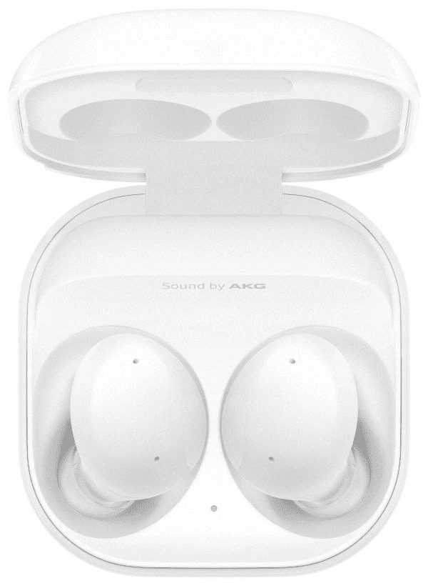
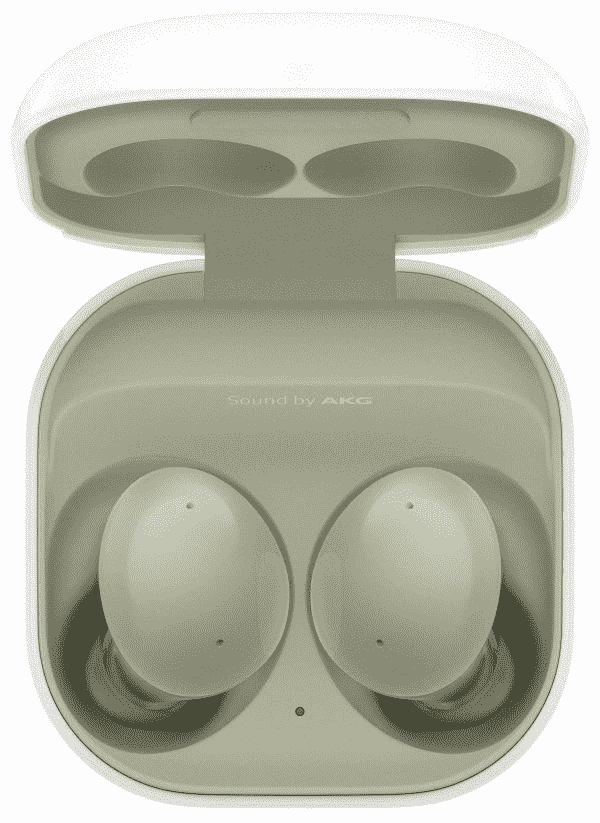

# 三星 Galaxy Buds 2 有哪些颜色？

> 原文：<https://www.xda-developers.com/samsung-galaxy-buds-2-colors/>

# 三星 Galaxy Buds 2 有哪些颜色？

找银河芽 2 色？我们可以帮忙。我们在这篇文章中解释了关于三星 Galaxy Buds 2 颜色选项的一切。

三星在最近的 Unpacked 活动中推出了新的真正的无线耳塞——Galaxy Buds 2。Buds 2 加入了该公司不断增长的 TWS 耳塞阵容，该阵容还包括 Galaxy Buds Pro、Galaxy Buds Live 和 Galaxy Buds+。这款耳塞是 buds 系列中最小、最轻的一款，拥有几个令人兴奋的实用功能。如果你打算购买新的 Galaxy Buds 2，你可能想知道它们的颜色选择。三星将出售四种颜色的 Buds 2——白色、橄榄色、石墨色和淡紫色。

## 三星 Galaxy Buds 2 种颜色

有趣的是，三星在所有变体中都保持了 Buds 2 外壳的白色。然而，外壳的内部将与实际的耳塞颜色匹配。三星在这里提供了一些颜色选择，所以每个人都有适合的。耳塞看起来很时髦，所以选择一种适合你风格的颜色，或者一种与你的智能手机或你使用的外壳相匹配的颜色！

 <picture></picture> 

Graphite

##### 三星 Galaxy 芽 2

Galaxy Buds 2 石墨变体几乎是黑色的。因此，如果你喜欢黑色，你会喜欢石墨版本。

 <picture></picture> 

Samsung Galaxy Buds 2

##### 三星 Galaxy 芽 2

Galaxy Buds 2 的白色版本完全是白色的，将吸引喜欢基本款的消费者。看起来很漂亮，很优雅。

 <picture></picture> 

Olive

##### 三星 Galaxy 芽 2

芽 2 的橄榄色变体会让你想起真正的橄榄。如果你不想让你的耳塞看起来简单朴素，Olive 就很棒。

 <picture></picture> 

Samsung Galaxy Buds 2

##### 三星 Galaxy 芽 2

薰衣草是 Buds 2 的另一种颜色变体，可以让你变得丰富多彩，充满活力。它应该和很多裙子和其他女性服装搭配得很好。

## 银河蓓蕾 2:特色

Galaxy Buds 2 采用动态双向扬声器，可播放高音和低音。这些还配备了三个级别的环境声音控制，可以减少高达 98%的外部背景噪音。此外，三星表示，它使用机器学习解决方案来消除外部声音，并在通话中只关注佩戴者的声音。有三个板载麦克风来帮助这个过程。

Buds 2 一次充电可以提供五个小时的播放时间，并带有主动噪音消除(ANC)。便携包将播放时间延长至 20 小时。对于一副真正的无线耳塞来说，这很正常。

* * *

你喜欢 Galaxy Buds 2 的颜色选项吗？你打算买哪一款？请在评论区告诉我们。你也可以看看银河芽 2 的[案例。如果 Buds 2 没有让你兴奋，市场上还有其他几款](https://www.xda-developers.com/best-samsung-galaxy-buds-2-cases/)[出色的无线耳塞](https://www.xda-developers.com/best-wireless-earbuds/)可供选择，所以去看看吧。