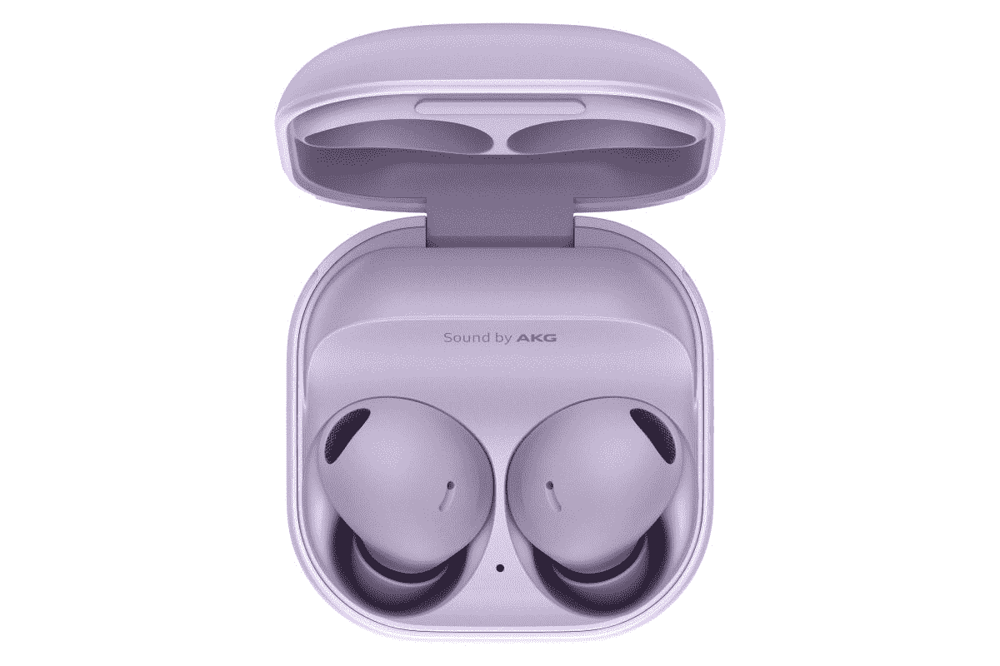

# 三星 Galaxy Buds 2 Pro 有哪些颜色？

> 原文：<https://www.xda-developers.com/samsung-galaxy-buds-2-pro-colors/>

# 三星 Galaxy Buds 2 Pro 有哪些颜色？

你想知道三星 Galaxy Buds 2 Pro 提供哪些颜色选项吗？这是一份所有可供选择的颜色的清单。

三星在 2022 年夏天的 Unpacked 活动中展示了预期的 Galaxy Buds 2 Pro。此次发布会与[银河折叠 4](https://www.xda-developers.com/samsung-galaxy-z-fold-4-hands-on/) 和[银河翻转 4](https://www.xda-developers.com/samsung-galaxy-z-flip-4-hands-on/) 同时进行。三星 Galaxy Buds 2 Pro 配备了使其脱颖而出的功能。尽管尺寸很小，但它们支持高级功能，包括 ANC、语音检测等等。如果你经常掉你的饰品，你可能需要买一个盒子来保护它们。毕竟安全总比后悔好。现在，你一定想知道 Galaxy Buds 2 Pro 有哪些颜色？这是关于这件事你需要知道的一切。

## 三星新一代专业耳塞的所有颜色

三星 Galaxy Buds 2 Pro 有三种鲜艳的颜色可供选择- **石墨**、**白色**和**宝来紫**。只要 229 美元，你就可以在这些引人注目的装饰中选择一双。如果你不喜欢他们中的任何一个，你总是可以给他们一个皮肤或外壳来更新他们的外观。最终，这三种颜色提供了不同的氛围，符合不同的心情和口味。所以你可能至少能忍受其中一种颜色。

*   <picture></picture>

    三星 Galaxy Buds 2 Pro

    白色的选择也是为那些寻找平淡，但更喜欢明亮颜色的人准备的。

*   <picture></picture>

    三星 Galaxy Buds 2 Pro

    宝来紫芽是这三款中最独特的一款，提供了悦目的浅色系。

* * *

就我个人而言，我总是在最暗的地方购买我的设备。所以在这种情况下，我完全会选择 Galaxy Buds 2 Pro 的石墨色，因为在我看来，它们比其他颜色更好看。同样值得注意的是，你选择的颜色会影响外壳和里面的耳塞。所以如果你选择宝来紫色的，当你在路上听的时候，这种颜色可能和你的衣服不搭配。同时，石墨色和白色可以搭配任何衣服颜色，不会像第三种颜色那样突出。

*您会选择三星 Galaxy Buds 2 Pro 的哪种颜色，为什么？请在下面的评论区告诉我们。*