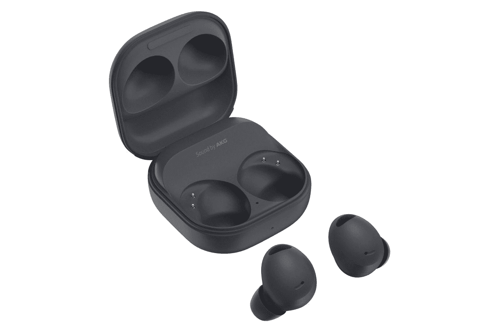

# 三星 Galaxy Buds 2 Pro 打折 75 美元

> 原文：<https://www.xda-developers.com/samsung-galaxy-buds-2-pro-priced-at-154-99/>

大约一个月前，三星宣布了其最新设备，Galaxy Z Fold 4 和 Galaxy Z Flip 4。除了备受期待的设备，该公司还首次推出了 [Galaxy Buds 2 Pro](https://www.xda-developers.com/samsung-galaxy-buds-2-pro-launch/) 。无线耳塞受到了高度赞扬，如果你使用三星或安卓设备，这是一个很好的选择。虽然它 229.99 美元的价格似乎是合理的，但有些人可能不愿意花那么多钱买一副耳塞。谢天谢地，他们得到了很大的折扣，比原价低了 75 美元。

Galaxy Buds 2 Pro 是一套紧凑的无线耳塞，在一个小包装中提供了许多功能。这款耳塞的设计与前代略有不同，音频性能也有所提升。此外，耳塞使用三个信噪比(SNR)麦克风，大大提高了通话质量。此外，该设备支持 24 位高保真音频，可以提供身临其境的更强大的听觉体验。

耳塞还提供主动降噪和智能环境声音支持，允许设备自动检测用户何时说话，自动降低媒体声音并激活环境声音模式。就连接而言，它使用蓝牙 5.3 连接，并提供 LE 音频支持。当从一个配对的设备转换到另一个设备时，耳塞还可以自动在设备之间切换。一次充电，Galaxy Buds 2 Pro 可提供长达 8 小时的使用时间，充电外壳可提供长达 29 小时的使用时间。使用 ANC 时，这些数字略有下降，使用 5 小时，充电情况下可达 18 小时。

现在，如果这听起来像是你可能感兴趣的东西，你可以从亚马逊购买 154.99 美元的三星 Galaxy Buds 2 Pro，这比其零售价节省了 33%。虽然有三种颜色可供选择，但石墨型号是目前唯一在售的型号。

***更新:很遗憾，通过亚马逊的交易不再可用。下一个最好的交易是通过三星利用其回收或以旧换新计划。***

 <picture></picture> 

Samsung Galaxy Buds 2 Pro

石墨材质的三星 Galaxy Buds 2 Pro

* * *

**来源** : [亚马逊](https://www.amazon.com/gp/product/B0B2SH4CN6/?tag=xda-21ck1uj-20&ascsubtag=UUxdaUeUpU43451&asc_refurl=https%3A%2F%2Fwww.xda-developers.com%2Fsamsung-galaxy-buds-2-pro-priced-at-154-99%2F&asc_campaign=Affiliate)