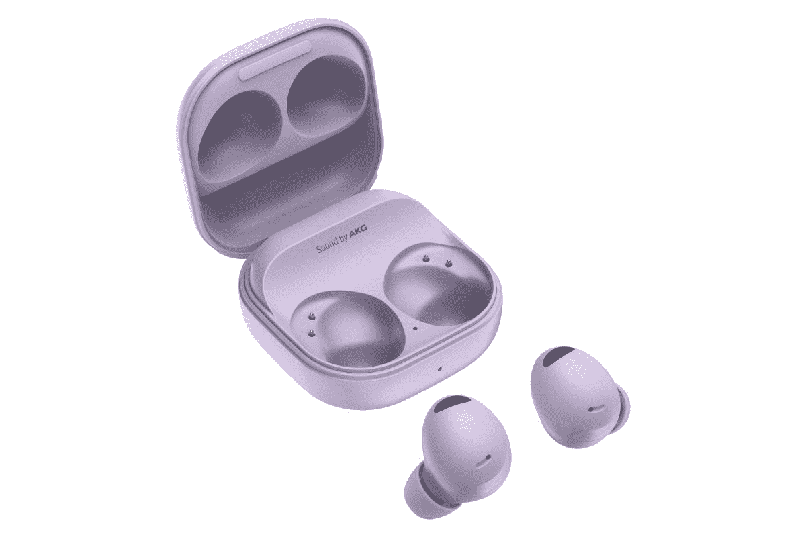

# 三星 Galaxy Buds 2 Pro 适合跑步吗？

> 原文：<https://www.xda-developers.com/samsung-galaxy-buds-2-pro-running-earphones/>

除了 [Galaxy Z Flip 4](https://www.xda-developers.com/samsung-galaxy-z-flip-4-review/) 和 [Galaxy Z Fold 4](https://www.xda-developers.com/samsung-galaxy-z-fold-4-review/) 之外，三星还推出了高端无线耳塞的最新尝试。 [Galaxy Buds 2 Pro](https://www.xda-developers.com/samsung-galaxy-buds-2-pro-review/) 比上一代产品有许多值得注意的升级，看起来真的很诱人，特别是当与最近的三星智能手机[搭配时。你可能对无线耳塞感兴趣的一个重要原因是为了锻炼。带着耳机线出去跑步不是最好的选择。无线耳塞是一个完美的选择，但在跑步方面，并不是所有的无线耳塞都一样。在新的 Galaxy Buds 2 Pro 的情况下，答案可能是肯定的，也可能是否定的。让我们看看双方的情况。](https://www.xda-developers.com/best-samsung-phones/)

## 是什么让 Galaxy Buds 2 Pro 适合跑步

当你跑步时，有一些你需要的关键特征。其中之一是防汗，并不是所有的无线耳塞都可以拥有这一点。佩戴耳塞时考虑定期跑步是很重要的。你不会冒险让没有防水功能的智能手机进水吧？

好在 Galaxy Buds 2 Pro 有必要的保护。防水等级为 IPX7，这也在考虑防汗性的可接受范围内。这也意味着，如果你出去跑步，开始下雨，你不必把它们收起来。

电池续航时间在 ANC 打开时可达 5 小时，在 ANC 关闭时可达 8 小时，因此即使是长距离跑也无需充电。Buds2 Pro 还支持环境声音，让您无需摘下耳塞就能清晰感受外部世界。

新设计比旧的 Galaxy Buds Pro 更小更轻，旨在防止旋转，因此它们不太可能掉出。如果真的发生了这种情况，而你因为任何原因找不到你的 Buds2 Pro，三星内置了 SmartThings Link 技术来帮助你团聚。

 <picture></picture> 

Samsung Galaxy Buds 2 Pro

三星最新的高端无线耳塞更适合，声音更好，是锻炼的好伴侣。

## 为什么你可能不希望 Galaxy Buds 2 Pro 用于跑步

从纯技术层面来说，Galaxy Buds 2 Pro 非常适合跑步。如果你经常跑步，这对你来说应该是一副不错的耳塞，尤其是如果你还使用三星智能手机的话。但是仍然有一个原因让你觉得它们不适合你。

Buds 2 Pro 没有任何翼尖或挂钩附着在耳朵周围，以增加安全性和稳定性。它甚至不是一个适合的选项。如果这是为你跑步的耳塞的关键部分，那么你不会想要 Galaxy Buds 2 Pro。它不会让这些耳塞变得更糟糕，但如果你喜欢这种东西，那么这种耳机不适合你，你应该考虑更专注于留在耳朵里的替代品。