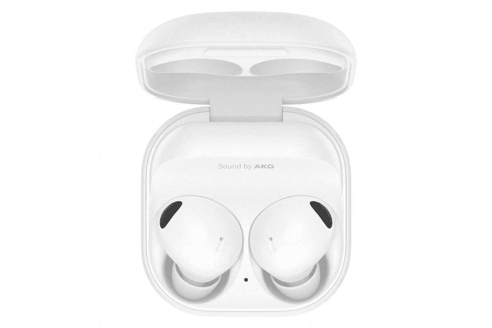

# 三星 Galaxy Buds 2 Pro vs 谷歌 Pixel Buds Pro:两个最好的非 AirPods 耳塞

> 原文：<https://www.xda-developers.com/samsung-galaxy-buds-2-pro-vs-google-pixel-buds-pro/>

苹果的 AirPods 是 iPhone 和苹果生态系统的代名词。但是在 Android 领域却没有这样的对等物。三星(Samsung)和谷歌(Google)正在努力夺取这一头衔，每个品牌都用自己的旗舰无线耳塞做了一个令人信服的案例。但是哪个更适合你呢？

*   银河蓓蕾 2 Pro 是 TWS 最新上架的一对。与旧的 Buds Pro 相比，这些高端耳塞的设计略有不同，更小。它们还支持降噪、3D 音频等功能。

*   ##### 谷歌 Pixel Buds Pro

    谷歌 Pixel Buds Pro 外观时尚小巧，能发出很棒的声音，与谷歌助手配合得很好。

## 三星 Galaxy Buds 2 Pro 与谷歌 Pixel Buds Pro:价格和可用性

三星和谷歌的耳塞现在都在销售，北美的消费者可以在亚马逊或百思买这样的实体电子商店轻松找到它们。三星的 Galaxy Buds 2 Pro 官方零售价为 230 美元，而 Pixel Buds Pro 的售价为 200 美元，便宜了 30 美元。在北美以外，三星的全球业务范围更广，从迪拜到越南的零售商都可以买到 Galaxy Buds 2 Pro。Pixel Buds Pro 和 Pixel 手机一样，只在特定市场上销售，所以你可能需要四处看看。

## 三星 Galaxy Buds 2 Pro vs 谷歌 Pixel Buds Pro:规格

| 规范 | Galaxy Buds 2 Pro | 像素芽专业版 |
| 尺寸和重量 | 

*   0.7×0.85×0.7 英寸(每芽)；1.97 x 1.97 x 1.1 英寸(充电盒)
*   0.19 盎司(每蕾)；1.53 盎司(充电盒)

 | 

*   0.88 x 0.87 x 0.93 英寸(每芽)；0.98 x 1.97 x 2.49 英寸(充电盒)
*   0.22 盎司(每芽)；2.2 盎司(充电盒)

 |
| 电池寿命 | 5 小时(ANC 开启)；8 小时(ANC 关闭)；总共 29 小时 | 7 小时(ANC 开启)，11 小时(ANC 关闭)，总共 31 小时 |
| 蓝牙 | 蓝牙 5.3 | 蓝牙 5.0 |
| 司机 | 

*   由 AKG 调谐的 10 毫米驱动器
*   5.3 毫米高音扬声器

 | 11 毫米 |
| 颜色: | 黑色、紫色、白色 | “木炭”、“雾”、“香茅”、“珊瑚” |
| 耐水性: | IPX4 | IPX7 |

## 硬件和设计:看马，没有茎！

三星和谷歌的耳塞都采用了更传统的前 AirPods 耳塞外观，没有从佩戴者耳朵伸出的细长耳塞杆。Galaxy Buds 2 Pro 稍微小了一点，重量也轻了一点，但是 Pixel Buds Pro 依然小巧。这两种耳塞的塑料机身都采用了哑光涂层，我更喜欢这种涂层，而不仅仅是 [AirPods](https://www.xda-developers.com/airpods-pro-2-review/) 使用的光滑涂层，还有其他耳塞，如[华为 FreeBuds Pro 2](https://www.xda-developers.com/huawei-freebuds-pro-2-review/) 。

三星和谷歌也给了耳塞一组生动的颜色:在 Galaxy Buds 2 Pro 上，颜色组成了整个听筒，而它们只是覆盖了 Pixel Buds 2 Pro 的外部。

两套耳塞都有可拆卸的硅耳塞，有三种尺寸选择，应该适合大多数耳朵。然而，我希望看到三星和谷歌效仿苹果，明年提供第四种选择(额外的小号)，因为我个人(显然)的耳道比平时更窄，所以即使是最小尺寸的耳塞仍然会比我想要的更刺耳。我意识到，和我交谈过的大多数人都觉得小费的数目已经足够了。耳塞具有常见的磨损检测传感器，每个耳塞中有三个麦克风，以及现在预期的触摸感应面板。

三星的外壳像订婚戒指盒一样打开，而谷歌的外壳更直立，就像 AirPods Pro 盒子一样。这两种情况都支持无线充电，当然也可以通过 USB-C 以传统方式充电。

谷歌 Pixel Buds Pro 在单次使用电池寿命方面具有相当大的优势，在开启主动噪声消除(ANC)的情况下，一次充电可以持续 7 个小时，在关闭 ANC 的情况下可以持续 11 个小时。Galaxy Buds 2 Pro 在同样的情况下只能工作五到七个小时，但三星的外壳装有更大的电池。因此，包括从外壳充电在内，Galaxy Buds 2 Pro 的总电池寿命可能为 29 小时，Pixel Buds Pro 为 31 小时。谷歌仍是赢家，但差距正在缩小。老实说，我不确定单次使用电池寿命的差异有多大关系。我无法想象许多人需要连续使用耳塞超过七个小时。

Pixel Buds Pro 在现实世界中真正重要的一个优势是其 IPX7 防水等级，而三星的 IPX4 则不然。这意味着 Pixel Buds Pro 可以完全浸没在水中，而三星 Buds 只能承受水溅。

## 软件和控制:出于不同的原因需要配套的应用程序

任何现代无线耳塞都可以与任何智能手机或计算设备配对，而不需要额外的软件帮助，这同样适用于这两种耳塞。然而，由于每个的缺点，我们认为需要配套的应用程序。

你会想要 Pixel Buds 伴侣应用程序，因为我们认为 Pixel Buds Pro 的默认 EQ 设置低于标准。然而，通过一些调整，你可以提高音频质量——至少在我们看来是这样。与此同时，Galaxy Buds 2 Pro 开箱后听起来很棒，但耳塞的默认数字助理是 Bixby，几乎可以肯定客观上不如谷歌助理(至少对说英语的人来说)。你必须跳转到三星的 Galaxy Buds 应用程序，才能将语音助手切换到谷歌助手。

耳塞支持触摸控制，如前所述，但由于 Pixel Buds Pro 有一个平坦的外表面，我们发现与圆形的 Galaxy Buds 2 Pro 形状相比，它更容易使用。我可以说，从个人经验来看，当我只是试图调整三星耳塞在耳朵中的适合度时，我经常会不小心暂停或开始播放音乐。

## 性能:出色的 ANC 和一些有用的智能特性

 <picture></picture> 

Google Pixel Buds A-series

凭借相对较大的音频驱动程序和对 LDAC 等所有花哨、充满缩写词的音频技术的支持，这两款耳塞都能够产生生动、完整的音频——尽管我们已经提到 Pixel Buds Pro 需要一些调整才能实现这一点。Galaxy Buds 2 Pro 在技术上更强大，因为它可以播放完整的 24 位声音。尽管如此，后者需要耳塞与最近的三星 Galaxy 旗舰产品配对，如 [Fold 4](https://www.xda-developers.com/samsung-galaxy-z-fold-4/) 或 [Flip 4](https://www.xda-developers.com/samsung-galaxy-z-flip-4) ，并支持兼容的流媒体服务。换句话说，大多数人无法利用这种端到端的 24 位音频。

两个耳塞的主动噪音消除也很出色，但我们认为三星有更好的透明(或音频传递)模式，因为外界听起来更自然一些。三星还有一个非常有用的智能功能，如果它检测到你的声音，可以让 buds 自动从噪音消除模式切换到透明模式。其逻辑是，你可以开着 ANC，但如果一个朋友过来打招呼，你只需说话，耳塞就会切换到让你进行对话的模式。

 <picture></picture> 

Samsung Galaxy Buds 2 Pro

Pixel Buds Pro 没有那么多智能功能，但它可以说是最重要的——你可以通过语音命令谷歌助手，而无需触摸耳塞。Galaxy Buds 2 Pro 无法做到这一点。此外，对于那些想知道的人来说，这些芽可以完美地与 iPhone 配对，你只是错过了访问 Siri 和任何情商调整。

总的来说，Galaxy Buds 2 Pro 或 Pixel Buds Pro 的性能很好，特别是如果你使用的是 Android 手机。另一方表示，耳塞可以很好地处理电话，因为它们听到了我们响亮而清晰的声音。

## 三星 Galaxy Buds 2 Pro vs 谷歌 Pixel Buds Pro:该买哪个？

我们觉得三星 Galaxy Buds 2 Pro 有点能力。它有更好的开箱即用的声音和更多的智能功能。然而，如果你打算将耳塞带进水中，或者如果你真的需要免提访问谷歌助手，Pixel Buds Pro 显然会胜出。两者之间也有一点小的，几乎无关紧要的价格差距，但在竞争两个伟大但相似的产品时，每一点都很重要。

*   银河蓓蕾 2 Pro 是 TWS 最新上架的一对。与旧的 Buds Pro 相比，这些高端耳塞的设计略有不同，更小。它们还支持降噪、3D 音频等功能。

*   ##### 谷歌 Pixel Buds Pro

    谷歌 Pixel Buds Pro 外观时尚小巧，能发出很棒的声音，与谷歌助手配合得很好。