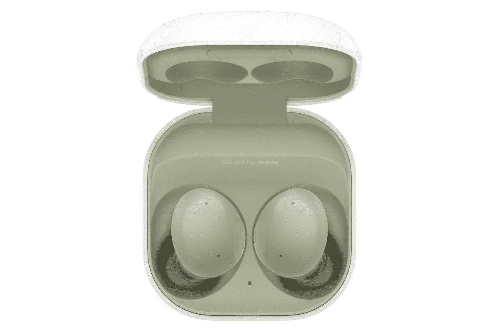

# 三星 Galaxy Buds 2 适合跑步吗？

> 原文：<https://www.xda-developers.com/samsung-galaxy-buds-2-running/>

三星刚刚推出了真正无线耳塞系列的最新产品 [Galaxy Buds 2](https://www.xda-developers.com/samsung-galaxy-buds-2/) 。他们将与新的 [Galaxy Z Flip 3](https://www.xda-developers.com/samsung-galaxy-z-flip-3/) 和 [Z Fold 3](https://www.xda-developers.com/samsung-galaxy-z-fold-3/) 可折叠产品一起发布，并带来了以前 Galaxy Buds 的一些高级功能。例如，这包括内置三个麦克风的主动噪音消除，这在这个价位对三星来说是新的。像这样的无线耳塞的常见用途是健身，所以你可能想知道 Galaxy Buds 2 是否适合跑步。

正如你可能已经猜到的，答案是视情况而定，但总的来说，这些是三星迄今为止最好的选择之一。跑步时需要考虑的一个因素是耳塞的适合度，Galaxy Buds 2 配备了不同尺寸的可互换耳塞。此外，三星在 Galaxy 可穿戴应用程序中添加了一个新的贴合测试，这意味着你可以看到耳塞与耳朵的贴合程度。当耳塞更容易掉落时，这应该有助于您在跑步时获得最佳体验。尽管如此，耳塞本身没有鳍状物或稳定器可以钩住你的耳朵，所以这对于非常繁重的锻炼来说可能是个问题。

相比苹果的标准 AirPods，它根本没有橡胶耳塞，这当然更好。这些也是迄今为止最小最轻的星系芽，所以它们不太可能脱落。

你也会很高兴地知道 Galaxy Buds 2 具有主动噪音消除和环境声音通过功能。例如，如果你在公路附近跑步，后者尤其重要，因为你想知道你的周围环境。当然，如果你知道你在一个安全的环境中，你可能会感谢噪音消除淹没所有外部噪音。

三星表示，Galaxy Buds 2 可以减少高达 98%的外部背景噪音。然而，有一个警告。如果您有 iOS 设备，则不能启用或停用 ANC 或环境声音直通。这些功能需要定制一部 Android 手机，尽管你可以在 Android 上启用它们，然后将 Buds 2 连接到 iOS 设备。尽管如此，还是不太方便。

最后一件值得注意的事情是电池寿命。Galaxy Buds 2 宣称，在启用 ANC 的情况下，电池续航时间可达 5 小时，充电后可延长 20 小时。这与大多数其他耳塞提供的功能相差不远，对于任何正常人的锻炼都应该足够了。但是如果你担心它，现在你知道了。

如果你有兴趣，你可以从下面的链接预购三星 Galaxy Buds 2，并用[这些保护套](https://www.xda-developers.com/best-samsung-galaxy-buds-2-cases/)为它们获得一些额外的保护。然而，如果你不完全相信，我们有一份你现在就能买到的[最佳无线耳塞](https://www.xda-developers.com/best-wireless-earbuds/)的清单。你一定会在那里找到适合你需要的东西。

 <picture></picture> 

Samsung Galaxy Buds 2

##### 三星 Galaxy 芽 2

三星 Galaxy Buds 2 以较低的价格提供了优质的三星耳塞功能。三个内置麦克风、环境声音和长电池寿命的主动噪音消除，同时是三星迄今为止最轻的耳塞。