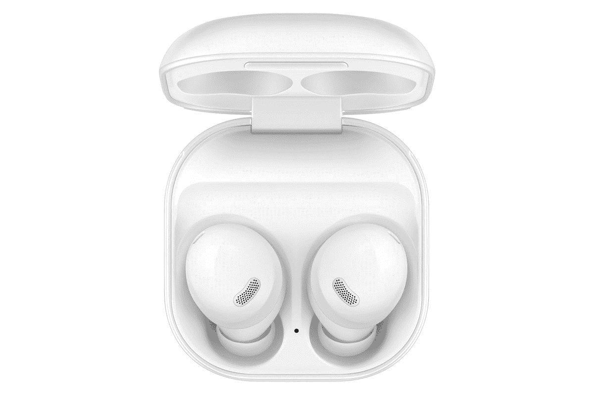

# 三星 Galaxy Buds 2 vs Galaxy Buds Pro:买哪个？

> 原文：<https://www.xda-developers.com/samsung-galaxy-buds-2-vs-galaxy-buds-pro/>

三星最近推出了 [Galaxy Buds 2](https://www.xda-developers.com/samsung-galaxy-buds-2/) 以及 [Galaxy Z Fold 3](https://www.xda-developers.com/samsung-galaxy-z-fold-3/) 和 [Galaxy Z Flip 3](https://www.xda-developers.com/samsung-galaxy-z-flip-3/) 。Buds 2 是前一段时间推出的 Galaxy Buds+的精神继承者，具有新的功能和改进，可以与一些高级 TWS 耳机相媲美，但价格略低。

如果你想买一副三星的无线耳塞，值得注意的是几个月前发布的 Galaxy Buds Pro，目前的售价与 Galaxy Buds 2 相同。所以我们想比较一下这两个，帮你自己决定买哪一个。下面是 Galaxy Buds 2 与 Galaxy Buds Pro 的对比，以确定最适合您的 TWS 耳机。

### 三星 Galaxy Buds 2 vs 三星 Galaxy Buds Pro 规格

## 三星 Galaxy Buds 2 vs 三星 Galaxy Buds Pro:规格

| 

规格

 | 

三星 Galaxy 芽 2

 | 

三星 Galaxy Buds Pro

 |
| --- | --- | --- |
| 尺寸和重量 | 

*   耳塞:17×20.9×21.1 毫米
*   外壳:50×50.2×27.8 毫米
*   重量:5g 耳塞，41.2g 外壳

 | 

*   耳塞:19.5x20.5x20.8mm
*   外壳:50x 50.2 x 27.8 毫米
*   重量:6.3g 耳塞，44.9g 外壳

 |
| 非洲民族会议(African National Council) | 

*   3 级环境声音控制
*   透明方式
*   切断声音的机器学习解决方案

 | 

*   2 级环境声音控制
*   透明方式
*   语音检测

 |
| 连通性 | 蓝牙 5.2 | 蓝牙 5.0 |
| 电池和充电 | 

*   芽——61 毫安
*   外壳–472 毫安时
*   20 小时播放时间，带外壳
*   USB-C 端口
*   Qi 无线充电

 | 

*   芽-61 毫安时
*   外壳- 472mAh
*   USB-C 端口
*   Qi 无线充电

 |
| IP 等级 | IPX2 | IPX7 |
| 颜色；色彩；色调 | 白色、橄榄色、石墨色、淡紫色 | 幻影紫，幻影银，幻影黑 |
| 价格 | $149 | $149 |

## 建造和设计

Galaxy Buds 2 和 Galaxy Buds Pro 在外壳和耳塞方面都采用了相同的设计语言。事实上，Galaxy Buds 2 和 Buds Pro 的外壳尺寸完全相似，这意味着您可以将 [Galalxy Buds 2 外壳](https://www.xda-developers.com/best-samsung-galaxy-buds-2-cases/)用于 Galaxy Buds Pro，不会有任何问题。这是三星为保持统一性所做的一件好事。这两种情况都在背面有一个 USB-C 端口，也支持无线充电。

不过，这两种情况看起来略有不同。Galaxy Buds 2 采用全白色外壳，外壳内部组件和耳塞本身有不同的颜色选择。另一方面，Galaxy Buds Pro 有三种不同的颜色，整个外壳和耳塞具有相同的配色方案。除此之外，两种耳塞外壳的外观没有其他区别。

## 合身舒适

虽然两种耳塞的设计基本相似，但 Galaxy Buds 2 上的单个耳塞比 Galaxy Buds Pro 略小，这使它们在长时间佩戴时更加舒适。这两款耳塞都采用了入耳式设计，这意味着它们位于耳道深处，能够提供良好的隔音效果。Galaxy Buds Pro 看起来稍微高端一些，而 Galaxy Buds 2 看起来稍微便宜一些，有着普通的光滑塑料外壳。

如果你打算戴着耳塞锻炼，我们建议你选择 Galaxy Buds Pro，因为它们的防护等级为 IPX7，在出汗和进水的情况下会更加安全。Galaxy Buds 2 的 IPX2 等级在很大程度上应该是不错的，但 Buds Pro 让您更加安心。

## 音质和 ANC

Galaxy Buds 2 和 Buds Pro 具有相似的声音驱动器，因此产生非常相似的音频。对于未经训练的人来说，两对耳塞看起来完全一样，这很好，因为 Galaxy Buds 2 在发布时的价格便宜了 50 美元。两种耳塞都有清晰的声音，良好的声音信号，会让大多数人对他们的声音感到满意。

两个耳塞上的 ANC 在消除外部噪音方面同样有效。然而，在 Galaxy Buds 2 上，你可以获得三个级别的 ANC，而在 Galaxy Buds Pro 上，你只能获得两个级别的 ANC。如果你要打很多电话，Galaxy Buds Pro 应该是你的选择，因为它有更好的麦克风设置，可以消除环境噪音。

两种耳塞听起来都很棒，但如果你以同样的价格购买，Galaxy Buds Pro 会占上风，因为它有更好的麦克风和略高的低音。

## 附加功能和电池寿命

就像大多数 TWS 耳塞一样，Galaxy Buds 2 和 Galaxy Buds Pro 的耳塞上都有触摸控制，可以用来执行多种不同的功能。这包括播放/暂停音乐、跳到下一首/上一首曲目、触发语音助手等。您还可以通过三星可穿戴应用程序配置两个耳塞，并通过应用程序控制两个耳塞上的 ANC/透明度级别。

Galaxy Buds Pro 具有入耳式检测功能，因此当您从耳朵上取下耳机时，音乐会自动停止播放，当您重新戴上耳机时，音乐会继续播放。这个功能在 Galaxy Buds 2 上是没有的。Galaxy Buds Pro 还有一些其他功能，包括语音检测，当你与某人交谈时，它会自动将耳塞切换到透明模式，以便更容易听到他们。还有一个挡风玻璃，在连接的设备之间自动切换，360 度音频和波束成形麦克风。如果您要将耳塞与三星手机配对，您还可以使用两个耳塞上的快速配对功能，让您无缝连接到它们。

在电池续航时间方面，Galaxy Buds 2 一次充电可以持续长达五个小时，这与 Galaxy Buds Pro 完全相同，两者都启用了 ANC。在实际使用中，两个耳塞应该理想地产生相似的电池体验。当你考虑到这种情况时，两个耳塞一次充电可以持续 20 小时。我们会说两个耳塞的电池寿命都相当不错。

## Galaxy Buds 2 vs Galaxy Buds Pro:买哪个？

在撰写本文时，Galaxy Buds Pro 和 Buds 2 的定价完全相同。考虑到这一点，Galaxy Buds Pro 更有意义，因为它有一些额外的功能，看起来稍微更高端，但听起来类似于 Galaxy Buds 2。如果你在 Galaxy Buds 2 上买得很划算，而且比通常的 150 美元价格更便宜，那么购买它而不是在 Galaxy Buds Pro 上花更多钱是明智的。

 <picture></picture> 

Samsung Galaxy Buds 2

##### 三星 Galaxy 芽 2

Galaxy Buds 2 是三星最新推出的一款带 ANC 的 TWS 耳机。

 <picture></picture> 

Samsung Galaxy Buds Pro

##### 三星 Galaxy Buds Pro

Galaxy Buds Pro 是三星的旗舰 TWS 耳塞，具有 ANC 和智能功能。

如果你对 [Galaxy Buds 2 和 Galaxy Buds Live](https://www.xda-developers.com/samsung-galaxy-buds-2-vs-galaxy-buds-live/) 感到困惑，我们也有一个比较，以及一个 [Galaxy Buds 2 和 AirPods Pro](https://www.xda-developers.com/samsung-galaxy-buds-2-vs-apple-airpods-pro/) 的比较，如果你对这两对耳塞感到困惑。