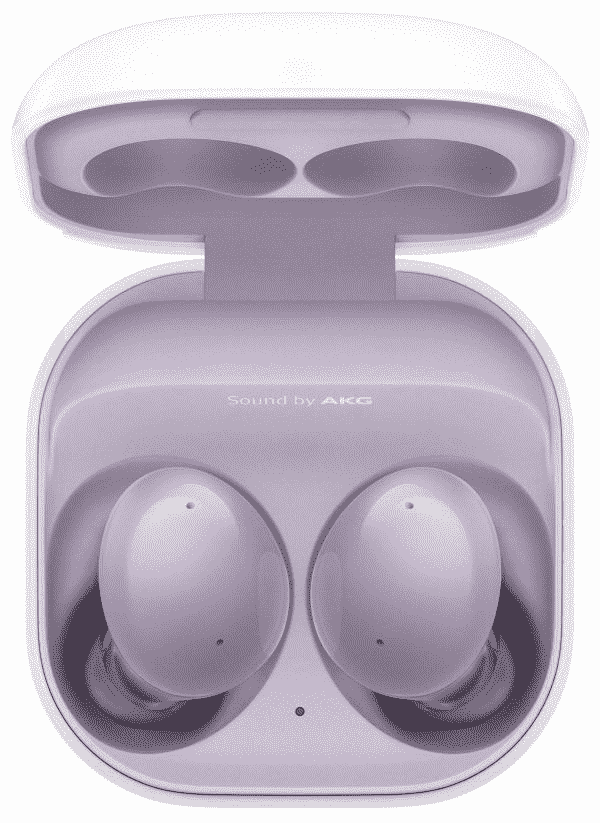
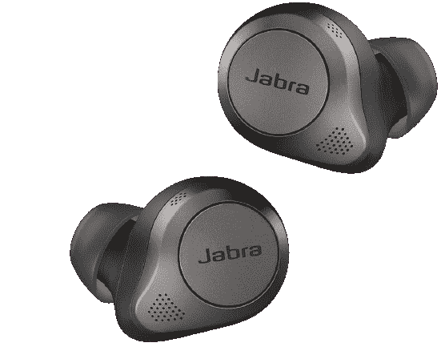

# 三星 Galaxy Buds 2 vs Jabra Elite 85T:你该选哪个 TWS？

> 原文：<https://www.xda-developers.com/samsung-galaxy-buds-2-vs-jabra-elite-85t/>

[三星 Galaxy Buds 2](https://www.xda-developers.com/samsung-galaxy-buds-2/) 和 Jabra Elite 85T 是市场上[最好的真正无线耳塞](https://www.xda-developers.com/best-wireless-earbuds/)中的两个，提供出色的声音、符合人体工程学的设计和有效的 ANC。Galaxy Buds 2 与 [Galaxy Z Fold 3](https://www.xda-developers.com/samsung-galaxy-z-fold-3/) 和 [Galaxy Z Flip 3](https://www.xda-developers.com/samsung-galaxy-z-flip-3-review/) 一同亮相。与此同时，Jabra Elite 85T 于 2020 年问世，相对而言比 Galaxy Buds 2 更老。然而，Jabra 继续将其作为旗舰产品进行推广。两种耳塞都有优点和缺点，但哪一种更好呢？我们在这种面对面的比较中找到答案。

## Galaxy Buds 2 Vs. Jabra Elite 85T:规格

| 

规格

 | 

银河蓓蕾 2

 | 

Jabra Elite 85T

 |
| --- | --- | --- |
| 体型和体重 | 

*   17 x 20.9mm 毫米(耳塞)
*   50.2 x 50 x 27.8mm 毫米(外壳)
*   5g(耳塞)
*   41.2 克(耳塞)

 | 

*   23.1 x 19.0 x 16.2mm 毫米(耳塞)
*   64.8 x 41.1 x 28.5mm 毫米(充电盒)
*   7g(耳塞)
*   45.1(充电情况)

 |
| 声音的 | 

*   动态双向扬声器
    *   11 毫米低音扬声器
    *   6.5 毫米高音扬声器

 |  |
| 非洲民族会议(African National Council) | 

*   是，支持 ANC
*   3 级环境声音控制
*   环境声音/透明模式
*   切断声音的机器学习解决方案

 | 

*   是，支持 ANC
*   穿透(透明)模式
*   可调模式

 |
| 麦克风 | 

*   3 个麦克风(每个耳塞)

 | 

*   3 个麦克风(每个耳塞)

 |
| 连通性 |  |  |
| 电池和充电 | 

*   使用 ANC 播放 5 小时
*   总播放时间为 20 小时(带充电外壳)

 | 

*   使用 ANC 播放 5.5 小时
*   总播放时间为 31 小时(带充电外壳)

 |
| IP 等级 |  |  |
| 颜色；色彩；色调 | 

*   白色、橄榄色、石墨色、淡紫色

 | 

*   钛黑、金米色、铜黑、灰色

 |

## 设计、舒适度和 IP 等级

理论上，Galaxy Buds 2 和 Jabra Elite 85T 都承诺将做到轻便舒适。但看看这些数字，Galaxy Buds 2 在这方面有优势，因为它们的重量只有 5g，比 Elite 85T 轻 2g。就外观而言，两款耳机都采用了类似的设计，但 Galaxy Buds 2 看起来更现代，更引人注目，这要归功于它们延伸到充电外壳的圆形设计。

Jabra Elite 85T 配有长方形耳塞和耳垢护罩，可防止灰尘、碎屑和粘性物质堵塞扬声器格栅。Galaxy Buds 2 配有标准圆形耳塞。为了帮助你选择合适的耳尖，三星的应用程序还提供了耳尖测试。

谈到控制，两种耳塞采取了不同的方法；Galaxy Buds 2 有触摸手势，所以它们有时可能会记录意外或错误的点击。你不太可能在 Jabra Elite 85T 上遇到这个问题，因为它们使用良好的旧物理按钮，但这也意味着你需要施加轻微的压力来激活它们，有可能让你的耳朵感到不安。

两种耳塞都具有防水防汗的 IP 等级，但 Jabra Elite 85T 的表现更好，因为与 IPX2 认证的 Galaxy Buds 2 相比，它们具有 IPX4 等级。这意味着它们更适合高强度训练和户外活动。

## 音质、ANC 和通话体验

两种耳塞在音频驱动设置上有所不同。Galaxy Buds 2 采用动态双向扬声器，由一个用于低音和中音的 11 毫米低音扬声器和一个用于处理高频的 6.5 毫米高音扬声器组成。Jabra Elite 85T 采用了更传统的设置，每个耳塞都有一个 12 毫米的动态驱动器。Galaxy Buds 2 显然拥有出众的硬件，但请记住，这很大程度上取决于音频调谐。

如果你不喜欢开箱即用的音质，三星和 Jabra 都通过其配套应用程序为你提供了许多定制选项，允许你根据自己的喜好调整音频，并播放不同的声音配置文件。

说到主动噪音消除(ANC)，这两款耳塞都声称能够提供强大的 ANC 性能。三星表示，Galaxy Buds 2 可以减少高达 98%的外部噪音，但这并不意味着它们可以将你与外界完全隔离——你仍然可以听到人们的声音和高音噪音。

Jabra Elite 85T 配有专门的噪音消除处理器，您可以通过 Sound+ app 控制 ANC 的级别。它们还具有压力释放孔，以减少由紧密密封和 ANC 引起的耳内压力积聚。

两种耳塞都提供可调透明度或环境模式，让您无需摘下耳机即可轻松聆听周围的声音和人们的声音。对于通话，Galaxy Buds 2 使用两个波束形成麦克风和一个内置的语音拾取单元。此外，还有一种基于机器学习的解决方案，可以减少外部声音。

Jabra Elite 85T 使用类似的波束成形麦克风和先进的防风降噪算法来消除风噪和多余的环绕声。

## 电池寿命和其他特性

在电池寿命方面，我们预计 Galaxy Buds 2 在 ANC 上的播放时间为 5 小时，Jabra Elite 85T 为 5.5 小时。虽然这些数字很接近，但 Galaxy Buds 2 在总续航能力方面落后，在充电情况下可提供长达 20 小时的播放时间。这比 Jabra Elite 85T 承诺的时间少了 11 个小时(最多 31 个小时)。两款耳塞都提供 Qi 无线充电和 USB-C 有线充电。

Galaxy Buds 2 的其他显著亮点包括蓝牙 5.2 支持、IPX2 评级、360°音频、Bixby/Assistant 集成，以及对 SBC、AAC 和三星可扩展编解码器的支持。

至于 Jabra Elite 85T，您可以获得蓝牙 5.1 连接、多点支持、SBC 和 AAC 编解码器、IPX4 评级和助理/Siri 支持。

## 结论

Galaxy Buds 2 和 Jabra Elite 85T 都是具有强大功能的真正无线耳塞。但总的来说，我们认为 Galaxy Buds 2 是一笔更好的交易，因为它们的价格合理，并提供了最佳的性价比。最初售价为 149 美元，在亚马逊上经常以 100-110 美元的价格出售(也可以查看[最佳 Galaxy Buds 2 案例](https://www.xda-developers.com/best-samsung-galaxy-buds-2-cases/))。如果你有三星设备，与三星 Galaxy 智能手机的生态系统集成也使它们成为一个不错的选择。如果您想要稳定的电池续航时间，并计划使用耳塞进行激烈的体力活动，那么 Jabra Elite 85T 更适合您。它们具有 IPX4 防水功能(与 Galaxy Buds 2 上的 IPX2 相比)，可提供长达 31 小时的播放时间。它们的原价是 229 美元，但通常以 149 美元的价格出售。

 <picture></picture> 

Samsung Galaxy Buds 2

##### 三星 Galaxy 芽 2

Galaxy Buds 2 提供有效的 ANC、双向扬声器和长达 20 小时的电池续航时间

 <picture></picture> 

Jabra Elite 85T

##### Jabra Elite 85t

Jabra Elite 85T 是顶级的真正无线耳塞，配有 12 毫米动态驱动器、强大的 ANC 和 31 小时的电池寿命。

这里有一个我们喜欢和不喜欢这两款耳机的快速纲要。

### 我们喜欢 Galaxy Buds 2 的什么:

*   轻巧抢眼
*   高级音频驱动程序设置
*   有效 ANC 和环境声音模式

我们不喜欢的是:

*   电池总寿命低于标准
*   缺乏 iOS 应用程序支持

### 我们喜欢 Jabra Elite 85T 的什么:

*   人体工程学设计
*   持久的电池寿命
*   IPX4 额定值

我们不喜欢的是:

*   有点过时的样子
*   昂贵的

你会选哪款耳机？请在下面的评论中告诉我们！