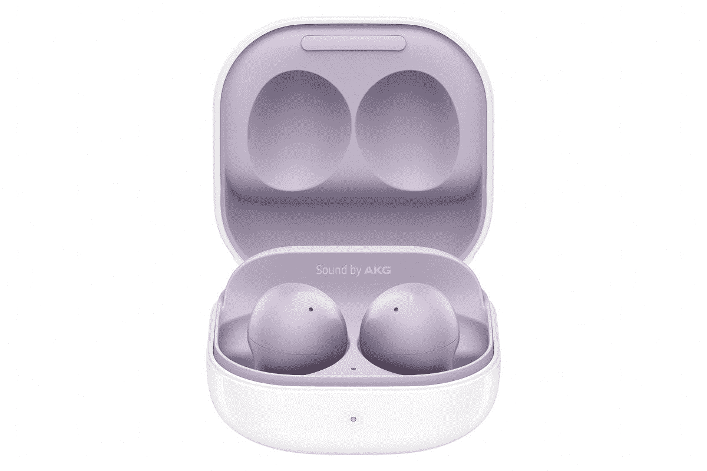

# 三星 Galaxy Buds 2 防水吗？你能和他们一起锻炼吗？

> 原文：<https://www.xda-developers.com/samsung-galaxy-buds-2-waterproof/>

# 三星 Galaxy Buds 2 防水吗？

如果你打算买一双三星最新的 Galaxy Buds 2，并想知道它们是否防水，这里有你的答案！

除了最新的可折叠产品 [Galaxy Z Fold 3](https://www.xda-developers.com/samsung-galaxy-z-fold-3/) 和 [Galaxy Z Flip 3](https://www.xda-developers.com/samsung-galaxy-z-flip-3/) ，三星还宣布了两款新配件，作为其生态系统的一部分。 [Galaxy Watch 4](https://www.xda-developers.com/samsung-galaxy-watch-4/) 和 [Galaxy Buds 2](https://www.xda-developers.com/samsung-galaxy-buds-2/) 是补充该品牌最新可折叠产品的一套新配件。Galaxy Buds 2 本质上是 Galaxy Buds+的继任者，在很多方面与 Galaxy Buds Pro 相似。它配有 ANC、无线充电、多设备连接和一系列其他功能。但是它们适合锻炼吗？三星 Galaxy Buds 2 防水吗？

传统上，三星的所有 TWS 耳机，从最初的 Galaxy Buds 到高端的 Galaxy Buds Pro，都有某种防水功能。这种防水性表现为 IP 等级。IP 代表*入口保护*，是对某些产品的认证，如果这些产品能够防水的话。Galaxy Buds 2 也有 IP 认证，等级为 IPX2。

简单来说，这意味着当 Galaxy Buds 2 以小于 15 度的角度撞击耳塞时，它可以阻止水进入耳塞。这对于常规锻炼来说应该没问题，汗水应该不会对 Galaxy Buds 2 造成太大伤害。然而，这并不意味着它们是防水的。它们只有很小程度的防水性，我们不建议在雨中或泳池中佩戴。

除非明确提到，否则没有哪个小玩意是真正防水的。IP 等级只是使设备防水，这是两码事。如果水进入 Galaxy Buds 2 内部，最终可能会损坏内部的电子设备，保修将不涵盖对您的耳塞造成的损坏，因为它会考虑物理损坏。因此，尽可能让你的电子产品远离水是明智的，即使它们是防水的。

 <picture></picture> 

Samsung Galaxy Buds 2

##### 三星 Galaxy 芽 2

Galaxy Buds 2 是三星最新推出的一款带有 ANC 的 TWS 耳机，价格实惠。

如果你已经拿起这些耳塞，请查看 Galaxy Buds 2 的[外壳。如果你对三星最新的 TWS 不感兴趣，你可以看看其他的](https://www.xda-developers.com/best-samsung-galaxy-buds-2-cases/)[大 TWS 选项](https://www.xda-developers.com/best-wireless-earbuds/)。