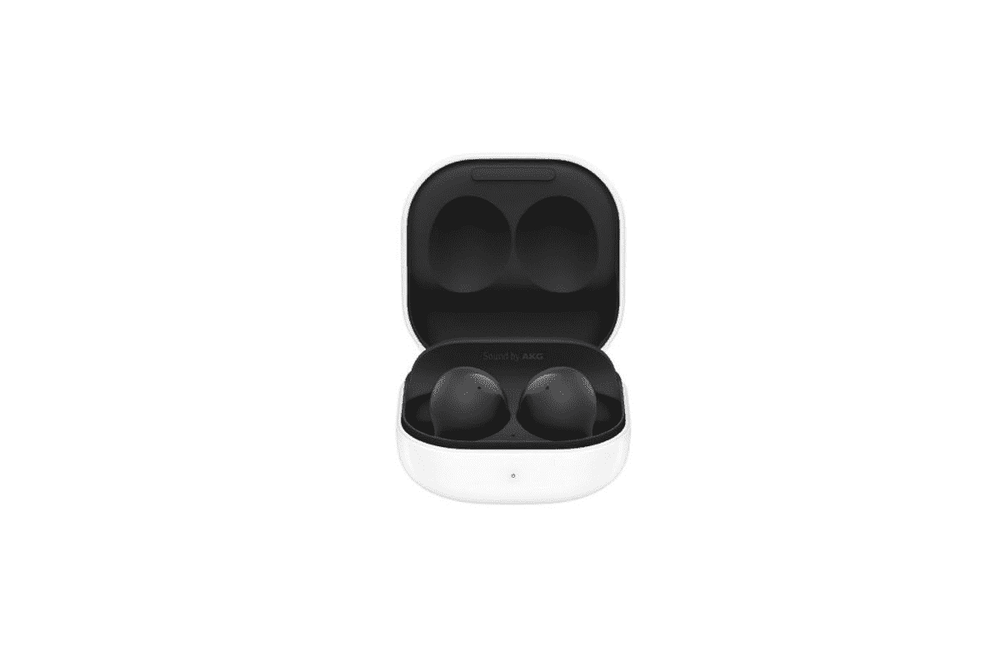

# 三星 Galaxy Buds 2 有无线充电吗？

> 原文：<https://www.xda-developers.com/samsung-galaxy-buds-2-wireless-charging/>

# 三星 Galaxy Buds 2 有无线充电吗？

如果你想知道 Galaxy Buds 2 在你拿到一对之前是否有无线充电功能，我们可以回答这个问题！

三星最新的*开箱*活动包括发布两款最受期待的智能手机——[Galaxy Z Fold 3](https://www.xda-developers.com/samsung-galaxy-z-fold-3/)和 [Galaxy Z Flip 3](https://www.xda-developers.com/samsung-galaxy-z-flip-3/) 。除了这两款可折叠手机之外，三星还宣布了两款新的配件加入其生态系统——Galaxy Watch 4 和 Galaxy Buds 2。Galaxy Buds 2 本质上是 Galaxy Buds Pro 的廉价版本，Galaxy Buds Pro 是你能买到的最好的 TWS 耳机之一。如果你打算购买 Galaxy Buds 2，并想知道是否支持无线充电，这里有你正在寻找的答案:是的，Buds 2 确实支持无线充电。

是的，Galaxy Buds 2 的外壳内置了无线充电功能。这意味着花蕾休息的充电盒有一个无线充电线圈内置在底部。多亏了这个线圈，每当你将 Galaxy Buds 2 的充电外壳放在无线充电器上时，它就会开始充电。如果你不想无线充电，也可以通过外壳上的 USB Type-C 端口为 Galaxy Buds 2 充电。虽然无线充电当然更方便，但它比传统的有线充电慢。

Galaxy Buds 2 支持无线充电的一大优势是，即使在没有任何外部电源的情况下，你也可以在外出时给耳塞充电。如果你有一部相当新的三星旗舰机，你可以使用手机上的反向无线充电功能快速为 Galaxy Buds 2 充电。你所要做的就是在手机上启用该功能，并将 Galaxy Buds 2 充电外壳放在手机背面，然后你就可以开始工作了。

 <picture></picture> 

Samsung Galaxy Buds 2

##### 三星 Galaxy 芽 2

Galaxy Buds 2 是三星最新推出的一款带 ANC 的 TWS 耳机。

Galaxy Buds 2 以较低的价格提供了一系列您通常会在较贵的耳机上找到的功能。如果你正在寻找一副好的、可靠的 TWS 耳塞，Buds 2 可能是你的一个好选择，特别是如果你有一部三星手机，或者你打算购买新的 Galaxy Z Fold 3 或 Galaxy Z Flip 3。如果你有一双，一定要看看 Galaxy Buds 2 的[最佳保护套，以防它们被划伤或掉落。](https://www.xda-developers.com/best-samsung-galaxy-buds-2-cases/)