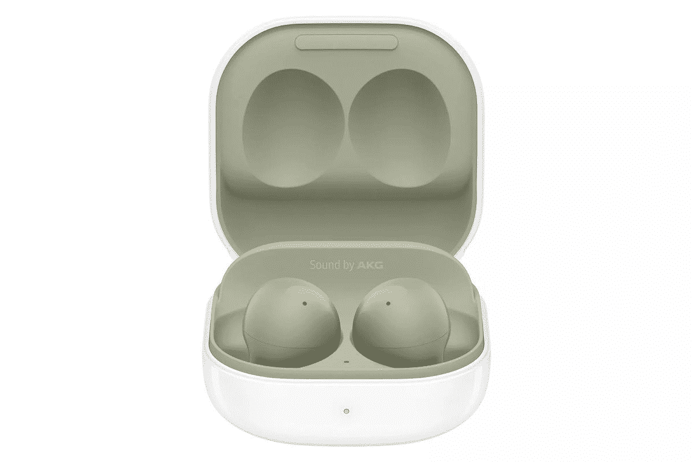

# 三星的 Galaxy Buds Windows 应用程序通过最新更新获得了 Galaxy Buds 2 支持

> 原文：<https://www.xda-developers.com/samsung-galaxy-buds-app-windows-buds-2-support/>

# 三星的 Galaxy Buds Windows 应用程序通过最新更新获得了 Galaxy Buds 2 支持

三星推出了 Galaxy Buds Live 和 Galaxy Buds 2 支持，并为 Windows 10 的 Galaxy Buds 应用程序提供了最新更新。

今年 5 月，[三星发布了](https://9to5google.com/2021/05/17/galaxy-buds-app-windows/)用于 Windows 的 Galaxy Buds 应用。这款应用只有一个简单的目的——让用户轻松地将 Galaxy Buds 与 Windows 10 PC 配对，并控制 ANC、均衡器和其他设置。发布时，该应用程序仅与 Galaxy Buds Pro 兼容。然而，三星宣布将通过后续更新扩展对 Galaxy Buds Live 和 Galaxy Buds+的支持。正如承诺的那样，该公司现在推出了对 Galaxy Buds Live 和新的 [Galaxy Buds 2](https://www.xda-developers.com/samsung-galaxy-buds-2/) 的支持，并更新了最新的 Galaxy Buds 应用程序。

根据 Reddit 用户 [u/Connect_Jump_8627](https://www.reddit.com/r/galaxybuds/comments/pe9sxr/new_galaxy_buds_app_for_windows_added_support_for/) 最近的一篇帖子，最新的 Galaxy Buds 应用更新为 Galaxy Buds Live 和新的 Galaxy Buds 2 提供了支持。遗憾的是，此次更新并没有将支持扩展到老款 Galaxy Buds+。如果你有一个受支持的三星 TWS 耳塞，你可以从下面的链接下载应用程序，并开始在 Windows 10 PC 上使用你的耳塞。

请注意，一些人报告说，在用应用程序将耳塞连接到电脑时遇到了问题。这个问题带来了一个“无法执行此操作”的错误，但你可以通过蓝牙将你的耳塞连接到你的电脑，然后启动应用程序来绕过它。

**[从微软商店下载 Galaxy Buds app](https://www.microsoft.com/en-in/p/galaxy-buds/9nhtlwtkfznb?activetab=pivot:overviewtab)**

如果这听起来太麻烦，你可以试试 Windows 的开源 Galaxy Buds Manager 客户端。它还获得了最新更新的 Galaxy Buds 2 支持，您可以通过跟随[此链接](https://github.com/ThePBone/GalaxyBudsClient/releases/tag/4.3.1)下载它。不过，Galaxy Buds Manager 中的 Galaxy Buds 2 支持在当前版本中是试验性的，所以在 Windows 10 PC 上使用耳塞时，您可能会遇到一些问题。

 <picture></picture> 

Samsung Galaxy Buds 2

##### 三星 Galaxy 芽 2

Galaxy Buds 2 是三星 TWS 耳塞系列的最新成员，以更实惠的价格提供 ANC。