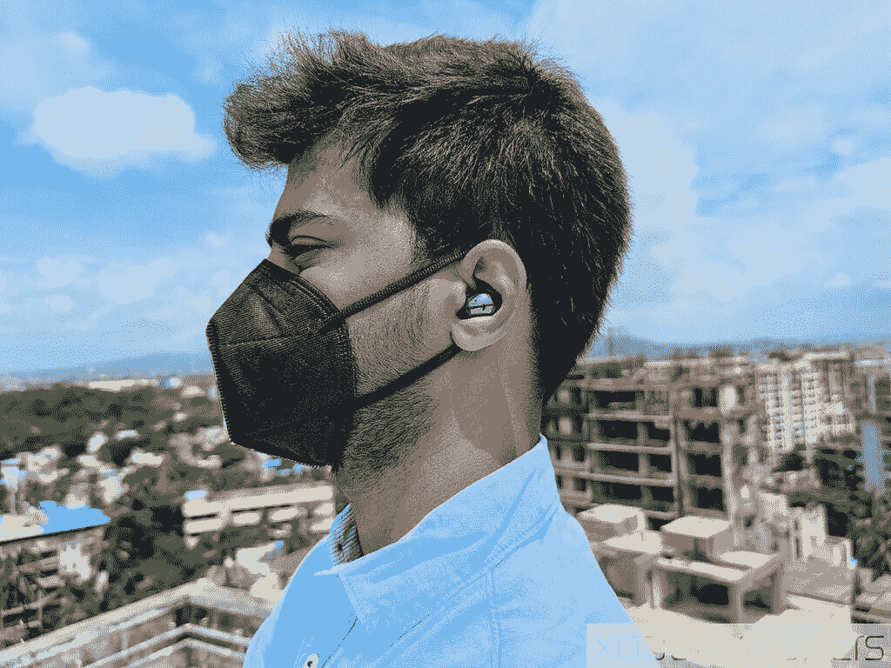
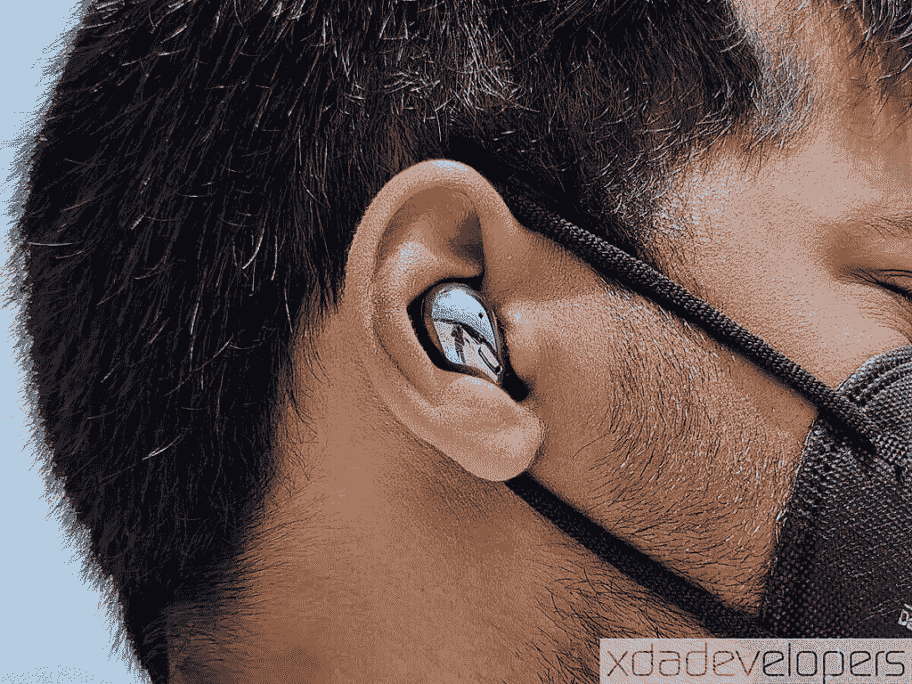
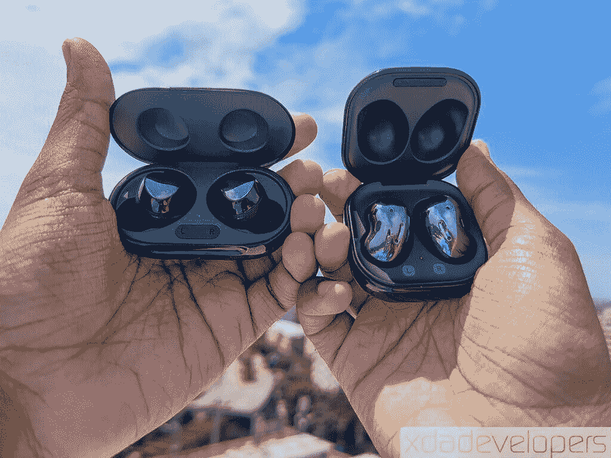

# 三星 Galaxy Buds 现场评论:这些耳塞上的美味设计！

> 原文：<https://www.xda-developers.com/samsung-galaxy-buds-live-review/>

你能独一无二地做一件事的方法只有这么多；过了一点，你一定会重复，这可能会导致你的产品开始类似于已建立的产品细分市场的一些关键特征。智能手机是长方形的玻璃板，笔记本电脑是带键盘的板，真正的无线耳塞要么是圆形的，要么上面有一个茎部。因此，当一种产品出现，偏离了既定的秩序，我们一定会注意到。这正是发生在~~银河豆~~ [银河芽直播](https://www.xda-developers.com/samsung-galaxy-buds-live/)上的事情。

当《T4 的花蕾》第一次出现在无茎的菜豆图案中时，我不仅仅是好奇。我有很多问题:它们是如何放进耳朵里的？它们有多大？它们是如何放入箱子的，又是如何留在里面的？它们有多容易脱落？他们会不舒服吗？他们如何隔离噪音？它们会有噪音消除功能吗？虽然三星的[官方发布](https://www.xda-developers.com/samsung-galaxy-watch-3-and-samsung-galaxy-buds-live-launched-in-india/)以及随之而来的营销和广告已经回答了其中的一些问题，但我希望在使用三星 Galaxy Buds Live 以及[三星 Galaxy Buds+](https://www.xda-developers.com/samsung-galaxy-buds-plus-review/) 和索尼 WF-1000XM3 之后，带来一些自己的观点。

## 三星银河芽生活:规格

| 

规格

 | 

三星 Galaxy Buds 直播

 |
| --- | --- |
| **尺寸&重量** | 

*   花蕾:27.2 x 17.3 x 15.5 毫米，5.6 克(每个)
*   外壳:50.0 x 50.2 x 27.8 毫米，42.2 克

 |
| **电池和充电** | 

*   耳塞:60 毫安时(每个)
*   外壳:472 毫安时
    *   无线充电支持

 |
| **扬声器和麦克风** | 

*   由 AKG 调谐的 12 毫米驱动器
*   低音导管
*   三个麦克风

 |
| **连通性** | 

*   蓝牙 5.0 BLE
*   编解码器:AAC，SBC，可扩展编解码器

 |
| **传感器和其他功能** | 

*   近程传感器
*   加速计
*   触敏传感器
*   霍尔传感器
*   IPX2 防水性

 |
| **颜色** | 神秘的青铜色，神秘的白色，神秘的黑色 |

*注:三星印度公司借给我们 Galaxy Buds Live 用于本次评测。这个评测是在使用了十二天之后。三星在这篇文章的内容中没有投入。*

* * *

## 三星 Galaxy Buds Live —设计和制造

虽然三星 Galaxy Buds+与最初的 Galaxy Buds 几乎相同，但 Galaxy Buds Live 与你在市场上看到的任何产品都不一样。它的形状与四季豆非常相似，三星[也想在某个时候称它们为豆子](https://www.xda-developers.com/samsung-galaxy-buds-live-teardown-showcases-easy-repairability-bean-references/)。这肯定是一个独特的设计，豆状耳塞的外表面有光泽，内表面有更柔和的哑光。我拥有的神秘黑色变体确实在闪亮的表面上留下了一些指纹，但它们并不明显。哑光表面减轻了 Buds+上更明显的廉价感，这很好，因为这些耳机不便宜。

 <picture></picture> 

This was the best-fit position for me, with the speakers relatively deep into the ear canal and the Buds Live pressing against the ear.

三星 Galaxy Buds Live 拥有独特的设计，不同于目前市场上的任何产品。

有一个具体的方式，你需要穿银河芽现场。大多数耳机在这方面非常直观，但 Buds Live 的外形如此独特，你确实需要一些帮助才能搞清楚。对于较大的耳朵，耳芽需要位于耳朵的最底部，几乎与地面平行(但不完全平行)。这样，两个扬声器格栅是最深的，最接近你耳朵的耳道。有一个突出的翼尖朝向磨砂侧的顶部，它与豆子形状一起，将花蕾压在你的耳廓上(如果你想更具体地说，在你耳廓的外耳底部)。三星包括另一对更大的翼尖，但我发现默认的更适合我，更大的更容易引起不适。对于较小的耳朵来说，花蕾会更直立。

 <picture></picture> 

This is the wrong fit for my ear size, as the Buds Live are not snug into the ear. This leaves a very large gap between the Buds and the auditory canal. However, this is how they would fit on smaller ears.

星系芽生活，当正确佩戴，从来没有真正脱落。

花蕾的形状以及它们的排列和挤压方式，如果你穿错了，会让人感觉不自信——如果你走得太多，感觉它们会掉下来。如果你做得正确(取决于你耳朵的形状和大小)，花蕾会几乎齐平，不自信会消失。在我的使用中，一旦我弄清楚了它们需要怎样被放进去，花蕾实际上从未脱落。它们非常舒适，以至于我跑了几次都没有掉下来。但是你的里程数可能仅仅因为我们的身体在个体水平上的不同而不同。

就舒适性而言，我确实觉得戴上耳机最多 4 个小时也很舒服。超过这个时间点，耳廓上的紧密贴合开始引起疼痛和不适。Buds Live 只有翼尖有橡胶元素，身体其余部分是硬塑料，所以所有的承受力都需要来自你的身体。如果你的耳朵较小，我可以看到这是一个问题，尽管三星声称它已经在各种耳朵形状和大小上广泛测试了 Buds Live 及其设计。值得三星称赞的是，Buds Live 是轻量级的，重量甚至低于 Buds+，所以你不会感觉到耳朵有任何沉重感。

芽生活在一个圆角方形的情况下，这是很容易放入口袋。耳塞在外壳内的休息支架不是很深，但耳塞不会脱落，因为磁铁在这方面做得足够好。保持盖子紧闭的磁铁比保持花蕾位置的磁铁更强——这只是一个奇怪的观察。继续我的吹毛求疵，当把耳塞放回外壳时，磁性咬合动作比在 Buds+上更强，但与索尼 WF-1000XM3 相比仍不明显，但我承认这只是个人吹毛求疵。我更喜欢 Buds+的药丸形外壳，而不是 Buds Live 的首饰盒形外壳，但 Buds Live 的外壳形状没有什么根本错误，所以两个选项都是正确的。我希望三星改变的是光滑的表面，因为它没有公平对待优质产品，让它感觉比它能冲压的东西更便宜。

 <picture></picture> 

The "lip" on the Buds Live case extends all across, while the Buds+ case only had it on the front.

Galaxy Buds Live 保护套内部有一个 LED 指示灯，用于指示耳塞的充电状态，外部有另一个 LED 指示灯，用于指示保护套的充电状态。表壳周围有一个缺口/缝隙，将两部分分开，因此您可以轻松打开表壳，而无需以任何特定方式握住它。USB Type-C 端口位于外侧转轴的下方。您可以使用该端口为外壳充电，也可以选择使用 Qi 认证的无线充电器充电。三星在包装盒中包括一条短的 USB Type-A 到 Type-C 电缆，因此您可以在开箱后立即为它们充电。

Buds Live 延续了前代产品的 IPX2 等级，这意味着它可以抵御轻微的水溅。所以这只是小事一桩，但仅此而已。下雨的时候你不想带它们出去。考虑到我所在地区的降雨量，我希望三星考虑在防水方面让下一代更好。

三星成功地赋予了耳塞自己的身份。

最后，Galaxy Buds Live 有一个独特的设计，让它与众不同，确保没有人会将它们误认为 AirPod 或市场上的任何其他 TWS。这个设计对我来说适合中短期穿着。但是因为 TWS 是如此的不同，舒适度和适合度归结于个人和他们耳朵的形状和大小。很难给它贴上“好”或“坏”的标签；只是没有真正主流对比的“不同”。三星想给耳塞赋予自己的身份，他们在这方面做得相当成功。

* * *

## 三星 Galaxy Buds Live —功能

### 简单配对

三星 Galaxy Buds Live 与 Galaxy Buds+共享许多软件功能。第一个配对过程超级简单:你必须打开盖子，Galaxy Buds Live 已经处于配对模式，这意味着你不需要进行任何复杂的配对手势或动作来与你的第一个设备一起使用它们。从那时起，您可以通过将花蕾放回外壳并重新打开盖子(您不需要取出花蕾)来进入手动配对模式。如果您不想将两个耳塞放回外壳中，也可以按住它们三秒钟以进入配对模式。

如果你有一部安装了三星 SmartThings 应用程序的三星智能手机，配对过程就更简单了。Galaxy Buds Live 也不支持谷歌的[快速配对](https://www.xda-developers.com/fast-pair-quick-bluetooth-pairing-headphones/)。请注意，您也可以单独使用任一耳塞进行播放。

### 多设备切换

很像 Galaxy Buds+(发布他们的更新)，Galaxy Buds Live 能够进行多设备切换。它不像蓝牙多点那样无缝，可以智能地转移音频焦点。尽管如此，从一个设备完全解除配对/断开连接到另一个设备会减少很多摩擦。假设您之前已经连接过这些设备，您可以在所需设备上点击 Buds Live 条目，Buds Live 将从这些设备接收音频输入。要明确的是，确实有改进的空间，但如果你一天中在几个设备之间跳来跳去，至少你不必一天中多次配对你的 Buds。不过，我确实希望看到下一代的蓝牙多点技术。

### 控制

三星 Galaxy Buds Live 的顶部有一个触摸传感器，但我发现直接触摸中间可以保证有反应。触摸区域没有明确的界限，但由于花蕾本身并不太大，除非你积极努力只触摸顶部边缘，否则你会自信地获得正确的触摸输入。像 Galaxy Buds+一样，只需轻按任一 bud 即可播放和暂停曲目。双击将播放下一首曲目，三击将播放上一首曲目。如果有来电，您可以双击接听。一旦被接受，你可以双击结束通话。按住可让您拒绝来电。

[三星可穿戴应用](https://play.google.com/store/apps/details?id=com.samsung.android.app.watchmanager)可以让你分别将左右耳塞上的单触按住命令重新配置为以下四个选项中的任何一个:语音命令、主动降噪、Spotify 或音量控制(右耳塞用于调高音量，左耳塞用于调低音量)。请注意，Galaxy Buds Live 和 Buds+一样，没有移除时自动暂停/插入时自动播放的功能，尽管它们可以检测何时被移除。另一方面，在移除或插入耳塞时，你真的不能*而不是*触摸触摸板。

你也可以锁定触摸控制。但与 Buds+不同的是，这里没有“双击耳塞边缘”功能。我并不真的想念它的缺席，但如果你对它感兴趣的话，这是值得注意的。

### 连通性

三星 Galaxy Buds Live 支持蓝牙 5.0 连接设备。对于编解码器，Buds Live、Buds+和 Buds 支持 SBC、AAC 和可扩展的 Samsung 编解码器(专有)。你只能在三星的设备上利用三星可扩展编解码器，如前所述，生态系统锁定对于体验这些耳塞的最佳声音至关重要。

就无线范围而言，我可以获得 10 米左右的不间断连接。这方面的性能与其他真正的无线解决方案不相上下。延迟也是 Buds Live 的一个问题，我的声音有大约 150 毫秒的延迟。如果你只是漫不经心地看视频，你可以忍受，但也许不太适合现场游戏，因为你可能会处于一个小劣势。我发现关闭主动噪声消除有助于略微改善延迟，将其降低到大约 120 毫秒。非三星设备上没有游戏模式，所以也要记住这一点。

在三星设备上(比如我测试这些设备的[三星 Galaxy M31s](https://www.xda-developers.com/samsung-galaxy-m31s-review/) ，你确实可以获得一种声称可以最小化音频延迟的游戏模式，这让我可以在有 ANC 的情况下将延迟降低到 100 毫秒以下，在没有 ANC 的情况下甚至更低。

### Galaxy 可穿戴应用

Galaxy Wearable app 是解锁三星可穿戴设备上某些定制的推荐下载，但基本功能和控制不一定需要它。这些功能中有很多与 Buds+的体验是重叠的。

该应用程序主要用于当您需要读取单个电池和外壳上电池电量的精确测量值时。您还需要它来下载和安装 TWS 的固件更新。对于过去的耳塞，[其中一些更新带来了有用的功能](https://www.xda-developers.com/samsung-galaxy-buds-plus-now-easily-switch-between-devices-seamlessly/#:~:text=For%20non%2DSamsung%20phones%2C%20users,second%20device%20(Device%20B).)，所以我建议保持安装应用程序并定期检查。您也可以在应用程序中重置耳塞。

应用程序中还有一个均衡器，带有一些预设。然而，你不能微调设置或创建自定义配置文件，这仍然是三星 hearables 的一个主要疏忽。不过，有[第三方应用可以做到这一点](https://www.xda-developers.com/make-your-headphones-sound-better-automatic-eq-wavelet/)。此外，您还可以让 Galaxy Buds Live 大声朗读您的通知。这可以通过摘要格式(只是应用程序的名称)或详细格式(通知内容)来完成。你也可以在每个应用程序的基础上设置这个功能。Galaxy 可穿戴应用程序还具有“查找我的耳塞”功能，可以在耳机上发出响亮的嘟嘟声。坦白地说，如果你真的丢了耳塞，这个功能实际上是没用的，因为除非耳塞离你的耳朵不到 10 厘米，否则你几乎听不到声音。你也可以打开环境声音模式来减轻耳朵的压力，但是效果很弱，我在下一节会提到。

### 主动噪声消除

三星 Galaxy Buds Live 上的一个亮点是，他们终于为三星最受欢迎的听觉阵容带来了主动噪音消除(ANC)。虽然 Buds+在 Galaxy Wearable 应用程序中有一个切换环境声音的开关，但 Buds Live 用一个 ANC 开关取代了这个开关。

芽直播上的 ANC 管用吗？长话短说，是的，ANC 确实有效。但是有一些需要注意的地方，尤其是在噪声隔离方面。

从技术上讲，Buds Live 上的主动噪声消除确实有效。当你戴上耳塞并拨动 ANC 时，你的耳朵会发出标志性的砰砰声，带来一种压力变化的感觉。然而，由于 Buds Live 的独特设计并没有完全密封耳朵，因此他们可以提供的经验噪音隔离非常少。因此，ANC 的净效果感觉很弱——流行更弱，噪音被消除的程度也明显较弱。

相比之下，索尼 WF-1000XM3 仍然是我个人被动噪音隔离和努力工作的主动噪音消除的正确组合的基准。我的办公桌上有一个悬挂式风扇，索尼的风扇发出的噪音只有它的 10%左右，我几乎听不到它的声音，同时仍然保持较低的音量。当 Galaxy Buds+处于中等音量设置时，由于噪音隔离，我可以淹没一些噪音，并听到大约 60-70%的噪音。当 Galaxy Buds Live 处于中等音量设置时，我仍然可以听到 50-60%的风扇声。主动噪音消除做得很好，但与只提供有效的噪音隔离系统相比，这还不足以真正发挥作用。与 Galaxy Buds+相比，收益最多是微不足道的。在 Buds Live 上关闭 ANC 使风扇重新成为焦点，高达 90%的噪音可以听到。ANC 正在做一些繁重的工作，但它也需要它的伙伴“噪音隔离”来真正提供一流的体验。就目前的情况来看，Buds Live 并不擅长屏蔽你周围的声音。

不过，三星正走在正确的道路上，我期待一款兼具噪音隔离和主动噪音消除功能的音频配件。或许他们可以在下一代产品的独特设计中加入噪声隔离功能？一个人可以希望。

* * *

## 三星 Galaxy Buds Live —音质和语音质量

三星 Galaxy Buds Live 采用了由 AKG 调谐的 12 毫米驱动程序。我仍然认为自己是音频评估的业余爱好者。在我的“普通消费者”音频感知中，Galaxy Buds Live 做得很好，但由于缺乏可察觉的噪音隔离，确实受到了阻碍。

Buds Live 的整体音质比 Buds+有所提升。

使用 Head-Fi 论坛的这个帖子作为参考，Buds Live 上的亚低音比 Buds+上的更好。我之前评论的光环主题的[相同音频在 Buds+上不那么雄伟，现在在 Buds Live 上听起来更有力度。《T4》的斗狗主题](https://youtu.be/Hpl5G1J1FE0)中的低音效果不错，但是没有什么能让低音爱好者兴奋起来。副低音也更加充实，就像星际牛仔主题的[一样](https://youtu.be/G_XQgMgLwoc)，但不足以压倒人声。这些都是对 Buds+的改进，但不是对 TWS 类别的分类定义，因为 Buds+有很多地方要覆盖。其他领域更接近 Buds +的出色表现，即人声、中音和高音。Buds Live 处理得非常好，所以总体来说，音质本身就是对 Buds+的升级。但是，噪音隔离的不足是贯穿始终的，所以你应该在一个相对安静的环境中享受你的音乐。

三星 Galaxy Buds Live 延续了 Buds+在麦克风性能方面的传统。我在 Buds Live 上的语音通话体验非常棒，在 Buds+上也是如此。三星已经发现语音通话质量比索尼和许多其他公司好得多，Buds Live 也获得了好评。它们非常适合在不接触手机的情况下打电话。

* * *

## 三星 Galaxy Buds Live —电池寿命

Galaxy Buds Live 声称在 ANC 打开的情况下，一次充电的电池寿命可达 6 小时，这一说法似乎站得住脚。在不舒服迫使我重新戴上 Galaxy Buds 之前，我最多可以戴上 4 小时零几分钟，在这个阶段，我通常会在 Buds Live left 中剩余超过 25%的电池——数学验证了这一点。该病例又增加了两个半周期(总共 20 小时)。Buds Live 上的备用电池略好于 Buds+上的备用电池。相比之下，Buds+在不需要放回外壳的情况下续航时间更长，但与 Buds Live 相比，外壳本身的电池容量更低。

一旦外壳上的电量耗尽，您可以通过 USB Type-C 端口或通过 Qi 兼容的无线充电器充电。无线充电对于 TWS 配件来说是一个不错的选择，如果你投资于无线充电生态系统，它会发挥很好的作用。

* * *

## 三星 Galaxy Buds Live —结束语

当我结束我的 Galaxy Buds+评测时，我注意到我多么想念索尼 WF-1000XM3 甜美的主动降噪功能。这让人们对 Galaxy Buds Live 及其作为亮点功能的主动噪音消除寄予厚望。当通过这个近视镜看时，芽生活是平淡无奇的，如果你买他们只是为了体验 ANC 的荣耀，你会失望的。音质很好，但缺乏隔音效果是你宁静之旅中的常规障碍。

《银河蓓蕾直播》做得好的一点是从一群空中飞人克隆人和蓓蕾崇拜者中脱颖而出。Buds Live 的主要焦点是它的设计——看起来很有趣，但它的效果足够好，足以让人真正感到惊讶。他们总是觉得他们会从你的耳朵上掉下来，但他们没有-这证明了三星在这一新设计背后的工程。芸豆状的形状( *rajma* ，在印地语中被称为)是一个很好的谈话开始，每个在我耳朵里看到这些的朋友都要求仔细看看并戴上它们，这让我在这个 COVID 世界里很恼火。

《银河蓓蕾直播》做得好的一点是从一群空中飞人克隆人和蓓蕾崇拜者中脱颖而出。

三星 Galaxy Buds Live 是 Galaxy Buds+的良好升级吗？我说不。不是因为芽生活本身不好，而是因为芽+仍然相当不错。Galaxy Buds+现在在印度已经降价，在₹10,490 的零售价格为[(约 142 美元)](https://shop-links.co/1723585475154091283)，而在美国仍然以 150 美元的价格购买。另一方面，Galaxy Buds Live 在₹14,990 更贵[(约 204 美元)](https://shop-links.co/1723585392551748580)在印度[在美国](https://shop-links.co/1723585360515055619)170 美元。根据我对这两种产品的体验，Buds+更容易推荐给每一个普通消费者。从这个意义上来说，它们更物有所值，也更经久不衰。Buds Live 面向重视前沿设计、不怕冒险的消费者，但这并不是所有消费者。

 <picture></picture> 

Samsung Galaxy Buds Live

##### 三星 Galaxy Buds 直播

三星 Galaxy Buds Live 是三星的下一代 TWS，采用了激进的开放式设计和 ANC，以及非常好的电池寿命和无线充电外壳。

**购买三星 Galaxy Buds Live: [三星. in](https://shop-links.co/1723585191026489698)|[Samsung.com](https://shop-links.co/1723585154446432095)****购买三星 Galaxy Buds+: [三星. in](https://shop-links.co/1723585475154091283)|[Samsung.com](https://shop-links.co/1723585442630032590)**

三星何去何从？有一个方向对我来说很有意义，那就是找出主动噪声消除与被动噪声隔离的最佳结合点。无论是增加入耳式橡胶耳塞，还是迁移到新的设计，还是在 Buds+设计中加入 ANC，这都是 2021 年值得关注的事情。