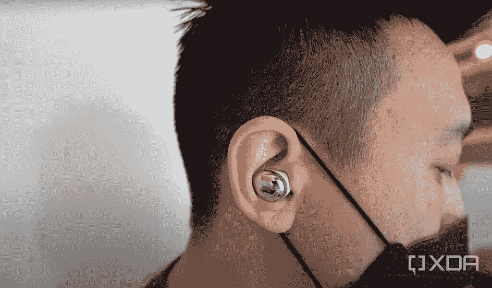
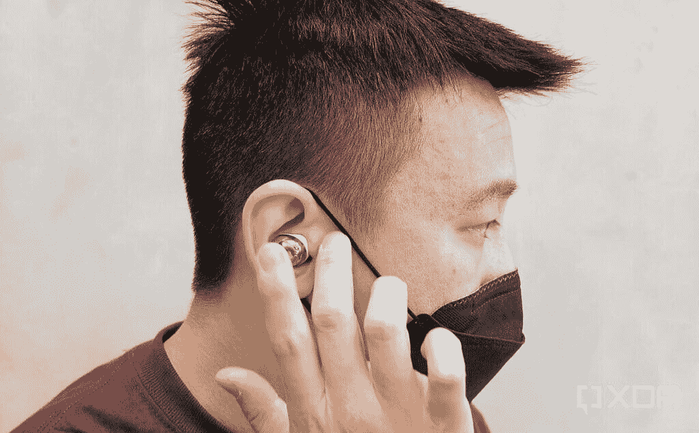
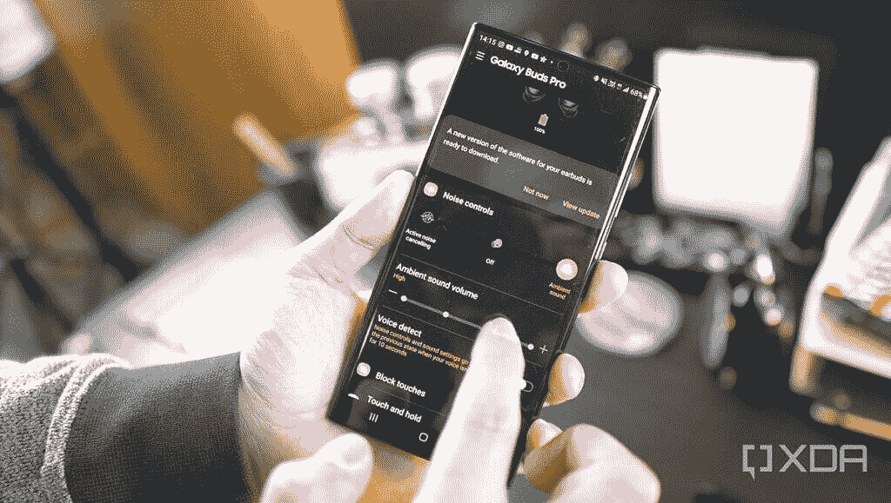

# Galaxy Buds Pro 评论:不是 AirPods 克隆的最佳耳塞

> 原文：<https://www.xda-developers.com/samsung-galaxy-buds-pro-review/>

凭借 Galaxy Buds Pro，三星终于做出了一对真正的无线耳塞，在我的个人排名中名列前茅。然而，他们花了几个迭代才到达那里，而且是在其他行业领导者的支持下。毫不夸张地说，苹果的 AirPods 改变了 T2 无线耳机产业的进程。在 AirPods 出现之前，博拉琪、Moto、FreeWavez 等品牌最早的无线耳塞呈现出各种形状和大小，但最终都不会偏离我们的耳道太远。

然后苹果发布了 AirPods，它当时看起来非常怪异，细长的茎从佩戴者的耳朵伸出来，朝着下巴向南下垂一英寸。我记得早期的一位评论家说它们看起来像“伸出耳朵的湿湿的香烟”,从那以后我一直无法摆脱脑海中的画面——我从来都不喜欢 AirPods 的外观。

但我的想法并不重要——这些细长的耳塞让 AirPods 能够提供更好的连接和声音，很快几乎所有制造无线耳塞的品牌都模仿了这种细长的耳塞设计。随着技术的进步，茎变得更短，也不那么难看了——我甚至变得宽容，开始使用 AirPods Pro 和[华为 free buds Pro](https://www.xda-developers.com/huawei-freebuds-pro-review/)——但茎仍然在那里，像疼痛的拇指一样伸出来。

这就是为什么我觉得三星值得表扬，因为他们拒绝抄袭苹果，而是坚持自己的设计。去年的 [Galaxy Buds Plus](https://www.xda-developers.com/samsung-galaxy-buds-plus-review/) 和 [Buds Live](https://www.xda-developers.com/samsung-galaxy-buds-live-review/) 是可靠的产品，但缺乏有意义的主动噪声消除或透明模式。今年的 Galaxy Buds Pro [终于增加了这两个功能](https://www.xda-developers.com/samsung-galaxy-buds-pro/)，这足以将它们推到我最喜欢的无线耳塞排名的首位。

 <picture></picture> 

The Galaxy Buds Pro: look ma, no stems!

## 三星 Galaxy Buds Pro:规格

| 

规格

 | 

三星 Galaxy Buds Pro

 |
| --- | --- |
| **尺寸&重量** | 

*   耳塞:
    *   19.5 x 20.5 x 20.8mm 毫米
    *   6.3g
*   案例:

 |
| **电池&充电** | 

*   耳塞:61 毫安时
*   外壳:472mAh

 |
| **扬声器&麦克风** | 

*   双向扬声器
    *   11 毫米低音扬声器
    *   6.5 毫米高音扬声器
*   3 个麦克风:
    *   一个高信噪比麦克风
    *   双外部麦克风
*   声音拾取单元

 |
| **ANC &环境声音** | 

*   两级可调 ANC
*   环境声音放大高达+20dB；4 个可调级别
*   语音检测

 |
| **连通性** | 

*   蓝牙 5.0
*   编解码器:可扩展(三星专有)，AAC，SBC

 |
| **传感器** | 加速度计、陀螺仪、接近传感器、触摸传感器 |
| **颜色** | 

*   幻影紫
*   幻影银
*   幻影黑

 |

## 设计

正如我在介绍中已经说过的，Galaxy Buds Pro 最值得注意的一点是，它们看起来一点也不像苹果的 AirPods 或其他[手机品牌的几十个受 AirPods 启发的耳塞。](https://www.xda-developers.com/oppo-enco-x-review/)它们看起来一点也不像三星的最后一款无线产品，豆状的 Galaxy Buds Live！

除此之外，Galaxy Buds Pro 在设计方面没有太多可说的——它们看起来，嗯，不错？这是一个半圆形的耳塞，有一个可拆卸的硅胶耳塞，可以嵌入我的耳道。这些耳塞看起来有点笨重，但每个 6.3 克的耳塞足够轻，可以在我的耳朵里呆上几个小时而不会有问题。安装的中等硅胶头非常适合我的耳朵；包装里有小号和大号的。它们有两种颜色——黑色或银色——银色有一层像镜子一样反光的高反射银涂层。

 <picture></picture> 

Touch controls with the Samsung Galaxy Buds Pro.

这个反射部分兼作控制音频的触摸板:轻轻一点就可以播放或暂停音乐；连按两次会跳过轨道；以及在噪声消除或透明模式之间的长时间按压循环(稍后将详细介绍)。如果你经常摆弄你的耳塞，不喜欢意外触发动作，你可以用 Galaxy Wear 应用程序关闭它们。

 <picture></picture> 

The Galaxy Buds Pro in its charging/carrying case.

Galaxy Buds Pro 充电盒体积小巧，像订婚戒指盒一样打开，这使得取出 Buds Pro 比 AirPods Pro 或华为 FreeBuds Pro 更容易。保护套有一个 USB-C 接口用于充电，支持无线充电。

## 三星 Galaxy Buds Pro 音频和麦克风质量

每个 bud 都有一个由 11 毫米低音扬声器和 6.5 毫米高音扬声器组成的双驱动系统，我发现 Galaxy Buds Pro 的音频质量不错，但不是顶级的。高音和中音是分开的，人声听起来很清脆。然而，我发现华为 FreeBuds Pro 的音频听起来更“饱满”，AirPods Pro 的低音更好，在听嘻哈音乐时更有“活力”。

三星 Galaxy Buds Pro 支持通用 SBC 和 AAC 音频标准，但如果您将它与 Galaxy 设备配对，它还支持三星专有的编解码器(“可扩展编解码器”)。值得一提的是，我将 Galaxy Buds Pro 与 Galaxy S21 Ultra、iPhone 12 Mini、MacBook Pro 和一台三星智能电视一起使用，音频质量对我来说听起来差不多。

然而，我对连接和麦克风印象深刻，因为这些 Galaxy Buds Pro 的尺寸较小，没有细长的杆，这显然有助于蓝牙信号和麦克风输入。

电话另一端的人说他们听得很清楚，事实上，当与三星 Galaxy S21 Ultra 或 Galaxy Note 20 Ultra 配对时，我可以将 Galaxy Buds Pro 用作无线蓝牙麦克风。我非常喜欢这个功能，因为我经常在旅途中拍摄视频。

## 噪声消除和透明模式

去年的 [Galaxy Buds Live](https://www.xda-developers.com/samsung-galaxy-buds-live-review/) 从技术上讲有主动噪音消除，但由于豆状芽松散地坐在你的耳朵里，没有密封耳道，噪音消除实际上是无用的。我很高兴地报告三星 Galaxy Buds Pro 在这方面做出了巨大的改进。我认为这些耳塞有密封我耳道的硅胶顶端的事实起了很大的作用，但我认为三星也在软件上做了一些改进。

Galaxy Buds Pro 在每个 Buds 中内置了三个麦克风，它们协调工作来分析外部声音，因此三星的软件可以使它们静音(噪音消除模式)或选择性地让它们通过(透明模式)。

我发现噪音消除在室内效果很好。我在一个有很多持续聊天的共同工作空间工作，Galaxy Buds Pro 很好地淹没了这些聊天。一旦我走上香港的街道——世界上最嘈杂、人口最稠密的地方之一——噪音消除显然不能让我完全安静下来，但它做了一件令人钦佩的工作。

 <picture></picture> 

Galaxy Wearable app connected to the Galaxy Buds Pro

我不能说我是一个真正的无线耳塞专家，因为我没有尝试过 Jabra 或索尼的任何耳塞，但与 AirPods Pro 和华为 FreeBuds Pro 相比，三星的噪音消除功能仍然有效。

透明模式也很棒。在默认的中等设置下，它只允许足够重要的声音进入，如人声和汽车喇叭声，同时还能抑制白噪声，如空调嗡嗡声和电脑风扇的旋转声。我可以一边听音乐，一边在透明模式下与人交谈。

但我最喜欢的 Galaxy Buds Pro 的功能是在降噪和透明模式之间自动切换，我觉得竞争对手需要在他们的下一个版本中提供这一功能。三星称之为“语音检测”，其工作原理是，每当 Buds 听到我的声音，它就会降低音量，并打开透明模式(如果尚未启用)，持续 5-15 秒。这意味着我可以戴上带有降噪功能的 Galaxy Buds Pro，但如果我需要进行简短的交谈，我可以在不接触耳塞或手机的情况下这样做。

语音检测功能非常有效——在我说出第一个单词之前，Galaxy Buds Pro 已经降低了音量，让声音通过。事实上，我花了一些时间来适应，因为我有唱歌的习惯，每当我唱歌时，音量就会降低。

好消息是，如果我愿意，我可以在 Galaxy 可穿戴应用程序中关闭这项功能。事实上，Galaxy Wearable app 有很多定制选项，包括更改降噪或透明模式的级别，以及调整音频 EQ。

## 电池寿命、其他信息和结论

三星 Galaxy Buds Pro 一次充电可以持续大约五个小时，无论是在降噪还是透明模式下。这个案子本身还有另外 2.5 项指控，总共大约 18 个小时。Buds 的等级也是 IPX7，我戴着它们淋浴了五分钟，没有任何问题。

你可以用语音命令触发 Bixby，但不能用谷歌助手或 Siri。这是一个重大失误，因为华为 FreeBuds Pro 可以触发这两个问题。你也不能直接在 buds 上调整音量，除非你重新分配长按命令给它，但这样做意味着你不能再用触摸在降噪和透明模式之间切换。

Galaxy Buds Pro 售价 200 美元，比苹果的 AirPods Pro 和华为的 FreeBuds Pro 都要便宜，我喜欢无耳塞的外观，所以对我来说，这是我最喜欢的耳塞。然而，无法触发除 Bixby 之外的任何形式的数字助理可能会成为某些人的交易破坏者。例如，当我骑自行车时，我喜欢在骑行途中触发 Siri 或谷歌助手，查看天气、时间或位置等信息。

无论如何，我尊重三星拒绝做几乎所有其他手机品牌都做过的事情——模仿苹果。

### 三星 Galaxy Buds Pro

三星 Galaxy Buds Pro 是三星的下一代 TWS 耳塞，引入了智能 ANC、空间音频和 IPX7 评级等功能。如果你正在寻找一副高级耳塞，这应该是你在 2021 年的首选之一。

**Affiliate Links**

Samsung

[View at Samsung](https://shop-links.co/link/?exclusive=1&publisher_slug=xda&article_name=The+Galaxy+Buds+Pro+are+the+best+earbuds+that+aren%27t+an+AirPods+clone&article_url=https%3A%2F%2Fwww.xda-developers.com%2Fsamsung-galaxy-buds-pro-review%2F&u1=UUxdaUeUpU1058&url=https%3A%2F%2Fwww.samsung.com%2Fus%2Fmobile%2Faudio%2Fheadphones%2Fgalaxy-buds-pro-phantom-violet-sm-r190nzvaxar%2F)