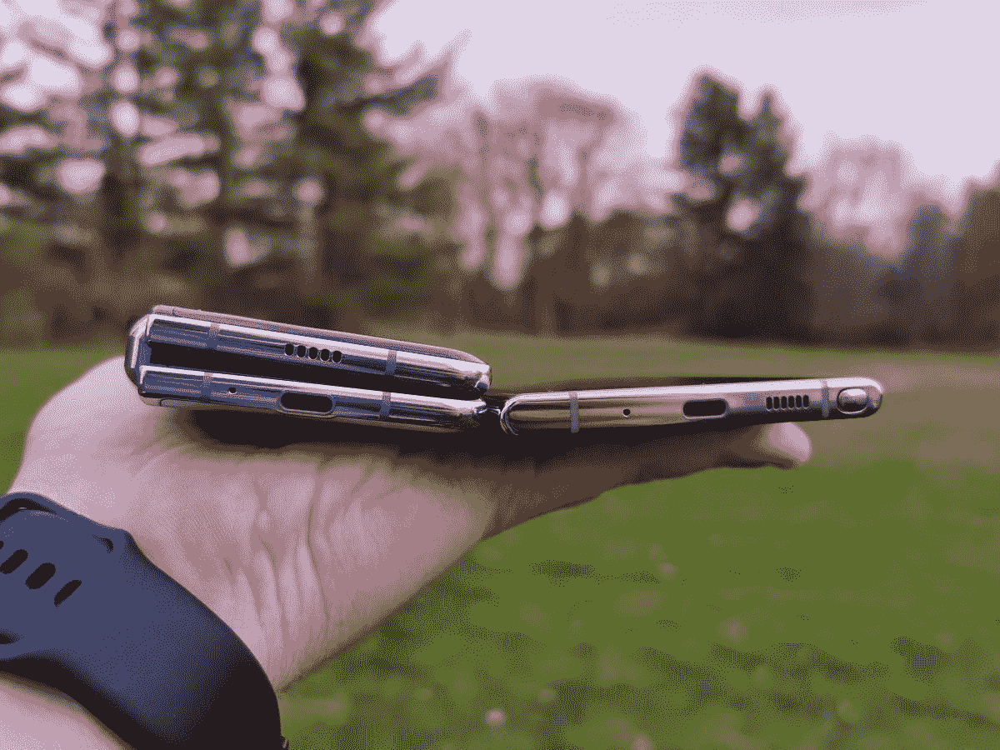
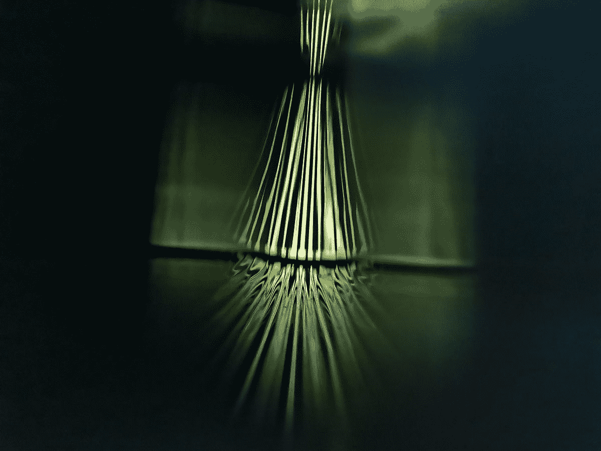
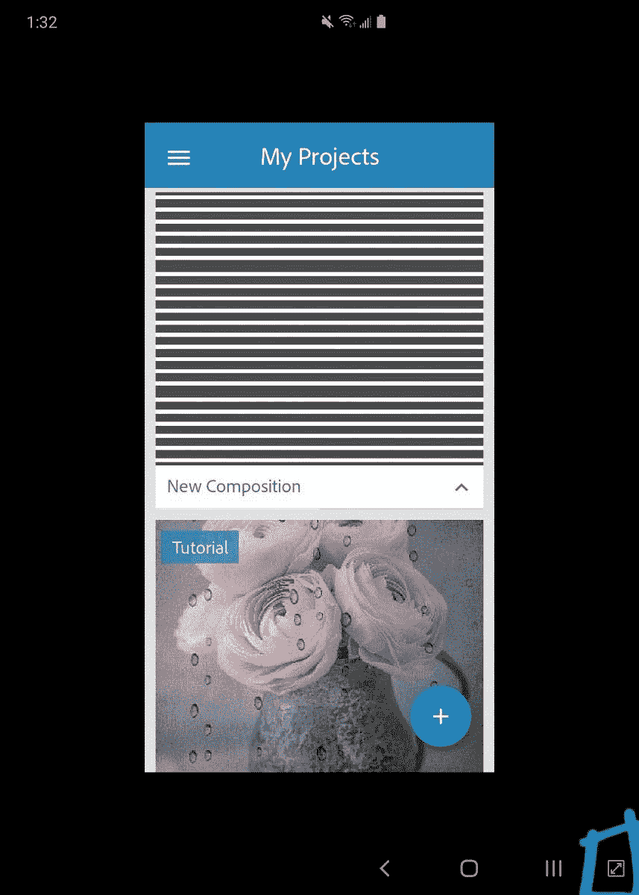

# 我已经使用 Galaxy Fold 一个月了:是啊，这就是未来

> 原文：<https://www.xda-developers.com/samsung-galaxy-fold-for-a-month/>

无法回避的事实是，三星 Galaxy Fold 是一款备受争议的设备。自发布以来，在动荡不安的过程中，这款手机受到了相当多的批评。鉴于这款设备如此彻底地背离了传统的外形，这种怀疑不仅是意料之中的，甚至可能是健康的。然而与此同时，许多评论才刚刚出炉，对其成败的评判尚未完全确定。

几年来，我一直非常喜欢手机。一开始我真的只关心规格。老实说，这很快就变得无聊了。所以在过去的一年多时间里，我对独特有趣的手机更感兴趣。我用过的最有趣、最令人兴奋、最酷的手机是三星 Galaxy Fold。

**[银河叠 XDA 论坛](https://forum.xda-developers.com/galaxy-fold)**

在深入研究细节之前，我想先声明一下，我认为这个价格是值得的。我知道许多读者会不同意，但我希望在这篇社论的结尾阐明我的理由。事实是，使用 Galaxy Fold 不同于使用任何其他手机。它比大多数现代手机更厚、更重、更精致、更脆弱。这并不意味着你需要呵护它，但你也不能滥用它，我们已经下意识地越来越依赖现代旗舰机现在提供的令人尊敬的耐用性。Galaxy Fold 非常特殊，观看视频和图片，甚至阅读评论，都无法让你接近使用手机是什么样子的想法。

|  | **三星 Galaxy Fold** |
| 显示方式 | 主显示屏:7.3 英寸 QXGA+动态 AMOLED 显示屏(4.2:3) Infinity Flex 显示屏，2152x1536，362 PPI 显示屏:4.6 英寸高清+ Super AMOLED 显示屏(21:9)，1680x720，399ppi |
| 大小 | 折叠后:62.8 x 160.9 x 15.7mm 毫米~ 17.1 毫米折叠后:117.9 x 160.9 x 6.9mm 毫米~ 7.6 毫米重量:276 克 |
| 显示调色板 | 仅限 HDR10+主显示器 |
| 片上系统 | 骁龙 855 |
| RAM 容量 | 12GB (LPDDR4X) |
| 存储容量 | 512GB UFS 3.0 |
| 扬声器系统 | 

*   立体声扬声器和耳机:AKG 的声音
*   采用杜比 Atmos 技术的环绕声

 |
| 耳机插孔 | 

*   不
*   三星 Galaxy Buds in the box

 |
| 前置摄像头 | 折叠:10MP 2PD AF f 2.2(80°)展开:10MP 2PD AF f 2.2(80°)+800 MP 深度相机 |
| 后置摄像头 | 三摄像机

*   超宽:16MP F2.2 (123)
*   广角:12MP 2PD 自动对焦 F1.5/F2.4 OIS (77)
*   长焦:12MP F2.4 OIS (45)

 |
| 蓄电池容量 | 4380 毫安时(典型)双电池 |
| 无线充电 | 是的，快速无线充电 2.0，无线电源共享 5W |
| 快速充电 | 

*   有，三星自适应快充，15W PD
*   盒子里的自适应快速充电器

 |
| 生物测定学 | 电容式侧面指纹扫描仪 |
| 防水防尘 | 没有人 |
| 软件 | 一个 UI 的 Android 9 Pie |

*关于本文:三星没有提供这款设备进行审查。我自己买的自用的。*

在任何其他评论或实践文章中，这一部分通常是关于手机的设计，即颜色、美学和尺寸。当谈到可折叠手机，尤其是第一款真正的可折叠手机时，诸如此类的东西并不重要。我知道人们想知道我对它的看法，所以让我快速浏览一下。

它的正面和背面都有玻璃，向下倾斜到铝轨中。铰链由不锈钢制成，感觉非常高级。它在手机折叠时可以在侧面看到，侧面完全平坦，向下倾斜到前后面板。我有一个银色的模型，它有一个镜面光洁度，在直射强光下有非常微妙的变色效果。

让我们来看看让折叠变得如此有趣的关键区别组件:铰链。它由不锈钢制成，折叠时可以在手机侧面看到。它的侧面完全是平的，向下倾斜进入前后面板。在电话的铰链和面板之间有非常小的间隙。这是为了让铰链平稳地打开和关闭，但确实会让水或灰尘进入体内。

 <picture></picture> 

Note 10+ vs Galaxy Fold Thickness

最重要的是可折叠显示屏的设计，简单来说，*它如何*折叠。Galaxy Fold 拥有我认为最好的可折叠设计，至少就我们在塑料可折叠显示器时代的地位而言。

手机机身由玻璃和铝制成，而主显示屏是塑料的。当手机折叠时，显示屏受到保护。当它展开时，你必须保护显示器。面板在关闭时非常安全，因为手机之间的间隙不足以容纳任何东西，三星增加的额外盖子解决了一些早期报道的颗粒进入问题。沙子和小鹅卵石当然可以塞进缝隙，但这就是缝隙的本质。

在手机的另一半，你有~~耳机插孔~~ USB C 端口。在手机右/下半部分，你有指纹扫描仪，电源按钮/Bixby 按钮和音量摇杆。与 Galaxy S10e 不同的是，电源键和指纹扫描仪也不同。起初，我不喜欢这样，因为感觉很奇怪。随着我越来越多地使用 Fold，我真的开始喜欢它，因为它的尺寸很容易在拿着手机时不小心碰到按钮。只有在显示器打开时指纹扫描仪才打开，这很好。它还有一个滑动按钮来拉下通知阴影的选项，但我还是没有打开它，因为我总是不小心碰到它。

话虽如此，我们还得谈谈显示器的耐用性。这是可折叠显示器的主要“缺点”。显示屏由塑料制成，这并不是最佳选择，但目前还没有可供消费者使用的可折叠玻璃。担心的是会有很深的划痕、凹痕，或者如果你按得太用力，可能会压碎显示屏。你知道吗，这是真的。这两种情况都有可能发生。问题是，他们可能不会。

 <picture></picture> 

Looking through the gap of the Galaxy Fold while folded

如果要出现很深的划痕，你需要在显示屏上撒沙子。这种情况会故意发生吗？可能不会，但外出时，散落的硬颗粒可能会找到它们在显示器上或口袋里的路径。对于凹痕，你需要用你的指甲用力压下去。这就是 Jerry Rig Everything 的 Zach 在他臭名昭著的耐久性视频中所做的事情。您是否曾经用力将指甲拖过显示屏，导致显示屏永久凹陷？不，很可能不是，至少不是故意的。我不能说我曾经在任何手机上这样做过，当然我也不会在折叠时这样做。压坏显示器怎么办？你不能给显示屏施加过大的压力，所以在合上显示屏时，你不能按下屏幕的中间。这样做很可能会随着时间的推移而损坏显示器。三星也会提醒你，所以只要你注意盒子里的文件，你就会没事的。比如说，当手机藏在垫子或床单下时，不小心坐在或躺在手机上也有可能产生压力。在弃牌的情况下，你必须稍微小心一点，注意这种情况。

说一下 ingress 也很重要。Galaxy Fold 的防护等级不是 IP68。星系褶皱会因接触沙子或水而受损。由于设计限制，三星无法将铰链完全密封在手机机身中。如果下雨，你就不能把手机拿出来。如果下雪了，你得把它包好。如果你在海边，你最好把它放在你的车里，因为你不想铰链里有沙子。这些情况都是基于沙子和水，因为这是你要担心的主要问题，否则，它会持续到大多数人的朝九晚五的工作时间。

## 软件:一个用户界面，但它可以折叠

我不想重新审查一个 UI，因为它实在不值得。我有一个[完整的用户界面评论](https://www.xda-developers.com/samsung-one-ui-review-android-pie-galaxy-s9-galaxy-note-9/)你可以去看看这个软件。Galaxy Fold 拥有相同的基本 One UI 软件和体验。与其再重复一遍一个 UI，不如让我们来谈谈 Galaxy Fold 上的软件是如何工作的，因为它显然不会与 Galaxy Note 10 这样的设备相同，对吗？

嗯，其实很相似，也很直观。基础软件是一样的。您可以在正面屏幕和主屏幕上访问所有应用程序。当你在正面屏幕上时，手机认为它是一部手机。当你打开它时，折叠认为它是一个平板电脑。这可能有点令人困惑，所以让我给你举个例子。当你关闭 Galaxy Fold 并打开 Samsung Music 时，它会显示“无需解锁手机即可控制音乐”没什么好犹豫的，对吧？嗯，当你打开 Galaxy Fold 时，它会显示“无需解锁平板电脑即可控制音乐”这只是一个词的区别，但却充分说明了软件体验。

大多数 Android 平板电脑上的软件绝对糟糕，因为大多数开发者不会为 Android 平板电脑设计他们的应用程序，特别是因为这些应用程序的销量很糟糕。这是公平的，我们不应该期望开发者为不会经常使用的设备开发应用程序。大多数人会认为可折叠产品和平板电脑有着相同的基本原则:如果它们卖不出去，为什么还要为它们开发呢？三星知道这将是一个问题，所以他们让开发者更容易为 Galaxy Fold 开发。他们还与数百名应用程序开发人员合作，为开箱即用的应用程序连续性添加了 Galaxy Fold 支持。三星表示，谷歌 Play 商店和银河商店的数百款应用已经支持应用连续性。我完全看得出来。在我的 Galaxy Fold 上安装的 131 个应用程序中，只有 8 个不支持连续性。对于这 8 个应用程序，你只需点击导航栏中的调整大小按钮，它就会将应用程序重新加载到更大的屏幕上。甚至一些很久没更新的 app 也支持。我不确定三星到底在搞什么类型的黑魔法，但是这么好这么快。感觉就是完整的成品软件。

 <picture></picture> 

Adobe Photoshop Mix doesn't have continuity

应用程序的连续性是三星正在大力推广的一项非常棒的功能。说“哦，是的，Fold 有应用程序的连续性，这很好”并不能真正告诉你关于它的任何事情。让我给你举一个我每天都在使用的实际例子。正如你所料，我收到了很多邮件，为了快速检查一封，不值得打开主显示屏。所以我可以在前面通读它们，选择我想阅读和回复的邮件。我打开前面显示屏上的电子邮件，意识到，“*伙计，这真的很小*”我所要做的就是打开更大的显示屏，我就在同一个地方，用同样的信息准备工作。它也是无缝的，中间没有加载或笨拙的转换。

除了应用程序的连续性，真的没有具体的功能。相机和用户界面都没有什么新的东西。它有一个 UI 1.5，这意味着你的微软手机已经预装，它有那些花哨的实时对焦相机和 AR 涂鸦模式。那是认真的。不过，这并不是一件坏事。它拥有你所需要的一切设置，甚至更多。作为 Android 皮肤的一个用户界面做得非常好，它真的不需要更多的折叠。三星在软件上做得非常好。

## 摄像头:显示屏越大越好

这款手机的摄像头本质上和 Galaxy Note 10+一样。我强烈推荐你去看看[上关于](https://www.xda-developers.com/samsung-galaxy-note-10-review/)的相机部分。如果你不想去看那篇评论并阅读整个部分，这里有一个很好地描述这款相机的小广告。

之前的三星手机的摄像头都有问题。这不是关于质量或实际的硬件问题，而是关于色彩科学。三星的颜色通常比较冷，饱和度调高到 11。这使得自动模式下直接从快门中出来的照片非常适合 Instagram 之类的东西。如果你想要更真实的生活照片，虽然，这不是真的很好。随着 Galaxy Note 10+的推出，三星改变了一些事情。照片没有以前那么饱和了。不要误会我的意思，它们仍然不是完全真实的，但它比早期的设备好得多。

你可能想自己看一些照片，所以这里有一些我用我的文件夹的后置摄像头拍的照片。你可以点击下面的链接查看完整的谷歌相册。

**[银河折叠相册](https://photos.app.goo.gl/Ze31VYqvpGEpBV1t9)**

照片样本不会显示的是折叠对于拍照来说有多好。与用 iPads 拍照的怪物不同，Galaxy Fold 并不令人讨厌。**大屏幕实际上非常适合拍照**。每张照片在取景器上都很好看，这让拍照变得有趣。使用较小的显示器，图片还可以。照片是真正的主要展示任务。

## 经验:你不能想象，直到你使用它

评论中的“体验”部分是我通常不会做的。大多数人都知道使用电话是什么样的。这是一个金属和玻璃板，明亮的灯光快速移动。你可能正在用一部手机阅读这篇文章，你可能知道使用一部普通的旧手机是什么感觉。我可以给你一个 Pixel 4 XL 或 Redmi Go，它们基本上是相同的体验。当然，在相机、软件、速度或其他方面存在差异，但 Galaxy Fold 是一种全新的东西。

关闭时，感觉很好。很重，但是很重。我的银河折叠有一点点吱吱作响的铰链。三星表示，这是正常的，因为随着时间的推移，铰链会松动。如果它变得太烦人，你可以很容易地把折叠带到服务中心，他们可以为你拧紧铰链。最初松动的原因是为了防止折断。wiggle 显然使它保持松弛，并让它折叠这 200，000 次。

在展开时，它感觉非常薄，甚至比大多数旗舰手机都薄。实际上，展开使用感觉很棒，这是理所应当的。重量分布均衡得惊人，分布均匀，所以不会觉得很重。问题是，它并不完全平坦，但屏幕之间有 2 度的偏移。它几乎是平的，在大多数情况下几乎不可能分辨出它不是，但是如果你仔细看，你可以看到它。在拥有它的头两三个星期里，我的钱包瘪了。将近一个月之后，它比我拆封的时候更平了。

即便如此，用户体验也绝对令人惊叹。它不像使用任何其他手机或平板电脑:平板电脑的尺寸实际上非常好，长宽比也很好。这使得查看 Reddit、Twitter、Gmail 或任何其他应用程序变得更加有趣。一切都是更大的，正如他们所说，越大越好。

三星没有告诉你的另一件事是，当它没有完全折叠或展开时，你可以使用它。你可以以 90 度角使用折叠，这可能看起来不舒服，事实也确实如此。在 135 度左右使用手机实际上是非常棒的。它让你感觉像是在看书。它不会看起来最好，因为显示器的颜色和亮度有一些差异，但它仍然可以工作。

折叠手机也很神奇。你无法用语言来描述手机与平板电脑合二为一的感觉。这是一种令人满足的感觉。打开和关闭它激起了每个人的兴趣，不管他们使用什么手机。还是那句话，很难用语言描述。这是一种你需要亲自尝试才能真正理解这种体验有多奇妙的设备。

## 结论:未来是珍贵的

当考虑 Galaxy Fold 时，你首先想到的可能是价格。它很贵，零售价为 1980 美元，但实际上，你最终会花更多的钱。这是因为两个原因。第一，因为销售税的存在。我最后在百思买花了 2150.76 美元买了我的。第二个原因其实是因为可用性。如果你真的想得到这款手机，你必须从易贝或 [Swappa](http://swapp.com) 等网站购买。他们目前在世界各地销售一空，库存补充非常缓慢。正如经济学的基本原理所说，高需求下的低库存意味着更高的价格。

价格不是一个大问题，即使它是一个巨大的价格。虽然与现代旗舰手机相比，这款手机太贵了，但它并不意味着要争夺同样的客户，因为它自成一类:一种改变范式的奢侈品。这是一种针对非常特殊的细分市场的产品，这些细分市场愿意支付额外的费用成为第一。这并不是说它不应该被所有人拥有，因为它很豪华或什么的，而是因为它是第一代涉足新产品类别的产品，目前受到首次采用者的追捧。

对我来说，Galaxy Fold 非常值得这个价格。是的，2000 美元是一大笔钱。这比任何人花在普通手机上的钱都要多。幸运的是，银河系折叠不止于此。是奢侈品，款式和功能都有。当你走进一个房间，每个人都想知道你有什么设备。当你四处走动时，拿着它看起来很时尚。它的功能也是市场上其他手机所没有的，因为它是一个真正的平板电脑，可以放在你的口袋里。在 Android 领域，我想不出比这更时尚、更实用的东西了，尤其是这款设计精良的产品。像这样的东西不会便宜，至少现在不会，所以对于一个新产品类别中的奢侈品的起始价格来说，这个价格是合适的。

**[银河叠 XDA 论坛](https://forum.xda-developers.com/galaxy-fold)**

最终，像银河折叠这样的东西，很难改变任何人的想法。相信我，我不想。我只是想说，用了 5 周左右，这是我用过的最喜欢的手机。没有像 Galaxy Fold 这样的手机或体验。Fold 让我对未来的可折叠产品感到兴奋，因为在使用它之后，我坚信可折叠产品将成为移动计算的未来。

在不太可能的情况下，你会有兴趣捡起银河折叠，这并不容易。它仅在全球特定运营商和三星商店的店内提供。在美国，你只能在特定的美国电话电报公司和百思买商店以及三家三星体验店购买 Galaxy Fold。如果你有兴趣，我推荐你去当地的三星网站看看。这确实因地区而异。