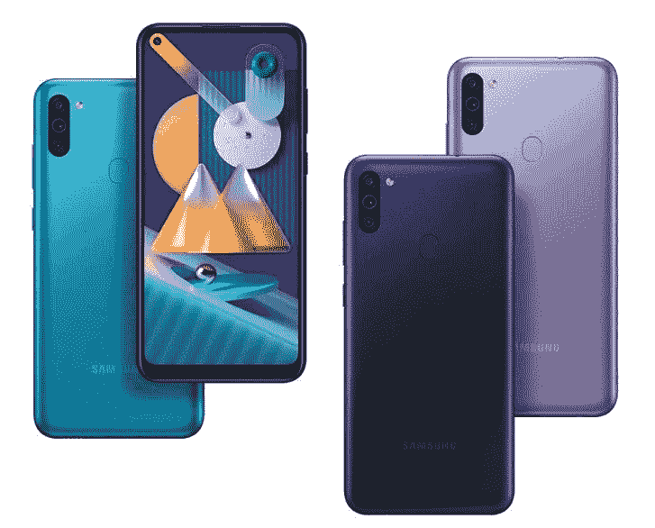

# 三星 Galaxy M11 和 Galaxy M01 入门级智能手机在印度上市

> 原文：<https://www.xda-developers.com/samsung-galaxy-m01-galaxy-m11-india-launch/>

三星去年在印度推出了仅在线的 Galaxy M 系列，以重振其在智能手机市场的廉价和低端市场的努力，这些市场有被小米和 Realme 的设备占领的危险。首批推出的手机是 Galaxy M20 和 Galaxy M10 T1。在这一年中，Galaxy M30、Galaxy M40 和 Galaxy M30s 紧随其后。2020 年，到目前为止，三星分别推出了 [Galaxy M31](https://www.xda-developers.com/samsung-galaxy-m31-hands-on/) 和 Galaxy M21，刷新了 [Galaxy M30s](https://www.xda-developers.com/samsung-galaxy-m30s-galaxy-a50s-review-comparison/) 和 Galaxy M20。现在，该公司已经在印度推出了 Galaxy M11 和 Galaxy M01。Galaxy M11 于今年早些时候在阿联酋发布，而 Galaxy M01 是 M 系列产品组合的[新成员。](https://news.samsung.com/in/samsung-launches-galaxy-m11-galaxy-m01-two-new-m-series-smartphones-in-sub-inr-15k-segment-in-india)

## 三星 Galaxy M01 和 Galaxy M11 -规格

| 

**规格**

 | 

**三星 Galaxy M11**

 | 

**三星 Galaxy M01**

 |
| --- | --- | --- |
| **尺寸&重量** | 

*   161.4 x 76.3 x 9.0 毫米
*   197 克

 | 

*   147.5 x 70.9 x 9.8 毫米
*   168 克

 |
| **显示** | 

*   6.4 英寸高清+ IPS 液晶屏，Infinity-U
*   1560x720 像素，267 PPI
*   19.5:9 宽高比

 | 

*   5.71 英寸高清+ IPS 液晶屏，Infinity-V
*   1560x720 像素，295 PPI
*   19.5:9 宽高比

 |
| **SoC** | 

*   高通骁龙 450:
    *   8 个 ARM Cortex-A53 内核，2.3GHz
*   Adreno 506 GPU

 | 

*   高通骁龙 439:
    *   4 个 ARM Cortex-A53 内核，2.2GHz
    *   4 个 ARM Cortex-A53 内核，1.7GHz
*   Adreno 505 GPU

 |
| **风筒&储存** | 

*   3GB + 32GB
*   4GB + 64GB
*   高达 512GB 的专用 microSD 卡插槽

 | 

*   3GB + 32GB
*   高达 512GB 的专用 microSD 卡插槽

 |
| **电池** | 

*   5000 毫安时
*   15W 快速充电

 |  |
| **指纹传感器** | 背装式指纹传感器 | 没有指纹传感器 |
| **后置摄像头** | 

*   1300 万像素主传感器，f/1.8
*   5MP 超广角传感器，
*   2MP 深度传感器，f/2.4

 | 

*   1300 万像素主传感器，f/2.2
*   2MP 深度传感器，f/2.4

 |
| **前置摄像头** |  |  |
| **音频** |  |  |
| **连通性** | 

*   无线保真
*   蓝牙
*   双 SIM 卡插槽
*   全球导航卫星系统
*   USB 类端口

 | 

*   无线保真
*   蓝牙
*   双 SIM 卡插槽
*   全球导航卫星系统
*   microUSB 端口

 |
| **安卓版本** | Android 10 之上的一个 UI 2.0 | Android 10 之上的一个 UI 2.0 |

Galaxy M01 和 Galaxy M11 是入门级手机，旨在与小米 Redmi 8、Realme C3、Redmi Note 7 Pro、Realme Narzo 10A 等竞争。他们的卖点是他们有小边框显示屏，因为 Galaxy M11 使用打孔显示屏，而 Galaxy M01 有水滴凹槽。M11 有三个后置摄像头，而 M01 则降至双摄像头。不幸的是，他们的其他规范并没有什么值得夸耀的。

*三星 Galaxy M01*

Galaxy M11 和 Galaxy M01 都是由旧 SOC 驱动的。Galaxy M01 的[骁龙 439](https://www.xda-developers.com/qualcomm-snapdragon-632-439-429-mobile-platforms/) SoC 于 2018 年推出，但它仅比旧的骁龙 430 略有增加。[骁龙 450](https://www.xda-developers.com/qualcomm-snapdragon-450-wear-fingerprint-sensors/) 早在 2017 年 6 月就已经推出，但它直到 2020 年 1 月才收到继任者的[骁龙 460](https://www.xda-developers.com/qualcomm-snapdragon-720g-662-460-navic/) 。骁龙 460 预计要到 2020 年底才会出现在手机中，因此骁龙 450 仍然是骁龙 400 系列的首选 SoC。争论的另一面是，联发科的 [Helio G70](https://www.xda-developers.com/mediatek-helio-g70-helio-g70t/) SoC，在 Realme C3 ( [gaming review](https://www.xda-developers.com/realme-c3-performance-gaming-review-mediatek-helio-g70/) )上找到，规格明显更好，由于拥有大 CPU 内核，用户体验也快得多。

 <picture></picture> 

Samsung Galaxy M11

Galaxy Mo1 还缺少指纹传感器，这令人失望。另一方面，Galaxy M11 确实设法以一种方式挽回了自己，它配备了 500 万像素的超广角摄像头，在不久前，这在这个价格点上还是一个不常见的功能。

### 定价和可用性

Galaxy M11 在印度的价格为 3GB 内存/32GB 存储版本的₹10,999 起价(约 146 美元)，而 4GB 内存/64GB 存储版本的价格为₹12,999.这款手机有黑色、金属蓝和紫色三种颜色。

**[从亚马逊购买三星 Galaxy M11](https://www.amazon.in/Samsung-Metallic-Storage-Additional-Exchange/dp/B086K9YCVN/?tag=xdaportalin-21)**

另一方面，Galaxy M01 是一款真正的入门级设备，因为它的单个 3GB RAM/32GB 存储版本的价格为₹8,999(约 120 美元)。这款手机有黑色、蓝色和红色三种颜色。

**[在亚马逊购买三星 Galaxy M01](https://www.amazon.in/Samsung-Galaxy-Storage-Additional-Exchange/dp/B086KCDGTQ/?tag=xdaportalin-21)**

Galaxy M11 和 Galaxy M01 现在都可以通过亚马逊、Flipkart、三星印度电子商店和其他主要电子零售商在印度购买。它们也将通过线下商店销售。

在价值主张方面，Galaxy M11 与 Realme Narzo 10 ( [评论](https://www.xda-developers.com/realme-narzo-10-realme-6i-review-pros-cons-mediatek-helio-g80/))和一岁的 Redmi Note 7 Pro ( [评论](https://www.xda-developers.com/xiaomi-redmi-note-7-pro-review/))等手机竞争，而入门级 Galaxy M01 与 Realme C3、Redmi 8A 和 Redmi 8 等手机竞争。我们再次看到一种模式，即三星仍然不愿意与小米和 Realme 在公平的竞争环境中竞争，因为这两家中国智能手机供应商在提供价值方面始终领先一步。与过去三星 J 系列手机相比，新款 Galaxy M 手机确实在价值上有了显著提高，过去三星 J 系列手机曾在 2019 年之前在这个价格段提供，但很明显，三星需要不断改进，才能在智能手机市场的这个竞争激烈的领域达到小米和 Realme 的高标准。