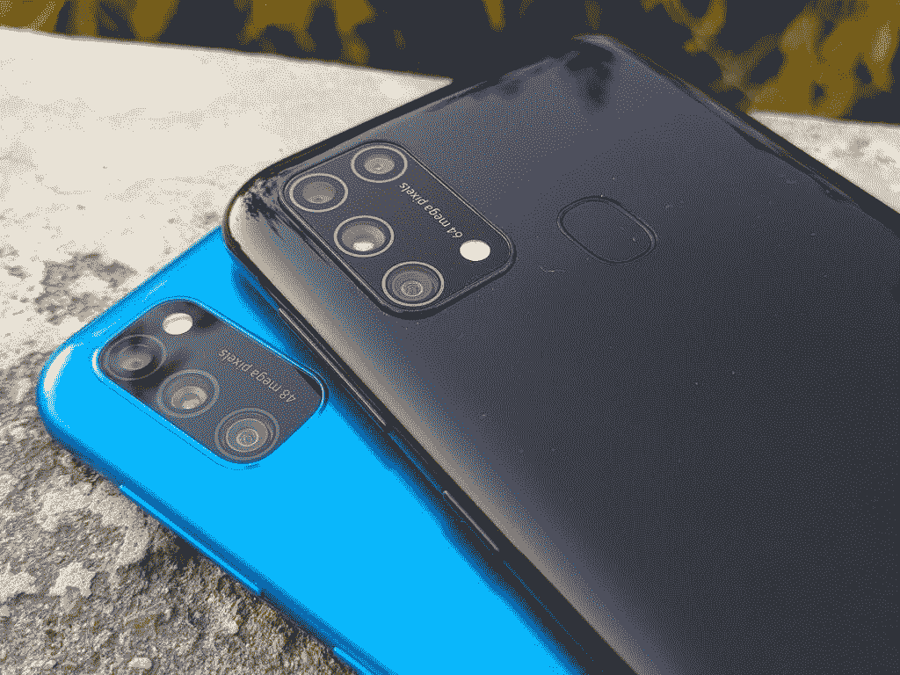

# Galaxy M31 实践:对三星廉价手机的小改进

> 原文：<https://www.xda-developers.com/samsung-galaxy-m31-hands-on/>

三星在印度推出的在线独家 Galaxy M 系列取得了巨大成功。早在 2 月份发布的 [Galaxy M30](https://www.xda-developers.com/samsung-galaxy-m30-india-launch-specifications/) 表现出色，在预算领域与 Redmi Note 7 Pro 和华硕 ZenFone Max Pro M2 等公司展开了激烈的竞争。六个月后，该公司[推出了 Galaxy M30s](https://www.xda-developers.com/samsung-galaxy-m30s-with-6000mah-battery-48mp-triple-cameras-galaxy-m10s-india/) ，带来了更多改进。现在，三星凭借一款名为 Galaxy M31 的新设备再次刷新阵容。

上个月在印度发布[，Galaxy M31 是一个迭代升级，内部结构与 Galaxy M30s 完全相同——比 M30 到 M30s 的升级还要小。那些最近购买了 Galaxy M30s 的人可能不会对这个时间感到满意，但他们不会错过这里的任何重要东西。](https://www.xda-developers.com/samsung-galaxy-m31-64mp-quad-camera-one-ui-2-android-10-launch-india/) 特别是 Galaxy M31 带来了四项关键变化，即新的主摄像头和前置摄像头，用于微距摄影的专用镜头，以及基础型号的额外 RAM。 这些升级让 Galaxy M 系列缩小了与竞争对手的差距，也为三星赢得了一些时间来开发真正的继任者，该继任者可能会在今年晚些时候到来。

我从上周开始使用这款设备，下面是我对三星 Galaxy M31 的第一印象。

*注:三星 Galaxy M31 审查单元是三星印度公司借给我们的。*

## 三星 Galaxy M31:规格

| 

规格

 | 

三星 Galaxy M31

 |
| --- | --- |
| **尺寸和重量** | 159.2 x 75.1 x 8.9mm191g |
| **显示&设计** | 

*   6.4 英寸 FHD+ (2280 x 1080) Super AMOLED，19:9
*   水滴凹口
*   康宁大猩猩玻璃 3(正面)

 |
| **SoC** | Exynos 9611:

*   4 个性能内核@ 2.3GHz 以上
*   4 倍效率内核@ 1.8GHz

Mali-G72 MP3 GPU |
| **RAM 和存储器** | 

*   6GB+64GB
*   6GB+128GB
*   UFS 2.1

可通过专用 microSD 卡插槽扩展 |
| **电池&充电** | 

*   6000 毫安时
*   USB 型
*   USB 2.0
*   15W 快速充电器(包含在包装盒内)

 |
| **软件** | 带有一个 UI Core 2.0 的 Android 10 |
| **摄像机** | 

*   64MP，f/1.8，主摄像头；0.8 米
*   8MP f/2.2，117 度超广角；1.12 米
*   500 万像素 f/2.4，1.12 米深度传感器
*   5MP 宏，f/2.2
*   32MP f/2.0 前置摄像头；0.8 米
*   4K@30fps(主相机)
*   240fps@高清 Sl0w-mo(主摄像头)

 |
| **音频** |  |
| **连通性** |  |

* * *

就设计而言，Galaxy M31 相当简单。为了保持可负担性，三星不得不偷工减料，这一点从全塑料产品中显而易见。与 Redmi 和 Realme 手机不同，Galaxy M31 在你拿着它的时候不会给你一种溢价感。这并不意味着这款设备感觉轻薄或廉价。它仍然是一款好看的设备，但要知道你得到的正是你所支付的——没有我们近年来从廉价手机中期待的惊喜因素。

从积极的一面来看，塑料结构使三星能够包装一个巨大的电池，而不会让设备感觉笨重。令人惊讶的是，尽管内置 6，000 毫安时电池，但它的手感却很轻。此外，塑料还应该避免耐用性问题。 背面有光泽——翻译:这是一个指纹磁铁。三星没有提供包装盒也没有让情况有任何好转。考虑到现在几乎每个原始设备制造商都会把他们的手机放在一个 TPU 盒子里，这有点令人失望。背面会在几秒钟内拾取污迹和指纹油脂，因此投资购买保护套是必须的。

 <picture></picture> 

Galaxy M30s on the bottom - Galaxy M31 on the top

电源键和音量键在右边，另一边托住 SIM 卡托盘。音量键放得有点高，尽管我的手很大，但我觉得够着它们有点不舒服。但它们确实提供了一个很好的点击声音，尽管是塑料的，也不觉得挑剔。 底部装有耳机插孔、扬声器护栅、USB C 口和麦克风。

在背面，我们注意到新的 64MP 主传感器和微距传感器与广角传感器、深度传感器和矩形相机模块内的 LED 闪光灯并排放置。微距摄像头的增加是 M31 和 M30s 之间唯一的视觉区别。即使这样，如果你不密切注意，也很容易把他们误认为双胞胎。

在正面，我们可以看到 6.4 英寸 Super AMOLED 面板，分辨率为 FHD+,具有水滴凹槽。作为 AMOLED 面板，色彩和对比度远远优于普通 LCD。然而，视角不是很好，并且当从离轴观看显示器时，可以观察到饱和度的损失。该显示器提供 420 尼特的峰值亮度，并且能够在自适应模式下获得额外的亮度，以获得更好的阳光清晰度。并排比较 Moto G8 Pro 的液晶面板，我们观察到 Galaxy M31 的面板更亮，在户外更容易阅读，尽管前者被认为在纸面上具有更高的峰值亮度。

显示器在默认的“鲜艳”模式下提供悦目的颜色，但您也可以选择针对 sRGB 色彩空间的“自然”模式。此外，您可以根据自己的喜好调整色温，并将其设置为冷、暖或中性。你还可以获得全系统的黑暗模式和蓝光过滤器，这使得晚上使用手机更容易。

Galaxy M31 由三星内部的 Exynos 9611 SoC 提供支持，在八核设置中采用了 4 个 ARM Cortex-A73 内核(2.31GHz)和 4 个 ARM Cortex-A53 内核(1.74GHz)。同样的 SoC 也可以在 Galaxy M30s、Galaxy A50 和 Galaxy A51 中找到。但这里的一个大变化是，与 Galaxy M30s 不同，三星现在在基础版本上为芯片组配备了 6GB 的 RAM，使其与竞争对手的手机不相上下。我们的审查单位是顶配 6GB 内存和 128GB 存储。

虽然该设备在日常使用中速度相当快，但我们在切换应用程序和打开多任务窗口时，不时会观察到明显的口吃和故障。 应用程序的打开动画也慢了一点，但这可以通过将开发人员设置中的动画速度提高到 0.5 倍来轻松解决。在很大程度上，性能相当可用，但我们希望三星在未来的更新中解决上述流动性问题。

这里的底线是 Galaxy M31 不是一款游戏手机。如果它要与 Poco X2 上的骁龙 730G 或红米 Note 8 Pro 上的联发科 Helio G90T 竞争，它将无法与之匹敌。但我们必须明白，这不是三星瞄准的受众。如果您的使用主要包括使用社交媒体应用程序、拍照、浏览互联网和休闲游戏，Galaxy M31 可能不会让您失望。只是不要指望它能在 max 显卡上运行几个小时的游戏。

相机部门是我们看到最大的升级。主要的 48MP 传感器已经被 64MP 传感器取代，现在有一个专用的 2MP 镜头用于微距摄影，使相机的总数达到 4 个。 就像 48MP 传感器一样，新的 64MP 相机也使用了 Quad Bayer a 传感器，将 6 个像素合并为 1 个像素，最终产生 16MP 的镜头。理论上，这应该意味着与 48MP 传感器相比，照片将保留更多细节，显示更好的动态范围，并在弱光下捕捉更多光线。

相机的用户界面经过深思熟虑，易于操作。 您可以在主屏幕上在相机、实时对焦和视频模式之间滑动，而其他相机模式，如夜间模式、专业模式、美食模式等，则集中在更多部分下。您甚至可以将这些模式从“更多”部分拖到底部托盘，以便于访问。

在日光下，Galaxy M31 拍摄的照片清晰，细节丰富。动态范围也很好，在高对比度的场景中，新传感器的改进非常明显。以下面的照片为例，注意当蓝天在星系 M30s 中被完全淹没时，星系 M31 是如何设法保护蓝天的。

在晚上，性能确实会受到轻微的影响，但是只要你被强烈的人工照明包围，照片确实会拍得很好，有足够的细节。

800 万像素广角镜头也能够在良好的光线条件下拍摄出精彩的照片，但它无法在弱光下留下深刻印象，产生的图像柔和，细节很少，动态范围缩小，颜色暗淡。

为了配合比赛，Galaxy M31 还拥有一个 5MP 微距镜头，用于超级特写镜头。它是一个固定焦距的传感器，所以保持主体在完美的焦距下是一个斗争，因为你不能通过点击屏幕来控制相机应该聚焦的确切位置，这经常导致失焦拍摄。但是当一切都对齐时，你可以捕捉到一些非常惊人的微小事物的照片。

在正面，我们现在有一个 32MP 的传感器，可以通过精确的肤色渲染生成细节丰富的自拍。与 Galaxy M30s 16MP 自拍相机相比，Galaxy M31 照片保留了更多细节，对比度和动态范围也更好，正如你在下面的照片中看到的那样。

Galaxy M31 运行 Android 10，上面有一个 UI Core 2.0。One UI Core 是三星在其高端中端和旗舰手机上提供的完整 One UI 体验的精简版。因此，它缺乏像内置屏幕记录器、Samsung Pay、安全文件夹和其他一些小功能。但是请放心，你不会错过任何重要的东西。所有重要的功能仍然存在，包括标准的 Android 10 功能，如全系统黑暗模式，新的导航手势，改进的带家长控制的数字福利工具，以及 One UI 2.0 的具体改进，如新的单手模式，重新设计的相机应用程序等等。

就像 MIUI 和 ColorOS 一样，One UI 也有相当份额的臃肿软件，从微软 Office 套件到常见的亚马逊、脸书、Snapchat 和一系列区域性应用。如果你不小心，在第一次设置手机时没有明确选择三星的建议，在设置手机时匆忙地继续点击下一步和继续，你会得到更多的应用和服务。

但在大多数情况下，One UI 使用起来很愉快，并在可定制性和易用性之间提供了完美的平衡。 有关 One UI 2.0 和整体软件体验的更多详细信息，请查看我们的 [Galaxy S10 Lite 评测](https://www.xda-developers.com/samsung-galaxy-s10-lite-review/)。

令人瞩目的 6，000 毫安时电池为所有设备供电，仍然是该领域最大的电池。盒子里的充电器只有 15W，但电池这么大，这是一个权衡，我会接受一个更小尺寸的电池。就充电速度而言，该设备需要超过 2 个半小时才能充满电。

底部的单声道扬声器音量很大，在峰值音量下不会出现太多失真。为了改善音质，当您通过蓝牙或有线耳机听音乐时，该设备还提供了杜比 Atmos 增强功能。 后置指纹扫描仪可以瞬间解锁手机，而面部解锁也非常快，即使在非常暗的光线下也能工作，尽管比平时慢一点。

### 结束语

Galaxy M31 可以被描述为 Galaxy M30s 的 Pro 版本。即使有，也没有多少重大改进。然而，只有当我们将 Galaxy M31 与 M30s 进行对比时，我们才会感到失望。就其本身而言，Galaxy M31 是一款完美的经济型智能手机，适合任何不是严肃游戏玩家的人。Galaxy M31 不仅是少数几款以这个价格提供 AMOLED 面板的设备之一，而且也是该领域唯一一款提供最大电池的设备。

谈到竞争，Galaxy M31 将与最近发布的 Realme 6 正面交锋，Realme 6 提供了更好的设计，90Hz 的显示屏和类似的相机套装。如果你能忽略相对较小的电池和液晶面板，Redmi Note 8 Pro 是另一个很好的选择，因为它与 Realme 6 具有相同的 SoC 和后置摄像头设置。

Galaxy M31 可能不会为你的钱提供绝对的帮助，但它仍然能够保持自己的价值。如果你能超越塑料构造和平均性能，Galaxy M31 有很多东西可以提供，从超长电池寿命和身临其境的显示屏到体面的摄像头和丰富的软件体验。

**从**购买三星 Galaxy M31:[三星印度](https://shop-links.co/link/?exclusive=1&publisher_slug=xda&article_name=Samsung+Galaxy+M31+Hands-on%3A+Incremental+Improvements+on+a+Great+Budget+Smartphone&article_url=https%3A%2F%2Fwww.xda-developers.com%2Fsamsung-galaxy-m31-hands-on%2F&u1=UUxdaUeUpU27582&url=https%3A%2F%2Fwww.samsung.com%2Fin%2Fsmartphones%2Fgalaxy-m%2F&ourl=https%3A%2F%2Fwww.samsung.com%2Fin%2Fsmartphones%2Fgalaxy-m31-m315f-6gb%2FSM-M315FZBDINS%2F) ||| [亚马逊印度](https://www.amazon.in/Samsung-Galaxy-Ocean-Blue-Storage/dp/B07HGJKDQL)