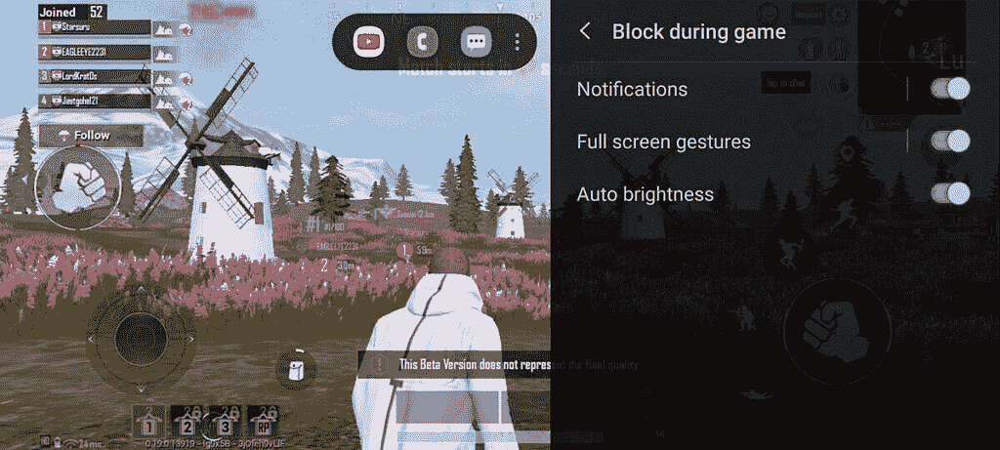

# 三星 Galaxy M31s 回顾:重复一个成功的公式

> 原文：<https://www.xda-developers.com/samsung-galaxy-m31s-review/>

三星 Galaxy M31s 于上个月末发布，作为 [Galaxy M31](https://www.xda-developers.com/samsung-galaxy-m31-64mp-quad-camera-one-ui-2-android-10-launch-india/) 的年中更新。如果你一直在跟踪，这些智能手机更新似乎以一致的速度出现，这表明三星希望保持中端产品系列的新鲜，以挫败任何竞争。这本身并不令人惊讶——[三星 Galaxy M30](https://www.xda-developers.com/samsung-galaxy-m30-india-launch-specifications/) 在一个非常拥挤的细分市场获得了相当大的关注，而 [Galaxy M30s](https://www.xda-developers.com/samsung-galaxy-m30s-with-6000mah-battery-48mp-triple-cameras-galaxy-m10s-india/) 凭借其价值主张真正吸引了人们的眼球。小米和 Realme 等中国智能手机原始设备制造商经常在这一领域占据主导地位，Galaxy M 系列似乎已经破解了让竞争对手保持警觉的密码。Galaxy M31s 能保持这种趋势吗？在这篇快速回顾中，我们将尝试找出 Galaxy M31s 到底发生了什么变化。

## 三星 Galaxy M31s:规格

| 

规格

 | 

三星 Galaxy M31s

 |
| --- | --- |
| **尺寸&重量** |  |
| **显示** | 

*   6.5 英寸 FHD+ sAMOLED
*   无限显示
*   峰值亮度:420 尼特

 |
| **SoC** | 三星 Exynos 9611

*   4x ARM Cortex-A73 @ 2.31GHz
*   4 个 ARM Cortex-A53 @ 1.74GHz
*   10 纳米

Mali G72 MP3 GPU |
| **闸板&存放** | 

*   6GB LPDDR4X + 128GB UFS 2.1
*   8GB + 128GB
*   专用 microSD 卡插槽

 |
| **电池&充电** | 

*   6000 毫安时
*   25W 快速充电
*   包装盒内包含 25W 快速充电器
*   反向有线充电(包装盒中包含 USB-C 至 USB-C 线)

 |
| **指纹传感器** | 侧装式指纹传感器 |
| **后置摄像头** | 

*   **主:** 64MP，f/1.8，索尼 IMX682
*   **次要:** 12MP 超宽，123 FoV
*   **第三级:** 5MP 深度传感器
*   **四进制:** 5MP 宏

 |
| **前置摄像头** | 32MP |
| **其他特性** |  |
| **安卓版本** | 搭载 OneUI 的 Android 10 |

*关于本次评测 **:** 三星 Galaxy M31s (8GB + 128GB)是三星印度借给我们的。此评论是在使用 7 天之后。三星在这篇文章中没有任何投入。*

* * *

## 三星 Galaxy M31s:设计、制造和展示

三星 Galaxy M31s 标志着三星迄今为止在其 M 系列产品中采用的设计语言的一次小升级。虽然这款设备的基本塑料外观和感觉与前代产品基本相同，但 Galaxy M31s 选择了背面的渐变颜色，这让这款设备有了自己的身份。我们收到的幻影黑色单元从顶部的银铬色开始，并在底部融合成黑色。chrome 颜色在相机上有点难以捕捉，中间的渐变比设备渲染的要平缓得多。背面也有光滑的表面。

该设备的中框、背板和按钮都是聚碳酸酯。很明显，三星使用聚碳酸酯来降低设备的成本，只要节省下来的成本能够惠及消费者，我们很大程度上对这一决定感到满意。此外，聚碳酸酯手机重量更轻，这意味着你不会真正注意到巨大的 6000 毫安时电池让你的手腕变得沉重。

三星 Galaxy M31s 最初并不觉得便宜，然而，在我短暂的使用过程中，我发现手机背面已经出现了小划痕。这些微划痕位于背部平坦表面的边缘(手机边缘有一丝弯曲)。如果手机在不到一周的使用时间内就能如此容易地被划伤，我对它在更长时间内的表现没有信心。我在使用类似建筑材料的 [Honor 20i](https://www.xda-developers.com/honor-20i-first-impressions-camera-versatility-early-mid-range/) 上也有过类似的经历，但玻璃背衬设备没有给我带来这个问题。光滑的表面也使 Galaxy M31s 成为指纹磁铁。此外，三星没有在 Galaxy M31s 的包装盒中包括任何外壳或盖子，所以我强烈建议为这款手机购买一个好的外壳。

在正面，显示屏从水滴凹槽到居中的打孔略有升级，三星将其称为 Infinity-O。实际上，我喜欢前置摄像头的这个位置，与朝向角落的打孔摄像头相对。由于这个位置，对内容的干扰很小，相机孔本身也足够小，不会使软件的美感不成比例。

三星 Galaxy M31s 正面也被 6.5”FHD+Super AMOLED 显示屏占据，非常不错。我唯一失望的是缺乏更高的刷新率——我们可以在印度这个价格段找到几款 90Hz 甚至 120Hz 刷新率的手机，所以三星真的需要考虑在这个部门进行升级。就可视性和其他显示质量而言，我对三星 Galaxy M31s 所提供的内容非常满意。三星的 AMOLEDs 是市场上的佼佼者，Galaxy M31s 也是如此。

如果你仔细观察，你会发现三星 Galaxy M31s 没有后置指纹传感器，因为传感器被移到了兼作电源按钮的一侧。三星本来可以选择内置指纹传感器，但速度和可靠性与传统的后置指纹传感器一样好，所以我没有抱怨。位置也很好，尽管手比较小的用户可能会喜欢把它放在更低的位置。所有按钮也点击良好。

Galaxy M31s 的底部有 3.5 毫米耳机插孔、USB Type-C 端口和扬声器孔。这一细分市场中的几款手机保留了 3.5 毫米耳机插孔，很高兴看到三星也保留了这一插孔。这款手机没有任何防水或防尘的官方声明，在这个价格范围内，这也不是一个罕见的疏忽。

背面的摄像头岛有轻微的凸起。它看起来与 Galaxy M31 上的相似，但传感器和 LED 闪光灯的位置不同。在相机岛上也看不到任何品牌，这使得三星 Galaxy M31s 的背面整体看起来很干净。

## 表演

三星 Galaxy M31s 配备了 Exynos 9611 SoC，采用了 4 个主频高达 2.3GHz 的 ARM Cortex-A73 内核和 4 个主频高达 1.7GHz 的 ARM Cortex-A53 内核。如果这种配置听起来很熟悉，那是因为三星已经推出了几款具有相同设置的设备，包括 Galaxy A50、Galaxy A51、Galaxy M30s 和 Galaxy M31。三星从 Galaxy M31 向 Galaxy M31s 提供的唯一“升级”是，后者标配 128GB 存储空间，并提供 8GB RAM 选项。

因此，我们在 Galaxy M31s 中测试 Exynos 9611 的基准性能没有什么意义。我们建议通读我们更长的 [Galaxy M30s 评测](https://www.xda-developers.com/samsung-galaxy-m30s-galaxy-a50s-review-comparison/)，因为初始基准测试结果表明，您将获得类似的性能，如果不是相同的话。

抛开基准不谈，Galaxy M31s 在日常任务中表现出色，正如人们对中端设备的预期。大多数用户不会注意到三星使用一年前的 SoC，而且这款手机在处理社交媒体浏览、互联网冲浪或休闲游戏等常规任务时通常没有问题。我在 Twitter 应用上经历了很多口吃和掉帧的情况，但这在 Twitter 上更多，在三星上更少。我注意到的一件事，也是 Kishan 在他的 Galaxy M31 快速评论中提到的，是手机上的大多数动画感觉太长太慢。这些动画应该提前半秒结束，让手机感觉更敏捷，反应更快。我建议在开发者选项中将动画速度提高到 0.5 倍，以消除这种有意的弹性。处理器能够跟上，所以我不知道为什么动画画得这么长。

Exynos 9611 在去年的 Galaxy M30s 上表现非常好，尤其是当你考虑到设备的价格以及它与相同 SoC 的 Galaxy A50s 之间的成本差异时。但自那以后，竞争继续向前推进，而三星却原地踏步。更不平衡的是，Galaxy M 系列每隔半年就会涨价，所以卓越的价值主张不再那么好了。因此，虽然 SoC 本身在当前适合其临时使用的受众，但价值追逐者和规格追逐者不会满意，因为你可以以更低的价格获得更好的性能和更好的规格表。此外，还有一个面向未来的问题:考虑到这款中端 SoC 已经推出一年了，Exynos 9611 在 2-3 年后还会配备齐全吗？这是只有时间才能回答的问题。

## 软件-基于 Android 10 的 One UI Core 2.1

三星 Galaxy M31s 运行在 Android 10 上，顶部有一个 UI Core 2.1，这是一个升级，因为其前身运行一个 UI Core 2.0。One UI Core 是三星旗舰产品上完整 One UI 体验的精简版，三星在其预算和较低的中档设备上提供这种“核心”版本。核心版本在 Samsung Pay 和 Secure Folder 等功能上表现不佳。你也失去了系统内置的屏幕录制器，尽管一个解决办法是将你想要屏幕录制的应用程序添加到三星游戏启动器，允许你在游戏中进行屏幕录制。

这是我 6 年多后的第一台三星设备，与姜饼时代的 Touchwiz 的可怕混乱相比，三星的软件已经成熟了多少，这让我感到惊喜。与 AOSP 相比，One UI Core 仍然感觉像一个定制的 ROM，具有一系列功能，从一堆永远在线的显示定制，到锁屏上的动画壁纸，到 Wi-Fi 和蓝牙控制的控制历史窗格，到更多的导航按钮选项。你也可以选择为手机设置一个关机时间表(不知道为什么，但如果你想的话，你可以这样做)，甚至可以选择让手机在连续 15 次输入错误的解锁码后自动清除。你还可以在不同的设备上播放一个应用程序中的媒体声音，这实际上让你可以从一个应用程序中播放音乐，同时让你在手机上播放其他内容。

在这个软件中还有很多需要探索的地方，但是一个 UI 核心所提供的全部功能已经超出了快速回顾的范围。不过，在这些设置中搜索是一个缓慢的过程，所以如果你想改变一些特定的设置，你最好记住设置的位置。

 <picture></picture> 

Game Launcher in One UI 2.1 Core lets you access favorite apps and record the screen while in a game

作为喜欢更多定制选项而不是准系统体验的人，一个 UI 核心是一个不错的体验。大多数用户，尤其是它的目标受众，应该对整体软件体验没有问题。如果您有其他三星配件，您也可以受益于更紧密的生态系统集成和更无缝的体验。

然而，我想提到的是膨胀和过度的软件货币化。在你设置手机的那一刻，一个用户界面核心试图悄悄地强迫你选择所有可选的额外功能和应用程序。

在上面的第一个截图中，你可以看到在设置过程中没有明显的方法来选择退出这些。但是如果你点击超链接，你会被带到第二页，在那里你可以取消选择这些选项。由 [Indus App Bazaar](https://www.xda-developers.com/interview-rakesh-deshmukh-indus-app-bazaar-hyper-localizing-mobile-apps-indic-language-support/) 支持的 Galaxy Apps Store 随后会提供一个预先选择的下载应用列表。即使你有意识地取消选择这些应用程序，你仍然会收到 Galaxy 应用程序商店下载的游戏，如 Candy Crush Saga，Solitaire Infinite 和 Infinite Differences。我重新确认了一个新的安装，没有真正的方法(我能找到)不把糖果粉碎传奇下载到手机上。

*更多偷偷摸摸的垃圾应用。请注意应用程序是如何在折叠视图中预先选择的。检查预装游戏的来源表明 Galaxy 商店是罪魁祸首。*

我们甚至还没有谈论那些受欢迎的、用户可能实际使用的预装应用程序——你可以发现亚马逊、脸书、Snapchat、网飞、亚马逊 Prime Video、Dailyhunt 和微软 Office 都预装了这些应用程序。“发现”标签是“发现”应用程序的另一个来源。奇怪的是，setup 上的一个设置是将未使用的应用程序置于深度睡眠状态，这样它们就不能向你发送通知了。如果你不马上给手机加载毫无意义的应用程序，你就不会真的需要这个功能——只是说说而已。

*全新安装的应用程序*

还会有更多的垃圾邮件向你袭来——预装的三星 Max VPN 应用程序会立即试图利用制造恐慌的通知来赚钱。即使您不同意 My Galaxy 应用程序的条款和条件以及隐私政策，您仍然会经常收到新闻报道和其他内容的通知。

诚然，一个 UI 核心上的货币化尝试和垃圾通知不像 MIUI 那样严重，但[它仍然存在](https://www.xda-developers.com/samsung-one-ui-2-5-add-lockscreen-ads-problem/)，需要加以强调。

我们向三星印度公司询问了该设备的软件支持。三星 Galaxy M31s 将更新到 Android 12，并将获得总共 4 年的安全更新(大约持续到 2024 年)。我们希望三星坚持这一承诺，因为 4 年安全更新承诺在这一领域是绝对闻所未闻的。三星还允许设备的引导程序轻松解锁，所以这也是一个优势。

## 照相机

三星 Galaxy M31s 在很大程度上保留了与其前代产品相同的相机设置，但有一些关键的变化。与 Galaxy M31 上的三星 ISOCELL GW1 传感器相比，现在的主要 64MP 传感器是索尼 IMX682。我们无法找到索尼这款新传感器的更多信息，除了缺乏 4K@60fps，因为 Galaxy M31s 最多只能记录 4K@30fps。超广角传感器也看到了 mp 计数的上升。

由于新冠肺炎的旅游警告，恶劣的天气条件和不规则的照明，我们没有太多的机会试用相机。因此，下面的 Flickr 图库中只有数量非常有限的相机样本。考虑到这是一款中档设备，我们希望看到许多与我们在该系列中看到的相同的特性:良好的日光性能和可接受的弱光性能。

Galaxy M31s 相机上最有趣的功能是软件添加。你现在得到了单镜头，这一功能是[银河 S20 系列](https://www.xda-developers.com/samsung-galaxy-s20-specs-features-pricing-availability/)的头条功能的一部分，并被正式带到了[银河 A51 和银河 A71](https://www.xda-developers.com/samsung-galaxy-a51-a71-updated-single-take-other-s20-series-features/) 。新的单次拍摄相机模式允许用户通过多种拍摄模式拍摄长达 10 秒的镜头，包括实时对焦、智能裁剪、视频和人工智能滤镜。对于有相机经验的用户来说，这个功能可能会觉得有点噱头。

但是对于缺乏经验的用户来说，当面对一个场景时，他们不确定自己真正想要点击什么，Single Take 将创意外包给了智能手机。你用一个单独的故意动作得到了各种各样的照片——所以如果你不确定你面前的场景在正常速度、加速、减速或作为回旋镖时是否会看起来最好；或者，如果从主相机、广角、使用滤镜或裁剪来看效果最好，单次拍摄可以让您将它们全部捕捉到一起并存储起来。您也可以使用前置摄像头进行单次拍摄。处理需要几秒钟，但没有重要到足以拒绝用户。由于这是一个可选功能，我可以肯定地看到一些内容创作者欣赏它的存在。然而，像 Single Take 这样的软件功能也可能被移植到它的前辈身上，尽管人们总是可以争论三星实际上有什么动机这样做。

## 三星 Galaxy M31s:电池寿命和充电

在我看来，三星 Galaxy M31s 最好的特点是电池。M30 系列以在可管理的空间内塞进大电池而闻名，Galaxy M31s 延续了这一传统，配备了一块 6000 毫安时的大电池。由于我的审查时间太短，无法确定我的使用案例中的电池寿命，我将 Galaxy M31s 放入 PCMark 的电池测试中，以计算出最低和最高分数，并给出用户可以预期的电池寿命的估计范围。

这项 PCMark 电池测试分两次进行。标记为“最小亮度”的运行将手机设置为最低显示亮度设置，并在持续时间内处于飞行模式。在这次测试中，Galaxy M31s 的屏幕打开时间接近 20 小时，这表明手机的显示屏和 CPU 在这么长的时间内都是打开的。第二次运行最大限度地提高了亮度，让手机保持正常的 Wi-Fi 连接，Galaxy M31s 在这次运行中获得了 12 小时的成绩。这是模拟标准化“真实世界使用”场景以给出电池寿命范围的最接近的方法之一，而您的个人体验将位于这两个极端之间。由于这两个极端都处于高端，因此很容易得出结论，Galaxy M31s 是普遍可用的传统智能手机中电池续航时间最好的手机之一。

三星 Galaxy M31s 不仅续航时间长，而且就其电池大小而言，充电也很快。使用附带的充电器(我们稍后会详细讨论)，您可以在第一个小时内每分钟充电 1%左右。请记住，电池也很结实，所以尽管百分比听起来可能不那么令人印象深刻，但你可以在 50 分钟内轻松获得 50%的电池，让手机持续你一个普通的一天。正如所料，一旦超过 80%，充电速度就会逐渐下降，因此充满电大约需要 1 小时 15 分钟。相比之下，Galaxy M31 需要两个半小时才能完全充电。

三星还因其兼容 USB PD PPS 3.0 的 25W 快速充电器( [TA800](https://shop-links.co/link/?exclusive=1&publisher_slug=xda&article_name=Samsung+Galaxy+M31s+Review%3A+Rehashing+a+successful+formula&article_url=https%3A%2F%2Fwww.xda-developers.com%2Fsamsung-galaxy-m31s-review%2F&u1=UUxdaUeUpU29422&url=https%3A%2F%2Fwww.samsung.com%2Fin%2Fmobile-accessories%2F25w-changer-ta800-ep-ta800xbngin%2F&ourl=https%3A%2F%2Fwww.samsung.com%2Fin%2Fmobile-accessories%2F25w-changer-ta800%2FEP-TA800XBNGIN%2F) )而获得主要支持[PDO:9V 时 2.77 a]；PPS: 3.0A (3.3-5.9V)或 2.25A (3.3-11.0V)]。这与三星在其几款旗舰产品中使用的充电器相同，例如[三星 Galaxy Note 20 Ultra](https://www.xda-developers.com/samsung-galaxy-note-20/) ，看到这款充电器出现在 Galaxy M31s 的盒子中绝对是一种享受。三星还在包装盒中包括一根 USB Type-C 到 USB Type-C 电缆(因为这是 TA800 充电器使用的电缆)，可用于对其他 USB Type-C 设备进行反向充电。随着越来越多的设备推出 USB Type-C，USB 供电充电器和 1 米长的 C-to-C 电缆应该也会在这款智能手机之外非常方便。最终结果是，包装盒中包含了一根令人惊讶的经得起未来考验的电缆和充电器。干得好，三星。

## 结束语

三星 Galaxy M31s 本身就是一款不错的手机，尽管它只是对其前身的一个小升级。三星已经凭借 Galaxy M30s 获得了金牌，因此他们在很大程度上坚持同样的模式是有道理的。更新换代的规模很小，而且只在少数领域，因此三星没有在 Galaxy M31s 上冒不必要的风险。这是好事还是坏事取决于你最看重智能手机的哪些方面。

三星 Galaxy M31s 拥有非常好的显示屏，令人愉快的相机和软件体验，以及出色的电池和充电能力。6GB + 128GB 型号的起价为₹19,499，8GB + 128GB 型号的起价为₹21,499，对于那些寻求这种功能组合的人来说，低价型号是更好的选择之一。

**[从亚马逊购买三星 Galaxy M31s](https://www.amazon.in/Test-Exclusive-712/dp/B07DJCJBB3/?tag=xdaportalin-21)**

但是，当你开始深入研究规格表并开始研究竞争对手时，你会发现其他几款手机提供了更好的整体价值。例如， [POCO X2](https://www.xda-developers.com/poco-x2-review-better-than-poco-f1/) 是一个优秀的整体选择，具有更好的构造，极具竞争力的 SoC，也很好的 120Hz LCD，索尼 IMX686 主摄像头，以及不错的电池寿命——所有这些都比可比的 6GB + 128GB 版本的₹18,499 价格更低。同样的价格也能让你买到[红米 Note 9 Pro Max](https://www.xda-developers.com/xiaomi-redmi-note-9-pro-max-snapdragon-720g-33w-fast-charging/) ，而稍微升到₹18,999 就能让你买到[realme 6 pro](https://www.xda-developers.com/realme-6-pro-review/)——这两者都是有竞争力的替代品。

也许三星 Galaxy M31s 最大的竞争对手是三星 Galaxy M31 本身。目前在亚马逊上的 [₹17,499 零售。对于类似的变体](https://www.amazon.in/Samsung-Galaxy-Ocean-128GB-Storage/dp/B07HGGYWL6/?tag=xdaportalin-21)，你不会失去很多东西(除了充电器，我认为)，尤其是当你考虑到三星的两款设备都带有相同的 SoC 时。Galaxy M31 更好的价值主张也是对三星的一个暗示——如果前任提供更好的价值，那么阵容就开始停滞不前了。我们希望这是我们最后一次在 M 系列上看到 Exynos 9611，也希望三星为 Galaxy M32 选择更具竞争力的 SoC。