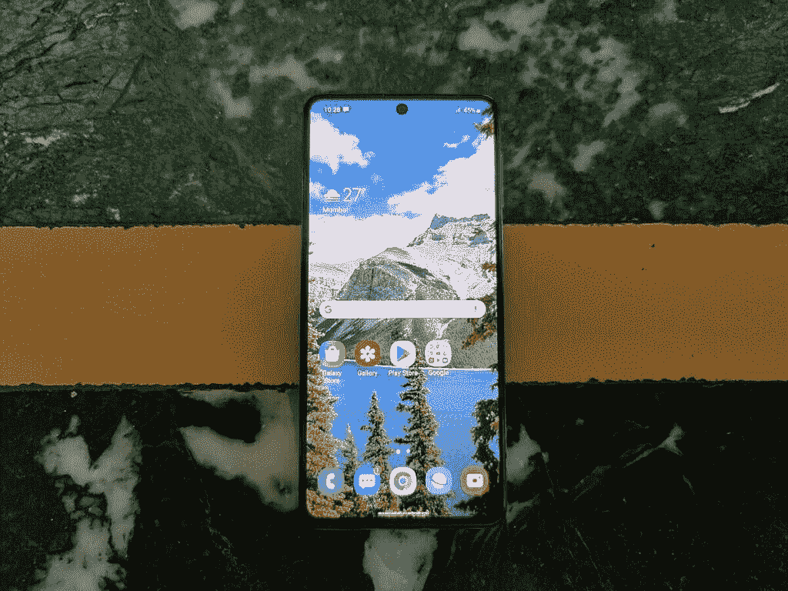

# 三星 Galaxy M51 评测——电池寿命的新标杆

> 原文：<https://www.xda-developers.com/samsung-galaxy-m51-review/>

不久前，三星在智能手机市场的预算、中低端和中高端领域向小米和 Realme 等中国智能手机供应商割让了大量土地。2017 年和 2018 年，该公司将印度头号智能手机供应商的地位输给了小米，此后一直没有夺回。预算 Galaxy J 系列和中端 Galaxy A 系列的竞争力不足以在拥挤的高价值产品世界中脱颖而出。因此，三星[在 2019 年](https://www.xda-developers.com/samsung-galaxy-j-renamed-galaxy-a/)重新设定了中端手机战略，推出了新的仅在线的 Galaxy M 系列和大幅升级的 Galaxy A 系列。像 [Galaxy M30](https://www.xda-developers.com/samsung-galaxy-m30-india-launch-specifications/) 这样的手机及其后继产品是有意义的进步，尽管它们仍然无法与价格更具侵略性的手机正面竞争。即使在 2020 年，Galaxy M 系列与小米和 Realme 的手机相比也存在价值赤字，但这并没有阻止三星在该系列的 USP 上翻倍:巨大的电池容量。 [Galaxy M20](https://www.xda-developers.com/samsung-galaxy-m20-m10-india-launch/) 和 Galaxy M30 拥有 5000 毫安时电池，而 [Galaxy M30s](https://www.xda-developers.com/samsung-galaxy-m30s-with-6000mah-battery-48mp-triple-cameras-galaxy-m10s-india/) 为中端市场带来了 6000 毫安时电池，由 [Galaxy M31](https://www.xda-developers.com/samsung-galaxy-m31-64mp-quad-camera-one-ui-2-android-10-launch-india/) 和 [Galaxy M31s](https://www.xda-developers.com/samsung-galaxy-m31s-exynos-9611-6000mah-battery-launched-india/) 继承。现在，新的[三星 Galaxy M51](https://www.xda-developers.com/samsung-galaxy-m51-launched-in-india-with-snapdragon-730g-and-a-7000mah-battery/) -旨在作为 M 系列的旗舰产品-带来了一个巨大的 7000 毫安时电池，这是中高档市场主流“品牌”手机的第一款。

**相关阅读:[三星 Galaxy M31s 回顾:老调重弹一个成功公式](https://www.xda-developers.com/samsung-galaxy-m31s-review/)**

Galaxy M51 在纸面上做出了正确的选择，配备了 6.7 英寸的 AMOLED 大显示屏，高通功能相当强大的骁龙 730G 片上系统，64MP 索尼 IMX682 主摄像头传感器，以及支持 25W 快速充电的 7,000mAh 电池。然而，它一方面必须应对众多竞争对手，包括[一加诺德](https://www.xda-developers.com/oneplus-nord-review/)、 [Realme X3](https://www.xda-developers.com/realme-x3-superzoom-review-an-actual-flagship-killer/) 、 [Realme X2 Pro](https://www.xda-developers.com/realme-x2-pro-xda-review/) 和 [Redmi K20 Pro](https://www.xda-developers.com/redmi-k20-pro-xiaomi-mi-9t-pro-review-flagship/) ，同时还要应对来自低价手机的压力，如 [POCO X2](https://www.xda-developers.com/poco-x2-review-better-than-poco-f1/) 、 [POCO X3](https://www.xda-developers.com/xiaomi-unveils-poco-x3-nfc-120hz-display-qualcomm-snapdragon-732g-64mp-quad-camera/) 和 [Realme 7 Pro](https://www.xda-developers.com/realme-7-realme-7-pro-launched-india/) 。它能在₹24,999 的起价(～341 美元)上脱颖而出吗，还是在这个竞争激烈的细分市场面临被淘汰的前景？让我们看看它在我们的评论中表现如何。

**[三星 Galaxy M51 XDA 论坛](https://forum.xda-developers.com/galaxy-m51)**

| 

规格

 | 

三星 Galaxy M51

 |
| --- | --- |
| **尺寸&重量** |  |
| **显示** |  |
| **SoC** | 高通骁龙 730G

*   2 个 ARM Cortex-A76 内核，主频为 2.2GHz
*   6 个 ARM Cortex-A55 内核，主频为 1.8GHz

Adreno 618 GPU |
| **风筒&储存** |  |
| **电池&充电** |  |
| **指纹传感器** | 侧装式指纹传感器 |
| **后置摄像头** |  |
| **前置摄像头** | 32MP，索尼 IMX616 传感器 |
| **安卓版本** | 带有一个 UI 2.1 的 Android 10 |

***关于本次评测* :** 三星印度给我们发来了三星 Galaxy M51 (SM-M515F)的 8GB RAM + 128GB 存储变体进行评测，我已经用了手机十天了。三星印度公司在这篇文章中没有投入。

* * *

## 三星 Galaxy M51:设计和显示

#### 设计

三星 Galaxy M51 的设计是一项工程壮举。

> 很长一段时间以来，电池容量为 5000 毫安时或更大的手机都有着笨重的名声。设备制造商继续将手机厚度作为不在手机中放置更大电池的理由。论点是，消费者更喜欢电池续航时间合理的更薄手机，而不是电池续航时间出色的更厚手机。厚度确实对人体工程学和手机可用性有着真正的影响，所以总的来说，行业在显示屏尺寸一直到 6.7 英寸的手机中确定了 4000 mah-4500 mah 电池的最佳位置。

像华硕 ROG 手机系列这样的手机只是证明了一点，如果你想要一个大电池容量(6,000mAh)，你必须以设备的厚度为代价。然而，三星通过 Galaxy M 系列解决了这个问题。尽管 Galaxy M30 系列的电池容量很大，但人们普遍认为它非常适合手持使用，这是通过在设备结构中使用塑料而不是玻璃和铝实现的。凭借 Galaxy M51，该公司达到了一个新的水平，因为它能够在手机尺寸中配备更大的电池，按照 2020 年的智能手机标准，这仍然是一部手机。

尽管拥有无与伦比的 7，000 毫安时电池，Galaxy M51 的手持可用性和人体工程学非常出色。正如预期的那样，这款手机比三星 Galaxy S20+等旗舰 6.7 英寸三星手机厚得多(9.5 毫米对 7.8 毫米)。不过，这款手机的重量令人惊讶地控制在 213 克。重量分布很好，比 OPPO Reno 10x Zoom ( [评测](https://www.xda-developers.com/oppo-reno-10x-zoom-review/))重三克，这是一款配有 4,000mAh 电池和机械弹出式前置摄像头的手机。通过使用久经考验的打孔前置摄像头，并使用 Glasstic(光滑塑料)作为构建材料，三星已经能够控制厚度和重量的传统问题。这是两年前我无法想象公司会做的事情。

Galaxy M51 的手持可用性和人体工程学非常棒。

> 当然，这种设计也有不利的一面。这款手机光滑的全塑料结构感觉不如玻璃背和铝制框架的手机那么高端，但我认为就电池寿命而言，对于我们获得的所有额外的不插电时间来说，这是一个可以接受的权衡。

除了令人钦佩的克制的重量和厚度，Galaxy M51 在设计上是一款典型的三星手机，有弯曲的背部，平坦的侧面和圆角。它的前面有一个居中的打孔前置摄像头。前挡板和打孔相机本身比 Galaxy S20+这样的旗舰要大，但仍然可以接受。在背面，长方形的摄像头外壳包含四个摄像头(64MP 主摄像头+ 12MP 超广角+ 5MP 微距+ 5MP 深度传感器)。这已经成为 2020 年三星手机的标准设计特征，谢天谢地，尽管有 1/1.7 英寸的主传感器，但摄像头的凸起很小。有一个 3.5 毫米耳机插孔，这是一个中端手机上受欢迎的景象。音量键和电源键放在手机右侧，指纹传感器与电源键集成在一起。都是标准的，这里不多批评。甚至颜色选项也有点无聊，因为你只能得到黑色或蓝色的手机。我得到了蓝色的变体，它看起来很好，但从美学角度来看，市场上有更好的选择。

Galaxy M51 没有防水的 IP 等级，这有点可惜。不出所料，它也没有无线充电功能。另一方面，它确实具有专用的 microSD 卡插槽，这意味着用户可以同时拥有两个 sim 卡和一个 microSD 卡插槽。

在盒子里，很高兴看到三星在盒子里捆绑了一个 25W 的 USB Type-C Power Delivery 3.0 快速充电器，这是它与 [Galaxy M31s](https://www.xda-developers.com/samsung-galaxy-m31s-review/) 甚至 [Galaxy Note 20 Ultra](https://www.xda-developers.com/samsung-galaxy-note-20/) 捆绑的同一款充电器。然而奇怪的是，盒子里没有箱子。三星也没有在显示器上应用工厂安装的屏幕保护器。

总体而言，Galaxy M51 的设计和制造质量相当不错。铝制框架会带来更好的耐用性和更好的手感，但也会增加重量。如果三星采用玻璃后盖甚至哑光塑料表面会更好，因为光滑的塑料确实会收集很多指纹。然而，对于价格来说，这种妥协是可以接受的，尤其是在考虑电池尺寸的时候。

总体而言，Galaxy M51 的设计和制造质量相当不错。铝制框架会带来更好的耐用性和更好的手感，但也会增加重量。如果三星采用玻璃后盖甚至哑光塑料表面会更好，因为光滑的塑料确实会收集很多指纹。然而，对于价格来说，这种妥协是可以接受的，尤其是在考虑电池尺寸的时候。

显示

#### Galaxy M51 的 6.7 英寸全高清+(2400 x 1080)20:9 Super amo led Plus 显示屏由大猩猩玻璃 3 保护，现在已经有四代之久了。看到三星不跟大猩猩玻璃 6 走很失望，更别说最新的[大猩猩玻璃 Victus](https://www.xda-developers.com/corning-gorilla-glass-victus-2m-drop-protection-double-scratch-resistance/) 了。这只不过是一个廉价削减成本的例子，这不是我可以得到的东西。显示器的刷新率为 60Hz，这意味着它错过了高刷新率的趋势。Realme 6 和 Realme 7 等 90Hz 显示屏的手机价格低至₹13,999，而 120Hz 显示屏的 POCO X2 价格为₹18,499.Galaxy M51 的 60Hz 面板远远落后于曲线，反映了三星的糟糕表现。没有高刷新率显示屏意味着现实世界的流畅度受到不利影响，这意味着即使有骁龙 730G SoC，Galaxy M51 也不会像前面提到的 Realme 和小米手机那样流畅。

另一方面，显示器本身的质量非常好。它有一个高亮度模式，这意味着阳光清晰度很好。“超级 AMOLED Plus”的命名并不意味着它有 RGB 矩阵，因为它仍然是钻石 PenTile。术语现在指的是具有更薄的面板。视角极佳(角度变化时可察觉的色彩偏移有限)，对比度是典型的 AMOLED-great，并且由于具有自动色彩管理功能，显示器具有根据 sRGB 和 DCI-P3 色域校准的自然色彩模式。

另一方面，显示器本身的质量非常好。它有一个高亮度模式，这意味着阳光清晰度很好。“超级 AMOLED Plus”的命名并不意味着它有 RGB 矩阵，因为它仍然是钻石 PenTile。术语现在指的是具有更薄的面板。视角极佳(角度变化时可察觉的色彩偏移有限)，对比度是典型的 AMOLED-great，并且由于具有自动色彩管理功能，显示器具有根据 sRGB 和 DCI-P3 色域校准的自然色彩模式。

* * *

表演

## 三星 Galaxy M51 由高通骁龙 730g SoC 驱动。这是继 Galaxy M40、Galaxy M01 和 Galaxy M11 之后，第四款采用骁龙 SoC 的 Galaxy M 系列手机。此前，三星仅在其中端 Galaxy A 系列手机(如 Galaxy A71)及其旗舰产品 Galaxy S 和 Galaxy Note 系列的地区版本中使用高端骁龙芯片。Exynos 9611 等中端 Exynos SoCs 在 CPU 性能方面甚至无法与高通骁龙 675 或骁龙 710 媲美，因为三星的芯片已经落后高通一段时间了。因此，这里的骁龙 730G 是 Exynos 9611 SoC 的一个重大进步，用于 Galaxy M30、 [Galaxy M30s](https://www.xda-developers.com/samsung-galaxy-m30s-galaxy-a50s-review-comparison/) 、 [Galaxy M31](https://www.xda-developers.com/samsung-galaxy-m31-hands-on/) 和 [Galaxy M31s](https://www.xda-developers.com/samsung-galaxy-m31s-review/) (是的，三星一直在多部手机中重复使用它)。它采用了两代更新的 ARM Cortex-A76 内核(尽管只有两个)，并且它还有一个更快的 GPU。

这里的问题是，你可以在比 Galaxy M51 便宜得多的手机中买到骁龙 730G 和它的更新版本骁龙 720G。例如，红米 note 9 pro/红米 Note 9S 的价格仅为₹13,999。POCO X2 ( [评测](https://www.xda-developers.com/poco-x2-review-better-than-poco-f1/))和 Realme 7 Pro 的售价比 Galaxy M51 更低。在 Galaxy M51 的价位上，你可以买到像一加诺德这样的手机，它具有更强大的骁龙 765G SoC。你还可以得到去年的 Redmi K20 Pro ( [评测](https://www.xda-developers.com/redmi-k20-pro-xiaomi-mi-9t-pro-review-flagship/))，它采用了一年前的旗舰骁龙 855 SoC。Realme X3 的价格也是一样的，它还配有一个 120 赫兹的液晶显示器。就性价比而言，Galaxy M51 远远落后于其竞争对手。然而，公平地说，没有人预计三星会与小米和 Realme 正面交锋，因为价值差距仍然太大。

出于某种原因，Galaxy M51 在大多数流行的基准测试中表现不佳。它的 Geekbench 5 分数低于其他骁龙 730G 驱动的设备。在速度计 2.0 中，得分(41.5)甚至落后于骁龙 845 手机，如一加 6T(得分 51.2)，也明显落后于骁龙 855 手机，如一加 7(得分 62.4)。我原本预计这款手机在 PCMark 中会有很好的表现，但即使在那里，分数也不算好，特别是在网络浏览 2.0 和写作 2.0 测试中。在 AndroBench 存储基准测试中，Galaxy M51 的顺序读取速度比其他 UFS 2.1 驱动的设备慢，尽管顺序读取、随机读取和随机写入速度都达到了标准。

在 GPU 性能方面，骁龙 730G 的 Adreno 618 GPU 比骁龙 675 的 Adreno 612 更上一层楼。尽管如此，它仍然落后于骁龙 765G 的 Adreno 620 GPU，更不用说骁龙 855 的 Adreno 640 GPU 了。在 3DMark 和 GFXBench 中，Galaxy M51 的得分和帧率再次低于其他骁龙 730G 设备。

我不知道三星使用的 DVFS 政策是否过于保守，或者是否有其他原因。Redmi K20 Pro 的基准测试结果在 CPU 性能和 GPU 性能方面都快得多。一加北部也遥遥领先。

然而，就真实世界的性能而言，Galaxy M51 在 60Hz 刷新率的手机中表现令人钦佩。是的，它永远不会像高刷新率显示屏的手机那样流畅，但同时，它也不会到处掉帧。与 Exynos 9810 驱动的 Galaxy Note 10 Lite ( [评论](https://www.xda-developers.com/samsung-galaxy-note-10-lite-review/))相比，Galaxy M51 的帧数要少得多，并且在整个 UI 和应用程序(如谷歌 Chrome)中明显更流畅。另一方面，与采用骁龙 855 处理器的 90Hz 的一加 7 Pro 相比，这款手机的流畅度落后了好几步。我不禁想知道，如果三星能够提供 90Hz 的面板，手机的流动性会有多好，但事实上，用户不会对现实世界的性能有太多抱怨。

这款手机的内存管理也相当不错。我使用不要杀死我的应用程序基准测试了后台应用程序杀死，它的分数是 100%，这是很好的结果。即使在实际使用手机时，除了 Android 的内存管理限制之外，我也没有遇到任何应用程序在后台被随机关闭以及无法接收通知的问题。

侧面安装的指纹传感器极其快捷。它比三星在其旗舰手机中使用的挑剔的超声波显示屏下指纹传感器精确得多。电源键的放置也是最优的。这是这款手机最好的一点，因为你不必像 Galaxy Note 10 Lite 那样处理缓慢的光学指纹传感器。

总体而言，Galaxy M51 在基准测试中的表现令人担忧，但它以不错的分数通过了真实世界的性能测试。就价格而言，用户不太可能抱怨速度和流畅度，即使更快更流畅的手机价格更低。缺乏高刷新率的显示器仍然是一个主要的缺陷。GPU 性能也中等，但现实世界的游戏性能不太可能受到影响，因为 Play Store 上的大多数 3D 游戏都可以在最低标准的设备上玩。

总体而言，Galaxy M51 在基准测试中的表现令人担忧，但它以不错的分数通过了真实世界的性能测试。就价格而言，用户不太可能抱怨速度和流畅度，即使更快更流畅的手机价格更低。缺乏高刷新率的显示器仍然是一个主要的缺陷。GPU 性能也中等，但现实世界的游戏性能不太可能受到影响，因为 Play Store 上的大多数 3D 游戏都可以在最低标准的设备上玩。

* * *

相机性能

## 由于印度新冠肺炎疫情正在进行的情况，我们放弃了对三星 Galaxy M51 的全面深入的相机审查。然而，我确实用这部手机拍了一些样品，可以在下面的画廊里看到。我将记录下一些关于相机质量的快速观察:

6400 万像素主摄像头在默认的 1600 万像素像素合并模式下，可以在日光下拍摄出良好的照片，具有足够的细节(即使三星仍在使用积极的降噪措施)，良好的曝光和巨大的动态范围。

*   全分辨率 6400 万像素的照片有很多亮度噪声，与 1600 万像素的面元图像相比没有任何细节改善。我不会为这个选项费心。
*   12MP 超广角相机以非常宽的视野拍摄可接受的照片，但细节水平确实下降，油画效果在全分辨率下普遍存在。
*   2 倍变焦的照片是数码变焦的，细节很差。我希望三星能够提供一个合适的长焦相机，而不是一个用途非常有限的微距相机。
*   不幸的是，室内照片缺乏细节和清晰度。降噪算法过于激进，因为它抹去了所有细节，同时留下了惊人的大量亮度噪声。使用夜间模式只会使情况变得更糟，因为最终的照片最好被描述为油画。
*   常规照片模式下的户外低光照片在细节方面还不错，但仍然有太多的亮度噪声和相对较暗的曝光。OIS 的缺乏让这里的人们感觉到了。夜间模式显著地使照片变亮，但是它的过度处理非常糟糕，以至于大多数照片根本没有留下任何细节。
*   60fps 的 4K 和 60fps 的 1080p 不支持视频录制。对于这个价位的一些人来说，缺乏 60fps 的 4K 可能是可以接受的，但缺乏 60fps 的 1080p 真的是一种耻辱。
*   在 4K 以每秒 30 帧的速度录制的视频和以每秒 30 帧的速度录制的 1080p 视频在日光下效果非常好。三星的 EIS 解决方案效果很好。
*   总的来说，对于一部标价为₹24,999.的手机来说，我不认为它的相机质量很好白天还好，总体还过得去，但本来可以好得多。在过去的一年里，三星在图像处理方面有所退步，特别是在夜间模式方面。
*   总的来说，对于一部标价为₹24,999.的手机来说，我不认为它的相机质量很好白天还好，总体还过得去，但本来可以好得多。在过去的一年里，三星在图像处理方面有所退步，特别是在夜间模式方面。

* * *

电池寿命和充电

## 如果没有 7000 毫安时电池的突出功能，三星 Galaxy M51 可能会成为一款容易被遗忘的中端手机，在强大的中端手机的海洋中消失。在这种情况下，规格*对*很重要——你不能指望极小的电池容量带来长时间的电池寿命，Pixel 4 用户会证明这一点。

一般来说，在所有其他因素保持不变的情况下，电池容量越大，电池寿命越长。过去三四年来，智能手机的电池寿命基本上停滞不前，因为设备制造商拒绝将电池容量提高到 4000-4500 毫安时以上。即使当它们达到 5,000mAh 时，电池寿命的增加也受到大而高刷新率显示器不断增加的功率要求、5G 的移动以及在某些情况下使用低效 SOC(如 Exynos 990)的反作用。然而，华硕 ROG Phone II 和 ROG Phone 3 ( [评论](https://www.xda-developers.com/asus-rog-phone-3-review/))确实证明，出色的电池寿命仍然是旗舰手机的一种可能。他们是如何做到的？用 6000 毫安的电池。

当然，Galaxy M51 不是一款旗舰手机。高通骁龙 730G SoC 的动力不如骁龙 855 和骁龙 865。SoC 的 8 纳米 LPP 制造工艺相对高效，尽管 TSMC 的 7 纳米 FinFET 可能是更好的制造选择。6.7 英寸 AMOLED 显示屏具有全高清+分辨率，避免了 QHD+的电力成本。当与 7，000 毫安时电池(最小容量为 6，800 毫安时)结合使用时，很明显，获得最佳电池续航时间的要素已经到位。

它能送货吗？**是的，的确是**。Galaxy M51 的电池寿命是我见过的智能手机中最好的。我拥有这款手机的时间有限，但已经很明显，耗尽电池是多么困难。在我的使用中，这款手机在**持续使用三天**，在**长达 13-15 个小时的开机时间**。(在一个 UI 2.1 内核中没有总不插电时间的屏幕打开时间统计，所以我使用 GSam 电池监控器来检查屏幕打开时间。)即使是最重的用户也不会有困难让手机坚持两天。在适度使用的情况下，这款手机的电池寿命可能是三天，这是真正出色的。我预计轻度用户可以获得长达五天的不插电时间，即使空闲功耗仍然可以更好一些。不过，在使用它的时候，这款手机真的很节省，即使是繁重的多标签网页浏览也不会像它应该的那样耗尽电池。

对于那些想要更持久手机的用户来说，Galaxy M51 是满足他们需求的合适选择。很高兴看到三星在 M 系列中关注电池容量。Galaxy M51 的电池容量比 Galaxy S20 Ultra 的 5000 毫安时电池大 40%，比 Galaxy M31 的 6000 毫安时电池大 16%。有了 Galaxy M51，用户在大量使用后将不会那么依赖于电源银行或中午充值。当你获得如此惊人的电池寿命时，谁还需要无线充电呢？

Galaxy M51 是智能手机电池寿命的新基准。

> 如此巨大的电池容量，快充是必须的。谢天谢地，三星在盒子里捆绑了一个 25W 的 USB Type-C Power Delivery 3.0 充电器。这款充电器支持可编程电源(PPS)和功率传输优化(PDO)。它配有一根 C 型到 C 型电缆。与一加的 Warp Charge 和 Realme 的 Dart Charging 不同，三星没有任何专有的快速充电协议，USB Type-C PD 3.0 充电器也可以用于其他兼容设备。这既是有利的一面，也是不利的一面。

虽然这意味着这款手机的充电速度不会像 65W Dart 充电的 Realme 7 Pro 那样快，但 Galaxy M51 的长期电池寿命将优于其竞争对手，因为他们的电池会因过度快速充电而耗尽。(65W 快速充电需要双节电池，因为 45W 是单节电池在不降低效率的情况下可以维持的最大功率。)三星的电池健康被誉为行业内较好的解决方案之一。据三星称，Galaxy M51 使用其捆绑的 25W 快速充电器从 0%充电到 100%需要 115 分钟。Realme 在中端细分市场领先的充电速度意味着 Realme 7 Pro 只需 35-40 分钟即可充满 100%，但其实际电池续航时间会少得多。

因此，Galaxy M51 的权衡是一个更好的选择，尤其是考虑到现在大多数消费者使用手机至少两年。一两年后，Galaxy M51 的电池将比竞争对手的超快充电电池有更多的充电周期。在未来，当充电标准适用于中档骁龙芯片时，我希望看到三星采用高通的[快速充电 5](https://www.xda-developers.com/qualcomm-quick-charge-5-100w-fast-charging-launch/) 和双电池。

因此，Galaxy M51 的权衡是一个更好的选择，尤其是考虑到现在大多数消费者使用手机至少两年。一两年后，Galaxy M51 的电池将比竞争对手的超快充电电池有更多的充电周期。在未来，当充电标准适用于中档骁龙芯片时，我希望看到三星采用高通的[快速充电 5](https://www.xda-developers.com/qualcomm-quick-charge-5-100w-fast-charging-launch/) 和双电池。

* * *

三星 Galaxy M51 -结论和最终想法

## 三星 Galaxy M51 是一款有趣的手机。它包括三星旗舰产品中多余的功能。想要一个 3.5mm 耳机插孔？有一个。一个专用的 microSD 卡插槽，这样你就可以同时使用双 sim 卡和 microSD 卡了？检查。支持快充的超大电池？检查。

对于三星最近删除了历史上被评估为对高级用户有用的功能感到失望的用户将在 Galaxy M51 中得到他们想要的东西。

然而，手机也带来了自己的妥协。你没有得到一个更平滑的滚动和超快动画的高刷新率显示。就价格而言，有更快、更流畅的竞争对手。一些竞争对手甚至有去年的旗舰骁龙 SoC，它的 CPU 和 GPU 性能要好得多。64MP 摄像头的图像处理仍然需要努力，即使传感器本身有能力，三星也需要彻底检查其糟糕的夜间模式。一个 UI 2.1 核心仍然显示推广通知，在印度版本中有如此多的捆绑膨胀软件，令人失望。该手机的振动电机是我用过的最糟糕的之一，以至于三星实际上在 UI 中禁用了触觉反馈，就像在所有其他 M 系列和 A 系列手机中一样。(可以在 Play Store 上下载一个 app 重新启用。)扬声器本来也可以更大声一点，最后，如果你把电池放在一边，这款手机的价值主张似乎并不太好。

电池，当然是 Galaxy M51 的 USP，不能随便放在一边。如果用户不在乎出色的电池续航时间和这个价格段中质量更好的显示器之一，他们可以看看替代产品，如一加诺德、POCO X2、即将推出的 POCO X3、Realme 7 Pro，甚至骁龙 855 驱动的旗舰产品，如 Realme X3 和 Redmi K20 Pro。然而，对于那些想要 6.7 英寸高质量 AMOLED 显示屏而不在乎高刷新率的用户，以及那些想要超级电池续航时间而不是超级快速充电的用户来说，Galaxy M51 将是最佳选择。这可能就是日常消费者。

电池，当然是 Galaxy M51 的 USP，不能随便放在一边。如果用户不在乎出色的电池续航时间和这个价格段中质量更好的显示器之一，他们可以看看替代产品，如一加诺德、POCO X2、即将推出的 POCO X3、Realme 7 Pro，甚至骁龙 855 驱动的旗舰产品，如 Realme X3 和 Redmi K20 Pro。然而，对于那些想要 6.7 英寸高质量 AMOLED 显示屏而不在乎高刷新率的用户，以及那些想要超级电池续航时间而不是超级快速充电的用户来说，Galaxy M51 将是最佳选择。这可能就是日常消费者。

**[三星 Galaxy M51 论坛](https://forum.xda-developers.com/galaxy-m51)**

**[三星 Galaxy M51 论坛](https://forum.xda-developers.com/galaxy-m51)**

三星 Galaxy M51

### 三星 Galaxy M51 拥有惊人的 7000 毫安时大电池，是那些讨厌给手机充电的人的最佳智能手机。记住这一点，当你周末外出度假时，放心地把你的充电器留在家里。

三星 Galaxy M51 拥有惊人的 7000 毫安时大电池，是那些讨厌给手机充电的人的最佳智能手机。记住这一点，当你周末外出度假时，放心地把你的充电器留在家里。

**Affiliate Links**

Amazon.in

[View at Amazon.in](https://www.amazon.in/dp/B085J1J32G/)