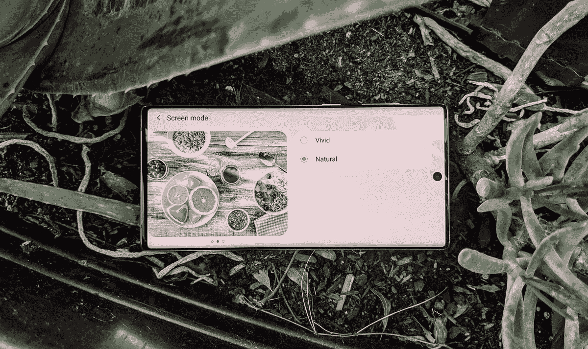
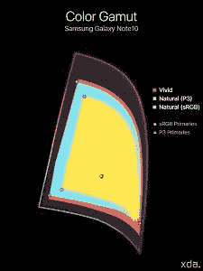
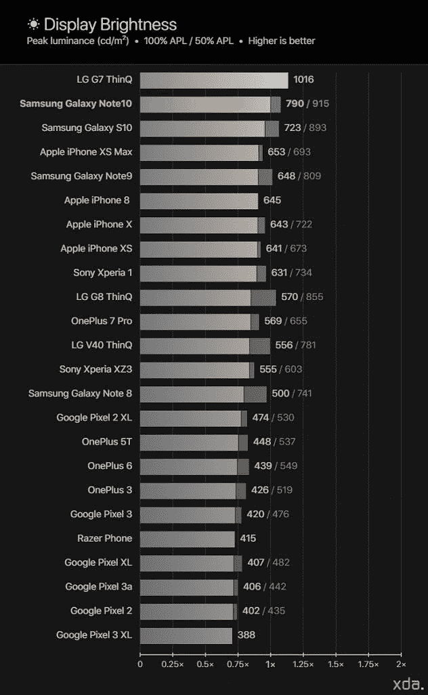
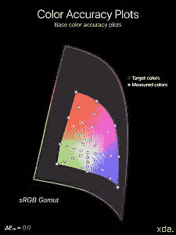

# 三星 Galaxy Note 10 显示器评论-充满活力，明亮，但不准确

> 原文：<https://www.xda-developers.com/samsung-galaxy-note-10-display-analysis-the-most-vibrant-and-brightest-but-not-the-most-accurate/>

三星和苹果是*“最佳智能手机显示器”*的两个背靠背的竞争者，这个头衔有时被认为属于发布最新手机的公司。然而，由于两家公司都从三星显示采购显示器，许多人认为 T2 的三星智能手机必须拥有更好的显示器。这种想法是有缺陷的，因为三星显示实际上是一家独立于三星移动的公司，三星移动组装 Galaxy 智能手机，也是三星显示的客户。就像任何其他客户一样，原始设备制造商最终对他们手机显示屏的色彩校准质量负责，最新的面板不一定意味着校准最好。在这篇评论中，我们全面考察了三星 Galaxy Note 10 的面板质量，以及它根据行业标准进行校准的情况。

## 三星 Galaxy Note 10 显示屏规格

Note 系列以前被认为是具有超大显示屏的巨型手机，但三星将其与 Galaxy Note 10 进行了转换，使其尺寸与 S 系列手机更加一致。普通的 Galaxy Note 10 在尺寸上与 Galaxy S10 非常相似，只是*略大于*——显示屏大约宽 0.2 英寸，高 0.1 英寸。前置摄像头位于显示屏顶部中央的一个小圆圈中，之前在 S10 上位于右上角。我个人认为，它在中间比在右边看起来更傻，但实际上在使用手机时更偏僻，因为状态栏中间通常没有任何东西，而且它不会将系统图标笨拙地推到左边。

这种面板被三星创造为“动态 AMOLED”，[他们主要将](https://shop-links.co/link/?exclusive=1&publisher_slug=xda&article_name=Samsung+Galaxy+Note+10+Display+Analysis%3A+The+Most+Vibrant+and+Brightest%2C+but+Not+the+Most+Accurate&article_url=https%3A%2F%2Fwww.xda-developers.com%2Fsamsung-galaxy-note-10-display-analysis-the-most-vibrant-and-brightest-but-not-the-most-accurate%2F&u1=UUxdaUeUpU25916&url=https%3A%2F%2Fwww.samsung.com%2Fglobal%2Fgalaxy%2Fgalaxy-z-fold4%2F&ourl=https%3A%2F%2Fwww.samsung.com%2Fglobal%2Fgalaxy%2Fwhat-is%2Fdynamic-amoled%2F)归功于其 HDR10+能力和有害蓝光的减少。在我看来，这是三星在一段时间内做出的最苹果的举动。该显示器的原始分辨率为 2280×1080 像素，高于 6.3 英寸显示器，即每英寸 401 像素。对于一部 950 美元的手机来说，这个像素密度*绝对是平庸的*，尤其是当三星的“中端”S10e 具有更高的像素密度，而其 S10 对应产品具有 1440p 屏幕。当我阅读文本时，较低的密度会立即引起我的注意，1080p 视频看起来肯定不如 S10 上的 1440p 视频清晰。三星一直在 1080p 或 1440p 渲染之间犹豫不决，正如他们在 1440p 面板上的 1080p 渲染分辨率所表明的那样。看起来，三星将受益于苹果的做法，即在两者之间设定特定的像素密度，并为两种尺寸的智能手机定制像素密度分辨率的面板。苹果为他们的有机发光二极管 iPhones 设定的目标是每英寸 458 像素，这在它们各自尺寸的 1080p 和 1440p 之间，在我看来，这是像素密度和功耗之间的最佳平衡点，不需要下采样。然而，我认为制造这些特定分辨率的面板实际上比仅仅使用大规模生产的 1440p 制造工艺成本更高。

三星吹嘘他们的显示器，从 S10 开始，[通过减少“有害范围”内的蓝光量来帮助缓解眼睛疲劳他们通过将蓝色有机发光二极管的波长向上移动一点可见光谱来实现这一点，这并不是一些人可能会相信的屏幕“过滤器”。因为调整光源的波长会改变其光线的颜色，三星需要为新的有机发光二极管彻底重新校准他们的面板。乍看之下，三星似乎在颜色匹配方面做得很好，正如它们相似的(暖)白点所表明的那样，但我不禁想知道这是否是为什么它们的*仍然*校准得如此温暖的原因。](https://news.samsung.com/global/easy-on-the-eyes-how-the-galaxy-s10s-display-protects-users-from-blue-light)

## **方法论 ▼**

为了从显示器获得定量的色彩数据，我们将设备特定的输入测试模式放入手机，并使用 X-Rite i1Pro 2 分光光度计测量显示器产生的发射。我们使用的测试模式和设备设置针对各种显示特性和可能改变我们所需测量的潜在软件实现进行了修正。我们主要在 50%的平均像素水平(APL)下测量灰度，其中 50%的显示图案尺寸非常类似于给定白点的 50%的恒定平均相对亮度。我们使用对数-对数空间中亮度读数的斜率的最小平方拟合来导出显示伽马。灰度读数是在最大显示器亮度的 100%、64%、36%、16%和 4%的幅度下获得的，并且被平均以获得指示显示器整体外观的单个读数。这些值分别与显示器亮度的 100%、80%、60%、40%和 20%大致相关。我们现在使用色差度量δ

*E[TP]* [(ITU-R BT.2124)](https://www.itu.int/dms_pubrec/itu-r/rec/bt/R-REC-BT.2124-0-201901-I!!PDF-E.pdf)

，这是一个

[overall better measure for color differences](https://www.ibc.org/publish/specifying-colour-tolerances-for-hdr-and-wcg-displays-/2449.article)

比δ

*E* [00]

这在我以前的评论中使用过，目前仍在许多其他网站的展示评论中使用。那些还在用δ的

*E* [00]

对于颜色误差报告，鼓励使用δ

*E[ITP]*

，作为

[will be detailed in a session](https://2019.smpte.org/home/session/162191/%CE%94eitp-is-now-itu-r-bt.2124-is-the-industry-ready-to-move-on-from-%CE%94e2000)

来自电影电视工程师协会(SMPTE)和肖像显示器协会(CalMan 的所有者)

*E[ITP]*

通常在计算中考虑亮度(强度)误差，因为亮度是完整描述颜色的必要组成部分。然而，由于人类视觉系统分别解释色度和亮度，我们将测试模式保持在恒定亮度，并且在我们的测试模式中不包括亮度(I/强度)误差

*ΔE*

价值观。此外，在评估显示器的性能时，将这两种错误分开是有帮助的，因为就像我们的视觉系统一样，它们属于显示器的不同问题。这样我们可以更彻底地分析和理解显示器的性能。我们的颜色目标基于 IC

[T]

C

[P]

/ITP 色彩空间，它比 CIE 1976 UCS 具有更好的色调线性，在感觉上更均匀。我们的目标以 100 cd/m 的基准在整个 ITP 色彩空间中大致均匀地间隔开

²

白色级别，以及 100%、75%、50%和 25%饱和度的颜色。在 100%、64%、36%、16%和 4%的面板背光级别下测量颜色，以评估整个显示器亮度范围内的颜色准确度。对于有机发光二极管显示器，这些颜色是在适当背光强度的最大亮度下测量的。这是因为有机发光二极管显示器主要使用脉宽调制来调节亮度，甚至通过降低电流比例来调节亮度，这相当于以较低的亮度进行渲染

*E[TP]*

值大约是 3

× the magnitude of Δ*E*[00] values for the same color. The metric assumes the most critically-adapted viewing condition for the observer, and a measured Δ*E[TP]* color difference value of 1.0 denotes a just-noticeable-difference for the color, and a value less than 1.0 signifies that the measured color is indistinguishable from perfect. For our reviews, a Δ*E[TP]* value of less than 3.0 is an acceptable level of accuracy for a reference display (suggested from ITU-R BT.2124 Annex 4.2), and a Δ*E[TP]* value greater than 8.0 is noticeable at a glance (tested empirically, and the value (8.0) also nicely lines up with roughly a 10% change in luminance, which is generally the change in percentage needed to notice a difference in brightness at a glance).

HDR 测试模式是针对

[ITU-R BT.2100](https://www.itu.int/dms_pubrec/itu-r/rec/bt/R-REC-BT.2100-2-201807-I!!PDF-E.pdf)

使用感知量化器(ST 2084)。HDR sRGB 图案与 sRGB 原色均匀间隔开，HDR 参考水平白色为 203 cd/m

² [(ITU-R BT.2408)](https://www.itu.int/dms_pub/itu-r/opb/rep/R-REP-BT.2408-2017-PDF-E.pdf)

，并且对于其所有模式，PQ 信号电平为 58%。HDR P3 图案与 P3 原色均匀间隔，白色等级为 1000 CD/m

²

和 75%的 PQ 信号电平。所有 HDR 模式都是在 HDR 平均 20% APL 和 20%显示尺寸窗口下测试的。

## **显示配置文件&色域**

三星 Galaxy Note10 的色域

Galaxy Note 10 保持了两种标准的颜色配置文件，自然和生动，适用于采用谷歌颜色管理系统的 Android 设备。

**自然**配置文件是我的美国骁龙版本的默认显示配置文件，如果[三星遵循与 S10](https://news.samsung.com/global/interview-infinity-viewing-experience-behind-the-galaxy-s10-display) 相同的趋势，它将是美国和欧洲的默认配置文件，而生动是亚洲的默认配置文件。它是色彩精确的显示配置文件，采用色彩管理在预期的色彩空间中呈现内容，默认情况下，针对非扩展色彩，将目标定为 sRGB，[整个互联网的标准色彩空间](https://www.w3.org/Graphics/Color/sRGB.html)。Android 应用程序中颜色管理的采用率仍然很低，但三星的 Gallery 应用程序和 [Google Photos](https://www.xda-developers.com/google-photos-wide-color-image-support-buggy-photo-viewer/) 都支持查看宽彩色图像。正如在色域图中看到的，配置文件似乎没有达到蓝色的完全饱和度，并且比标准略暖。

**生动**配置文件扩展了屏幕上颜色的色彩饱和度，并将白点修改为更冷，这可以通过可用的色温滑块进一步调整。相对于其自然轮廓，其色域增加了约 54%，红色增加了 22%，绿色增加了 38%，蓝色增加了 28%。虽然轮廓确实扩大了饱和度，但它的绿色和蓝色都向青色移动。这对于那些想要使用仅仅扩展色彩饱和度而不是最初想要的色彩色调的配置文件的人来说可能是不期望的。该配置文件也不支持 Android 的颜色管理系统，这不利于内容保持相同的相对艺术意图(如果应用程序支持)。有些手机同时提供色彩饱和度扩展配置文件*和*色彩管理，如[一加 7 Pro](https://www.xda-developers.com/oneplus-7-pro-display-review-finally-flagship-quality/) ，这提高了色彩饱和度扩展配置文件的可行性。

## **亮度:一个一个**

**章节描述▼**

我们的显示器亮度对比图表比较了三星 Galaxy Note 10 相对于我们测量的其他显示器的最大显示器亮度。图表底部水平轴上的标签代表相对于三星 Galaxy Note 10 显示屏的感知亮度差异的乘数，该乘数固定为“1×”。显示器亮度的大小，以每平方米坎德拉或尼特为单位，根据史蒂文幂定律使用点光源感知亮度的模态指数进行对数缩放，与三星 Galaxy Note 10 显示器的亮度成比例缩放。这是因为人眼对感知亮度有对数反应。测量 OLED 面板的显示性能时，了解其技术与传统 LCD 面板有何不同非常重要。液晶显示器需要一个背光来让光通过滤色器，滤色器会阻挡光的波长，从而产生我们看到的颜色。OLED 面板能够使它的每个单独的子像素发出它们自己的光。大多数有机发光二极管面板必须从其最大分配中为每个点亮的像素分配一定量的功率。因此，需要点亮的子像素越多，需要在点亮的子像素上分配的面板功率就越多，每个子像素接收的功率就越少。图像的 APL(平均像素级别)是整个图像中每个像素的单个 RGB 分量的平均比例。例如，一个完全红色、绿色或蓝色的图像具有 33%的 APL，因为每个图像只包括完全照亮三个子像素中的一个。完整的颜色混合青色(绿色和蓝色)、品红色(红色和蓝色)或黄色(红色和绿色)具有 67%的 APL，而完全照亮所有三个子像素的全白图像具有 100%的 APL。此外，一半黑一半白的图像具有 50%的 APL。最后，对于有机发光二极管面板，总的屏幕内容 APL 越高，每个点亮像素的相对亮度越低。LCD 面板没有这种特性(除了局部变暗)，因此，在较高的 APL 下，它们比有机发光二极管面板更亮。

手机亮度参考图表

说到显示器亮度，三星的移动 OLEDs 通常是最亮的。峰值显示亮度是一种质量，几乎全部来自所提供的面板及其额定功效。这就是三星的闪光点(*！因为他们与三星显示的团体关系可以让他们第一时间获得最新的图表和面板。然而，苹果的 iPhone 11 Pro 手机并没有在太长时间后发布，也使用了与 S10 和 Note 10 相同的一代面板。*

在自然状态下，三星 Galaxy Note 10 的手动亮度范围从最低 1.85 尼特到最高 377 尼特。这是在 100% APL 下测量的，这是一个全屏白色图像，此时 OLEDs 通常是最暗的。在 100% APL 时，显示驱动器的功率管理在其特定白电平(如果有的话)下处于最大值，并且不应用亮度提升。自然配置文件没有采用任何亮度增强，并且由于电源管理，它似乎没有太多的亮度衰减-事实上，随着 APL 的增加，显示器亮度似乎略有增加，这与有机发光二极管显示器的预期相反。然而，正如我们后来从灰度测量中揭示的那样，对于较低的色彩强度，随着 APL 的增加，实际上存在亮度衰减，三星必须应用*某种*增强来保持 100%强度的白色亮度读数相似(并略高)。

对于生动的配置文件，在 100% APL 下，手动亮度范围为 1.85 尼特至 380 尼特。与自然轮廓不同，三星尽可能多地从生动轮廓中挤出亮度，每 100 尼特平均显示亮度提高 7%的亮度。因此，在 50% APL 的情况下，生动的配置文件可以提升高达 420 尼特，在低<1% APL.

Under intense ambient light, the Galaxy Note 10 enters *高亮度模式*下达到 480 尼特的峰值，在该模式下，面板会消耗额外的功率，对于两种显示配置文件，100% APL 的情况下提升高达约 790 尼特。在高环境光下，在较低的内容像素级别下，还可以对两个配置文件进行额外的增强(对于自然配置文件，通常禁用此增强)，对于 50% APL，进一步增强至 915 尼特，对于屏幕的微小照明区域，达到 1115 尼特。

## **色彩准确度&平衡:B**

**章节描述 ▼**

我们的色彩准确度图为读者提供了显示器色彩性能和校准趋势的视觉评估。下面显示的是颜色准确度目标的基础，绘制在统一的 ITP 色彩空间上，圆圈代表目标颜色。

 **Drive balance:**

白光源的色温描述了光的“暖”或“冷”程度。颜色通常需要至少两个点来描述，而相关色温是一维描述符，为了简单起见，省略了基本的色度信息。sRGB 色彩空间以具有 D65 (6504 K)色温的白点为目标。以 D65 色温的白点为目标对于颜色准确性至关重要，因为白点会影响每种颜色混合的外观。然而，请注意，具有接近 6504 K 的相关色温的白点不一定看起来准确！有许多颜色混合可以具有相同的相关色温(称为 iso-CCT 线)，有些甚至看起来不是白色。因此，色温不应作为白点色彩准确度的衡量标准。相反，我们使用它作为一种工具来表现显示器白点的粗略外观，以及它如何在其亮度和灰度上变化。无论显示器的目标色温如何，理想情况下，其白色的相关色温在所有信号电平下都应保持一致，这在我们的下图中显示为一条直线。驱动平衡图显示了单个红色、绿色和蓝色 led 的强度如何随显示器亮度变化，与显示器相关的白色色温重叠，并揭示了显示器颜色校准的“紧密度”。这些图表比一维色温图表显示更多的颜色信息。理想情况下，红色、绿色和蓝色 led 应在显示器的整个亮度范围内尽可能保持一致。

**前言:**

智能手机显示屏越来越好。非常好。一些最新智能手机的显示屏似乎在色彩准确度测试中表现出色。然而，当它们与基准级别的显示器竞争时，它们可能就差远了。低宽度模式的δ*E*值并不能说明全部情况。必须改进显示器评估，以更好地反映显示器的细微性能，并能够更好地区分*非常好的*显示器之间的校准特性。

我们已经转移到一个新的客观色差度量标准，δ*E[TP]*[(ITU-R Bt . 2124)](https://www.itu.int/dms_pubrec/itu-r/rec/bt/R-REC-BT.2124-0-201901-I!!PDF-E.pdf)，这是一个比δ*E*[00]更好的总体色差度量标准，它在我以前的评论中使用过，目前仍在许多其他网站的展示评论中使用。那些仍在使用δ*E*[00]进行色彩误差报告的人被鼓励使用δ*E[ITP]*，因为[将在美国电影和电视工程师协会(SMPTE)和肖像显示器(CalMan 的所有者)的会议](https://2019.smpte.org/home/session/162191/%CE%94eitp-is-now-itu-r-bt.2124-is-the-industry-ready-to-move-on-from-%CE%94e2000)中详细介绍。

δ*E[TP]该指标假设观察者的观察条件最关键，测得的δ*E[TP]*色差值为 1.0 表示该颜色的差异仅可察觉，小于 1.0 的值表示测得的颜色与完美颜色没有区别。在我们的评测中，小于 3.0 的δ*E[TP]值是参考显示器的可接受精度水平(根据 ITU-R BT.2124 附录 4.2 建议)，大于 8.0 的δ*E[TP]*值一眼就能看出(根据经验测试，值(8.0)也很好地符合亮度大约 10%的变化，这通常是注意到亮度差异所需的百分比变化**

我们还策划了一套更详尽的测试模式，以更好地评估涵盖更多条件的总色彩准确度。由于这些原因，我们为本次审查提供的δ*E*值不能直接与之前审查中报告的δ*E*值进行比较，因为度量和测试模式都不同，我们更新的评估报告了更大的δ*E*值。方法和测试模式在前面的章节中有所解释。

**sRGB color accuracy for Samsung Galaxy Note10 (Natural profile)**

作为三星的传统，白点被校准得过于温暖，100%白色的相关色温约为 6215 K。考虑到有机发光二极管显示器容易出现同色异谱故障，并且在相同的颜色测量中比透射式 LCD 显示器显得更暖，测量太暖会使 Galaxy 显示器离行业标准白点更远。一个不准确的暖白点对 Note 10 的整个色域都是一种损害，会使所有颜色向红色偏移，降低颜色准确性。有些人可能会认为这是由于三星的自适应白点，这是他们旧的自适应显示器配置文件的一部分，但这并不适用于自然配置文件(它似乎也不存在于生动的配置文件中)，Note 10 是在一个近乎漆黑的房间中测量的。

鉴于三星在显示器色彩准确度方面的所谓优势，我们对 Galaxy Note 10 在 sRGB 自然轮廓中的色彩准确度的评估实际上有点令人失望。该轮廓对于 sRGB 具有 4.5 的平均色差δ*E[TP]*，在其整个强度范围内具有 4.6 的标准偏差。这意味着，平均而言，三星 Galaxy Note 10 上的 sRGB 颜色是不完美的，超出了参考容差，尽管除了异常值之外，许多颜色不太可能被注意到。4.6 的高标准偏差是由于那些具有高误差的异常值，这使得与完美颜色难以区分的颜色和一眼就能注意到的颜色误差都在平均值的一个标准偏差内。

三星 Galaxy Note 10 在最大电流强度下最准确，平均色差δ*E[TP]*为 3.4，但它的红色和蓝色略有欠饱和。随着色彩强度的降低，Galaxy Note 10 的色彩准确度也会降低。高饱和度的红色会变得极度过饱和，在最低强度下，整个色域都会过饱和。对于非常低的 4%亮度，配置文件的平均色差δ*E[TP]*为 10.3，这在最低显示亮度级别和一般低亮度场景下可能会令人不愉快。对于低强度、最大饱和度的 sRGB 红，Note 10 的自然轮廓具有非常高的最大误差 30°。整体平均值不包括这种非常低的亮度的δ*E[TP]值，因为这些亮度级的色彩准确度并不重要，并且在有机发光二极管显示器上经常会出现偏差。*

*点击此处链接至智能手机色彩准确度参考图表。请注意，此列表中的测量值使用旧方法，注释 10*相应地进行了缩放。*

**P3 color accuracy for Samsung Galaxy Note 10 (Natural profile)**

幸运的是，Galaxy Note 10 在其自然轮廓中再现 P3 颜色的表现略好于 sRGB 颜色，尽管 sRGB 色域精度肯定更重要。对于 P3 颜色，饱和度目标被很好地跟踪，并且在较低的强度下没有明显的过饱和。然而，蓝色仍然会发生色调偏移，并且在较低的强度下会略微过饱和，就像 sRGB 颜色一样。三星似乎对较低强度下的颜色混合有问题，随着当前强度的降低，原色接近显示器的原生色域。对于 P3 颜色，自然轮廓的总体平均值δ*E[TP]为 4.2，标准偏差低得多，为 2.9。*

**Drive balance charts for Samsung Galaxy Note 10**

自然轮廓和生动轮廓的 RGB 驱动平衡在其整个亮度范围内保持一致。三个颜色通道保持在其最大强度的 10%以内，因此白色和灰色不会明显偏移太远。至于不同 APL 下的颜色偏移，随着显示器发射的增加，Note 10 的面板表现为红色和蓝色增加，绿色略有减少。这导致面板在较高的 APL 下向品红色移动，显示亮度越高变得越严重。

## **对比&语气反应:B**

**章节描述 ▼**

显示器的灰度系数决定了屏幕上的整体图像对比度和颜色亮度。大多数显示器上使用的行业标准伽马遵循 2.20 的幂函数。更高的显示伽玛功率将导致更高的图像对比度和更暗的颜色混合。数字电影通常采用 2.40 和 2.60 的更高伽马功率，但智能手机在许多不同的照明条件下观看，更高的伽马功率不合适。我们下面的伽马曲线是三星 Galaxy Note 10 显示屏上看到的颜色亮度与其相关输入信号水平的对数-对数表示。高于 2.20 线的测量点表示色调比标准色调更亮，而低于 2.20 线的测量点表示色调比标准色调更暗。由于人眼对感知的亮度有对数反应，所以轴是对数标度的。现在，大多数现代旗舰智能手机显示屏都配有经过校准的色彩配置文件，色彩精确。然而，由于随着内容 APL 的增加而降低屏幕上颜色的平均亮度的有机发光二极管特性，现代旗舰有机发光二极管显示器的总颜色准确度的主要差异现在在于显示器的最终伽马。伽马射线构成了非彩色(灰度分量)图像，或图像的结构，人类在感知时更敏感。因此，显示器的伽玛与内容的伽玛相匹配非常重要，通常遵循行业标准 2.20 幂函数。

**Gamma scales for Samsung Galaxy Note 10**

50%的平均像素级别(APL)是许多应用程序及其内容的典型像素级别。在 50% APL 的情况下，Note 10 的伽马值高于标准值 2.20，自然和生动的轮廓都约为 2.35。这导致三星 Galaxy Note 10 通常会显示比标准对比度更高的图片。对于低 APL，对应于黑暗场景和黑暗模式应用程序，两个配置文件上的显示伽玛更接近 2.20 标准，尽管它仍然略高。然而，这被通常在低/暗环境照明下观看的低 APL 含量所抵消，在低/暗环境照明下，通常期望更接近 2.40 的显示伽马。对于低显示亮度*和*低含量 APL，Note 10 增强了其阴影，导致在面板可能难以呈现深色阴影的超昏暗条件下，伽马约为 2.06。然而，显示灰度系数应该理想地保持一致并且独立于内容 APL，并且应该仅通过改变环境照明或者通过外部色调映射来修改。

两种配置文件具有相同的目标传递函数，该函数负责显示的预期对比度和伽玛。实际上，两个轮廓之间的实际伽马是不同的，因为生动轮廓以较低的 APL 含量增强其亮度，而自然轮廓则没有。理论上，鲜艳轮廓的亮度提升意味着其显示灰度系数和对比度应该随着相对于自然轮廓的显示亮度而增加，事实也确实如此。然而，当对 Galaxy Note 10 的亮度范围进行平均时，这两个轮廓实际上非常相似。这有点不寻常，因为自然轮廓意味着 APL 的亮度几乎没有变化，然而轮廓在低 1% APL 和中等 50% APL 之间的对比度有相当大的差异。因此，虽然自然轮廓没有亮度提升，但它仍然会受到显示器发射增加造成的亮度衰减的影响，低强度阴影受影响最大。这导致在较高的显示发射时，自然轮廓的显示伽玛增加。

总的来说，自然轮廓的灰度和对比度不太准确，也很不一致。它们随亮度和 APL 而显著变化，从低 APL 时的低亮度的 2.06 到 50% APL 时的中等亮度的 2.47。虽然不需要认真评估生动的配置文件的准确性，但如果不遵循颜色外观模型，显示器配置文件应该保持一致的伽玛。

在我之前评测过的 exy nos Galaxy S10 上，我注意到它的显示奇怪地遵循了 sRGB 传递函数，而不是直线伽马幂。然而，我随后发现骁龙变体通常遵循直线 2.20 伽马幂，并且两个面板具有不同的校准。我正在评测的 Galaxy Note 10 是骁龙的变种，虽然我没有 Exynos Note 10，但我认为三星可能仍然针对某些变种的 sRGB 转移功能。 [DisplayMate 的 Note 10+](http://www.displaymate.com/Gamma_49G.html) 的强度等级与我的 Exynos S10 和 sRGB 传递函数的强度等级精确匹配，报告的伽马值相同。我的猜测是，三星现在正在使用 sRGB 传递函数对 Exynos 显示管道中的自然配置文件进行原生解码。

凭借 Exynos S10，我认为三星可能最终*解决了*黑色剪裁的问题。虽然 sRGB 传递函数不像直接伽马幂那样有力，也不提供那么多对比度，但它确实有通过显著提升近黑色阴影来欺骗黑色挤压的好处。对于骁龙 Galaxy Note 10，面板仍然表现出与所有之前的三星 Galaxy 显示器相同的黑色剪裁量(除了作弊的 Exynos 变种)。三星仍然无法呈现其 8 位亮度的前 5 步，除了疏忽之外，在这一点上绝对没有任何原因。

我以前的 Exynos S10 上的高亮度模式还可以调整高环境照明的显示伽玛，显著降低对比度和减轻屏幕颜色，以提高阳光清晰度和感知颜色的准确性。看起来这不再是三星 Galaxy Note 10 的情况，除非该功能也是 Exynos 变种独有的。如果是的话，这将是骁龙设备的一个受欢迎的补充。

## **HDR 视频播放:D**

随着 Galaxy S10 的发布，三星开始推动 HDR10+的发展，并吹嘘其最新手机能够捕捉和播放新格式的视频。实际上，手机现在能够支持它是非常了不起的。但是，智能手机能多准确地再现 HDR 的内容呢？对于我们的评估，我们将只存放 8 位颜色和静态元数据。

**HDR PQ reproduction for Samsung Galaxy Note 10**

不幸的是，三星 Galaxy Note 10 似乎没有很好地再现绝对感知量化器。阴影开始太暗，亮度跳得太高，过度曝光整个场景。然而，20% APL 的 1000 尼特的峰值亮度是很大的，三星确实正确地滑入了它，而不是像索尼 Xperia 1 一样削波。Note 10 在再现 HDR 色彩方面也做得不太好，错过了 HDR sRGB 色域内的大部分红色和橙色色调。橙色、粉红色和紫色色调完全偏离了 HDR P3 色域，可能是因为超出了基本的 PQ 曲线。这些参考颜色的颜色误差非常高，甚至没有覆盖 BT2100 颜色空间的总颜色量的很大一部分。

## **最后的想法**

尽管 Galaxy Note 10 只是 Galaxy S10 的微小更新，但我对三星似乎正在走向的方向(或缺乏方向)有点失望。例如，将“基础”Note 10 的分辨率下调至 1080p 是不必要的。包括我在内，有很多人绝对可以解决 Note 10 每英寸 401 像素的问题。一加一直因为在显示屏上保持同样的每英寸 401 像素而受到抨击，三星不应该成为避难所。在典型的智能手机观看距离下，像素密度徘徊在大多数人的视觉敏锐度范围内，它需要进一步清晰化，才能让更多人舒适地看到完美的清晰度。

颜色的准确性及其复杂性是一个非常小众的问题。大多数人不一定在乎完美的色彩再现，这就是为什么我倾向于在我的总体评分中降低它的权重。但是那些真正关心颜色准确性的人需要知道它的校准质量的全部范围。这就是 Note 10——以及三星的一般校准——的表现不如大多数商店所展示的那样好的地方。DisplayMate 是公认的，因为三星似乎一次又一次地在 DisplayMate 的色彩准确度测试中胜出。大多数人不会质疑这一点，因为当你阅读色彩准确度测量数据时，要理解你在看什么，确实需要很多这方面的知识。其中一个问题是，DisplayMate 在其最大亮度下只能测量显示器上的 41 种颜色。这不足以在足够的显示条件下形成准确描述显示器总体精度的度量。因为，根据我的测量，三星 Galaxy Note 10 的色彩准确度在较低的色彩强度下会迅速恶化。关于面板校准的许多复杂细节被省略，包括黑色削波、驱动变化和适当平均的伽马(因为伽马也随着总发射而变化)。所有这些都是参考显示器非常重要的特性，显示器评论应该能够揭示这些问题。

> 鉴于智能手机及其实用性的日益普及，确实应该对智能手机显示屏进行更多独立测试，以达到这些更高的标准。

但对于那些不在乎色彩准确度的人来说，它只是另一个更亮的面板，没有其他改进，像素也有所减少。然而，其他面板也变得一样亮，许多显示器也已经相当准确，其中相当多的显示器比 Galaxy Note 10 更准确。然后是那些现在包括更高刷新率面板的产品，这些面板为智能手机显示体验提供了一种实际上引人注目的*umph*-一种在新的显示功能添加中尚未感受到(或看到)的 *umph* 。以我个人的判断，这些因素现在模糊了支撑 Galaxy 系列成为智能手机显示屏领导者的界限。这很好，因为这是最新智能手机显示屏变得越来越好的结果，他们需要这种额外的审查才能区分它们。

| 

### 好的

*   市场上最亮的有机发光二极管
*   非常鲜明生动的轮廓

 | 

### 坏

*   950 美元设备上的 1080p/401 PPI 面板表现平平
*   自然轮廓中的白点太暖
*   低强度颜色会过饱和
*   HDR10 回放需要改进
*   黑色剪裁没有改进

 |
|  |

| **规格** | 三星 Galaxy Note 10 |
| --- | --- |
| **类型** | “动态 AMOLED”penti le 钻石像素 |
| **制造商** | 三星显示公司。 |
| **尺寸** | 5.7 英寸乘 2.7 英寸 对角线 6.3 英寸 15.4 平方英寸 |
| **分辨率** | 2280×1080 像素19:9 像素宽高比 |
| **像素密度** | 每英寸 284 个红色子像素每英寸 401 个绿色子像素每英寸 284 个蓝色子像素 |
| **像素锐度距离** *视力为 20/20 的可分辨像素距离。典型的智能手机观看距离约为 12 英寸* | < 12.1 英寸为全彩色图像 < 8.6 英寸为非彩色图像 |
| **角度偏移** *在倾斜 30 度时测量* | -25%亮度偏移δ*E[TP]*= 7.8%色彩偏移 *点击此处查看图表* |
| **黑色削波阈值** *要削波的黑色信号电平* | < 2.0% |

| **规格** | **自然** | **生动** |
| --- | --- | --- |
| **亮度** | **100% APL:** 790 尼特(自动)/ 377 尼特(手动)**50% APL:** 915 尼特(自动)/ 376 尼特(手动)1% APL: 1115 尼特(自动)/ 375 尼特(手动)

* * *

每 100 尼特的亮度增加 0.6% | **100% APL:** 781 尼特(自动)/ 380 尼特(手动)50% APL: 905 尼特(自动)/ 420 尼特(手动)1% APL: 1107 尼特(自动)/ 478 尼特(手动)

* * *

每 100 尼特的亮度提升 6.9% |
| **伽玛** *标准是 2.20 的直线伽玛* | 2.07–2.46 平均 2.34*高方差* | 2.06–2.47 平均 2.36*高方差* |
| **白点** *标准是 6504 K* | 6215kδ*E[TP]*= 3.1 | 6703kδ*E[TP]*= 2.3 |
| **色差** | **sRGB:** 平均δ*E[TP]*= 4.5 4.6 最大δ*E[TP]*= 30*50%色彩准确度* *最大误差高***P3:** 平均值δ*E*= 4.2±2.9 最大值δ*E[TP]*= 17*41%色彩准确度* *最大误差高* | **色域比自然轮廓**大 54%*+22%红色饱和度，色调向橙色偏移 1.1 度(δ*e[tp⊥]*= 5.2)**+38%绿色饱和度，色调向青色偏移 5.1 度(δ*e[tp⊥]*= 13.6)**+25%蓝色饱和度，色调向青色偏移 5.7 度(δ*e[tp⊥]*= 18.8)* |

[**三星 Galaxy Note 10 论坛**](https://forum.xda-developers.com/galaxy-note-10)| |[|**三星 Galaxy Note 10+论坛**](https://forum.xda-developers.com/galaxy-note-10+)