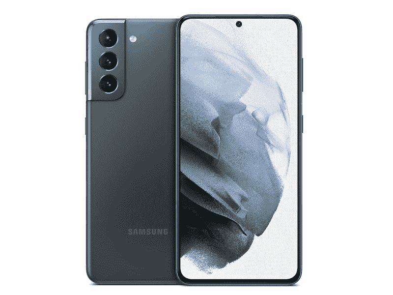
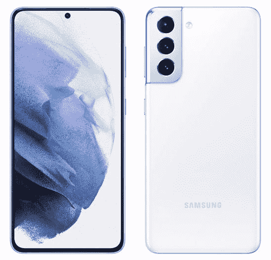

# 这里有所有的 Galaxy S21 颜色和你应该买哪个！

> 原文：<https://www.xda-developers.com/samsung-galaxy-s21-colors/>

新的[三星 Galaxy S21 系列](https://www.xda-developers.com/samsung-galaxy-s21/)已经上市，总共有 6 种新颜色首次亮相一款或多款手机。你可能会很困惑哪种型号有哪种颜色，但我们会帮你解决这个问题。这里是所有新的 Galaxy S21 颜色，它们适用于哪些手机，我们认为你应该购买哪一款，为什么！

 <picture></picture> 

Samsung Galaxy S21 Plus

这是 Galaxy S21 系列的新英雄色，看起来棒极了！它是一种华丽的浅紫色(淡紫色)，具有哑光表面，在手机边缘和相机周围有一条金色的旅行。虽然金色和紫色的组合非常独特，但它可能不适合所有人，但我们喜欢它！

 <picture></picture> 

Phantom Black

与普通 Galaxy S21 的幻影灰颜色非常相似，幻影黑颜色选项用于 Plus 和 Ultra 变体，并为不想让自己的手机突出或定义它们的人提供了一种柔和的配色方案。这是保留色，但可能是最受欢迎的颜色之一！

 <picture></picture> 

Galaxy S21 Ultra

银色是我最喜欢的颜色之一，让这款手机的颜色真正脱颖而出的是，背面的颜色是更暗的银色，装饰和相机周围形成了对比。如果你购买这种颜色的 S21 Ultra，请注意，它只有 128GB 的存储空间，而不是更高的版本！

这是不止一款 Galaxy S21 设备都提供的三种主要颜色，但只有入门级 Galaxy S21 才有这三种颜色。其中一些颜色看起来很棒，我们希望看到它们出现在该系列更高级的版本中！下面是 Galaxy S21 系列才有的三种颜色。

 <picture></picture> 

Samsung Galaxy S21

这是一种只有 Galaxy S21 才有的华丽的新粉色，它是独一无二的，因为没有多少设备有粉色选项。像幻影紫一样，它具有哑光表面，并在手机边缘和相机周围镀上金色。粉色和金色是一个独特的组合，但它可能会两极分化！

 <picture></picture> 

Samsung Galaxy S21

幻影灰的颜色只有 Galaxy S21 才有，而且是一种近乎黑色的暗灰色。深灰色周围是深色的镶边，甚至连相机边框都几乎是-黑色的。三星本可以从谷歌的书里取一片叶子，叫它几乎黑，但是幻影灰才是正式名称！

 <picture></picture> 

Samsung Galaxy S21

幻影白是为任何想要简单颜色而不是黑色的人设计的，它是白色后部与手机和摄像头凸起周围的银色装饰的结合。它很保守，但看起来很醒目，如果这最能描述你的个性，那它就是完美的！

正如我们对三星的期望一样，也有一些颜色选项是该公司在线商店独有的。常规 Galaxy S21 没有任何额外的配色，但 S21 Plus 和 S21 Ultra 都有一些额外的颜色选项，这些选项是“定制的”，在撰写本文时，将需要 4-5 周才能发货。考虑到标准颜色还要两周才能发货，如果你想要更独特的颜色，额外的等待时间可能是值得的！

 <picture></picture> 

Samsung Galaxy S21 Ultra

我喜欢钛的颜色，虽然我们没有亲眼见过，但是渲染让它看起来很棒。这是一种灰色和黑色的混合，既保留又相当独特。市场上很少有钛色的手机，所以如果你想要一款既保守又出众的手机，这款就是你要的！

 <picture></picture> 

Phantom Navy

亲自来看，这可能看起来更像海军，但从渲染，它几乎看起来像金属和黑色和深蓝色之间的混合。我们当然希望看到一些更有个性的东西，但是如果你想要一些保守但非常不同的东西，这可能是你购买的一个很好的选择！

 <picture></picture> 

Phantom Brown

我一看到这个就喜欢上了！我喜欢棕色，这绝对是智能手机上最独特的颜色之一。与去年的旗舰产品不同，它的颜色看起来不是青铜色，而是带有黑色摄像头凸起的金属棕色，是为那些安静保守但又想与众不同的人设计的！

 <picture></picture> 

Samsung Galaxy S21 Plus

我肯定你在想——黄金怎么样？你可以买到金色的 Galaxy S21，但只能买到 Plus 版本。它看起来比相机周围稍微暗一些，所以仍然有两种色调，但它肯定会为那些想要金色手机的人服务！

 <picture></picture> 

Samsung Galaxy S21 Plus

停下来，拿走我的钱。当我看到红色是一个选项时，这是我最初的想法——这是我最喜欢的颜色之一，很遗憾它只在 Galaxy S21 Plus 上出现，但如果你打算购买三星三款手机中的中间款，这绝对是我推荐的颜色。

## 哪款 Galaxy S21 颜色适合你？

三星对于 Galaxy S21 系列的颜色选择整体来说还是挺有意思的。与大多数产品一样，一些颜色只适用于特定设备，但令人惊讶的是，Galaxy S21 Ultra 没有幻影紫罗兰英雄色。我真的很希望看到三星也采用一些我最喜欢的颜色，例如颜色选项中的蓝色和红色——特别是去年 Galaxy S20 FE 就采用了这些颜色——但这里有适合每个人的东西。

如果你在看 Galaxy S21，你有最广泛的颜色可供选择。幻影紫是独特而美丽的，而幻影粉是一个伟大的选择，如果你想要一些颜色，但紫色和金色的组合不是很喜欢你。如果你想要更含蓄和柔和的颜色，我们会选择幻影白，而幻影灰适合那些想要黑色或类似黑色的深色的人。

如果你在看 Galaxy S21 Plus，选择要少得多，所以如果你想要一种流行的颜色，肯定要看看幻影紫选项。除此之外，如果你想要更暗、更保守的东西，你可以选择幻影黑，而幻影银是为那些希望脱颖而出，同时拥有一款可以搭配任何服装或情绪的设备的人设计的。

如果你在看 Galaxy S21 Ultra，你的选择甚至更有限，要么是幻影黑，要么是幻影银。如果你需要更多颜色的东西，我们建议选择幻影银，然后将其与彩色 Galaxy S21 外壳或外壳配对，这可以帮助你脱颖而出，而无需承诺彩色和有趣的手机颜色。

 <picture></picture> 

Galaxy S21 Ultra

如果你想要一台无所不能的设备，或者你是超级用户，那么 Galaxy S21 Ultra 就是你的不二之选。这款手机功能齐全，无所不能，并能让您在未来几年继续使用。如果您需要精英中的精英，Galaxy S21 Ultra 就是您的理想之选。