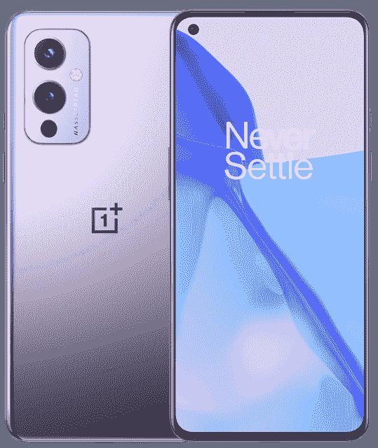
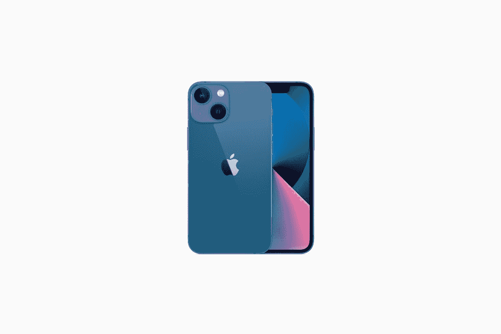
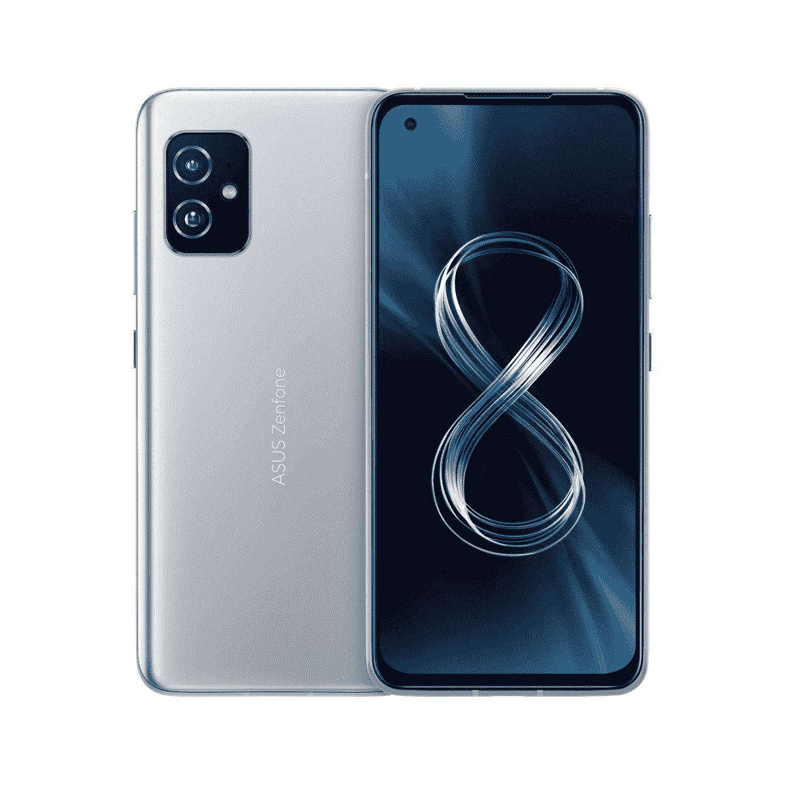
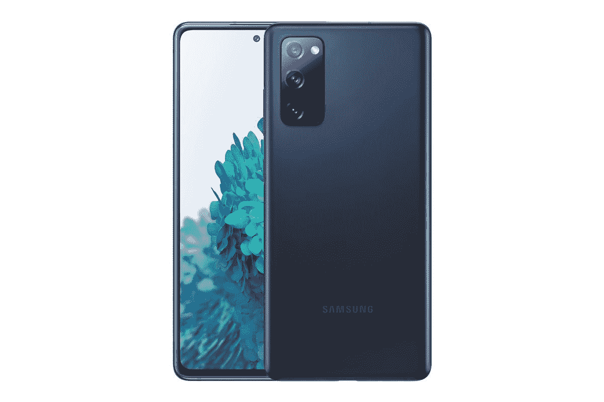

# 2023 年最佳三星 Galaxy S21 FE 替代品

> 原文：<https://www.xda-developers.com/samsung-galaxy-s21-fe-alternatives/>

当我们准备在几周内推出旗舰产品[三星 Galaxy S22](https://www.xda-developers.com/samsung-galaxy-s22/) 系列时，三星宣布了更实惠的 [Galaxy S21 FE](https://www.xda-developers.com/samsung-galaxy-s21-fe/) 。对于那些希望以不那么旗舰的价格获得旗舰体验的人来说，这是一款不错的手机。三星的品牌价值和功能丰富的操作系统可能会迫使一些人选择 Galaxy S21 FE。然而，如果你愿意接受其他选择，这里有你能买到的最好的 Galaxy S21 FE 替代品，它们要么比手机更好，要么提供更好的价值。如果你仍然计划使用三星的产品，看看[最好的 Galaxy 21 FE 交易](https://www.xda-developers.com/samsung-galaxy-s21-fe-deals/)来节省一些钱。

## 1.谷歌像素 6

如果你正在寻找 Galaxy S21 FE 的替代品，这应该是最明显的选择。 [Pixel 6](https://www.xda-developers.com/google-pixel-6/) 位于 Pixel 6 Pro 的正下方，是一款超值产品，这就是为什么许多人甚至会选择 Pixel 6 而不是 Pixel 6 Pro。它有同样的新张量芯片，具有所有的人工智能和人工智能能力。与 Pro 相比，Pixel 6 的显示屏略有下降。尽管有 90Hz 的 OLED 面板，它仍然是一个很好的显示器。后置两个相同的摄像头——一个 50MP 主传感器和一个 12MP 超宽摄像头，但错过了 Pixel 6 Pro 的长焦镜头。

正面的摄像头没有 Pro 上的宽，分辨率也降至 800 万像素。除此之外，标准的 Pixel 6 不会让你错过太多。Pixel 6 也略小于少数人可能更喜欢的 Pixel 6 Pro。Pixel 6 上也有同样的软件支持。电池略小，为 4600 毫安时，但更小的屏幕和更低的刷新率意味着电池寿命将与 Pro 一样好，如果不是更好的话。Pixel 6 的起价仅为 599 美元，是一款超值产品，如果你想要最超值的旗舰产品，大多数人都应该购买这款手机。

如果你在手机上玩很多游戏，搭载骁龙 888 的 Galaxy S21 FE 的性能会稍好一些，但在日常使用中不会有任何明显的差异。Pixel 6 的构建质量更好，虽然你失去了长焦镜头和 120Hz 显示屏，但谷歌在 Pixel 6 上的软件 magic 弥补了这一点。如果你特别喜欢拍很多照片，你会爱上 Pixel 6 的。

 <picture></picture> 

Google Pixel 6

Pixel 6 配备了谷歌新的张量芯片、现代设计和旗舰相机。

## 2.一加 9

一加 9 是一款真正的旗舰智能手机，是 Galaxy S21 FE 的完美替代品。一加从一开始就注重速度，一加 9 也不例外。它的引擎盖下有强大的骁龙 888 芯片组，与美国 Galaxy S21 FE 中的芯片组相同，在国际变体上比 Exynos 2100 更好。如果你想要一部运行速度快、能玩大型游戏的手机，别再犹豫了。

就像 Galaxy S21 FE 一样，一加 9 也有一个全高清+ AMOLED 显示屏，刷新率为 120Hz。后置摄像头由哈苏调整，虽然一加 9 上没有长焦摄像头，但良好的电池续航时间和极快的 65W 充电比化妆更适合它。Galaxy S21 FE 最多只能充电 25W，这与一加的曲速充电技术无法相比。

在撰写本文时，Oneplus 9 也比 Galaxy S21 FE 便宜 100 美元，这是显而易见的。一加也将像三星一样，三年更新一次设备。

 <picture></picture> 

OnePlus 9

##### 一加 9

一加 9 的售价比便宜的 Galaxy S21 FE 便宜 100 美元。

## 3.苹果 iPhone 13 Mini

这可能是 iPhone 13 而不是 Mini，但 iPhone 13 Mini 在价格上更接近 Galaxy S21 FE，这就是为什么推荐的原因。除了显示屏，iPhone 13 Mini 几乎在每个方面都比 Galaxy S21 FE 好。苹果的 A15 Bionic 是一款出色的 CPU，在性能和效率方面都超过了骁龙 888 或 Exynos 2100。iPhone 13 Mini 也有一个玻璃背板，取代了 S21 FE 上的塑料背板。

虽然 Galaxy S21 FE 可能有一个额外的长焦相机镜头，但 iPhone 13 Mini 拍摄的图像和视频质量更好。你将与 iPhone 13 Mini 妥协的一个方面是显示屏。Galaxy S21 FE 的显示屏更大，刷新率为 120Hz。iPhone 13 Mini，顾名思义，5.4 寸小显示屏，刷新率 60Hz。Galaxy S21 FE 的显示屏感觉更现代，更适合内容消费。

也就是说，如果你能扩大预算，我们建议选择标准的 iPhone 13，因为它有更大的显示屏和更好的整体包装。iPhone 13 Mini 的电池寿命也比去年的 12 Mini 有了很大的提高，而且在标准的 iPhone 13 上只会更好。当然，只有当你愿意转向 iOS 时，这一切才会普遍。如果你是一个狂热的 Android 粉丝，你可能会犹豫不决，但如果你不介意 iOS，iPhone 13 或 iPhone 13 Mini 是很好的选择，取决于你的预算。

 <picture></picture> 

iPhone 13 Series

##### 苹果 iPhone 13

iPhone 13 Mini 和标准 iPhone 13 是 Galaxy S21 FE 的绝佳替代品，前提是你愿意改用 iOS。

## 4.华硕 Zenfone 8

华硕 Zenfone 8 是一款紧凑的智能手机，具有强大的规格。它有骁龙 888，就像 Galaxy S21 FE 一样，但最大的区别在于整体外形。如果你喜欢小巧紧凑的设备，Zenfone 8 就是你的选择。它的价格与 Galaxy S21 FE 相似，其余规格也非常相似。显示屏更小，但它拥有相同的 AMOLED 技术和 120Hz 的刷新率，确保了流畅的滚动和性能。

Galaxy S21 FE 的后部有一个额外的长焦摄像头，与 Zenfone 8 上的 4,000mAh 电池相比，电池更大。当然，并不是每个人都喜欢有这么多内容可以在线消费的小显示器。然而，如果你是那些喜欢较小设备的人之一，你肯定应该考虑华硕 Zenfone 8。它目前的零售价略低于 Galaxy S21 FE，为 629 美元。

 <picture></picture> 

Asus Zenfone 8

##### 华硕 Zenfone 8

如果你喜欢小手机，但仍然想要强大的规格，Zenfone 8 可能是一个很好的选择。

## 5.三星 Galaxy S20 FE 5G

惊喜惊喜！去年的 Galaxy S20 FE 5G 仍然是一个很好的选择，比新的 Galaxy S21 FE 提供了更好的价值。它有一个强大的骁龙 865 SoC，一个 120Hz 的 AMOLED 显示屏，一组与 Galaxy S21 FE 类似的摄像头，以及一个 4,500mAh 电池和无线充电支持的良好整体包装。鉴于它属于三星的高级系列手机，你还将获得三年的 Android 版本更新。

假设 Galaxy S21 FE 较新，它将获得额外一年的更新，但这是你可以忽略的事情，特别是如果你计划只使用这款手机 2-3 年。Galaxy S20 FE 上的 5G 支持意味着您也不会错过最新的网络技术。你可以以比 Galaxy S21 FE 低至少 100 美元的价格买到 Galaxy S20 FE，如果你想买特价或二手/翻新设备，你也可以以更低的价格买到它。如果你想节省一些钱，同时从同一品牌获得类似的体验，Galaxy S20 FE 在 2022 年仍然有意义。

 <picture></picture> 

Samsung Galaxy S20 FE

##### 三星 Galaxy S20 FE

Galaxy S20 FE 可能已经有一年的历史了，但仍然是一个可靠的选择，特别是如果你想省钱的话。

## 6.印度的最佳选择:一加 9RT

一加 9RT 是一加最新推出的产品，规格与 Galaxy S21 FE 非常相似。两款手机都有三个摄像头，但 Galaxy S21 FE 有一个更有用的长焦摄像头。两款手机的显示屏也很相似——全高清+ AMOLED 面板，刷新率为 120Hz，自拍相机有一个穿孔。然而，与三星 Galaxy S21 FE 相比，有几个关键的差异使一加 9RT 成为更好的选择。

首先，在印度销售的 Galaxy S21 FE 上的芯片组是 Exynos 2100，它功能强大，但在移动游戏方面并不出色。如果你玩了很多像 BGMI 和 Genshin Impact 这样的大型游戏，你会发现游戏性能有所下降。另一方面，一加 9RT 装有骁龙 888 芯片组，功能更强大，可以轻松处理繁重的任务。一加 9RT 的另一个方面是 65W 的翘曲充电，超过了 Galaxy S21 FE 上的 25W 充电支持。

总的来说，与 Galaxy S21 FE 相比，一加 9RT 似乎是一款更全面的手机，也提供了更好的价值。

 <picture></picture> 

OnePlus 9RT

##### 一加 9RT

与 Galaxy S21 FE 相比，一加 9RT 以骁龙 888 的形式为您提供了更好的芯片组和更快的充电速度，使其成为在印度购买的更物有所值的设备。

* * *

这些是一些最好的三星 Galaxy S21 FE 替代品，你可以在大约 600-700 美元的类似价格点购买。列表中提到的所有手机都物有所值，所以你可以挑选你最感兴趣的一款。如果你想要最好的相机，你可以选择 Pixel 6。如果你想要快速充电的稳定性能，一加 9 是一个很好的选择。如果你不介意切换到 iOS，并且想要一个紧凑的设备，iPhone 13 Mini 应该是你的选择。如果你想继续使用 Galaxy S21 FE，我们[建议为它挑选一个外壳](https://www.xda-developers.com/best-samsung-galaxy-s21-fe-cases/)。

你认为这些设备中的哪一个是 Galaxy S21 FE 的完美替代品？请在下面的评论中告诉我们！