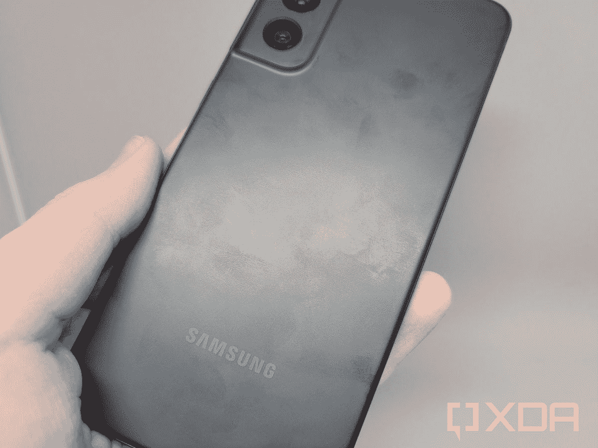

# 三星 Galaxy S21 FE 评测:好手机，价格不对

> 原文：<https://www.xda-developers.com/samsung-galaxy-s21-fe-review/>

Galaxy S20 FE(粉丝版)在发布时是 2020 年最好的智能手机之一。这不是因为它有令人难以置信的摄像头或独特的硬件功能，而是因为它以低得多的价格带来了 Galaxy S 系列的一些最好的功能。虽然主要的 Galaxy S 手机接近或超过 1000 美元，但 Galaxy S20 FE 在发布时的价格为 699 美元，通常会降至 550 美元。旗舰级智能手机在美国很难买得起，三星决定在许多以前只有基于 Exynos 的 Galaxy 手机的地区推出骁龙驱动的机型，这也使它在国际上获得了成功。对于这些地区，你最终可以获得一款采用骁龙处理器的三星旗舰，这意味着你可以在它上面玩得比在该地区的主要 S 系列旗舰上玩得更好。

对于银河 S21 FE 来说，几乎不可能重复同样的兴奋和成功，特别是在[似乎推迟了几个月](https://www.xda-developers.com/samsungs-galaxy-s21-fe-delayed-changing-socs/)之后。这款手机最终成功通过了终点线，但随着一年前的硬件和 [Galaxy S22](https://www.xda-developers.com/samsung-galaxy-s22/) 的发布只有几天了，没有多少理由以 699.99 美元的预定起价购买这款手机。

### 三星 Galaxy S21 FE 规格。点击放大。

| 

规格

 | 

银河 S21 FE

 |
| --- | --- |
| **构建** | 塑料背，金属框架 |
| **尺寸&重量** | 

*   155.7 x 74.5 x 7.9 毫米
*   177 克

 |
| **显示** | 

*   6.4 英寸 FHD+ AMOLED
*   2340 x 1080
*   120 赫兹刷新率

 |
| **SoC** | 

*   美国:高通骁龙 888
*   国际:Exynos 2100

 |
| **闸板&存放** | 

*   6GB 内存/128GB 存储空间
*   8GB 内存/256GB 存储空间
*   没有 microSD 卡插槽

 |
| **电池&充电** | 

*   4500 毫安时电池
*   25W 有线快速充电
*   15W 无线充电
*   4.5W 反向无线充电

 |
| **安全** | 显示指纹扫描仪 |
| **后置摄像头** | 

*   主要:12MP，f/1.8，120˚ FoV
*   广角:12MP，f/2.2，123 FoV
*   长焦:800 万像素，f/2.4，32 FOV

 |
| **前置摄像头** | 32MP，f/2.2，81 视场角 |
| **端口** | 

*   USB 类型-C
*   没有耳机插孔

 |
| **音频** | 立体声扬声器 |
| **连通性** | 

*   Sub6/mmWave 5G
*   4G LTE
*   Wi-Fi 802.11 a/b/g/n/ac/x(双频)
*   蓝牙 5.0
*   超宽带

 |
| **软件** | 一个 UI 4.0/Android 12 |
| **其他特性** | 

*   支持 NFC 的 Samsung Pay
*   IP68 等级

 |

***关于本文:**三星一月份给我们发了一部 Galaxy S21 FE 来评测。该公司对这篇文章的内容没有任何意见。*

## 设计和硬件

Galaxy S21 FE 的尺寸为 155.7 x 74.5 x 7.9 毫米，比 Galaxy S21 稍大，但比 Galaxy S21 Plus(和 Galaxy S21 Ultra)小。它不是最大的手机，但也绝对不小。

几乎手机的整个正面都被 6.4 英寸的 AMOLED 屏幕覆盖，除了屏幕顶部居中的打孔自拍相机和底部的小下巴。显示屏分辨率与 Galaxy S21 几乎相同(Galaxy S21 FE 的分辨率为 2340 x 1080，Galaxy S21 的分辨率为 2400 x 1080)，最大刷新率也是 120Hz。我对 Galaxy S21 FE 上的屏幕没有任何抱怨——它和普通 Galaxy S21 上的显示器一样高质量，黑色很深，颜色很鲜艳。

我对屏幕没有任何抱怨。

后壳是塑料材质，就像 Galaxy S20 FE 和普通 Galaxy S21 一样。然而，与这两款手机不同的是，相机阵列的两侧融入了外壳的其余部分。就我个人而言，我不会花太多时间看我的手机背面，但有些人似乎喜欢这种微妙的变化。我对后壳的一个抱怨是，它容易收集指纹——即使在我这里的深色“石墨”型号上，污迹在白天也很容易看到。我不能测试其他颜色的选择是否更好，但如果你打算买一个箱子，那就没什么关系了。

 <picture></picture> 

Fingerprint smudges after about a week of usage

手机右侧是电源和音量按钮，底部是 USB Type-C 端口、主扬声器、主麦克风和 SIM 卡插槽。遗憾的是，没有耳机插孔或 microSD 卡插槽，尽管 Galaxy S20 FE 确实有一个 microSD 插槽。在美国上市的机型(至少 SM-G990U1/DS)支持双卡，这在美国主流 Android 手机上很少见，但 T2 三星还没有启用该功能。在那之前，你只能使用普通的单一 SIM 卡，就像三星的大多数其他美国手机一样。

Galaxy S21 的一个有益升级是更大的电池。S21 FE 中的 4500 毫安时电池可以轻松支持我一整天的适度使用，并且您还可以获得 25W 有线快速充电、15W 无线充电和 4.5W 反向无线充电。这没有 T4 一加 9 系列 T5 的 65W 有线充电快(其他一些手机 T7 比它快)，但我会整夜给手机充电，所以这对我来说不是什么大问题。

## 三星 Galaxy S21 FE:性能和软件

Galaxy S21 FE 在美国有高通骁龙 888 系统芯片，在其他地方几乎都有三星 Exynos 2100 SoC。这与 Galaxy S21 系列中的芯片组相同，在这一点上已经超过一年了。这并不是说这款手机不快，因为它和其他骁龙 888 手机一样快，反应也一样快，但不可否认的是，花 700 美元购买一年前的硬件并不是最划算的。

不可否认，花 700 美元购买一年前的硬件并不划算。

三星只在基本型号 Galaxy S21 FE 上配备了 6GB 内存，低于 Galaxy S20 FE 和 Galaxy S21 FE 上的 8GB 内存。对于应用程序之间的典型切换来说，这仍然是足够的内存，但同样，这款手机的价格与一年半前*的 FE 手机(8GB)一样高。*

在软件体验方面，Galaxy S21 FE 拥有与最近三星手机相同的 UI 软件包。这是三星第一款开箱即用的 UI 4 手机(基于 [Android 12](https://www.xda-developers.com/android-12/) ),该公司正在[将其慢慢推广到其他设备](https://www.xda-developers.com/tag/samsung-one-ui-4/)。你可以获得 Android 12 中提供的一切，例如你主题化的新的[全系统材料](https://www.xda-developers.com/material-you-monet-theme-engine/)，结合定制的系统设计和几十个三星制造的应用程序和服务。

One UI 可能仍然不是每个人都喜欢的 Android 风格，但在这一点上我对它的抱怨相对较少——[三星去年表示，它将开始从 One UI 中删除广告](https://www.xda-developers.com/samsung-removing-ads-one-ui-stock-apps/)，至少在我们的美国型号上，我没有注意到任何类似的事情，所以这是一个进步。

Galaxy S20 FE 包含在三星承诺的三次 Android 操作系统升级和四年安全补丁中。这意味着手机应该在 Android 13、14 和 15 可用后接收它们，并且你最早要到 2026 年的某个时候才能获得重要的安全补丁。

## 三星 Galaxy S21 FE:相机

Galaxy S21 FE 上有三个后置摄像头:12MP 超宽摄像头、12MP 主摄像头和 8MP 长焦摄像头。这几乎与普通 Galaxy S21 的设置相同，只有一个重要的区别——普通 Galaxy S21 的长焦分辨率要高得多，为 64MP。如果你想看两者之间的一些相机样品，请查看我们的[对比贴](https://www.xda-developers.com/samsung-galaxy-s21-vs-samsung-galaxy-s21-fe/)。

**[点击此处观看全分辨率图像](https://imgur.com/a/XZatbxo)**

由于这几乎是与 Galaxy S21 相同的相机配置，并且因为 Galaxy S21 通常可以拍摄出优秀的照片，所以你也不会对 Galaxy S21 FE 有任何抱怨。色彩有时有点饱和，夜间性能不是业界最好的，但整体照片质量很好。还有一个 32MP 自拍相机，像大多数最新的三星旗舰和中端手机一样，它位于顶部的一个打孔切口中。

## 结论

三星 Galaxy S21 Fan Edition 是真空中的一款出色的智能手机，我可以毫无问题地将它用作我的日常手机。性能很棒，显示屏大而生动，照片质量也不错，三星承诺的三大 Android OS 更新是目前 Android 世界中最好的。在过去的一年里，我很喜欢使用基本型号 Galaxy S21，这几乎是同一款设备。

没有人应该为这部手机支付全价。

但是，这款手机*绝对*不值 699.99 美元。Galaxy S20 FE 在 2019 年上市时也是同样的价格，但它也几乎完美地定位在 Galaxy S20 系列和 Galaxy S21 系列发布的中间。对于那些在更好的交易出现之前推迟购买 S20 的人来说，这是一个很好的选择。与此同时，Galaxy S21 FE 就在预计推出的 [Galaxy S22](https://www.xda-developers.com/samsung-galaxy-unpacked-february/) 系列之前上市，其芯片组现已超过一年。它在某些方面也是早期 Galaxy S20 FE 的降级，内存更少，没有 microSD 卡插槽。因为这款手机模仿了 Galaxy S21 系列的 Exynos-骁龙分裂，所以 exy nos 的地区也没有来自高通的更好的处理器可以期待。

一款与 Galaxy S21 几乎相同的手机，三星要价 700 美元，一年前刚上市时是 800 美元，但频繁的销售使这款手机降到了[700 美元](https://www.xda-developers.com/samsung-galazy-s21-flat-deal/)或[650 美元](https://www.androidpolice.com/2021/02/27/grab-a-samsung-galaxy-s21-for-650-150-off/)。没有人应该为这款手机支付全价，即使你可以从运营商那里获得优惠的折价交易或折扣，三星也可能在未来一两个月内为 Galaxy S22 提供类似的折扣。正如我所说，这是一部好手机，但时机让它处于一个相当尴尬的位置。

如果即将推出的 Galaxy S22 系列最终明显比这款手机贵([这似乎不太可能](https://www.xda-developers.com/galaxy-s22-european-pricing-leak/))，或者价格在你的国家更合理，你不会对 Galaxy S21 FE 有太多抱怨。

 <picture></picture> 

Samsung Galaxy S21 FE

##### 三星 Galaxy S21 FE

三星最新的廉价旗舰手机是一款很棒的手机，只要你能买到它就行。