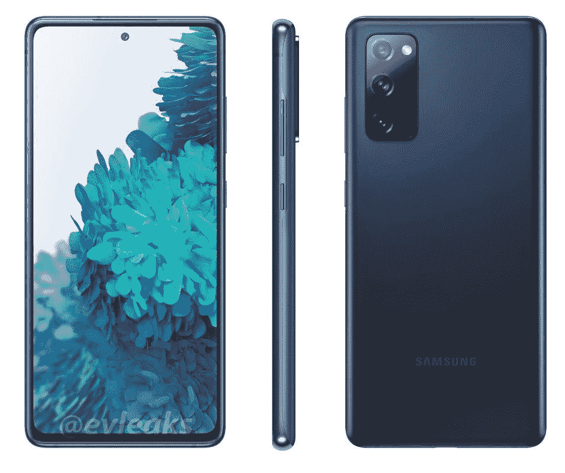

# 赶快在这个黄金日购买 Galaxy S21 FE 和 S20 FE，享受七折优惠

> 原文：<https://www.xda-developers.com/samsung-galaxy-s21-fe-s20-fe-amazon-prime-day-deal/>

三星将其旗舰产品 Galaxy S22 系列打折至超低价格，用于亚马逊 Prime Day(T1)销售，但这并不是唯一大幅打折的智能手机。如果你一直想买一个，但不知何故错过了太多的降价机会，现在你有了另一个机会。这家韩国 OEM 厂商正在为其“粉丝版”手机提供疯狂的折扣，包括 Galaxy S21 FE 和 Galaxy S20 FE。

## 银河 S21 FE

Galaxy S21 FE 可能是最后一代手机，但今天仍然是一款很好的手机——这要归功于 Prime Day 交易，该交易将 6GB 和 8GB RAM 版本的价格都带到了创纪录的低价。当三星今年年初推出这款手机时，我们主要对手机的价格感到失望:基本 6GB RAM/128GB 存储版本为 700 美元。尽管价格不菲，但我们确实喜欢 Galaxy S21 FE。它有一个很棒的设计，有一些恒星的颜色选择，一个清晰的 AMOLED 显示屏，具有流畅的 120Hz 刷新率，一个像样的摄像头，出色的性能，持久的电池寿命，快速充电，使其成为[最好的三星 Galaxy 手机之一](https://www.xda-developers.com/best-samsung-phones/)。

 <picture></picture> 

Samsung Galaxy S21 FE

##### 三星 Galaxy S21 FE

Galaxy S21 FE 是三星 2022 年的预算旗舰，现在售价为 539 美元，比原价节省了 231 美元。

三星最初承诺三个主要的 Android 操作系统更新和四年的安全补丁，但后来修改为[四个 Android 更新和五年的安全更新](https://www.xda-developers.com/samsung-promises-four-android-os-upgrades-flagships/)。Galaxy S21 FE 配有 Android 12，因此当 Android 13、14、15 和 16 可用时，它应该会收到这些版本。毫无疑问，对于低于 550 美元的手机来说，这是一个很长的支持期。

## 银河 S20 FE

Galaxy S20 FE 于 2020 年推出，是一款预算稳健的旗舰设备，配备 120Hz AMOLED 面板和 4,500mAh 大电池。由于高通骁龙 865 芯片组，加上高达 8GB 的内存和 256GB 的内部存储，您今天支付的费用也可以获得出色的 5G 接收。这款手机在美国的无锁版零售价格通常为 670 美元(256GB 型号)，但亚马逊目前将它打折了 201 美元，仅售 469 美元，这使得它更加实惠。

 <picture></picture> 

Samsung Galaxy S20 FE

##### 三星 Galaxy S20 FE

如果你想进一步削减一些成本，同时仍然获得一部相对现代和强大的智能手机，Galaxy S20 FE 值得一看。

总的来说，如果你想在市场上买一款不是来自一加或谷歌的平价安卓旗舰机，这可能是你最好的选择。在此之后，将不会有太多机会获得新的和便宜的 Galaxy S21 FE 或 S20 FE，所以如果你想购买它们中的任何一个，请尽快准备好。