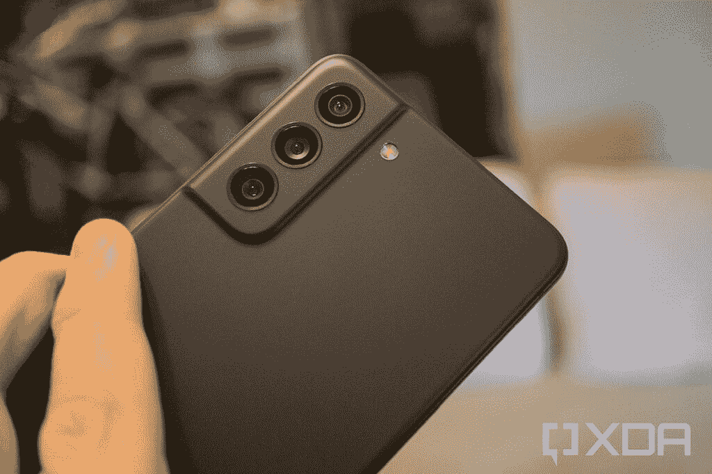

# 三星 Galaxy S21 FE vs 一加 9:该买哪款手机？

> 原文：<https://www.xda-developers.com/samsung-galaxy-s21-fe-vs-oneplus-9/>

Galaxy S21 FE 凭借强大的内部功能和开箱即用的最新 Android 版本，延续了三星在预算旗舰领域的势头。正如我们在 [Galaxy S21 FE 评论](https://www.xda-developers.com/samsung-galaxy-s21-fe-review/)中提到的，它现在可能不会提供最佳价值，但这种情况有望很快改变。这款手机有很多令人喜欢的地方，我们一直认为它是目前超值旗舰产品中的主流选择。在本文中，我们将看看[三星 Galaxy S21 FE](https://www.xda-developers.com/samsung-galaxy-s21-fe/) vs [一加 9](https://www.xda-developers.com/oneplus-9/) 的对比，看看哪个更好。

一加 9 不是该品牌的最新旗舰产品，但我们认为它的老化程度相当不错。这在很大程度上归功于骁龙 888 带来的流畅体验。你还可以获得一些可爱的添加剂，包括 65W 快速充电支持，120Hz AMOLED 面板，以及一套利用哈苏色彩科学的像样的相机。但这款手机总体上有多好，是否值得以大约 30%的价格购买像 Galaxy S21 FE 这样的手机。让我们找出答案。

**浏览本文:**

## 三星 Galaxy S21 FE vs 一加 9:规格

在我们开始比较之前，让我们快速浏览一下规格，了解每款智能手机的特点:

| 

**规格**

 | 

**三星 Galaxy S21 FE**

 | 

**一加 9**

 |
| --- | --- | --- |
| **构建** |  | 

*   玻璃纤维增强聚合物框架
*   大猩猩玻璃 5 正面和背面

 |
| **尺寸&重量** | 

*   155.7 x 74.5 x 7.9mm 毫米
*   177 克

 | 

*   北美/欧洲:
*   印度/中国:

 |
| **显示** | 

*   6.4 英寸 FHD+动态 AMOLED 2X
*   2340 x 1080p 像素
*   120 赫兹刷新率
*   240Hz 触摸采样率

 | 

*   6.55 英寸 FHD+ AMOLED (2400 x 1080)
*   402PPI
*   20:9 宽高比
*   120 赫兹刷新率
*   1100 尼特峰值亮度
*   支持 sRGB 和 DCI-P3 色彩空间
*   HDR10+
*   自动色温调节
*   大猩猩玻璃 5

 |
| **SoC** | 

*   美国:高通骁龙 888
*   国际:Exynos 2100

 | 

*   高通骁龙 888
    *   1 个 Kryo 680(基于 ARM Cortex X1)Prime core @ 2.84 GHz
    *   3 个 Kryo 680(基于 ARM Cortex A78)性能内核@ 2.4GHz
    *   4 个 Kryo 680(基于 ARM Cortex A55)高效内核@ 1.8GHz
*   Adreno 660 GPU

 |
| **风筒&储存** |  | 

*   8GB LPDDR5 内存+ 128GB UFS 3.1 存储
*   12GB + 256GB

 |
| **电池&充电** | 

*   4500 毫安时
*   25W 快速充电
*   15W Qi 无线充电
*   反向无线充电

 | 

*   4500 毫安时电池
*   65W 有线快速充电(29 分钟内 1-100%)
*   45W 有线快速充电(USB PD)
*   15W Qi 无线充电(仅限北美/欧洲)
*   附带 Warp Charge 65T 充电器(支持高达 45W 的 USB PD 或 PPS，适用于非一加设备)

 |
| **安全** | 

*   显示指纹扫描仪
*   三星 Knox

 | 显示指纹扫描仪 |
| **后置摄像头** | 

*   主要:1200 万像素，f/1.8，双像素自动对焦，OIS
*   超宽:12MP，f/2.2，123 FoV
*   长焦:800 万像素，f/2.4，3 倍光学，30 倍空间变焦，OIS

 | 

*   主要:48MP 索尼 IMX689，f/1.8，EIS，PDAF+咖啡馆
*   辅助:50MP 索尼 IMX766 超宽、f/2.2、自由镜头
*   第三级:2MP 单色传感器
*   双 LED 闪光灯
*   视频:8K 视频@ 30fps4K 视频@ 30/60 fps 慢动作:720p @480fps，1080p @ 240fps

 |
| **前置摄像头** | 32MP，f/2.2 | 16MP 索尼 IMX471，f/2.4，FF，EIS |
| **港口** | USB 类型-C | USB 3.1 第一代 C 类 |
| **音频** | 

*   立体声扬声器
*   杜比大气

 | 

*   双立体声扬声器
*   噪声消除支持
*   杜比全景声认证

 |
| **连通性** | 

*   Sub6/mmWave 5G
*   4G LTE
*   双频 Wi-Fi 802.11 a/b/g/n/ac/x
*   蓝牙

 | 

*   LTE 4×4 MIMO
*   SA/NSA 5G
*   Wi-Fi 6 2×2 MIMO(双频带)
*   蓝牙 5.2 (aptX、aptX HD、LDAC、AAC 支持)
*   国家足球联盟
*   GPS (L1+L5 双频)、GLONASS、伽利略、北斗、A-GPS

 |
| **软件** | 基于 Android 12 的 OneUI 4.0 | 基于 Android 11 的 OxygenOS 11 |
| **其他特性** | 

*   支持 NFC 的 Samsung Pay
*   IP68 等级

 | 

*   IP68 防尘防水等级(仅限 T-Mobile 版本)
*   警报滑块
*   升级的触觉电机
*   一加酷玩冷却系统(五层系统，带有一个蒸汽室以及石墨和铜层)

 |

从规格来看，可以肯定地说，三星 Galaxy S21 FE 与一加 9 的比较将是一场势均力敌的比赛。两款手机的内部硬件非常相似，只有一些微小的差异。看看它们在不同部分如何相互叠加会很有趣，所以让我们来看看。

## 设计和制造质量

从设计开始，我们会说三星为 Galaxy S21 FE 设计了一个最小的美学，而一加 9 有一个苗条的身体。两款手机看起来都很现代，但一加 9 用更多优质材料展示了它的旗舰地位。Galaxy S21 FE 采用塑料背面和金属框架，而一加 9 是玻璃夹层，中间是玻璃纤维增强聚合物框架，正面和背面都是大猩猩玻璃 5。即使你错过了玻璃背面，我们也要说 Galaxy S21 FE 有更坚固的底盘。

自然，一加 9 也是这次比较中最重的手机，重达 192 克。它的厚度也是 8.7 毫米。如果你倾向于更轻更薄的手机，你必须选择 Galaxy S21 FE，因为它重 177 克，厚度仅为 7.9 毫米。哑光表面也使这款手机更容易握持和使用。

三星 Galaxy S21 FE 有一系列有趣的彩色可供选择，包括薰衣草色、橄榄色、白色和石墨色。它也是仿照 Galaxy S21 系列设计的，所以你可以在背面获得轮廓切割设计，后置摄像头外壳融入底盘。相比之下，一加 9 的设计更加华丽。你可以在星光黑，冬季薄雾，北极天空配色，所有这些都是为了吸引眼球而设计的。你还可以在背面看到一个非常标准的带有哈苏商标的相机模块。一加 9 配备了粉丝最喜欢的提醒滑动条，这是我们多年来越来越喜欢的功能。对许多人来说，背面或美学上的差异不一定是交易的破坏者，因为他们会以保护设备的名义用外壳覆盖它。如果你打算使用一个案例，我们强烈建议你这样做，那么一定要查看我们收集的[最佳 Galaxy S21 FE 案例](https://www.xda-developers.com/best-samsung-galaxy-s21-fe-cases/)和[最佳一加 9 案例](https://www.xda-developers.com/best-oneplus-9-cases/)，找到一些可靠的选项。

至于耐用性，三星 Galaxy S21 FE 的所有型号都具有 IP68 等级，而只有 T-Mobile 版的一加 9 具有 IP68 防尘和防水性能。其他领域也有类似的限制。例如，印度版的一加 9 就没有无线充电功能。然而，Galaxy S21 FE 并非如此，因为所有型号都具有 IP68 防护等级并支持无线充电。这两款手机都没有 3.5 毫米耳机插孔或 microSD 卡插槽。考虑到如今大多数旗舰手机都不允许你从外部扩展存储空间，或者在没有适配器的情况下使用一对有线耳塞或耳机，这并不奇怪。

## 显示

移动到前面，在这次比较中，两款手机都有 120 赫兹的 AMOLED 屏幕，一加 9 略大。Galaxy S21 FE 采用 6.4 英寸 FHD+动态 AMOLED 2X，而一加 9 采用 6.55 英寸 FHD+ AMOLED 面板。两款手机的前面板上也有一个穿孔摄像头。Galaxy S21 FE 的摄像头位于显示屏的顶部中央，而一加 9 的摄像头位于左上角。我们正在寻找这一细分市场中最好的两个显示屏，我们认为您绝对不会对这两款手机的显示屏有任何抱怨。您可以在两个面板上获得 HDR 10+支持，支持高刷新率和良好的亮度水平。

 <picture></picture> 

Galaxy S21 FE

这两款手机还配备了显示指纹扫描仪，它们都非常快速可靠。值得指出的是，Galaxy S21 FE 因其前玻璃面板采用了大猩猩玻璃而获得了一些印象分。另一方面，一加 9 采用了大猩猩玻璃 5 面板。我们预计“新”大猩猩玻璃 Victus 会更有弹性，但不言而喻，你可能需要使用屏幕保护器。这些都是玻璃面板，在一天结束的时候，如果受到重大撞击，它们肯定会破碎。你可以看看我们收集的[最佳 Galaxy S21 FE 屏幕保护器](https://www.xda-developers.com/best-samsung-galaxy-s21-fe-screen-protectors/)来找到一些好的选择。

## 内部硬件

三星 Galaxy S21 FE 和一加 9 都以这个价格提供了一套很好的内部组件，这是这类手机最大的吸引力之一。我们正在考虑两款手机中的骁龙 888 SoC，它以在大多数日常工作负载中提供可靠的性能而闻名。Galaxy S21 FE 在包括印度在内的大多数全球市场使用内部的 Exynos 2100，但这也与骁龙 888 芯片相当。比如说，在运行一个基准测试应用程序或一些资源密集型应用程序时，您肯定会看到一些性能差异，但在每种情况下，总体性能都应该非常出色。

这两款设备的基本版本将为您提供 8GB 内存和 128GB 存储空间，因此没有区别。虽然 Galaxy S21 FE 在某些市场上只配备了 6GB 的 RAM，但请记住这一点。Galaxy S21 FE 的顶级版本配备了 8GB 内存和 256GB 存储空间，而一加 9 的顶级版本配备了 12GB 内存和 256GB 存储空间。同样值得一提的是，在北美，Galaxy S21 FE 标准支持 Sub-6 和 mmWave 5G，但如果你选择运营商版本，你只能在一加 9 上获得 mmWave 5G 选项。未锁定的型号仅限于 6 级以下，因此在做出购买决定时请记住这一点。

最后，还有电池寿命的话题。这两款对比手机内部都装有 4，500 毫安时的电池，应该足够使用一整天而不会出现任何问题。然而，一加 9 号比 Galaxy S21 FE 有优势，因为它的电池。首先，它支持 65W 有线充电，只需 30 多分钟即可充满手机电池。Galaxy S21 FE 具有 25W 的快速充电功能，需要一个多小时才能完成。值得注意的是，你还必须为 Galaxy S21 FE 单独购买一个充电器，因为它不包含在包装盒中。谢天谢地，一加还没有跟上这个趋势，所以你仍然可以在盒子里找到充电器。

另外值得指出的是，三星 Galaxy S21 FE 的所有型号都支持 15W Qi 无线充电和反向无线充电。然而，只有北美和欧洲版本的一加 9 支持无线充电，而印度版本明显缺乏这一功能。

## 照相机

三星 Galaxy S21 FE 采用三摄像头设置，包括 12MP 主镜头、12MP 广角摄像头和 8MP 模块，提供 3 倍光学变焦。它不完全是旗舰机型上的 100 倍空间缩放功能，但它能够进行 30 倍空间缩放。OIS 的支持也让这变得更加容易。一加 9 配有一个 4800 万像素的主摄像头，一个 5000 万像素的广角镜头和一个 200 万像素的单色摄像头。哈苏相机是一加 9 的美国专利之一。不过，一加只是利用了哈苏的颜色科学。正如我们在[一加 9 相机评论](https://www.xda-developers.com/oneplus-9-camera-review/)中提到的，哈苏色彩科学已经提高了相机的整体性能。它可能不是最好的射手，但它肯定能带来令人耳目一新的拍照体验。

 <picture></picture> 

Galaxy S21 FE

由于 Galaxy S21 FE 的相机配置几乎与 Galaxy S21 相同，并且因为 Galaxy S21 通常可以拍摄出色的照片，我们认为您也不会对 S21 FE 有任何问题。再说一次，它没有因为捕捉到目前最好的照片而获得任何奖项，但整体照片质量非常好。我们将在下面添加一些使用两款手机拍摄的相机样本，请务必看一看，看看您最喜欢哪一款。

Galaxy S21 FE 的前面有一个 32MP 的自拍相机，而一加 9 配有一个 16MP 的索尼 IMX471 自拍相机。在视频录制方面，Galaxy S21 FE 可以在所有相机上捕捉 4K@30fps 的视频，而 4K@60fps 仅适用于主相机和自拍相机。一加 9 也可以录制 4K@60fps 视频，但它在支持 8K@30fps 视频方面略有优势。

**三星 Galaxy S21 FE 相机样品**

**一加 9 号相机样品**

## 三星 Galaxy S21 FE vs 一加 9:你该买哪个？

三星和一加都有超值旗舰产品，分别是 Galaxy S21 FE 和一加 9。凭借 S21 FE，三星成功提供了出色的整体体验，尽管有点贵。如果你忽略它的价格标签，那么 Galaxy S21 FE 对于那些希望购买价值不超过 1000 美元的旗舰智能手机的人来说似乎是显而易见的。一加 9 也是如此，但一加的软件方面有一点不确定性。

Galaxy S21 FE 自带基于 Android 12 的 OneUI 4.0，而一年前推出的一加 9 则自带 Android 11。这两款设备都将获得三年的 Android 更新，这意味着 Galaxy S21 FE 将切换到 Android 15(或当时的名称)，而一加 9 将看到 Android 14。即使你不打算在未来三年内使用 Galaxy S21 FE，但它保证会在 Android 12 之后获得三次重大更新这一事实意味着它在转售市场上的价值只会增加一点点。但是如果你不介意，那么你也不会对一加 9 失望。它提供了可靠的性能，提供了一套良好的相机，也是一个伟大的显示器。一加 9 的价格比 Galaxy S21 FE 低 100 美元，这也是一个很好的选择。我们预计三星未来会降低 S21 FE 的价格，但你可以决定是否要等待不可避免的降价。

 <picture></picture> 

Samsung Galaxy S21 FE

##### 三星 Galaxy S21 FE

三星最新的廉价旗舰手机是一款很棒的手机，只要你能买到它。

 <picture></picture> 

OnePlus 9

##### 一加 9

香草一加 9 是为那些谁想要旗舰性能，但不想支付最高美元。

你可以通过上面提到的链接查看这两款手机。我们还鼓励您访问我们的[最佳 Galaxy S21 FE 交易](https://www.xda-developers.com/samsung-galaxy-s21-fe-deals/)和[最佳一加 9 交易](https://www.xda-developers.com/best-oneplus-9-deals/)页面，看看您是否可以在购买时获得不错的折扣。或者，你也可以现在就查看我们收集的[最佳安卓手机](https://www.xda-developers.com/best-android-phones/)，看看哪些手机在安卓生态系统中占据榜首。