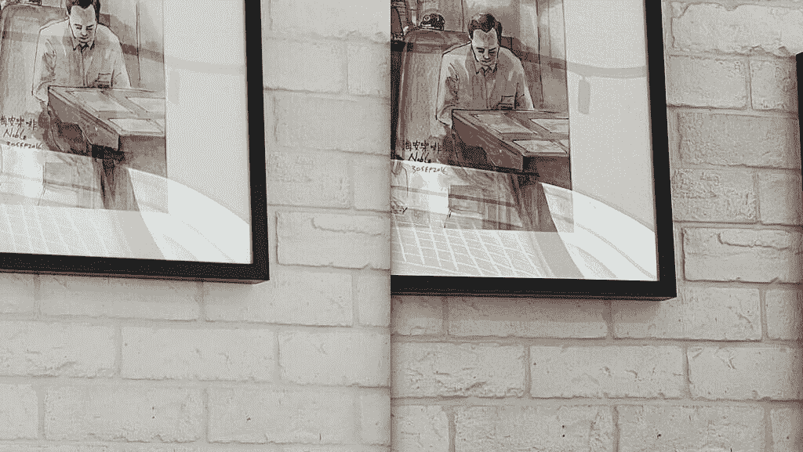
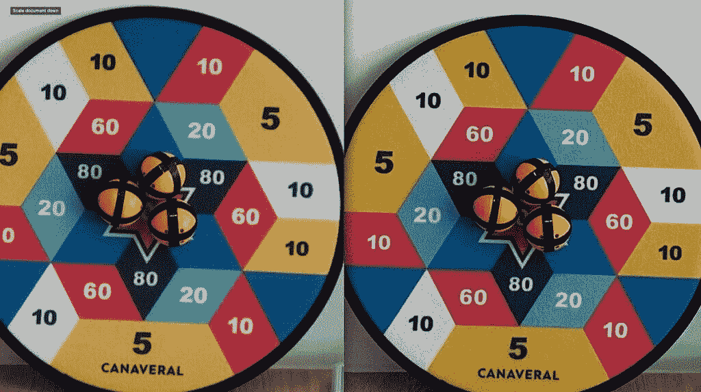
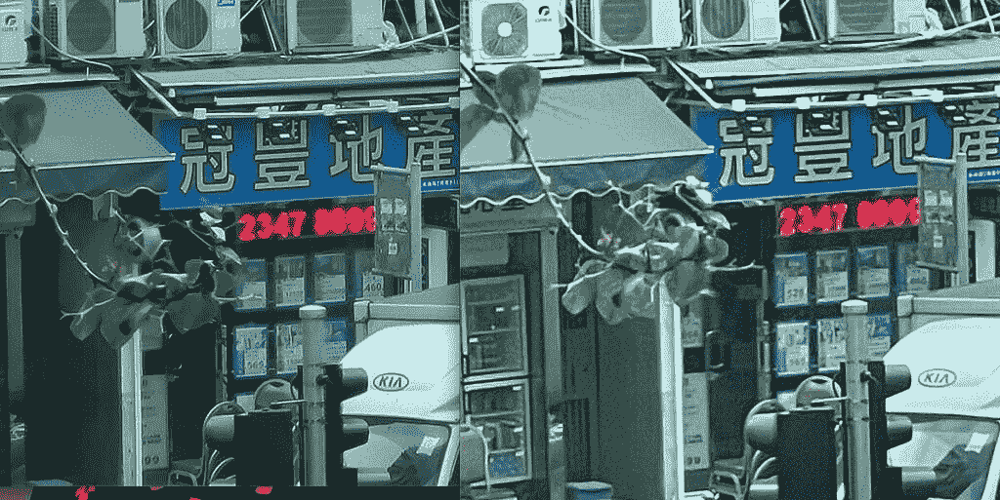
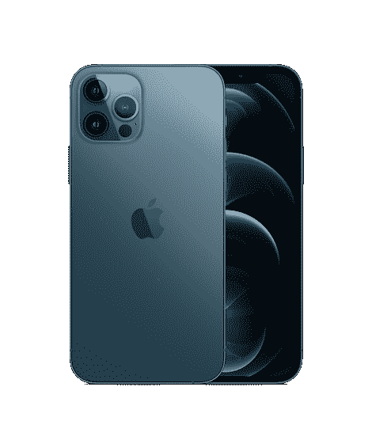

# 三星 Galaxy S21 Plus vs 苹果 iPhone 12 Pro:该买哪款旗舰？

> 原文：<https://www.xda-developers.com/samsung-galaxy-s21-plus-vs-iphone-12-pro/>

三星的 [Galaxy S 系列](https://www.xda-developers.com/samsung-galaxy-s21/)通常是安卓智能手机的旗手——尤其是在北美——因此人们很自然地将它们与苹果的[iphone 相提并论。](https://www.xda-developers.com/apple-iphone-12-series/)在这次比较中，我们将让苹果和三星的最新旗舰产品这两款“中等”设备相互竞争——与 [iPhone 12 Pro](https://www.xda-developers.com/apple-iphone-12-review/) 相比，[三星 Galaxy S21 Plus](https://www.xda-developers.com/samsung-galaxy-s21/) 表现如何？

## 三星 Galaxy S21+ vs 苹果 iPhone 12 Pro:规格和对比

| 

规范

 | 

三星 Galaxy S21+

 | 

苹果 iPhone 12 Pro

 |
| --- | --- | --- |
| **构建** | 

*   铝制中框
*   大猩猩玻璃背
*   大猩猩玻璃 Victus 正面

 | 

*   不锈钢中框
*   玻璃正面和背面
*   用于玻璃保护的“陶瓷护罩”

 |
| **尺寸&重量** | 

*   161.4 x 75.6 x 7.8mm 毫米
*   202 克

 | 

*   7.4 x 146.7 x 71.5mm 毫米
*   187 克(全球)
*   189 克(美国)

 |
| **显示** | 

*   6.7 英寸 FHD+动态 AMOLED 2X 显示屏
*   2400 x 1080 像素
*   394 PPI
*   120Hz 可变刷新率
*   20:9 宽高比
*   1300 尼特峰值亮度
*   HDR10+
*   始终显示
*   无限显示

 | 

*   6.1 英寸超级视网膜 XDR 有机发光二极管显示屏
*   2，532 x 1，170 分辨率，460 PPI

 |
| **SoC** | 

*   **国际:** Exynos 2100:
    *   1 个内核，2.9GHz 以上
    *   3 个内核@ 2.8GHz 以上
    *   4 个内核@ 2.4GHz
*   美国和中国:高通骁龙 888

 |  |
| **Ram &存储选项** |  | 

*   128GB(内存未透露)
*   256GB(内存未披露)
*   512GB(内存未披露)

 |
| **电池&充电** | 

*   4800 毫安时
*   25W USB 供电 3.0 快充
*   15W 无线充电
*   4.5 反向无线充电
*   在大多数地区，包装盒中没有充电器

 | 

*   2，815 毫安时电池，符合认证列表
*   带 MagSafe 的 15W 无线充电
*   7.5W Qi 无线充电
*   盒子里没有充电器

 |
| **安全** | 超声波显示指纹扫描仪 | Face ID(原深感摄像头面部识别) |
| **后置摄像头** | 

*   **初级:** 12MP，广角镜头，f/1.8，1/1.76”，1.8 m，OIS，双像素 PDAF
*   **次要:** 12MP，超广角镜头，f/2.2，1/2.55”，1.4 m
*   **第三:** 64MP，长焦镜头，f/2.0，1/1.76”，0.8 米，OIS PDAF

 | 

*   **主要:** 12MP
*   **次要:** 12MP，超广角
*   **第三:** 12MP 长焦

 |
| **前置摄像头** | 100 万像素，f/2.2，1.22 米，双像素 PDAF | 12MP，f/2.2 |
| **端口** | USB 3.2 类型 C | 专有闪电端口 |
| **连通性** | 

*   蓝牙 5.1
*   国家足球联盟
*   无线网络 6
*   5G

 | 

*   5G:低于 6GHz
*   超宽带
*   支持 2x2 MIMO 的 wi-Fi 6(802.11 ax)
*   蓝牙 5.0

 |
| **软件** | 基于 Android 11 的三星 One UI 3.1 | iOS 14 |
| **其他特征** | IP68 | IP68 |
| **定价** | 起价 999 美元 | 起价 999 美元 |

**三星 Galaxy S21 Plus XDA 论坛 || [苹果 iPhone 12 Pro XDA 论坛](https://forum.xda-developers.com/c/apple-iphone-12.11789/)**

* * *

## 设计和硬件

轮廓切割设计使 Galaxy S21 Plus 具有引人注目的外观

使用 Android 的一个有趣之处是，各品牌更愿意逐年改变自己的风格。因此，虽然 iPhone 12 Pro 在正面和背面看起来都像 iPhone 11 Pro，这本身看起来与 iPhone XS 和 iPhone X 没有太大区别，但 Galaxy S21 Plus 由于其独特的摄像头模块，具有几乎从未见过的设计。被三星称为“轮廓切割”的 Galaxy S21 的一半摄像头模块无缝融入铝制机箱。这是一种前所未有的外观和设计，给 Galaxy S21 Plus 带来了引人注目的外观。

iPhone 12 Pro 正面有现在标志性的 iPhone 凹槽，而 Galaxy S21 Plus 除了一个小孔外，基本上是一个不间断的显示屏。回到疫情时代之前，人们可能会认为 iPhone notch 是值得的，因为 Face ID 非常有用——但在今天这个经常戴面具的时代，将面部识别作为唯一的生物识别安全形式已经成为一个大麻烦。当你考虑到 Galaxy S21 系列的 in- [显示屏指纹传感器又一次改进了](https://www.xda-developers.com/galaxy-s21-qualcomm-fingerprint-scanner-fix-problems/)(它比上一代的传感器大 1.7 倍)，这是一个显而易见的问题——我会随时在一个凹槽上打一个小孔。Galaxy S21 Plus 的显示屏也变得更亮(最大亮度为 1500 尼特)，刷新速度更快(在 48 赫兹和 120 赫兹之间动态调整)，分辨率更高。

虽然与 iPhone 12 Pro 相比，我个人更喜欢 Galaxy S21 Plus 的外观，但这只是我的主观看法。说到结构和耐用性，iPhone 12 Pro 客观上更坚固，这是因为与 Galaxy S21 Plus 更薄的铝制机箱相比，它采用了扁平的不锈钢栏杆。不过，尽管如此，我觉得 Galaxy S21 Plus 握起来更舒服，因为它的长宽比更窄，侧面更圆。

* * *

## 软件和特殊功能

Galaxy S21 Plus 在 Android 11 之上运行 One UI 3.1iPhone 12 Pro 运行的是 iOS 14。对这两种操作系统进行太深入的比较没有多大意义，因为每一方都有其在这些生态系统中根深蒂固的忠诚者。与 iOS 相比，我个人更喜欢 Android，因为它有额外的定制功能，更连贯的文件系统，以及同时运行两个或更多应用的能力。One UI 3.1 与之前的三星软件皮肤不同，不会与 Android 中断太多，它带来的额外功能大多受到欢迎，除了 Bixby 等所有臃肿的三星应用程序。

苹果 iOS 胜出的地方在于生态系统整合。无论是通过隔空投送将文件从 iPhone 12 Pro 发送到 MacBook，还是在 Apple Watch 上录制语音备忘录并立即在 iPhone 或 iPad 上使用该文件，或者是将 iPhone 用作 Apple TV 的遥控器，都有一个更成熟的产品生态系统，更紧密的集成，以及对三星生态系统的卓越第三方应用支持。然而，三星正在尝试并取得进展:与 Galaxy S21 系列一起发布的 [Galaxy Buds Pro](https://www.xda-developers.com/samsung-galaxy-buds-pro/) 可以在 Galaxy S21 Plus 和 [Galaxy Tab S7](https://www.xda-developers.com/samsung-galaxy-tab-s7-review/) 之间切换。2020 年末发布的 Galaxy Watch 3 也可以说是功能最强的安卓智能手表，而[和其他任何可穿戴设备一样接近于苹果手表 5。还有很大的改进空间，所以苹果在这一点上领先。](https://www.xda-developers.com/galaxy-watch-3-vs-apple-watch-6/)

iPhone 12 Pro 有更好的生态系统体验，但 Galaxy S21 Plus 是一种更通用的计算设备

然而，Galaxy S21 Plus 作为一款计算设备更加通用，因为如果你将它插入屏幕并与键盘配对，它的软件可以兼作台式电脑——三星将这一功能称为 DeX。iPhone 12 Pro 仍然只是一部手机。

* * *

## 表演

每个设备都采用 5 纳米芯片——这两款手机都不缺原始功率。从技术上讲，苹果的 A14 Bionic 在基准测试中仍优于高通的骁龙 888，但这种差距在现实世界的使用场景中并不明显。

事实上，Galaxy S21 Plus 有时*感觉更快，*主要是因为 120Hz 的刷新率。Galaxy S21 Plus 上的关闭应用程序等基本动画感觉比 iPhone 12 Pro 上的更快。

正如所料，在两部手机上玩游戏绝对不成问题。在 iPhone 12 Pro 上编辑视频似乎更胜一筹——原生相机应用程序允许修剪和裁剪，更不用说它的渲染速度比 Galaxy S21 Plus 更快——但部分原因是软件，而不仅仅是原始处理能力。

* * *

## 摄像机

这两款手机都有一个三摄像头系统，覆盖了现在标准的广角、超广角和长焦焦距。iPhone 12 Pro 使其与三个 12MP 传感器保持一致，而 Galaxy S21 Plus 的主和超宽使用 12MP 传感器，但使用 64MP 传感器进行变焦。

理论上，Galaxy S21 Plus 的像素密度更高的长焦相机应该在进一步变焦方面更好，因为三星有更多的像素可以用来创建本质上是图像的数字放大。但实际上，每次电话交易都是根据焦距来决定胜负的。一般来说，Galaxy S21 Plus 在 10 倍时会产生更清晰的照片，但在 2 倍时，iPhone 12 Pro 的图像会显示更多细节。

 <picture></picture> 

2x zoom, S21 Plus (left) and iPhone 12 Pro (right)

iPhone 12 Pro 的 2 倍变焦镜头始终比 S21 Plus 的相同镜头更清晰。

 <picture></picture> 

2x zoom, S21 Plus (left) and iPhone 12 Pro (right)

但如果将变焦提高到 10 倍，Galaxy S21 Plus 将占据领先地位，因为它有更多的像素供三星的软件使用。

 <picture></picture> 

10x zoom, S21 Plus (left) and iPhone 12 Pro (right)

Galaxy S21 Plus 可以将变焦范围扩大到 10 倍以上，最高可达 30 倍。但最终，由于 Galaxy S21 Plus 使用了基本的远摄变焦镜头设置，而不是潜望镜镜头，其变焦能力受到了限制。

至于其他两个摄像头(主摄像头和超宽摄像头)，这两个手机都可以拍摄出非常好的照片，白天几乎无法通话。总的来说，Galaxy S21 Plus 的 12MP 传感器会吸收更多的光线，但这也意味着阴影等鲜明对比的照片会失去一些情绪。iPhone 12 Pro 还能保持更准确的色彩，这几乎是一个错误，因为由于我工作空间的窗帘，一些室内照片呈现出蓝色。三星倾向于稍微调整颜色，以产生它认为更有冲击力的照片。

然而，在光线较暗的情况下，iPhone 12 Pro 始终能够产生更清晰的图像，噪点更少。这有助于苹果的情况，它的夜间模式自动启动，感觉相当无缝，而在 Galaxy S21 手机上，你必须滑动到相机应用程序的“更多”部分才能手动调出夜间模式。这对普通用户来说是好事，但更喜欢控制拍摄的用户会欣赏三星的做法。要在 iPhone 12 Pro 上关闭夜间模式，你需要点击取景器左上角的黄色图标，然后手动将表盘改为 0——这种操作当然不是快速和理想的。

 <picture></picture> 

Galaxy S12 Plus (left), iPhone 12 Pro (right)

iPhone 12 Pro 在视频性能方面也取得了胜利——尽管今年的差距比以往任何时候都要小。在下面的视频样本中，你可以看到 Galaxy S21 Plus 在动态范围甚至在我走路时的基本稳定性方面都跟上了 iPhone 12 Pro。然而，当我在 0:10 分快速摇动相机时，Galaxy S12 Plus 的镜头出现了常见的轻微抖动，这种抖动对安卓手机的影响一直比对 iPhones 更大。在晚上，Galaxy S21 Plus 的微抖动问题增加了，但它也比 iPhone 12 Pro 在黑暗区域带来了更多的光线，最明显的是 0:24 标记处的阴影浸透的植物。

* * *

## 电池寿命

在续航能力方面，Galaxy S21 Plus 的 4，800 毫安时电池明显大于 iPhone 12 Pro 的 2，815 毫安时电池(根据认证清单)。然而，考虑到 Galaxy S21 Plus 的显示屏更耗电，Android 手机的电池效率比 iPhone 12 Pro 低，续航能力可能接近。我广泛使用了 iPhone 12 Pro，发现电池寿命很好，但不是很好——我希望 Galaxy S21 Plus 也是如此，但一旦我们花更多时间使用三星的新手机，我们会更新这一点。

* * *

## 应该买哪个？

Galaxy S21 Plus 和 iPhone 12 Pro 都提供了出色的构建质量、顶级的处理能力和真正有能力在白天或晚上拍照的相机。然而，虽然 iPhone 12 Pro 的相机系统非常接近苹果的顶级产品(iPhone 12 Pro Max 的相机改进非常细微)，但 Galaxy S21 Plus 的相机系统比 Galaxy S21 Ultra 的相机系统明显低一个档次。后者有一个更强大的变焦相机和其他功能，如拍摄微距照片的能力。

这意味着那些选择 iPhone 12 Pro 的人知道他们正在获得接近苹果最佳技术的体验，但 Galaxy S21 Plus 的买家将不得不面对这样一个事实，即他们的设备与三星的 apex 产品相比有相当明显的下降。

作为一个广泛测试过所有四款 iPhone 12 和所有三款 Galaxy S21s 的人，我想说:如果你决定购买 iPhone，iPhone 12 Pro 是比 iPhone 12 Pro Max 更好的选择。但对于三星来说，这是颠倒的:Galaxy S21 Ultra 比 Galaxy S21 Plus 值更多的钱。

 <picture></picture> 

Samsung Galaxy S21 Plus

##### 三星 Galaxy S21 Plus

三星 Galaxy S21 Plus 是 2021 年新旗舰系列中的老二，集旗舰 SoC 和高级构建于一身，配有体面的显示屏和摄像头设置。

 <picture></picture> 

Apple iPhone 12 Pro

##### 苹果 iPhone 12 Pro

iPhone 12 Pro 几乎拥有苹果目前提供的所有最佳功能:它拥有 5 纳米芯片，多功能和一致的三摄像头系统，以及优质的制造质量。