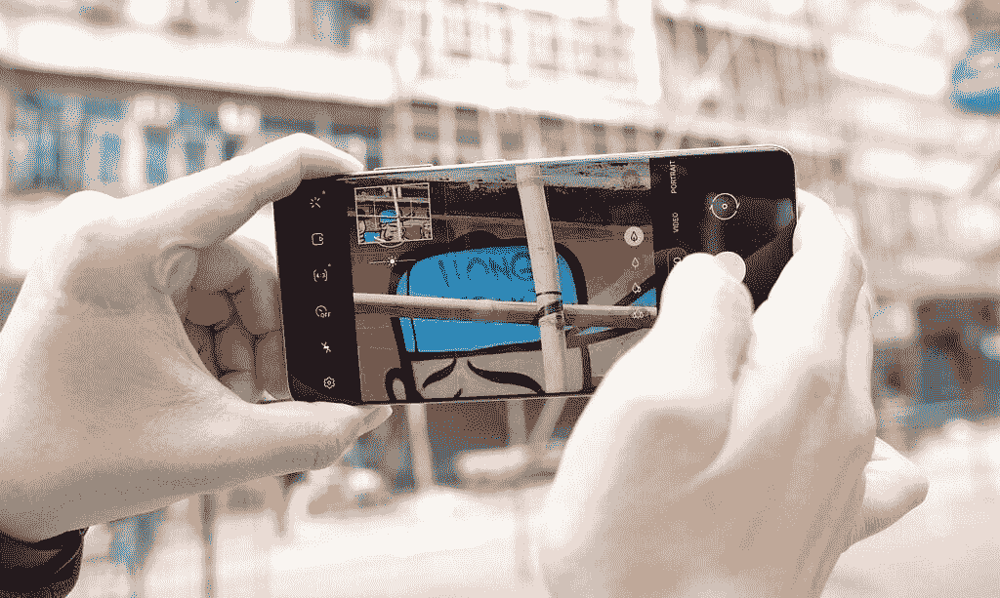

# Galaxy S21 Ultra，72 小时后:使用三星最好的手机后的 5 次外卖

> 原文：<https://www.xda-developers.com/samsung-galaxy-s21-ultra-preview-five-takeaways/>

我拥有三星 Galaxy S21 系列已经 72 个小时了。在这段时间里，我的大部分注意力都集中在了头把交椅 Galaxy S21 Ultra 上。三天的时间对于一个完整的回顾来说不够长，但是足够形成很多观点了。以下是我对三星最新旗舰产品的五点看法。

## 三星 Galaxy S21 系列:规格

### 规格表

| 

规范

 | 

三星 Galaxy S21

 | 

三星 Galaxy S21+

 | 

三星 Galaxy S21 Ultra

 |
| --- | --- | --- | --- |
| **建造** | 

*   铝制中框
*   塑料背面
*   大猩猩玻璃 Victus 正面

 | 

*   铝制中框
*   大猩猩玻璃 Victus 回
*   大猩猩玻璃 Victus 正面

 | 

*   铝制中框
*   大猩猩玻璃 Victus 回
*   大猩猩玻璃 Victus 正面

 |
| **尺寸&重量** | 

*   151.7 x 71.2 x 7.9 毫米
*   171 克

 | 

*   161.5 x 75.6 x 7.8 毫米
*   202 克

 | 

*   165.1 x 75.6 x 8.9 毫米
*   229 克

 |
| **显示** | 

*   6.2 英寸 FHD+动态 AMOLED 2X 平板显示器
*   2400 x 1080 像素
*   421 PPI
*   120Hz 可变刷新率
*   20:9 宽高比
*   HDR10+
*   1300 尼特峰值亮度
*   始终显示
*   无限显示

 | 

*   6.7 英寸 FHD+动态 AMOLED 2X 平板显示器
*   2400 x 1080 像素
*   394 PPI
*   120Hz 可变刷新率
*   20:9 宽高比
*   1300 尼特峰值亮度
*   HDR10+
*   始终显示
*   无限显示

 | 

*   6.8 英寸 QHD+动态 AMOLED 2X 曲面显示屏
*   3200 x 1440 像素
*   515 磅每英寸
*   120Hz 可变刷新率
    *   支持 120 赫兹 QHD+频率
    *   10-120 赫兹
*   20:9 宽高比
*   1500 尼特峰值亮度
*   HDR10+
*   始终显示
*   无限显示

 |
| **SoC** | 

*   **国际:** Exynos 2100:
    *   1x ARM Cortex X1 @ 2.9GHz +
    *   3 个 ARM Cortex A78 内核，2.8GHz 以上
    *   4 个 ARM Cortex A55 内核@ 2.2GHz
*   美国:高通骁龙 888:
    *   1 个 Kryo 680 Prime 内核@ 2.84GHz
    *   3 个 Kryo 680 性能内核@ 2.4GHz
    *   4 个 Kryo 680 高效内核@ 1.8GHz

 | 

*   **国际:** Exynos 2100:
    *   1x ARM Cortex X1 @ 2.9GHz +
    *   3 个 ARM Cortex A78 内核，2.8GHz 以上
    *   4 个 ARM Cortex A55 内核@ 2.2GHz
*   美国:高通骁龙 888:
    *   1 个 Kryo 680 Prime 内核@ 2.84GHz
    *   3 个 Kryo 680 性能内核@ 2.4GHz
    *   4 个 Kryo 680 高效内核@ 1.8GHz

 | 

*   **国际:** Exynos 2100:
    *   1x ARM Cortex X1 @ 2.9GHz +
    *   3 个 ARM Cortex A78 内核，2.8GHz 以上
    *   4 个 ARM Cortex A55 内核@ 2.2GHz
*   美国:高通骁龙 888:
    *   1 个 Kryo 680 Prime 内核@ 2.84GHz
    *   3 个 Kryo 680 性能内核@ 2.4GHz
    *   4 个 Kryo 680 高效内核@ 1.8GHz

 |
| **风筒&储存** | 

*   8GB LPDDR5 + 128GB
*   8GB + 256GB

 | 

*   8GB LPDDR5 + 128GB
*   8GB + 256GB

 | 

*   12GB LPDDR5 + 128GB
*   12GB + 256GB
*   16GB + 512GB

 |
| **电池&充电** | 

*   4000 毫安时
*   25W USB 供电 3.0 快充
*   15W 无线充电
*   4.5 反向无线充电
*   大多数地区包装盒中没有充电器

 | 

*   4800 毫安时
*   25W USB 供电 3.0 快充
*   15W 无线充电
*   4.5 反向无线充电
*   大多数地区包装盒中没有充电器

 | 

*   5000 毫安时
*   25W USB 供电 3.0 快充
*   15W 无线充电
*   4.5 反向无线充电
*   大多数地区包装盒中没有充电器

 |
| **安全** | 超声波显示指纹扫描仪 | 超声波显示指纹扫描仪 | 超声波显示指纹扫描仪 |
| **后置摄像头** | 

*   **主:** 12MP，广角镜头，f/1.8，1/1.76”，1.8 m，OIS，双像素自动对焦
*   **次要:** 12MP，超广角镜头，f/2.2，120 FoV，1/2.55”，1.4 m，定焦
*   **第三:** 64MP，长焦镜头，f/2.0，1/1.76”，0.8 米，OIS PDAF

 | 

*   **主:** 12MP，广角镜头，f/1.8，1/1.76”，1.8 m，OIS，双像素自动对焦
*   **次要:** 12MP，超广角镜头，f/2.2，120 FoV，1/2.55”，1.4 m，定焦
*   **第三:**6400 万像素，长焦镜头，f/2.0，1/1.76”，0.8 米，OIS PDAF

 | 

*   **初级:** 108 MP，广角镜头，f/1.8，79，24mm，1/1.33 "，0.8 m(诺娜-宁滨前)，OIS，PDAF，激光自动对焦
*   **次要:** 12 MP，超广角镜头，f/2.2，120 FoV，13mm，1/2.55”，1.4 m，双像素自动对焦
*   **第三:** 10 MP，长焦镜头，f/2.4，35，72mm，1/3.24”，1.22 m，OIS，3 倍光学变焦，双像素自动对焦
*   **四进制:**1000 万像素，长焦镜头，f/4.9，10，240 毫米，1/3.24 英寸，1.22 米，OIS，10 倍光学变焦，双像素自动对焦

视频:

*   所有前置和后置摄像头的 4K 为 60fps

 |
| **前置摄像头** | 10MP，f/2.2，1.22 m，80 FoV，双像素自动对焦 | 10MP，f/2.2，1.22 m，80 FoV，双像素自动对焦 | 40MP，f/2.2，0.7 米，80 FoV，PDAF |
| **端口** | USB 3.2 类型 C | USB 3.2 类型 C | USB 3.2 类型 C |
| **音频** | 

*   AKG 的立体声扬声器
*   杜比大气

 | 

*   AKG 的立体声扬声器
*   杜比大气

 | 

*   AKG 的立体声扬声器
*   杜比大气

 |
| **连通性** | 

*   蓝牙 5.1
*   国家足球联盟
*   无线网络 6
*   5G

 | 

*   蓝牙 5.1
*   国家足球联盟
*   无线网络 6
*   5G

 | 

*   蓝牙 5.1
*   国家足球联盟
*   Wi-Fi 6E
*   5G

 |
| **软件** | 基于 Android 11 的三星 One UI 3.1 | 基于 Android 11 的三星 One UI 3.1 | 基于 Android 11 的三星 One UI 3.1 |
| **其他特性** | 

*   IP68 防水等级
*   蚂蚁+
*   三星 DeX
*   诺克斯
*   Bixby 语音助手
*   谷歌探索窗格
*   某些地区的 MST 支持

 | 

*   IP68 防水等级
*   蚂蚁+
*   三星 DeX
*   诺克斯
*   超宽带
*   Bixby 语音助手
*   谷歌探索窗格
*   某些地区的 MST 支持

 | 

*   IP68 防水等级
*   蚂蚁+
*   三星 DeX
*   诺克斯
*   超宽带
*   Bixby 语音助手
*   谷歌探索窗格
*   Wacom 手写笔和 S Pen 支持(单独销售，外部存储)
*   某些地区的 MST 支持

 |
| **颜色** | 

*   幻影紫
*   幻影灰色
*   幻影白
*   幻粉色

 | 

*   幻影紫
*   幻影灰色
*   幻影白
*   Samsung.com 独家:

 | 

*   幻影灰色
*   幻影白
*   Samsung.com 独家:
    *   幻影钛
    *   幽灵海军
    *   幻影棕

 |

*注:我收到了三星香港公司租借的 Galaxy S21 Ultra 的骁龙 888 零售版本。三星在本文中没有任何投入*

* * *

# 变焦锁是一个游戏改变者

到现在为止，你可能已经知道 Galaxy S21 Ultra 配备了 10x [光学变焦摄像头](https://www.xda-developers.com/samsung-galaxy-s21-ultra-100x-space-zoom-periscope-camera/)，比 Galaxy S20 Ultra 和 Galaxy Note 20 Ultra 的 5 倍光学镜头有所提升。三星允许 Galaxy S21 Ultra 以数字方式放大 100 倍。虽然 100 倍的照片有时是可用的，但变焦镜头更实际的用途是捕捉 10 倍、20 倍甚至 30 倍的照片，这些照片令人惊讶地清晰，并可用于 Instagram。例如，参见下面的 30 倍变焦样本。

北美消费者可能会被 Galaxy S21 Ultra 的变焦能力所震惊，但亚洲那些容易使用华为 P40 Pro、[华为 Mate 40 Pro](https://www.xda-developers.com/huawei-mate-40-pro-hands-on-preview/) 或[小米 Mi 10 Ultra](https://www.xda-developers.com/xiaomi-mi-10-ultra-first-phone-qualcomm-quick-charge-5/) 等设备的人知道，还有其他手机可以完成同样的拍摄。

三星领先其他公司的是一项名为“变焦锁定”的功能，一旦变焦超过 20 倍，它就会使用人工智能锁定目标区域。一旦锁定，像颤抖和摇晃这样的轻微手部动作不会影响取景器的拍摄。

 <picture></picture> 

The Galaxy S21 Ultra at 30x with zoom lock enabled (in the upper left corner box).

取景器中锁定变焦的画面类似于万向架上的照相机，因为它以最小的移动稳定地浮动，除非相机持有者剧烈地移动手。请看下面的变焦锁定视频——我单手拿着 Galaxy S21 Ultra，变焦 100 倍，取景器比 30 倍变焦的华为 Mate 40 Pro 或 10 倍变焦的 iPhone 12 Pro 更稳定。

* * *

# 摄像机的重大改进

[说到相机](https://www.xda-developers.com/galaxy-s21-cameras/)，Galaxy S21 Ultra 的视频功能得到了很大的提升。多年来，我和其他评论家都说 iPhone 的视频摄像头性能优于 Android 产品。这在视频稳定、动态范围和适应照明突然变化等领域最为明显。

Galaxy S21 Ultra 在所有三个方面都表现出色，特别是即使在曝光剧烈变化的情况下也能找到正确的照明平衡。事实上，在霓虹闪烁的香港街道上拍摄的夜间视频中，Galaxy S21 Ultra 比 iPhone 12 Pro Max 更好地暴露了无数的灯光。现在说 Galaxy S21 Ultra 的摄像头是否比 iPhone 12 Pro Max 的好还为时过早，但它是任何安卓品牌都有可能击败苹果的。自己看看下面这段并排的视频。

Galaxy S21 Ultra 还带来了其他功能，例如可以同时使用前置和后置摄像头进行录制，散景视频，以及我最喜欢的功能之一——可以将 Galaxy Buds Pro 或 Buds Live 用作蓝牙无线麦克风。

* * *

# 屏幕弧度刚刚好

我和足够多的业内同行交流过，也看过足够多的评论，知道很多(大多数？)的人不喜欢曲面屏。无论是可以说是世界上最有影响力的移动技术公司[YouTuber](https://www.youtube.com/watch?v=lvV3jSLYK8A)、技术网站[的编辑](https://9to5google.com/2020/01/16/galaxy-s20-curved-screen-opinion/)，还是 XDA[自己的首席运营官](https://twitter.com/BrandonMiniman/status/1287255721680220160?s=20)，都有人公开呼吁品牌停止使用曲面屏，坚持使用平板显示器。

他们的抱怨从意外的手掌触摸到边缘的颜色扭曲到易碎性的增加。我认为这些抱怨大多是合理的，但尽管如此，我个人还是更喜欢曲面屏幕，因为它们看起来很好，用起来感觉很好。我觉得弧形屏幕看起来更具美感，由于圆形、较窄的外形，曲率有助于更舒适的握持。我还想补充一点，一些品牌，比如华为，已经完全把边缘的意外触摸当成了问题。

三星的 Galaxy S21 Ultra 似乎找到了中间地带。它的 6.8 英寸屏幕弯曲得非常微妙——足以让 Galaxy S21 Ultra 仍然保持三星实际上发明的“任何地方都没有锋利的边缘”的手感，而且它的侧挡板明显比平板屏幕的 Galaxy S21 和 Galaxy S21 Plus 更薄。但曲线也足够微妙，意外触摸增加脆弱性不应该是一个问题。在我看来，Galaxy S21 和 Galaxy S21 Plus 的平边和尖角让人感觉不够高档。

就我个人而言，我仍然认为像华为 P40 Pro 这样具有更戏剧性曲线的手机看起来更迷人，但三星似乎已经找到了取悦大多数人的中间地带。

* * *

# One UI 3.1 远离 Bixby 和三星的怪癖

Galaxy S21 Ultra 开箱即可在 Android 11 上运行 One UI 3.1。从视觉上看，One UI 3.1 与 Galaxy Note 20 Ultra 附带的 One UI 2.5 非常相似。我主要注意到 Android 11 的一些微妙的视觉变化，如面板中的圆形通知框。其他 [One UI 3.1 的功能](https://www.xda-developers.com/one-ui-3-1-features-samsung-galaxy-s21-ultra/)在我的 Galaxy S21 Ultra 上运行良好，比如 S-Pen 支持和视频散景。我们的主编米沙·拉赫曼也为感兴趣的人写了一篇关于 [One UI 3.0](https://www.xda-developers.com/one-ui-3-0-beta-galaxy-s20-samsung-android-11-update/) 新功能的深入分析。

对我来说，我注意到 Galaxy S21 Ultra 的软件没有向用户推送三星自己的软件。例如，我的设备开箱后显示的是谷歌的 Discover feed，而不是三星自己的 feed。当我按下电源按钮时，它也会返回关机菜单，而不是试图启动 Bixby。

你现在可以双击屏幕来打开或锁定屏幕——这是我从 LG G2 开始就喜欢的功能，如果我通过“边缘面板”(滑动菜单)打开一个应用程序，如果我已经打开了另一个应用程序，应用程序现在会在分屏视图中打开。“应用程序配对”部分还会记住您最近打开的两个应用程序，以防您需要再次打开该组合。

* * *

# 电池寿命是一个潜在的问题

Galaxy S21 Ultra 有 5000 毫安时的电池，通常被认为是足够的容量，但这款手机还配备了一个华丽的 6.8 英寸，3200 x 1400 WQHD+显示屏，刷新频率高达 120 赫兹，亮度可达 1500 尼特。

换句话说，5000 毫安时的电池对于像我这样的重度用户来说已经足够了。在过去的三天里，我看到在一天 13 个小时的工作即将结束时，电池电量下降到 20%以下，大约有五个小时的屏幕时间。

今天有点令人担忧:我在早上 7:00 拔掉了充满电的 S21 Ultra 的插头，查看了一些电子邮件和短信，然后在没有插回电话的情况下继续睡觉。中午醒来(我工作到深夜！)并注意到手机的电池电量为 93%，在五个小时的待机时间里，电池电量消耗了 7%。

然后，我把手机拿出来进行了一下午的照片和视频测试，在 Spotify 上播放了一个小时的播客，截至我写这篇文章时(午夜，几乎正好是我第一次拔掉手机后的 16 个小时，但实际使用了 12 个小时)，电池电量为 18%，屏幕显示时间为 4 小时 23 分钟。

这不是糟糕的电池寿命，但它不是伟大的。在非 Covid 时间，我很可能还有两到三个小时才能回家充电。公平地说，我是一个重度用户:我将屏幕分辨率设置为最大设置(它是 2,400 x 1,080)，并使用“自适应”刷新率(最高可达 120Hz)。我今天也比平时拍了更多的视频。

三天时间来判断一部手机的续航能力还为时过早，但我不认为 Galaxy S21 Ultra 是一部能像华为或小米手机那样持续使用一整天的手机。

* * *

这就是我使用 Galaxy S21 Ultra 72 小时后的五点收获。我认为三星制造了一款 apex 平板手机，今年很难超越，但我会在下周的全面评论中确认这一点。XDA 团队的其他成员也将在其他地区测试这款手机，所以请继续关注 XDA，我们将对 Galaxy S21 系列进行深入报道。

 <picture></picture> 

Galaxy S21 Ultra

三星 Galaxy S21 Ultra 是 2021 年新旗舰系列中的终极杀手锏，集旗舰 SoC、高级构建、出色的显示屏和令人惊叹的相机设置于一身，以及高级旗舰上预期的所有额外功能。