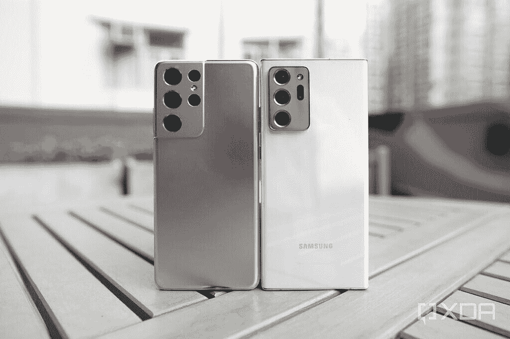
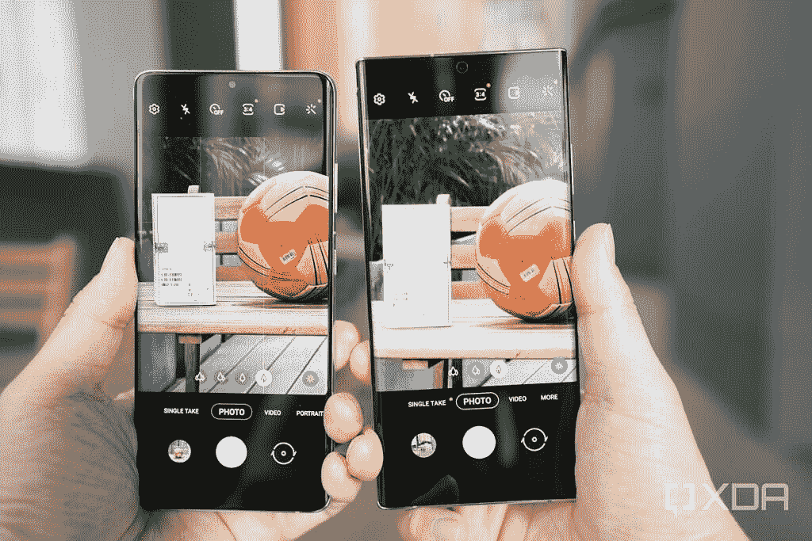
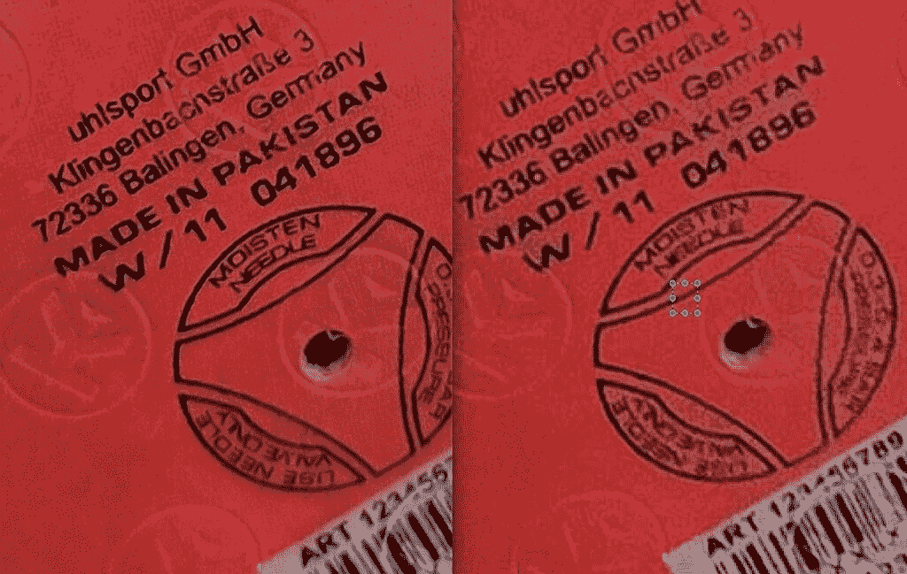

# 三星 Galaxy S21 Ultra vs Note 20 Ultra:该买哪款旗舰？

> 原文：<https://www.xda-developers.com/samsung-galaxy-s21-ultra-vs-galaxy-note-20-ultra/>

三星 Galaxy S21 Ultra 代表了三星在智能手机显示屏和相机方面的绝对优势。但是不到半年的 [Galaxy Note 20 Ultra](https://www.xda-developers.com/samsung-galaxy-note-20-ultra-review-exynos/) 仍然足够强大，而且因为它几乎肯定会在[看到折扣](https://www.xda-developers.com/best-galaxy-note-20-ultra-deals/)，对于不需要绝对最新但仍然想要强大东西的消费者来说，它可能是更好的价值。有哪些关键区别，[Galaxy S21 系列有什么新功能](https://www.xda-developers.com/samsung-galaxy-s21-preview/)，如果你现在上市，你应该买哪一款三星旗舰？多读点了解一下。

 <picture></picture> 

Galaxy S21 Ultra (left); Galaxy Note 20 Ultra (right).

## 三星 Galaxy S21 Ultra 与 Note 20 Ultra:规格对比

| 

规范

 | 

三星 Galaxy S21 Ultra

 | 

三星 Galaxy Note 20 Ultra

 |
| --- | --- | --- |
| **打造** | 

*   铝制中框
*   大猩猩玻璃背
*   大猩猩玻璃 Victus 正面

 | 

*   铝制中框
*   玻璃正面和背面
*   大猩猩玻璃 Victus 正面

 |
| **尺寸&重量** | 

*   165.1 x 75.6 x 8.9mm 毫米
*   228 克

 | 

*   164.8 x 77.2 x 8.1mm 毫米
*   213 克

 |
| **显示** | 

*   6.8 英寸 QHD+动态 AMOLED 2X 显示屏
*   120Hz 可变刷新率
*   20:9 宽高比
*   1600 尼特峰值亮度
*   HDR10+
*   始终显示

 | 

*   6.9 英寸 QHD+动态 AMOLED 2X 显示屏
*   120Hz 可变刷新率
*   1300 尼特峰值亮度
*   HDR10+
*   始终显示

 |
| **SoC** | 

*   **国际:** Exynos 2100:
    *   1 个内核，2.9GHz 以上
    *   3 个内核@ 2.8GHz 以上
    *   4 个内核@ 2.4GHz
*   美国和中国:高通骁龙 888

 | 

*   **国际:** Exynos 990
*   美国和中国:高通骁龙 765+分

 |
| **Ram &存储选项** | 

*   12GB + 128GB
*   12GB + 256GB
*   12GB + 512GB

 | 

*   12GB + 128GB
*   12GB + 256GB
*   12GB + 512GB

 |
| **电池&充电** | 

*   5000 毫安时
*   25W USB 供电 3.0 快充
*   15W 无线充电
*   4.5 反向无线充电
*   大多数地区包装盒中没有充电器

 | 

*   4500 毫安时
*   25W USB 供电 3.0 快充
*   15W 无线充电
*   4.5 反向无线充电

 |
| **安全** | 超声波显示指纹扫描仪 | 超声波显示指纹扫描仪 |
| **后置摄像头** | 

*   **主:** 108MP，广角镜头，f/1.8，1/1.33”，0.8 m，OIS，双像素 PDAF
*   **次要:** 12MP，超广角镜头，f/2.2，1/2.55”，1.4 m
*   **第三:** 10MP，长焦镜头，f/2.0，1/1.76”，0.8 米，OIS PDAF
*   **四元:** 10MP 潜望镜长焦镜头，f/4.9，240mm，1/3.24 "，1.22 m，OIS，10x 光学变焦

 | 

*   **主:** 108MP，广角镜头，f/1.8，1/1.33”，0.8 m，OIS，双像素 PDAF
*   **次要:** 12MP，超广角镜头，f/2.2，1/2.55”，1.4 m
*   **第三:** 10MP 潜望镜长焦镜头，f/3.0，240mm，1/3.24 "，1.22 m，OIS，5 倍光学变焦

 |
| **前置摄像头** | 4000 万像素，f/2.2，0.7 米，双像素 PDAF | 10MP，f/2.2，1.22 米 |
| **港口** | USB 类型-C | USB 类型-C |
| **连通性** | 

*   蓝牙 5.1
*   NFC0 Wi-Fi 6
*   5G

 | 

*   蓝牙 5.0
*   wi-Fi 802.11 a/b/g/n/AC/ax 2.4 GHz+5 GHz，HE80，MIMO，1024-QAM
*   5G

 |
| **软件** | 基于 Android 11 的三星 One UI 3.1 | 基于 Android 10 的三星 One UI 2.5 |
| **其他特性** | 

*   IP68
*   S-Pen 支持(单独购买)

 | 

*   IP68
*   S-Pen 支持(包括在内)

 |
| **定价** | 起价 1299 美元 | 起价 1399 美元 |

## Galaxy S21 Ultra 在 Galaxy Note 20 Ultra 上有哪些改进？

对于在 Galaxy S21 Ultra 和 Note 20 Ultra 之间做出选择的消费者来说，一个大问题可能是“Galaxy S21 Ultra 相比 Galaxy Note 20 Ultra 有哪些改进？”有两个主要方面的显著改进:处理器和相机变焦系统。

Galaxy S21 Ultra 由高通的[骁龙 888](https://www.xda-developers.com/qualcomm-snapdragon-888-benchmarks/) 驱动，这是一款 5 纳米 SoC，代表了高通目前所能提供的最佳产品。然而，Galaxy Note 20 Ultra 的骁龙 865+也不逊色。尽管如此，无论是基准测试还是现实世界的性能，骁龙 888 都是更好的芯片——尽管你不会真正看到差异，除非你真的推手机，比如使用前置和后置摄像头拍摄视频，或者使用每个镜头拍摄 4K/60fps，Galaxy S21 Ultra 可以做到，但 Galaxy Note 20 Ultra 不能。

摄像系统是最明显的改进之处。Galaxy S21 Ultra 相机引入了新的潜望镜变焦镜头，与 Galaxy Note 20 Ultra 的 5 倍光学变焦相比，可以实现 10 倍光学变焦。说实话，如果保持在一个合理的范围(10 倍)，变焦镜头质量的差异是微妙的——虽然如果你像素窥视，你可以看到质量的差异——但在更长的变焦，差异变得更加明显。

 <picture></picture> 

10x zoom with the Galaxy S21 Ultra and Galaxy Note 21 Ultra.

例如，在上面足球的 10 倍放大图像中，如果在手机上观看，两幅图像看起来很相似。只有当我真的在更大的屏幕上进行像素窥视时，我才看到 Galaxy S21 Ultra 的 10 倍镜头捕捉到了更多的纹理和细节。

 <picture></picture> 

10x zoom, Galaxy S21 Ultra (left) and Galaxy Note 20 Ultra.

在更长的变焦镜头下，更容易看到。下面的设置包含两个手机的 20 倍和 30 倍变焦。请注意，Galaxy S21 Ultra shot 要清晰得多。

Galaxy S21 Ultra 还额外增加了一个焦距约为 70 毫米的 3 倍光学远摄变焦镜头，非常适合拍摄肖像。Galaxy Note 20 Ultra 由于缺少较短的变焦镜头，使用了高达 4.9x 的数字变焦。然而，3 倍镜头之间的差异很难分辨。您可以在下面的 Galaxy S21 Ultra shot 中看到键盘有更多的细节，脖子周围的衣领也有更多的纹理。

108 兆像素的主摄像头和 12 兆像素的超宽硬件基本保持不变——尽管 Galaxy S21 Ultra 在主摄像头中使用了较新的传感器——但是 Galaxy S21 Ultra 应该会拍摄出更好的照片，因为它结合了出色的骁龙 888 ISP 和三星自己的微调功能。

转到前面，Galaxy Note 20 Ultra 的自拍相机在 40MP 时像素密度也更高，之后三星会将像素归入 10MP 自拍，而 Galaxy Note 20 Ultra 则有一台简单的 10MP 自拍相机。除了不同的颜色科学，我不知道自拍图像质量有什么实质性的不同。

Galaxy S21 Ultra 的屏幕在技术上也很优越，能够以 120 赫兹运行，同时保持 1440 像素的分辨率；Galaxy Note 20 Ultra 必须降级至 1080p——尽管说实话，我认为人眼无论如何也无法在相对较小的手机屏幕上分辨 1440p 和 1080 p。在我看来，两个屏幕看起来都一样漂亮。

用户可能会觉得不同的地方在于耐用性 Galaxy Note 20 Ultra 的 5，000 毫安时电池比 4，500 毫安时电池大得多，所以 S21 Ultra 在充电前肯定会跑得更远。

全面而言，还有更微妙的改进，比如 Galaxy S21 Ultra 拥有更大的内置指纹扫描仪和对 WiFi 6 的支持，但这些都是相对较小的改进，大多数人甚至不会注意到。对大多数消费者来说，将是 SoC 和相机变焦能力将这两款手机区分开来。

## Galaxy S21 Ultra 和 Galaxy Note 20 Ultra 在哪些方面相似？

Galaxy S21 Ultra 与 Galaxy Note 系列的共同点比以往任何一款 S 手机都多，因为它支持 S-Pen 手写笔，这种手写笔长期以来一直是 Note 系列的主要产品。这意味着两部手机之间的界限比以往任何时候都更加模糊。

虽然值得注意的是，Galaxy S21 Ultra 的 S-Pen 支持不包括蓝牙遥控器，但将其用作笔来记录笔记或草图时会感觉相同，因为延迟和软件功能基本保持不变。虽然 S21 Ultra 有一个新设计的相机模块，但两部手机的整体结构相似——都有哑光玻璃表面和略微弯曲的屏幕。软件体验也应该是相似的，正如所有其他的三星奖励功能，如 DeX。

## 你应该买哪一个？

如果钱不是问题，那么三星 Galaxy S21 Ultra 是显而易见的，因为它有更好的变焦镜头，更亮的屏幕和更新的处理器——除非你真的想要一个免费的 S-Pen，并存储在手机中。

 <picture></picture> 

Galaxy S21 Ultra

三星 Galaxy S21 Ultra 是 2021 年新旗舰系列中的终极杀手锏，集旗舰 SoC、高级构建、出色的显示屏和令人惊叹的相机设置于一身，以及高级旗舰上预期的所有额外功能。

但由于三星 Galaxy Note 20 Ultra 现在是一款“旧”手机，因此肯定会有定期折扣，将原来 1399 美元的价格降低数百美元。因此，如果你想节省一些现金，同时仍然获得非常优质的三星体验，Note 20 Ultra 在许多领域都保持良好，不会感到过时。即使在 2021 年，它仍然是一部野兽般的手机。

 <picture></picture> 

Samsung Galaxy Note 20 Ultra

##### 三星 Galaxy Note 20 Ultra

三星 Galaxy Note 20 Ultra 拥有市场上最好的屏幕和最好的相机之一。它的 108 百万像素摄像头可以拍摄出清晰明亮的照片，而潜望镜变焦镜头可以达到 50 倍。