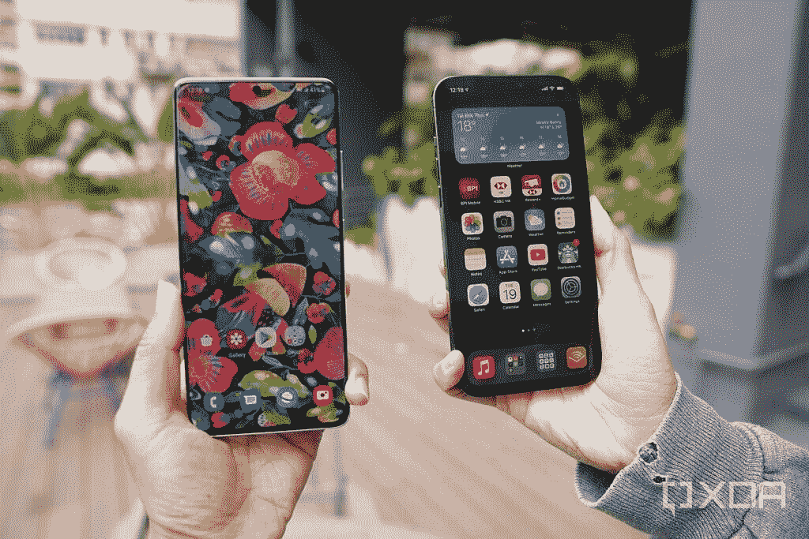
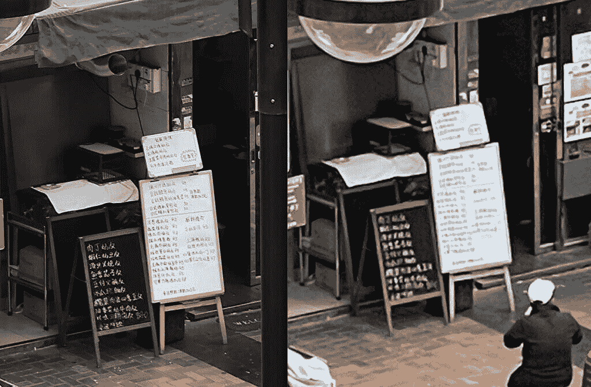
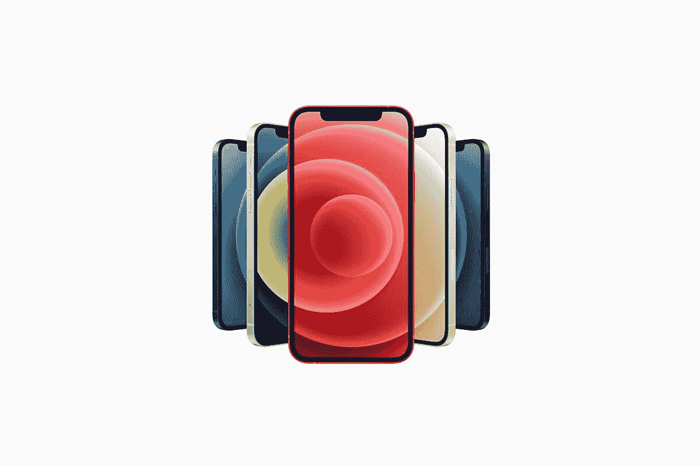

# Galaxy S21 Ultra vs iPhone 12 Pro Max:该买哪个大手机？

> 原文：<https://www.xda-developers.com/samsung-galaxy-s21-ultra-vs-iphone-12-pro-max/>

越大越好吗？如果你问智能手机公司，答案肯定是肯定的。无论是苹果(Apple)还是三星(Samsung)、华为(Huawei)还是 Oppo，趋势一直是为最大型号的手机保留最高端的规格、最前沿的组件。目前最新的热门产品是[三星 Galaxy S21 Ultra](https://www.xda-developers.com/samsung-galaxy-s21-ultra-preview-five-takeaways/) ，因此我们很自然地将它与苹果最近的热门产品 [iPhone 12 Pro Max](https://www.xda-developers.com/apple-iphone-12-pro-max-hands-on-preview/) 进行比较。

## 三星 Galaxy S21 Ultra 与苹果 iPhone 12 Pro Max:规格和比较

| 

规范

 | 

三星 Galaxy S21 Ultra

 | 

苹果 iPhone 12 Pro Max

 |
| --- | --- | --- |
| **打造** | 

*   铝制中框
*   大猩猩玻璃背
*   大猩猩玻璃 Victus 正面

 | 

*   不锈钢中框
*   玻璃正面和背面
*   用于玻璃保护的“陶瓷护罩”

 |
| **尺寸&重量** | 

*   165.1 x 75.6 x 8.9mm 毫米
*   229 克

 | 

*   160.8 x 78.1 x 7.4mm 毫米
*   226 克(全球)
*   228 克(美国)

 |
| **显示** | 

*   6.8 英寸 QHD+动态 AMOLED 2X 曲面显示屏
*   3200 x 1440 像素
*   120Hz 可变刷新率
    *   支持 120 赫兹 QHD+频率
    *   10-120 赫兹
*   20:9 宽高比
*   1500 尼特峰值亮度
*   HDR10+
*   始终显示

 | 

*   6.7 英寸超级视网膜 XDR 有机发光二极管显示屏
*   2，778 x 1，284 分辨率，458 PPI

 |
| **SoC** | 

*   **国际:** Exynos 2100:
    *   1 个内核，2.9GHz 以上
    *   3 个内核@ 2.8GHz 以上
    *   4 个内核@ 2.4GHz
*   **美国和中国:**高通骁龙 888

 |  |
| **Ram &存储选项** | 

*   12GB + 128GB
*   12GB + 256GB
*   16GB + 512GB

 | 

*   128GB(内存未透露)
*   256GB(内存未披露)
*   512GB(内存未披露)

 |
| **电池&充电** | 

*   5000 毫安时
*   25W USB 供电 3.0 快充
*   15W 无线充电
*   4.5 反向无线充电
*   大多数地区包装盒中没有充电器

 | 

*   3，687 毫安时电池，符合认证列表
*   带 MagSafe 的 15W 无线充电
*   7.5W Qi 无线充电
*   盒子里没有充电器

 |
| **安全** | 超声波显示指纹扫描仪 | Face ID(原深感摄像头面部识别) |
| **后置摄像头** | 

*   **初级:** 108 MP，广角镜头，f/1.8，79，24mm，1/1.33 寸，0.8 m(诺娜-宁滨前)，OIS，PDAF，激光自动对焦
*   **次要:** 12 MP，超广角镜头，f/2.2，120 FoV，13mm，1/2.55”，1.4 m，双像素自动对焦
*   **第三:** 10 MP，长焦镜头，f/2.4，35，72mm，1/3.24”，1.22 m，OIS，3 倍光学变焦，双像素自动对焦
*   **四元:**1000 万像素，长焦镜头，f/4.9，10，240 毫米，1/3.24 英寸，1.22 米，OIS，10 倍光学变焦，双像素自动对焦

 | 

*   **主要:** 12MP
*   **次要:** 12MP，超广角
*   **第三:** 12MP 长焦

 |
| **前置摄像头** | 40MP，f/2.2，0.7 米，80 FoV，PDAF | 12MP，f/2.2 |
| **港口** | USB 3.2 类型 C | 专有闪电端口 |
| **连通性** | 

*   蓝牙 5.1
*   国家足球联盟
*   Wi-Fi 6E
*   5G

 | 

*   5G:低于 6GHz
*   超宽带
*   支持 2x2 MIMO 的 wi-Fi 6(802.11 ax)
*   蓝牙 5.0

 |
| **软件** | 基于 Android 11 的三星 One UI 3.1 | iOS 14 |
| **其他特性** | IP68 | IP68 |
| **定价** | 起价 1199 美元 | 起价 1099 美元 |

* * *

## 设计和硬件

三星 Galaxy S21 Ultra 和苹果 iPhone 12 Pro Max 都是巨大的手机，重量分别为 229 克和 228 克，屏幕分别为 6.8 英寸和 6.7 英寸。但是，尽管三星的 Galaxy S21 Ultra 很重，但对我来说握起来要舒服得多，因为三星的设备前后都有曲线，融入了略圆的机箱，而 iPhone 12 Pro Max 和 iPhone 12 系列的其他产品一样，具有平坦的侧面和几乎不妥协的坚硬边缘。

当我去年秋天测试 iPhone 12 系列时，我实际上很喜欢它们的方形设计，但只喜欢另一款更小的 iPhone 12s。Pro Max 的尺寸为 160.8 x 78.1 x 7.4mm 毫米(6.3 x 3.07 x 0.4 英寸)，实在是太大太宽了，没有这么硬的边角。

Galaxy S21 Ultra 的 6.8 英寸屏幕也采用了比 iPhone 12 Pro Max 的 19.5:9 更窄的 20:9 纵横比，这进一步使 Galaxy S21 Ultra 成为一款握起来更舒适的手机。

说到屏幕，这是三星一面倒的胜利。Galaxy S21 Ultra 的面板不仅变得更亮，像素更多，刷新速度是原来的两倍，而且几乎没有中断，与 iPhone 相比，只有一个小孔。

* * *

## 软件和特殊功能

正如我们刚刚在设计部分提到的，大手机更难握持和使用。那么人们为什么要忍受它们呢？两个原因:在更大的画布上消费娱乐内容(游戏、视频)的能力，以及在生产力方面做更多事情的能力。

在这两种情况下，三星 Galaxy S21 Ultra 都完全击败了苹果 iPhone 12 Pro Max。Galaxy S21 Ultra 的屏幕中断较少，因此视频或游戏看起来更好。三星还实现了一系列软件功能，使 Galaxy S21 Ultra 能够利用其更大的屏幕，例如能够在浮动窗口中打开应用程序，并在分屏视图中同时启动两个预设的应用程序。

Galaxy S21 Ultra 还支持 S-Pen 手写笔，这是 Galaxy S 手机有史以来第一次支持 S-Pen 手写笔，S-Pen 手写笔是 Note 系列的稳定产品。这一点，加上 DeX 功能，使三星 Galaxy S21 Ultra 成为移动领域最通用的设备之一。

另一方面，苹果 iPhone 12 Pro Max 实际上只是一个[放大的超大尺寸](https://www.xda-developers.com/iphone-12-pro-max-review/) iPhone 12 Mini。Pro Max 的用户界面与任何其他运行 iOS 14 的 iPhones 完全相同。您不能一次打开多个应用程序，您不能调整主屏幕网格以在主屏幕上放置更多应用程序。

* * *

## 表演

到目前为止，这还只是一边倒的事情，但至少苹果可以因为知道自己拥有更强大的大脑而感到欣慰。苹果的 A14 Bionic 在每个基准测试中都超过了高通骁龙 888，尽管在现实世界中，除了编辑/渲染视频之外，真的很难看出区别 iPhone 的原生照片库应用程序不仅允许我修剪视频，还允许我裁剪和旋转视频；包括 Galaxy S21 Ultra 在内的任何 Android 手机都无法提供这一点。

 <picture></picture> 

Galaxy S21 Ultra and the iPhone 12 Pro Max

作为一款媒体消费设备，Galaxy S21 Ultra 拥有更具沉浸感的屏幕，但 iPhone 12 Pro Max 拥有更好的立体声扬声器，可以发出更响亮、更饱满的声音。

这两款设备的整体速度相似，尽管 Galaxy S21 Ultra 经常因为更高的刷新率而感觉更快，但这主要是一种错觉。两款手机的应用启动时间非常接近。

* * *

## 摄像机

当谈到用主相机拍摄“正常”照片时，Galaxy S21 Ultra 和 iPhone 12 Pro Max 都非常出色。无论白天黑夜，镜头都清晰而充满活力，动态范围几乎总是恰到好处。

在两个主摄像头之间挑选一个赢家几乎可以归结为主观意见和对颜色的偏好 Galaxy S21 Ultra 往往有一个较冷的色调，而 iPhone 12 Pro Max 的照片似乎更温暖。

如果我必须吹毛求疵，我会说 iPhone 12 Pro Max 的主摄像头更容易使用，因为它感觉更流畅。Galaxy S21 Ultra 的主摄像头有轻微的快门延迟——在下面的一组照片中，我同时按下了两台手机上的快门按钮，iPhone 拍摄的照片清晰地先拍摄([像韩](https://en.wikipedia.org/wiki/Han_shot_first))。如果我需要拍摄一张移动物体的照片，我会相信过去几年中的任何 iPhone，而不是 Galaxy S21 Ultra。

iPhone 12 Pro Max 还会自动打开夜间模式，并将其相对无缝地融入拍照体验中(它只是在昏暗的场景中自动打开)，而 Galaxy S21 Ultra 则需要你手动跳转到夜间模式。当然，想要更多控制的用户可能更喜欢三星的方法，它为用户提供了更多的完全控制。

在视频方面，iPhone 12 Pro Max 的主摄像头也更好一些:镜头稍微稳定一些，尤其是在晚上，每当我走路和拍摄时，Galaxy S21 Ultra 仍然会有轻微的抖动。

苹果刚刚取得的所有胜利都来自于主摄像头。移动到变焦镜头，这是一个片面的 beatdown。Galaxy S21 Ultra 使用双变焦系统来覆盖各种焦距。一个 10MP 的长焦相机可以拍摄 3 倍的光学镜头，而它的 10 倍光学潜望镜相机可以处理更长的变焦。iPhone 12 Pro Max 采用单个 12MP 长焦摄像头，2.5 倍光学变焦。下面是两张以 12 倍变焦拍摄的照片，这是 iPhone 12 Pro Max 允许的最大变焦。

 <picture></picture> 

12x zoom, Galaxy S21 Ultra (left) and iPhone 12 Pro Max (right).

这是另一套 12 倍变焦镜头。

 <picture></picture> 

12x zoom, Galaxy S21 Ultra (left), iPhone 12 Pro Max (right).

最后，这里是 5 倍变焦。质量上的差距缩小了，但对三星来说，这仍然是一个明显的胜利。

 <picture></picture> 

10x zoom, Galaxy S21 Ultra (left) and iPhone 12 Pro Max (right).

用超广角相机会近很多。两款手机都使用 12MP 传感器，拍摄的视野和清晰度看起来很接近。

说到变焦，就是一边倒的 beatdown。

## 电池寿命

Galaxy S21 Ultra 的 5，000 毫安时电池比 iPhone 12 Pro Max 内部的 3，687 毫安时电池大得多，但因为后者的显示屏像素更少，刷新频率为 60 赫兹，所以它始终比 Galaxy S21 Ultra 的电池续航时间更长。我是一个重度用户，所以对我来说，三星的最新产品通常只能勉强维持一天 14 个小时(电池剩余约 10-15%)，而 iPhone 12 Pro Max 通常至少剩余 25%。

## 应该买哪个？

iPhone 12 Pro Max 和 Galaxy S21 Ultra 都是超级强大的平板电脑，主摄像头非常棒。然而，在我看来，Galaxy S21 Ultra 是一款更加多功能的设备。如果我真的需要完成工作，Galaxy S21 Ultra 的高级文件系统、同时运行两个应用程序的能力、手写笔支持以及兼做台式电脑的选项远远超过了 iPhone 12 Pro Max。

有人可能会说，我应该判断一部手机“只是一部手机”，而不是考虑所有其他的使用案例，如三星 DeX，但如果我花了 1000 多美元买一部手机，我想感觉我的钱花得值。而 Galaxy S21 Ultra 在我看来只是更好的价值。

 <picture></picture> 

Galaxy S21 Ultra

三星 Galaxy S21 Ultra 是 2021 年新旗舰系列中的终极杀手锏，集旗舰 SoC、高级构建、出色的显示屏和令人惊叹的相机设置于一身，以及高级旗舰上预期的所有额外功能。

 <picture></picture> 

iPhone 12 Pro Max

##### 苹果 iPhone 12 Pro Max

苹果最大的智能手机是一款功能强大的大屏幕设备。