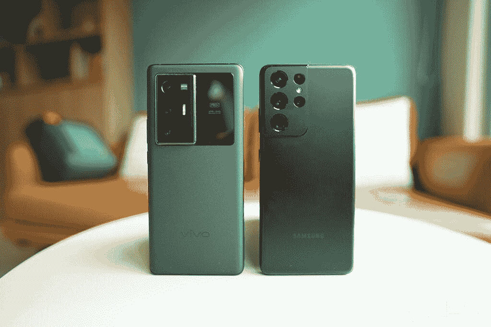
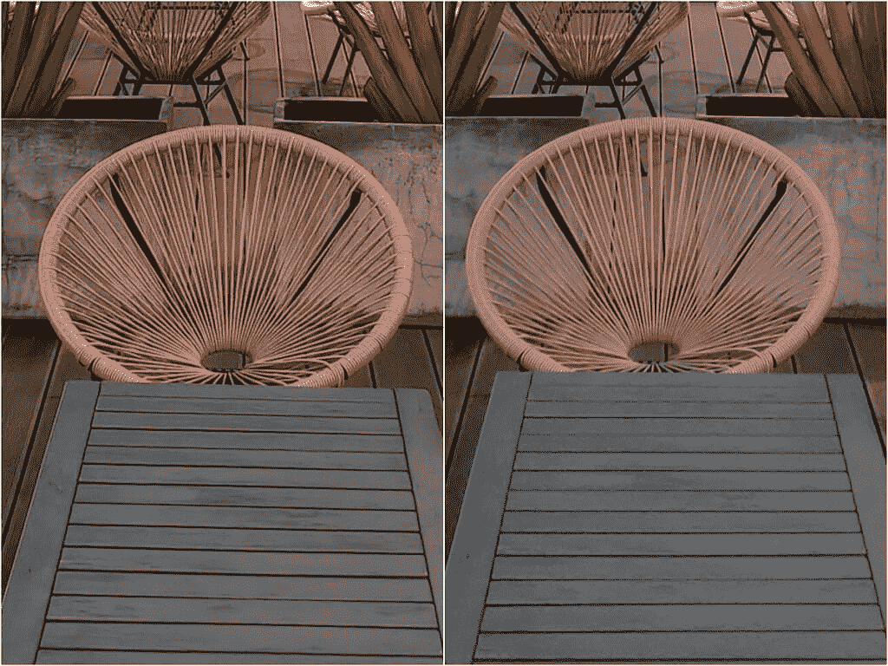
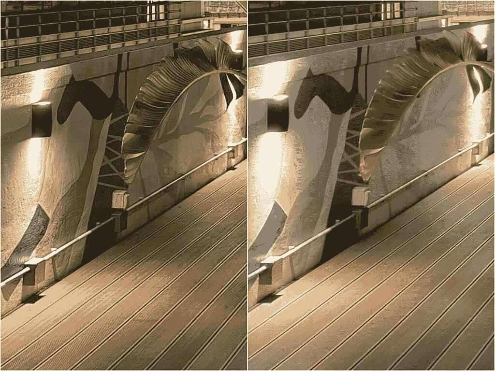

# 三星 Galaxy S21 Ultra vs Vivo X70 Pro Plus:安卓相机王者对决

> 原文：<https://www.xda-developers.com/samsung-galaxy-s21-ultra-vs-vivo-x70-pro-plus-camera-shootout-comparison/>

三星的 [Galaxy S21 Ultra](https://www.xda-developers.com/samsung-galaxy-s21/) 在 2021 年的大部分时间里一直占据着[最佳智能手机摄像头](https://www.xda-developers.com/best-smartphone-cameras/)的宝座。但是一个新的挑战者以 [Vivo X70 Pro Plus](https://www.xda-developers.com/vivo-x70-pro-plus-first-impressions/) 的形式到来了，在我们之前的相机枪战中[击败了 iPhone 13 Pro](https://www.xda-developers.com/vivo-x70-pro-plus-first-impressions/)之后，它是一个主要的竞争者。过去几周，我带着这两款过分夸张的 Android 旗舰在镇上四处拍摄了数百个样本，如果一张照片能说明一千个单词，那么我认为我们这里有足够的图像来讲述一个长故事。

 <picture></picture> 

Vivo X70 Pro+ (left); Galaxy S21 Ultra (right)

### 点击展开:Vivo X70 Pro+和三星 Galaxy S21 Ultra:规格

## 三星 Galaxy S21 Ultra vs Vivo X70 Pro+:规格

| 

规范

 | 

Vivo X70 Pro Plus

 | 

三星 Galaxy S21 Ultra

 |
| --- | --- | --- |
| **打造** | 

*   铝制中框
*   大猩猩玻璃 Victus 回
*   大猩猩玻璃 Victus 正面

 | 

*   铝制中框
*   大猩猩玻璃 Victus 回
*   大猩猩玻璃 Victus 正面

 |
| **尺寸&重量** | 

*   164.5 x 75.2 x 8.9 毫米
*   213 克

 | 

*   165.1 x 75.6 x 8.9mm 毫米
*   229 克

 |
| **显示** | 

*   6.78 英寸 AMOLED
*   3200 x 1440 像素
*   517ppi
*   可变刷新率高达 120Hz

 | 

*   6.8 英寸动态 AMOLED 2X 曲面显示屏
*   可变刷新率高达 120Hz

 |
| **SoC** | 高通骁龙 888+。 | 

*   **国际:** Exynos 2100
*   **美国和中国:**高通骁龙 888:

 |
| **风筒&储存** |  | 

*   12GB/126GB 内存
*   128GB/256GB/512GB

 |
| **电池&充电** | 

*   4500 毫安时
*   55W 有线快速充电(充电器包含在包装盒中)
*   50W 无线充电

 | 

*   5000 毫安时
*   25W USB 供电 3.0 快充
*   15W 无线充电
*   4.5 反向无线充电
*   大多数地区包装盒中没有充电器

 |
| **安全** | 光学显示指纹读取器 | 超声波显示指纹扫描仪 |
| **后置摄像头** | 

*   **初级:** 50MP 宽，三星 GN1，f/1.57，1/1.31”，OIS
*   **次要:** 48MP 超宽，索尼 IMX 598，f/2.2，万向技术
*   **第三:** 12MP 长焦，索尼 IMX 663，f/1.6，2x 光学
*   **四元:** 8MP 潜望镜，f/3.4，5 倍光学变焦

 | 

*   **主要:**108 兆像素宽，f/1.8，1/1.33 英寸，OIS，激光自动对焦
*   **二级:** 12MP 超宽，f/2.2
*   **第三:** 10MP 长焦，3 倍光学变焦，f/2.4
*   **四元:** 10MP，潜望镜，10x 光学变焦，f/4.9

 |
| **前置摄像头** | 32MP | 40MP |
| **端口** | USB-C | USB-C |
| **音频** | 立体声扬声器 | 立体声扬声器 |
| **连通性** | 

*   5G(毫米波)
*   支持 2x2 MIMO 的 Wi-Fi 6 (802.11ax)
*   蓝牙 5.0
*   国家足球联盟

 | 

*   5G(毫米波)
*   Wi-Fi 6E (802.11ax)
*   蓝牙 5.1
*   国家足球联盟

 |
| **软件** | Android 11 之上的 FunTouch OS 12 | Android 11 之上的一个 UI 3.1 |
| **其他特征** | 双物理 SIM | 韩国和美国的单一实体 SIM 卡；大多数其他地区的双物理 SIM 卡 |

## 三星 Galaxy S21 Ultra vs Vivo X70 Pro Plus:主摄像头

[sc name = " pull-quote-right " quote = "比较 Vivo X70 Pro+和 Galaxy S21 Ultra 的主摄像头的讽刺之处在于，无论如何，三星在技术上都赢了"]比较这两款设备的主摄像头的讽刺之处在于，无论如何，三星在技术上都赢了。那是因为 Vivo X70 Pro+的主射手采用了三星研发的 50MP ISOCELL GN1 传感器。与此同时，Galaxy S21 Ultra 的主镜头使用了其 108MP ISOCELL HM3 传感器。当你意识到，从几乎所有的技术角度来看——图像传感器尺寸、单个像素尺寸 50MP GN1 传感器都优于 108MP HM3 传感器时，讽刺的程度就增加了。

但是当然，智能手机照片的质量取决于软件，正如它取决于硬件一样(甚至可以说更多)，那么这些手机的表现如何呢？

在上面这些相对简单直接的照片中，我们可以看到两个相机都产生了充满活力、清晰的图像，但 Vivo 的图像全面“更亮”，因为它的图像传感器更大，单个像素尺寸更大，光圈更快。这在所有四张照片中都很明显(Galaxy S21 Ultra shot 中被阴影覆盖的任何区域在 X70 Pro+拍摄中看起来都稍微好一点)，但在商店的第三组照片中却不和谐。

当我们在较暗的场景中拍摄时，更好的进光能力将会派上用场，但在这里当光线充足时，Vivo 的镜头几乎太亮了。第二组和第三组，我更喜欢三星的 take，亮区和暗区的对比更加鲜明。在我看来，这些照片更具戏剧性。然而，三星的图像往往过于冷静。我认为这是为了让天空看起来更蓝，但这通常会使照片的色调比实际场景更冷。Vivo 的颜色在上面的四张图中都更准确。

如果我们将上述镜头放大到 100%，并在显示器上进行像素窥视，我们可以看到 Vivo 的图像几乎在任何地方都更清晰。

两款手机的景深都相对较浅，因此任何物体或主体的特写镜头都会产生自然的令人愉悦的散景。这种效果在 X70 Pro+上更强一点。我不确定这是软件辅助还是传感器尺寸的差异。

一旦我们进入弱光环境，Vivo X70 Pro Plus 的卓越感光度就开始发挥作用。

如果你在一个小手机屏幕上看上面的照片，两张照片可能看起来一样棒。但是放大和像素窥视，X70 Pro+的拍摄更加详细。

 <picture></picture> 

Vivo X70 Pro+ (left); Galaxy S21 Ultra (right)

 <picture></picture> 

X70 Pro+ (left); Galaxy S21 Ultra (right)

这是另一套。

一旦我们放大，Vivo X70 Pro+的照片噪点更少，细节更好。

更多照片样本。

至于用主摄像头录像，已经很接近了。两者之间的稳定性似乎是相同的——白天非常好；到了晚上，两人都感到极度紧张。三星的镜头有更强烈的色彩，但 Vivo 的镜头在夜间拍摄时会吸收更多的光线。

一旦太阳落山或光线变暗，Vivo X70 Pro+就是更好的弱光相机

在很大程度上，我认为对于白天的照片，X70 Pro+和 Galaxy S21 Ultra 更胜一筹。但一旦太阳落山或光线变暗，X70 Pro+就是更好的弱光相机。

* * *

## 三星 Galaxy S21 Ultra vs Vivo X70 Pro Plus:超宽摄像头

Vivo 的 X70 Pro+采用了 48MP 超宽传感器，可产生像素像素化的 12MP 照片。Galaxy S21 Ultra 的超宽镜头是一个简单的 12MP 相机。

白天拍摄是两款手机超宽的虚拟纽带，因为它们产生的图像具有非常相似的动态范围和清晰度。三星的形象倾向于更冷的色调。

然而，如果我们在弱光条件下拍摄，那么 Vivo X70 Pro+的超广角镜头一直击败 Galaxy S21 Ultra。

在弱光下，Vivo X70 Pro+的超广角镜头一直击败 Galaxy S21 Ultra

即使从远处看，我们也可以看到 Vivo 的照片有更鲜艳的颜色(看看天空，以及街道上商店发出的灯光)，但一旦我们放大，我朋友的脸和头发，以及她倚靠的墙壁的纹理，在三星的照片上明显更模糊。

 <picture></picture> 

X70 Pro+ (left); Galaxy S21 Ultra (right)

三星的超宽也容易出现镜头眩光，对 Vivo 的拍摄没有太大影响。这可能要归功于蔡司的 T 型涂层，该涂层应用于 X70 Pro+的所有相机玻璃镜头。

对于视频，Vivo X70 Pro+的超宽是建立在一个万向节的顶部，因此它具有略优的稳定性，在快速行走时尤其明显。除此之外，视频短片都很相似。

* * *

## 三星 Galaxy S21 Ultra vs Vivo X70 Pro Plus:人像

Vivo 的 X70 Pro+使用其 2 倍长焦拍摄人像，而三星则有专用的 3 倍变焦镜头。然而，默认情况下，三星的人像模式是以 2 倍焦距拍摄的——这很奇怪(你为什么不默认光学变焦镜头，而不是 2 倍数码变焦？).

尽管如此，两款手机的人像都很好，有精确的边缘检测和软件散景，看起来不会太假。

* * *

## 三星 Galaxy S21 Ultra vs Vivo X70 Pro Plus:变焦镜头

每部手机都使用两个变焦镜头来覆盖长焦距和短焦距。对于 Vivo，有前面提到的 12MP 2x 长焦镜头与 8MP 5x 光圈的潜望镜镜头配对。另一方面，三星给了 Galaxy S21 Ultra 一个 10MP 3x 倍的长焦相机，以及一个 10MP 10x 的 f/4.9 潜望镜变焦。

就个人而言，我更喜欢三星的光学变焦距离(3 倍，10 倍)，因为两者之间有足够的差距来证明拥有两个镜头是正确的，我经常拍摄 10 倍的长变焦镜头。然而，我想有人会说，对于正常使用来说，2 倍和 5 倍的光学变焦是更实际的变焦距离？

正如预期的那样，两款手机各自的短光学变焦(Vivo 的 2 倍，三星的 3 倍)都非常清晰。X70 Pro+使用的是混合变焦，所以它比 Galaxy S21 Ultra 的光学 10 倍变焦略低。

如果我们切换到 5 倍变焦，那么脚本就颠倒了:Vivo X70 Pro+的光学 5 倍看起来比三星的混合 5 倍更清晰。如果我们深入研究——15 倍——三星遥遥领先。

然而，在晚上，变焦质量的差距变得模糊。我认为这是在弱光条件下，潜望镜相机的斗争，因此这两款手机依赖软件多得多。

尽管 X70 Pro+的变焦镜头在与三星的竞争中表现出色，但我们仍然可以让 Galaxy S21 Ultra 的变焦系统略胜一筹，因为当它获胜时(在 15 倍拍摄中)，差异是显而易见的。

* * *

## 三星 Galaxy S21 Ultra vs Vivo X70 Pro Plus:自拍

[sc name = " pull-quote-left " quote = "两款手机都犯了在我脸上涂美颜滤镜的罪，即使我没有要求"]两款手机都犯了在我脸上涂美颜滤镜的罪，但 Vivo 的皮肤美白/平滑效果更强。我知道有些人更喜欢这些过滤器，但如果我们愿意，手机品牌需要给我们完全关闭它的选项。不，关闭美颜模式并不能完全移除它。对于视频来说，三星显然取得了胜利 Galaxy S21 Ultra 自拍镜头具有更好的平衡和音频。

* * *

## 三星 Galaxy S21 Ultra vs Vivo X70 Pro Plus:结论

Vivo X70 Pro+是目前最好的全能安卓拍照手机

根据我的样本，Vivo 的手机赢得了主摄像头和超宽部分，而三星赢得了变焦和自拍。肖像部分是一个虚拟的领带。那么是二比二平局，对吗？不完全是。我认为几乎无可争议的是，主摄像头和超宽摄像头的性能比变焦和自拍更重要，三星在变焦部分的胜利只差一点点。

三星的 Galaxy S21 Ultra 长期以来一直是世界上最强大的相机系统，但在我看来，这个宝座已经被 Vivo X70 Pro+夺走了。Vivo X70 Pro+是目前最好的全能安卓拍照手机。

 <picture></picture> 

Galaxy S21 Ultra

Galaxy S21 Ultra 带来了一个高性能的相机系统和一个大而漂亮的屏幕。