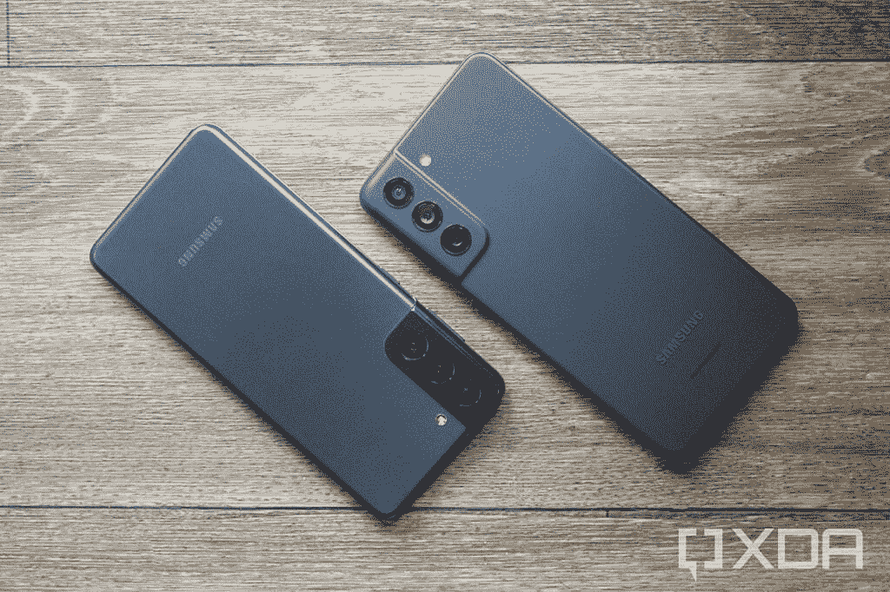
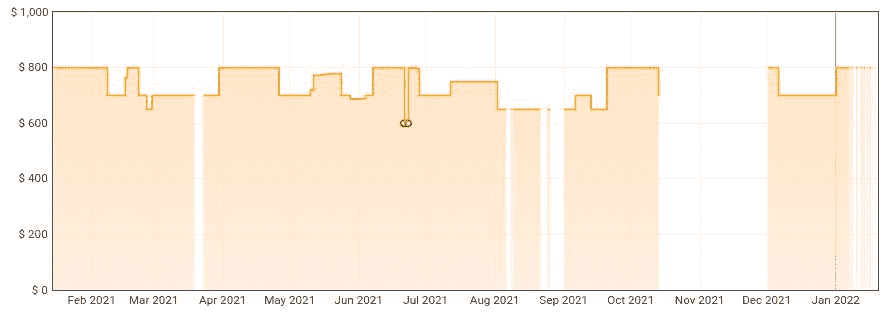

# 三星 Galaxy S21 vs Galaxy S21 FE:哪款手机值得你花钱？

> 原文：<https://www.xda-developers.com/samsung-galaxy-s21-vs-samsung-galaxy-s21-fe/>

经过几个月的谣言、泄露和(可能的)延迟，三星终于在 2022 年 1 月 3 日发布了[Galaxy 21 FE](https://www.xda-developers.com/samsung-galaxy-s21-fe/)—“FE”代表“粉丝版”。这款手机是备受喜爱的 [Galaxy S20 FE](https://www.xda-developers.com/samsung-galaxy-s20-fe-launch/) 的续集，主要是作为去年 [Galaxy S21](https://www.xda-developers.com/samsung-galaxy-s21/) 的一个预算更友好的版本。这款手机也可能是即将推出的 [Galaxy S22](https://www.xda-developers.com/samsung-galaxy-s22/) 系列的预算替代品，但没有这些手机的最终定价信息，我们还不能确定。

Galaxy S21 FE 的延迟发布意味着有许多因素需要考虑。如果你已经拥有一部 Galaxy S21，你应该升级吗？如果你两部手机都没有，哪一个更好地利用了你的钱？我们将在本对比指南中尝试回答这些问题(以及其他问题)。此外，在本指南中，我们只比较了**基本型号 Galaxy S21** 和 Galaxy S21 FE，而不是更昂贵的 Galaxy S21 Plus 或 Galaxy S21 Ultra。

*关于这篇文章:三星一月份给我们发了一部 Galaxy S21 FE 来评测。该公司对这篇文章的内容没有任何意见。*

## 三星 Galaxy S21 与 Galaxy S21 FE:规格

| 

规格

 | 

银河 S21

 | 

银河 S21 FE

 |
| --- | --- | --- |
| **构建** | 塑料背，金属框架 | 塑料背，金属框架 |
| **尺寸&重量** | 

*   151.7 x 71.2 x 7.9 毫米
*   171 克

 | 

*   155.7 x 74.5 x 7.9 毫米
*   177 克

 |
| **显示** | 

*   6.2 英寸 FHD+ AMOLED
*   2400 x 1080
*   120 赫兹刷新率

 | 

*   6.4 英寸 FHD+ AMOLED
*   2340 x 1080
*   120 赫兹刷新率

 |
| **SoC** | 

*   美国:高通骁龙 888
*   国际:Exynos 2100

 | 

*   美国:高通骁龙 888
*   国际:Exynos 2100

 |
| **风筒&储存** | 

*   8GB 内存/128GB 存储
*   8GB 内存/256GB 存储空间
*   没有 microSD 卡插槽

 | 

*   6GB 内存/128GB 存储空间
*   8GB 内存/256GB 存储空间
*   没有 microSD 卡插槽

 |
| **电池&充电** | 

*   4000 毫安时电池
*   25W 有线快速充电
*   15W 无线充电
*   4.5W 反向无线充电

 | 

*   4500 毫安时电池
*   25W 有线快速充电
*   15W 无线充电
*   4.5W 反向无线充电

 |
| **安全** | 显示指纹扫描仪 | 显示指纹扫描仪 |
| **后置摄像头** | 

*   主要:12MP，f/2.2，123˚ FoV
*   广角:1200 万像素，f/1.8，79°视野
*   长焦:64MP，f/2.4

 | 

*   主要:12MP，f/1.8，120˚ FoV
*   广角:12MP，f/2.2，123 FoV
*   长焦:800 万像素，f/2.4，32 FOV

 |
| **前置摄像头** | 10MP，f/2.2，80°视野 | 32MP，f/2.2，81 视场角 |
| **端口** | 

*   USB 类型-C
*   没有耳机插孔

 | 

*   USB 类型-C
*   没有耳机插孔

 |
| **音频** | 立体声扬声器 | 立体声扬声器 |
| **连通性** | 

*   Sub6/mmWave 5G
*   4G LTE
*   Wi-Fi 802.11 a/b/g/n/ac/x(双频)
*   蓝牙 5.0

 | 

*   Sub6/mmWave 5G
*   4G LTE
*   Wi-Fi 802.11 a/b/g/n/ac/x(双频)
*   蓝牙 5.0
*   超宽带

 |
| **软件** | 一个 UI 4.0/Android 12(发布时为 Android 11) | 一个 UI 4.0/Android 12 |
| **其他特色** | 

*   支持 NFC 的 Samsung Pay
*   IP68 等级

 | 

*   支持 NFC 的 Samsung Pay
*   IP68 等级

 |

## 三星 Galaxy S21 vs Galaxy S21 FE:设计和硬件

Galaxy S21 FE 的硬件设计与之前的 Galaxy S21 几乎相同。两款手机都有玻璃覆盖的显示屏和塑料后壳，设备内部有一个金属框架，背面有三个摄像头，底部有一个主扬声器和 USB Type-C 端口。不幸的是，这两款手机都没有耳机插孔或 microSD 卡插槽。

 <picture></picture> 

Galaxy S21 (left) and Galaxy S21 FE (right)

两者的主要区别在于物理大小。基本型号 Galaxy S21 的屏幕为 6.2 英寸，而 Galaxy S21 FE 的面板略大，为 6.4 英寸。两个屏幕都是 AMOLED，都有相同的 2340 x 1080 分辨率，都有 120Hz 的刷新率——唯一的区别是 Galaxy S21 FE 显示屏稍微大一点。

除此之外，背面的摄像头阵列不太明显。尽管它仍然像大多数其他高端智能手机上的摄像头一样，从手机背面伸出来，但颜色与外壳相匹配，侧面是倾斜的。无论如何，这都不是一个突破性的变化，但仍然值得注意。

由于 Galaxy S21 FE 稍大，三星能够安装更大的 4500 毫安时电池(相比之下，Galaxy S21 的电池容量为 4000 毫安时)。最便宜的 Galaxy S21 FE 也只有 6GB 内存，而所有版本的 Galaxy S21 都有 8GB 内存，但价格更高的 256GB Galaxy S21 FE 将内存提升到 8GB。

除了这些差异，这两款手机或多或少是一样的。他们在美国都有高通骁龙 888 芯片组，在其他地方都有 Exynos 2100，他们都有 [Android 12](https://www.xda-developers.com/android-12/) 和 [One UI 4](https://www.xda-developers.com/samsung-one-ui-4-android-12-update-tracker/) ，他们都支持 5G，等等。

## 三星 Galaxy S21 vs Galaxy S21 FE:相机

Galaxy S21 和 Galaxy S21 FE 的摄像头设置几乎相同，两款设备上都有超宽、广角和长焦后置摄像头。然而，它们之间有细微的差别。Galaxy S21 上的超宽比 Galaxy S21 FE 上的超宽像素尺寸略高(1.4μm vs 1.12μm)，所以质量在普通 Galaxy S21 上要好一点。最显著的区别是长焦相机 Galaxy S21 的长焦相机为 6400 万像素，而 S21 FE 只有 800 万像素。

在现实生活中，用这些手机拍摄的照片几乎完全相同。我努力寻找两者之间的区别，甚至在把它们复制到我的电脑上，在一个更大的显示屏上观看之后。主摄像头在两款手机上的表现大致相同，尽管 Galaxy S21 在纸面上略有优势，广角照片也很接近。

Galaxy S21 FE 拍摄的照片唯一明显较差的地方是长焦相机，但只是在某些情况下。Galaxy S21 FE 上分辨率较低的长焦镜头仍然可以像普通 Galaxy S21 一样处理明亮的区域，但如果你继续放大(特别是在较暗的环境下)，照片质量会比 S21 下降得更快。

## 结论:你应该得到哪一个？

Galaxy S21 粉丝版绝对是一款让人摸不着头脑的手机。它与基本型号 Galaxy S21 几乎相同，只是它的材料更便宜，并且多了一代操作系统更新(因此它应该会收到 Android 13、14 和 15，而 Galaxy S21 将在 14 停止)。Galaxy S21 在推出时为 799.99 美元，但它不止一次降至 699 美元，而 Galaxy S21 粉丝版的起价为 699.99 美元。三星可能会在未来几个月内降低 FE 的价格，使这款手机更划算，但该公司尚未采取任何行动。

如果你已经有了 Galaxy S21，并且你在考虑是否应该升级，答案是响亮的**不**。Galaxy S21 FE 并没有明显优于 Galaxy S21，在某些方面(比如长焦相机)还有点差。屏幕略大，还有三个主要的 Android 操作系统更新(相比之下，Galaxy S21 还有两个更新)，但这不足以保证花更多的钱。

对于使用旧设备的人，或者想放弃 iPhone 的人来说，答案就有点复杂了。Galaxy S21 FE 是一款好手机，但它不是 Galaxy S20 FE 首次发布时的绝对便宜货。这是一款略有不同的 Galaxy S21，价格高于 Galaxy S21 在过去六个月的大部分时间里的价格。

 <picture></picture> 

Galaxy S21 128GB pricing on Amazon (Source: [Keepa](https://keepa.com/#!product/1-B08N3J7GJ8))

整个 Galaxy S21 系列在零售商处开始缺货，这表明三星可能会从这一点开始将 Galaxy S21 FE 作为唯一可用的 Galaxy S21 型号销售。如果这是真的，交叉购买这两款手机有点毫无意义，除非你在新的 Galaxy S21 FE 和二手/翻新的 Galaxy S21 之间做出决定。

总结:如果你想要一部*新*手机，你在两者之间的唯一选择可能是 Galaxy S21 FE。不过，如果可以的话，我仍然建议等待销售——花 700 美元购买一部与一年前 800 美元几乎相同的手机没有太大意义，即使三星推出了一个新的 Android 更新。

 <picture></picture> 

Samsung Galaxy S21

去年的 Galaxy S21 仍然是一款很棒的手机，拥有快速的骁龙 888 芯片组和两个主要的 Android 操作系统更新。确保你只在打折的时候买。

 <picture></picture> 

Samsung Galaxy S21 FE

##### 三星 Galaxy S21 FE

较新的 Galaxy S21 FE 稍大一些，并且有一年多的 Android 操作系统更新，但在其他方面与 Galaxy S21 没有太大区别。

如果你持观望态度，我们建议等待 Galaxy S22 发布后再做决定。您还可以继续并[立即预订 Galaxy S22，并获得 50 美元的店内积分](https://shop-links.co/1763916363050265664?u1=8340adba-1b62-4725-bb8e-7015306510c6)以及其他预购优惠。