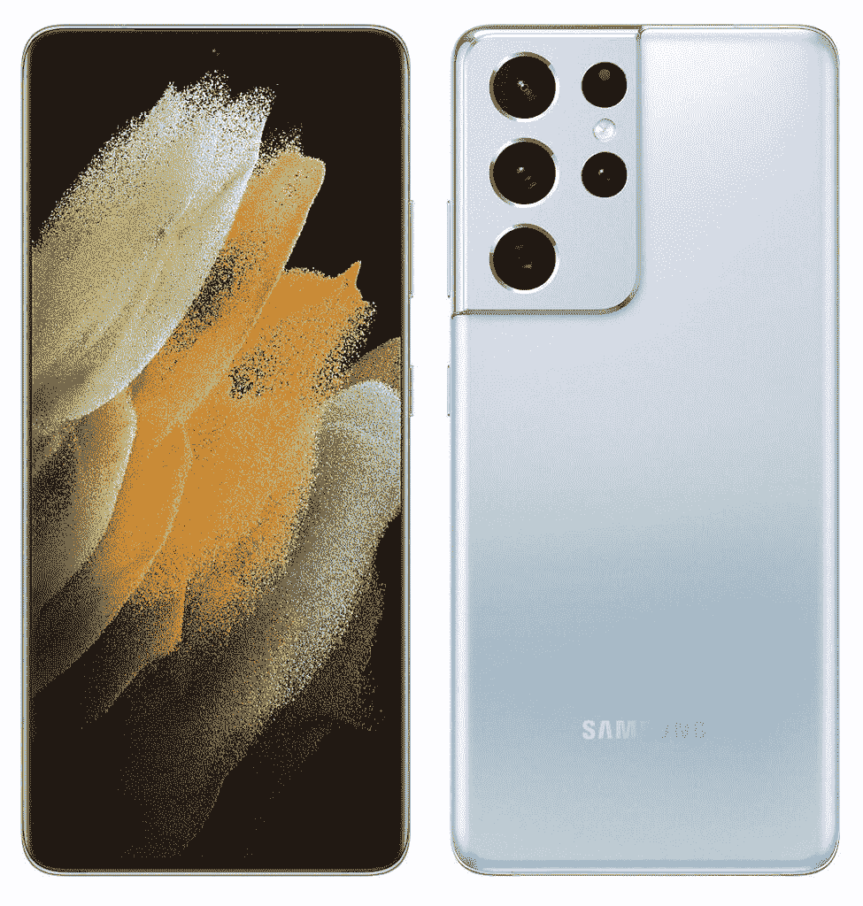

# 三星 Galaxy S21:2021 年秋季销售、价格、新闻、信息、规格、外壳和配件

> 原文：<https://www.xda-developers.com/samsung-galaxy-s21/>

三星 Galaxy S21、三星 Galaxy S21 Plus 和三星 Galaxy S21 Ultra 是三星最新的 5G 旗舰产品。它们代表了传统智能手机外形中消费者就绪技术的巅峰。这些手机采用了一流的技术，并且有史以来第一次，Galaxy Note 系列以外的手机提供了令人垂涎的 S Pen 体验。三星今年跳过了 Note 系列，转而支持最近推出的 Galaxy Z Fold 3。这意味着，如果你正在寻找一款出色的全能旗舰产品，S21 系列将继续保持三星为普通消费者提供的最佳产品，除非你真的想要一款可折叠的产品。 [Galaxy S22](https://www.xda-developers.com/samsung-galaxy-s22/) 系列预计将于明年初推出，但在此之前，这是你需要的关于当前一代 S21 的所有信息。

这里是你需要知道的关于三星 Galaxy S21 系列的一切，从规格到外壳和配件，如果你已经有了手机，你可以购买这些东西。

**浏览本页:**

**[Galaxy S21 Ultra，72 小时后:使用三星最好的手机后的 5 次外卖](https://www.xda-developers.com/samsung-galaxy-s21-ultra-preview-five-takeaways/)**

## 三星 Galaxy S21 系列:规格

| 

规范

 | 

三星 Galaxy S21

 | 

三星 Galaxy S21+

 | 

三星 Galaxy S21 Ultra

 |
| --- | --- | --- | --- |
| **构建** | 

*   铝制中框
*   塑料背面
*   大猩猩玻璃 Victus 正面

 | 

*   铝制中框
*   大猩猩玻璃 Victus 回
*   大猩猩玻璃 Victus 正面

 | 

*   铝制中框
*   大猩猩玻璃 Victus 回
*   大猩猩玻璃 Victus 正面

 |
| **尺寸&重量** | 

*   151.7 x 71.2 x 7.9 毫米
*   171 克

 | 

*   161.5 x 75.6 x 7.8 毫米
*   202 克

 | 

*   165.1 x 75.6 x 8.9 毫米
*   229 克

 |
| **显示** | 

*   6.2 英寸 FHD+动态 AMOLED 2X 平板显示器
*   2400 x 1080 像素
*   421 PPI
*   120Hz 可变刷新率
*   20:9 宽高比
*   HDR10+
*   1300 尼特峰值亮度
*   始终显示
*   无限显示

 | 

*   6.7 英寸 FHD+动态 AMOLED 2X 平板显示器
*   2400 x 1080 像素
*   394 PPI
*   120Hz 可变刷新率
*   20:9 宽高比
*   1300 尼特峰值亮度
*   HDR10+
*   始终显示
*   无限显示

 | 

*   6.8 英寸 QHD+动态 AMOLED 2X 曲面显示屏
*   3200 x 1440 像素
*   515 磅每英寸
*   120Hz 可变刷新率
    *   支持 120 赫兹 QHD+频率
    *   10-120 赫兹
*   20:9 宽高比
*   1500 尼特峰值亮度
*   HDR10+
*   始终显示
*   无限显示

 |
| **SoC** | 

*   **国际:** Exynos 2100:
    *   1x ARM Cortex X1 @ 2.9GHz +
    *   3 个 ARM Cortex A78 内核，2.8GHz 以上
    *   4 个 ARM Cortex A55 内核@ 2.2GHz
*   美国:高通骁龙 888:
    *   1 个 Kryo 680 Prime 内核@ 2.84GHz
    *   3 个 Kryo 680 性能内核@ 2.4GHz
    *   4 个 Kryo 680 高效内核@ 1.8GHz

 | 

*   **国际:** Exynos 2100:
    *   1x ARM Cortex X1 @ 2.9GHz +
    *   3 个 ARM Cortex A78 内核，2.8GHz 以上
    *   4 个 ARM Cortex A55 内核@ 2.2GHz
*   美国:高通骁龙 888:
    *   1 个 Kryo 680 Prime 内核@ 2.84GHz
    *   3 个 Kryo 680 性能内核@ 2.4GHz
    *   4 个 Kryo 680 高效内核@ 1.8GHz

 | 

*   **国际:** Exynos 2100:
    *   1x ARM Cortex X1 @ 2.9GHz +
    *   3 个 ARM Cortex A78 内核，2.8GHz 以上
    *   4 个 ARM Cortex A55 内核@ 2.2GHz
*   **美国:**高通骁龙 888:
    *   1 个 Kryo 680 Prime 内核@ 2.84GHz
    *   3 个 Kryo 680 性能内核@ 2.4GHz
    *   4 个 Kryo 680 高效内核@ 1.8GHz

 |
| **闸板&存放** | 

*   8GB LPDDR5 + 128GB
*   8GB + 256GB

 | 

*   8GB LPDDR5 + 128GB
*   8GB + 256GB

 | 

*   12GB LPDDR5 + 128GB
*   12GB + 256GB
*   16GB + 512GB

 |
| **电池&充电** | 

*   4000 毫安时
*   25W USB 供电 3.0 快充
*   15W 无线充电
*   4.5 反向无线充电
*   在大多数地区，包装盒中没有充电器

 | 

*   4800 毫安时
*   25W USB 供电 3.0 快充
*   15W 无线充电
*   4.5 反向无线充电
*   在大多数地区，包装盒中没有充电器

 | 

*   5000 毫安时
*   25W USB 供电 3.0 快充
*   15W 无线充电
*   4.5 反向无线充电
*   在大多数地区，包装盒中没有充电器

 |
| **安全** | 超声波显示指纹扫描仪 | 超声波显示指纹扫描仪 | 超声波显示指纹扫描仪 |
| **后置摄像头** | 

*   **主:** 12MP，广角镜头，f/1.8，1/1.76”，1.8 米，OIS，双像素自动对焦
*   **次要:** 12MP，超广角镜头，f/2.2，120 FoV，1/2.55”，1.4 m，定焦
*   **第三:** 64MP，长焦镜头，f/2.0，1/1.76”，0.8 米，OIS PDAF

 | 

*   **主:** 12MP，广角镜头，f/1.8，1/1.76”，1.8 m，OIS，双像素自动对焦
*   **次要:** 12MP，超广角镜头，f/2.2，120 FoV，1/2.55”，1.4 m，定焦
*   **第三:** 64MP，长焦镜头，f/2.0，1/1.76”，0.8 米，OIS PDAF

 | 

*   **初级:** 108 MP，广角镜头，f/1.8，79，24mm，1/1.33 "，0.8 m(诺娜-宁滨前)，OIS，PDAF，激光自动对焦
*   **次要:** 12 MP，超广角镜头，f/2.2，120 FoV，13mm，1/2.55”，1.4 m，双像素自动对焦
*   **第三:** 10 MP，长焦镜头，f/2.4，35，72mm，1/3.24”，1.22 m，OIS，3 倍光学变焦，双像素自动对焦
*   **四进制:**1000 万像素，长焦镜头，f/4.9，10，240 毫米，1/3.24 英寸，1.22 米，OIS，10 倍光学变焦，双像素自动对焦

视频:

*   所有前置和后置摄像头的 4K 为 60fps

 |
| **前置摄像头** | 10MP，f/2.2，1.22 m，80 FoV，双像素自动对焦 | 10MP，f/2.2，1.22 m，80 FoV，双像素自动对焦 | 40MP，f/2.2，0.7 米，80 FoV，PDAF |
| **端口** | USB 3.2 类型 C | USB 3.2 类型 C | USB 3.2 类型 C |
| **音频** | 

*   AKG 的立体声扬声器
*   杜比大气

 | 

*   AKG 的立体声扬声器
*   杜比大气

 | 

*   AKG 的立体声扬声器
*   杜比大气

 |
| **连通性** | 

*   蓝牙 5.1
*   国家足球联盟
*   无线网络 6
*   5G

 | 

*   蓝牙 5.1
*   国家足球联盟
*   无线网络 6
*   5G

 | 

*   蓝牙 5.1
*   国家足球联盟
*   Wi-Fi 6E
*   5G

 |
| **软件** | 基于 Android 11 的三星 One UI 3.1 | 基于 Android 11 的三星 One UI 3.1 | 基于 Android 11 的三星 One UI 3.1 |
| **其他特征** | 

*   IP68 防水等级
*   蚂蚁+
*   三星 DeX
*   诺克斯
*   Bixby 语音助手
*   谷歌探索窗格
*   某些地区的 MST 支持

 | 

*   IP68 防水等级
*   蚂蚁+
*   三星 DeX
*   诺克斯
*   超宽带
*   Bixby 语音助手
*   谷歌探索窗格
*   某些地区的 MST 支持

 | 

*   IP68 防水等级
*   蚂蚁+
*   三星 DeX
*   诺克斯
*   超宽带
*   Bixby 语音助手
*   谷歌探索窗格
*   Wacom 手写笔和 S Pen 支持(单独销售，外部存储)
*   某些地区的 MST 支持

 |
| **颜色** | 

*   幻影紫
*   幻影灰色
*   幻影白
*   幻粉色

 | 

*   幻影紫
*   幻影灰色
*   幻影白
*   Samsung.com 独家:

 | 

*   幻影灰色
*   幻影白
*   Samsung.com 独家:
    *   幻影钛
    *   幽灵海军
    *   幻影棕

 |

**[三星 Galaxy S21/Galaxy S21 Plus/Galaxy S21 超 XDA 论坛](https://forum.xda-developers.com/c/samsung-galaxy-s21-s21-s21-ultra.11933/)**

* * *

## 显示

先说 Galaxy S21 系列上的显示屏。该系列中的三款设备均采用动态 AMOLED 2x 显示屏，具有 120Hz 可变刷新率、20:9 宽高比和 HDR10+支持。这三款设备都有一个 Infinity-O 显示屏，这只是三星对居中打孔显示屏的营销术语。在所有三款手机的正面，您还可以获得最新的 [Gorilla Glass Victus](https://www.xda-developers.com/corning-gorilla-glass-victus-2m-drop-protection-double-scratch-resistance/) ，用于防刮擦和防摔保护。与以前的 Galaxy S 型号一样，Galaxy S21 系列也具有始终显示功能。

 <picture></picture> 

Samsung Galaxy S21+

这三款手机的主要区别在于显示屏的大小，从普通 Galaxy S21 的 6.2 英寸到 Plus 的 6.7 英寸和 Ultra 的 6.8 英寸。此外，普通版和 Plus 版的平板 FHD+面板相对较低端。Galaxy S21 Ultra 是事情变得有点有趣的地方，因为它的显示屏边缘有一个微妙的曲线，并提升到 QHD+分辨率。

 <picture></picture> 

Samsung Galaxy S21 Ultra

这也是三星 Galaxy 旗舰产品首次不仅获得了 QHD+分辨率和 120Hz 刷新率，还获得了 120Hz 刷新率，并可选择 QHD+分辨率。峰值亮度也有所不同，Ultra 的亮度高达 1500 尼特，而其他两个都限制在仍然可观的 1300 尼特。

* * *

## 设计

由于这三款手机的屏幕大小不同，尺寸必然不同，重量也不同。重量差异还因建筑材料的变化而进一步加剧。这三款设备都有铝制中框，但 Galaxy S21 像 Galaxy Note 20 一样采用了聚碳酸酯。Galaxy S21 Plus 和 Ultra 重新获得了大猩猩玻璃 Victus。

 <picture></picture> 

Samsung Galaxy S21

一加 9 对 Galaxy S21:哪个低于 800 美元的手机适合你？

另一个明显的设计变化是后置摄像头模块。今年它有了一个更独特的外观，相机模块在角落里流动，而不是一个孤岛。相机凸起仍然存在，但它具有更大的表面积，一直延伸到一个角落。因此，当放在桌子上时，手机应该不太容易摇晃。Galaxy S21 Ultra 拥有最大的摄像头模块，因为它增加了摄像头硬件。

 <picture></picture> 

Samsung Galaxy S21 Plus

总的来说，这些手机有一个干净和低调的外观。背面的 Samsung 标志是唯一的品牌标识(以及地区法律规定的其他强制性认证品牌标识)。这些设备底部有一个 USB 3.2 Type-C 端口和一个扬声器格栅，左侧有常见的电源按钮和音量摇杆。如果你在等待耳机插孔的回归，你会失望，因为它今年也不会出现。但从好的方面来看，整个系列的防水防尘等级为 IP68。

Galaxy S21 系列的最佳无线耳塞:Galaxy Buds Pro、索尼 WF-1000XM3 等等！

 <picture></picture> 

Samsung Galaxy S21 Ultra

对于生物识别，三星再次选择了该系列的超声波显示指纹扫描仪，跳过了光学显示和侧装指纹扫描仪。使用的超声波指纹扫描仪是高通的第二代 3D 声波传感器，比上一代超声波指纹扫描仪大 1.7 倍，快 30%。这将确保你在三星旗舰机上获得比以往更好的[解锁体验。](https://www.xda-developers.com/galaxy-s21-qualcomm-fingerprint-scanner-fix-problems/)

某些内存和存储型号可能并非所有颜色都有。此外，这些选项也可能会根据您所在的地区进行调整。

此外，有些颜色是 Samsung.com 独有的。其中包括 Galaxy S21 Plus 的幻影红和幻影金，以及 Galaxy S21 Ultra 的幻影棕、幻影海军和幻影钛。这些颜色仅限量供应，并且可能仅在预购期间供应。

* * *

## SoC、RAM 和存储

三星遵循其通常的模式，将设备 SOC 分为美国和其他一些选定的地区，以及世界其他地区。美国和中国香港等地区获得[高通骁龙 888 SoC](https://www.xda-developers.com/qualcomm-snapdragon-888-explained-specs-features/) ，而世界其他地区获得 [Exynos 2100 SoC](https://www.xda-developers.com/samsung-exynos-2100-specs-features/) 。我们专门报道了这些 SOC，我们鼓励您查看它们以了解更多详细信息。

正如该系列的一般主题一样，Galaxy S21 Ultra 的 RAM 和存储选项更多地处于过度使用的范围内(12GB + 128GB、12GB + 256GB、16GB + 512GB)，而 Galaxy S21 和 Galaxy S21 Plus 则获得了更多的实际容量(8GB + 128GB、8GB + 256GB)。不幸的是，这些手机都不支持 microSD 卡，所以马上为你选择合适的存储量。

* * *

## 照相机

相机设置是 Galaxy S21 和 Galaxy S21 Plus 与 Galaxy S21 Ultra 之间更具决定性的差异之一。Galaxy S21 和 Galaxy S21 Plus 具有相同的相机设置，而 Galaxy S21 Ultra 则有所改变。

### Galaxy S21 和 Galaxy S21 Plus:前后摄像头设置

对于 Galaxy S21 和 Galaxy S21 Plus，您可以获得一个三后置摄像头设置，包括一个主摄像头、一个超广角摄像头和一个长焦摄像头。

主相机是一个 12MP f/1.8 的拍摄器，带有 1/1.76 英寸的传感器，产生 1.8 m 大像素的图像。你可以在主相机上获得双像素自动对焦和 OIS。

辅助相机是一个 12MP f/2.2 拍摄器，带有 1/2.55”传感器，产生 1.4 m 大像素的图像。视野是 120，这不是最宽的，但本质上也不是一个坏的选择。

第三个相机是一个 64MP f/2.0 远摄镜头，带有 1/1.76”传感器，可生成 0.8 m 大像素的图像。你可以在这台相机上看到 PDAF 和 OIS，它的主要用途是用 3 倍光学变焦捕捉图像。

两款手机的前置摄像头都是 10MP f/2.2 拍摄器，可以产生 1.22 m 像素大小的图像，并具有双像素自动对焦。

### Galaxy S21 Ultra:前后摄像头设置

相机设置为 Galaxy S21 Ultra 提供了一种精彩的体验。只有辅助超广角摄像头是从 Galaxy S21 和 Galaxy S21 Plus 共享的。所有其他的相机都不一样。

主相机是一个 108MP f/1.8 拍摄器，带有一个 1/1.33 英寸的大传感器，产生 0.8 米大像素的图像。然后手机将这些像素中的九个合并成一个像素(非宁滨)，给你一个 12MP 的输出和 240 万的大像素。

背面的另外两个摄像头配有长焦镜头，每个镜头都投射到 1/3.24 英寸的传感器上，像素为 1.22 米。使用两个长焦镜头实质上提供了两个不同级别的光学变焦。第一个是 10MP f/2.4 拍摄器，提供 3 倍光学变焦，第二个是 10MP f/4.9 拍摄器，提供 10 倍光学变焦。两者都具有 OIS 功能。结合数字变焦，三星可以提供从 1 倍到 10 倍的无缝光学变焦体验，同时还承诺高达 100 倍的混合变焦能力，这被称为 100 倍空间变焦。

Galaxy S21 Ultra 还可以在所有相机上以 60fps 的速度拍摄 4K 视频。如果您需要更多选项，您可以在专业模式下点按“照片”以输出到 12 位 RAW 文件。

Galaxy S21 Ultra 上的前置摄像头是一个 4000 万像素、f/2.2 的射手，具有 0.7 米像素和 PDAF。

**[一加 9 Pro vs 三星 Galaxy S21 Ultra:超级手机之战！](https://www.xda-developers.com/oneplus-9-pro-vs-galaxy-s21-ultra/)**

### 相机有哪些新功能？

这些新的相机软件功能构成了基于 Android 11 的 One UI 3.1 的一部分，但它们本身值得一提，因为它们对新的三星 Galaxy S21 系列的相机体验非常重要:

*   改进的 8K 快照:从 8K 视频记录中抓取静止的 3300 万像素照片
*   Vlogger 视图:用前后摄像头同时捕捉视频。
*   导演视角:使用前置和后置摄像头同时捕捉视频，同时保留在多个后置摄像头之间快速切换的能力，同时访问所有摄像头输出的实时预览。
*   多麦克风录音:使用三星 Galaxy Buds Pro 等配对配件来录制环境声音，同时使用手机的麦克风进行录音。
*   单次拍摄:增加了新的专业风格的视频设置，如高亮视频和动态慢动作。
*   变焦锁定:通过锁定画面中心的焦点，最大限度地减少手的抖动，捕捉清晰的变焦图像。

* * *

## 电池和充电

由于手机的物理尺寸不同，还有一些其他的物理差异，它们也有不同大小的电池，从普通 Galaxy S21 的 4000 毫安时到 Galaxy S21 Plus 的 4800 毫安时和 Galaxy S21 Ultra 的 5000 毫安时。

令人欣慰的是，它们的充电能力始终保持不变(尽管这可能不完全是件好事)。这三款手机都获得了 25W USB Power Delivery 3.0 快速充电，15W 无线充电，以及提供 4.5W 反向无线充电的能力。有线充电解决方案肯定不是最快的，但它是通用的，所以你会很幸运地找到一个兼容的充电器，可靠地实现这些适度的速度。我们既松了一口气，同时又感到失望——对普遍性方法松了一口气，但失望是因为其他公司的专有技术要快得多。这种通用性将受到用户的青睐，尤其是因为这三款手机都不会在包装盒中附带电源模块(除了在特定地区)。

* * *

## 5G 和连接

5G 是整个产品线的标准，但在某些地区有很大的差异。例如，如果你在美国购买该设备，你将获得毫米波支持以及低于 6GHz 的 5G，而世界其他地区将不得不与低于 6GHz 的 5G 竞争。所以，如果你打算在购买地区之外使用手机，一定要记住这一点。

此外，三款手机都支持蓝牙 5.1 和 NFC，但 [Galaxy S21 Ultra 支持 Wi-Fi 6E(多亏了 Broadcom BCM4389](https://www.xda-developers.com/broadcom-galaxy-s21-ultra-wifi-6e-support/) )，而其他两款手机支持 Wi-Fi 6。

[超宽带](https://www.xda-developers.com/google-adding-ultra-wideband-uwb-api-android/)追踪是 Galaxy S21 Ultra 和 Galaxy S21 Plus 上的一项功能，但常规版本中却没有。

* * *

## 笔支架

今年发布的一个亮点是包含了[的笔](https://www.xda-developers.com/best-galaxy-s21-stylus/)支持。不过，只有 Galaxy S21 Ultra 得到了它，围绕它有一些警告。首先，S Pen 不是包装的一部分，设备内部没有空腔来存储 S Pen，因此需要单独购买并在外部存储。

三星正在单独销售有一个空腔来存放 S Pen 的外壳。不过，你在 S Pen 上失去了与蓝牙相关的功能，所以像空气触发器和遥控快门这样的东西都不起作用。我们认为这意味着你不一定也需要一支 S 笔——任何 Wacom 手写笔都可以。

[三星还计划在今年晚些时候销售 S Pen Pro](https://www.xda-developers.com/samsung-s-pen-pro-galaxy-s21-ultra-release-details/) ，所以如果你真的想进入 S21 系列的手写笔游戏，请密切关注。

* * *

## MST 支持和 Samsung Pay

三星 Galaxy S21 系列不支持 MST，仅限于使用 NFC 技术进行支付。这款手机在所有地区都支持 Samsung Pay，假设该功能在这些地区已经可用。

* * *

## Android 11 的一个 UI 3.1

三星 Galaxy S21 系列对三星的 UX 皮肤 One UI 进行了增量更新，即基于 Android 11 的 One UI 3.1。虽然没有很多突破性的功能添加或大修，但有一些值得注意的变化:

我们已经对一个 UI 3.1 比一个 UI 3.0 带来的[变化进行了更广泛的观察，所以请查看一下以了解更完整的内幕。](https://www.xda-developers.com/samsung-one-ui-3-1-features-changes/)

* * *

## 表壳和配件

作为现在的传统，三星为 Galaxy S21 Ultra 、 [Galaxy S21 Plus](https://www.xda-developers.com/best-galaxy-s21-plus-cases/) 和 [Galaxy S21](https://www.xda-developers.com/best-galaxy-s21-cases/) 提供了一系列官方[保护套。他们的官方保护套包括智能保护套、](https://www.xda-developers.com/best-galaxy-s21-ultra-cases/)[一个带 S 形笔的保护套](https://www.xda-developers.com/samsung-galaxy-s21-s-pen/)、[一个单独的 S 形笔](https://www.xda-developers.com/best-galaxy-s21-stylus/)，几个外观华丽的保护套，包括广受欢迎的 Kvadrat Cover+等等。当然， [Galaxy S21 系列](https://www.xda-developers.com/which-galaxy-s21-should-you-buy/)已经证明很受欢迎，很多人都在利用[最佳 Galaxy S21 Ultra deals](https://www.xda-developers.com/best-galaxy-s21-ultra-deals/) 和[最佳 Galaxy S21 deals](https://www.xda-developers.com/best-galaxy-s21-deals/) ，这是我们为您收集的。

除了三星的官方保护套，市场上还有大量第三方保护套，我们为您收集了这些保护套，包括 Galaxy S21 Ultra 的[最佳超薄保护套](https://www.xda-developers.com/best-galaxy-s21-ultra-thin-cases/)、 [Galaxy S21 Plus](https://www.xda-developers.com/best-galaxy-s21-plus-thin-cases/) 和[Galaxy S21](https://www.xda-developers.com/best-galaxy-s21-thin-cases/)；Galaxy S21 Ultra 、 [Galaxy S21 Plus](https://www.xda-developers.com/best-galaxy-s21-plus-rugged-cases/) 和 [regular Galaxy S21](https://www.xda-developers.com/best-galaxy-s21-rugged-cases/) 的[最佳加固保护套；以及 S21 Ultra](https://www.xda-developers.com/best-galaxy-s21-ultra-rugged-cases/) 、 [Galaxy S21 Plus](https://www.xda-developers.com/best-galaxy-s21-plus-clear-case/) 和普通 Galaxy S21 型号的[最佳清晰案例。](https://www.xda-developers.com/best-galaxy-s21-ultra-clear-cases/)

以下是三星官方的保护套:

Galaxy S21 Ultra 还有两个外壳，这些都是 S Pen 附带的:S Pen 附带的硅胶外壳和 S Pen 附带的智能清晰视图外壳。

三星还推出了两款新的无线充电器，以及[三星 SmartTag](https://www.xda-developers.com/samsung-galaxy-smarttag-launch-find-lost-items/) 和[三星 Galaxy Buds Pro](https://www.xda-developers.com/samsung-galaxy-buds-pro/) 。

* * *

## 三星 Galaxy S21 系列:定价和供货情况

三星 Galaxy S21 系列定价如下:

| 

没有。

 | 

设备

 | 

美利坚合众国

 | 

欧洲

 | 

英国

 | 

印度

 |
| --- | --- | --- | --- | --- | --- |
| 1. | 三星 Galaxy S21 - 8GB + 128GB(幻影紫、幻影灰、幻影粉、幻影白) | $799.99 | €849 | £769 | ₹69,999 |
|  | 三星 Galaxy S21 - 8GB + 256GB(幻影灰) | $899.99 | €899 | £819 | ₹73,999 |
| 2. | 三星 Galaxy S21 Plus - 8GB + 128GB(幻影紫、幻影银、幻影黑) | $999.99 | €1,049 | £949 | ₹81,999 |
|  | 三星 Galaxy S21 Plus - 8GB + 256GB(幻影黑) | $1,099.99 | €1,09 | £999 | ₹85,999 |
| 3. | 三星 Galaxy S21 超 12GB + 128GB(幻影银，幻影黑) | $1,199.99 | €1,249 | £1,149 | - |
|  | 三星 Galaxy S21 超 12GB + 256GB(幻影黑) | $1,299.99 | €1,299 | £1,199 | ₹1,05,999 |
|  | 三星 Galaxy S21 超 16GB + 512GB(幻影黑) | $1,399.99 | €1,429 | £1,329 | ₹1,16,999 |

*注意:其他颜色将通过 Samsung.com 销售。这些定制颜色的库存有限，只能持续到预购期。*

三星 Galaxy S21 系列现已公开发售。您可以通过以下链接购买该设备！消费者将能够通过 Samsung.com、运营商、线上和线下零售商购买这些设备。

 <picture></picture> 

Samsung Galaxy S21

三星 Galaxy S21 是 2021 年新旗舰系列的起点，包装在一个旗舰 SoC 中，以及一个体面的显示器和相机设置。

 <picture></picture> 

Samsung Galaxy S21 Plus

##### 三星 Galaxy S21 Plus

三星 Galaxy S21 Plus 是 2021 年新旗舰系列中的老二，集旗舰 SoC 和高级构建于一身，配有体面的显示屏和摄像头设置。

 <picture></picture> 

Galaxy S21 Ultra

三星 Galaxy S21 Ultra 是 2021 年新旗舰系列中的终极杀手锏，集旗舰 SoC、高级构建、出色的显示屏和令人惊叹的相机设置于一身，以及高级旗舰上预期的所有额外功能。

**[应该买哪个 Galaxy S21？普通的，高级的，还是超高级的？](https://www.xda-developers.com/which-galaxy-s21-should-you-buy/)**

三星 Galaxy S21 系列于 2021 年 1 月 20 日至 1 月 28 日接受预购。预订设备的客户在 Galaxy S21 上获得了价值 100 美元的三星积分，在 Galaxy S21 Plus 上获得了 150 美元的三星积分，在 Galaxy S21 Ultra 上获得了 200 美元的三星积分。所有预购还包括免费的 Galaxy SmartTag。Galaxy S21 系列的运营商和无锁版从 2021 年 1 月 29 日开始在全球公开销售。

**[Galaxy S21 的最佳替代品——购买顶级手机！](https://www.xda-developers.com/best-samsung-galaxy-s21-alternatives/)**

在印度，预购这款设备的消费者可以免费获得一个三星 Galaxy 智能标签，以及一张三星购物优惠券，最高可达₹10,000.HDFC 银行客户获得了₹10,000 返现，而三星升级计划提供了高达₹5,000.的额外奖励预购从 2021 年 1 月 15 日开始，早期交付从 2021 年 1 月 25 日开始。从 2021 年 1 月 29 日开始，在 Samsung.com/in,三星歌剧院、线下零售店、Amazon.in、Flipkart、Crome 和 Reliance Digital 进行公开销售。

## 第三方外壳和配件

现在 Galaxy S21 系列已经公开销售，您可以在第三方外壳和配件中获得相当多的选择。我们在下面列出了一些很好的选项:

[标签]

[tab title ="Galaxy S21 表壳和配件"]

所有这些选项都适用于常规 Galaxy S21 型号:

[/tab]

[tab title ="Galaxy S21 Plus 表壳和配件"]

所有这些选项都适用于 Galaxy S21 Plus，它是家中的老二:

[/tab]

[tab title ="Galaxy S21 Ultra 表壳和配件"]

所有这些选项都适用于顶级旗舰产品 Galaxy S21 Ultra:

[/tab]

[/tabs]

## 案例回顾

我们还查看了一些配件，所以在您购买之前，请务必查看我们的想法:

我们将在未来尝试更多的配件，所以请继续关注进一步的建议！

## 发展

三星设备不被认为是非常友好的开发者，即由于 Knox 及其为社区带来的限制。尽管如此，你仍然可以参与一些定制开发工作——只是要知道这个过程可能比更友好的设备更困难，结果可能与你的期望不一致。

你可以尝试用这个[非官方的 TWRP 端口为三星 Galaxy S21 系列](https://www.xda-developers.com/unofficial-twrp-samsung-galaxy-s21-plus-ultra/)进行定制开发工作。请注意，闪烁任何自定义恢复将绊倒诺克斯，你将无法在手机上的 OTA 更新了。