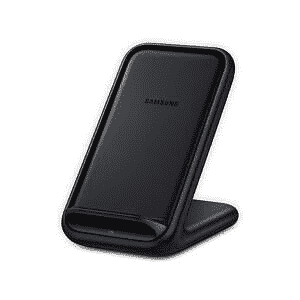

# 三星 Galaxy S22 系列支持无线充电吗？

> 原文：<https://www.xda-developers.com/samsung-galaxy-s22-charging/>

无线充电是许多消费者在下一代手机中寻找的一项功能。就个人而言，给手机充电并不是最乏味的任务，但是插上和拔下一根电缆需要额外的几秒钟。使用无线充电器要方便得多，许多高端手机都支持这一功能。如果你想知道，是的，这包括三星 Galaxy S22 系列。

Galaxy S22 系列的三款手机都支持无线充电，包括反向无线充电(三星称之为无线 PowerShare)。考虑到三星的旗舰手机支持无线充电已经有一段时间了，这不应该是一个惊喜。不过，盒子里没有无线充电器。你可以在下面的拆箱文章中看到盒子里有什么:

## Galaxy S22 系列的无线充电是如何工作的？

就像目前大多数其他手机一样，三星 Galaxy S22 系列采用 Qi 标准进行无线充电。这是一个通过短程无线连接传输电力的接口，允许您在不插入电缆的情况下为手机充电。本质上，你需要做的就是把你的手机放在无线充电器上(它可以是一个垫子，支架，或者任何可以在里面安装充电线圈的东西)，如果它正确对齐，它就会开始充电。Qi 几乎是目前唯一重要的无线充电标准，因此找到一个兼容的充电器应该很容易。

 <picture></picture> 

Multiple devices charging on a wireless charger

三星 Galaxy S22 系列支持高达 15W 的无线充电速度，这不是最快的，但仍然很快。这是无线充电的缺点之一——它往往比有线充电慢。例如，Galaxy S22 和 Galaxy S22 Plus 支持高达 25W 的有线充电，Galaxy S22 Ultra 支持高达 45W 的充电。无线充电的局限性是存在的，因为很难在不产生大量热量的情况下无线传输电力，这些热量可能会造成损坏。

但这还不是全部，因为 Galaxy S22 手机还支持无线 PowerShare，即反向无线充电。本质上，你可以把你的手机作为另一个设备的充电器。Galaxy S22 系列可以为另一台设备提供高达 4.5W 的功率。虽然你可以尝试用这种方式给另一部手机充电，但这实际上是为了给支持无线充电的配件充电，如三星的 Galaxy Buds Pro。因为这些设备的电池很小，所以用这种方式充电很容易。

## 你应该买一个无线充电器吗？

无线充电并不是必需品，而是一项便利功能。就像我们说过的，它允许你把手机放在充电器上就能充电，不需要摆弄电缆。你可以在工作时让手机在办公桌上充电，甚至可以找一个充电支架来支撑手机，这样你就可以在需要的时候轻松地看一眼屏幕。它更适合“放下就忘”的情况，所以下次你拿起手机时，你就能更好地在一天中使用它。

 <picture></picture> 

Samsung 15W Wireless charger stand

另一个很大的好处是，当手机充电时，你可以使用 USB Type-C 端口做其他事情。三星 Galaxy S22(像大多数旗舰手机一样)没有耳机插孔，所以如果你想使用有线耳机，你需要那个端口。使用无线充电器，您可以在这种情况下保持端口空闲。您需要找出适合这种情况的理想充电器，因为许多支架会在纵向方向上阻挡端口，而其他一些支架可能没有正确的线圈定位来进行横向充电。

不过，无线充电也有缺点，因为在这种充电方式下，你无法真正使用手机。每次你拿起手机，它都会停止充电，直到你把它放回充电器上，对一些人来说，这比有线充电更不方便。此外，正如我们提到的，无线充电在大多数情况下没有有线充电快，而且也更贵。

无论如何，如果你认为利大于弊，你可以看看你能为 Galaxy 手机得到的最好的无线充电器。此外，我们还为您提供了一份[最佳有线充电器](https://www.xda-developers.com/best-samsung-galaxy-s22-chargers/)的清单。

如果你想了解三星最新手机的所有信息，请查看我们的 [Galaxy S22 实践](https://www.xda-developers.com/samsung-galaxy-s22-hands-on/)，重点是普通和 Plus 型号，如果你想要顶级型号，也可以查看 [Galaxy S22 Ultra 实践](https://www.xda-developers.com/samsung-galaxy-s22-ultra-hands-on/)。你可以在下面购买这两款手机，或者查看我们关于 Galaxy S22 系列的[最佳交易的综述。](https://www.xda-developers.com/best-samsung-galaxy-s22-deals/)

 <picture></picture> 

Samsung Galaxy S22

三星 Galaxy S22 由骁龙 8 Gen 1 驱动，支持最高 15W 的无线充电。

 <picture></picture> 

Samsung Galaxy S22 Plus

##### 三星 Galaxy S22 Plus

Galaxy S22 Plus 和 S22 一样棒，但现在有了更大的电池和显示屏。

 <picture></picture> 

Samsung Galaxy S22  Ultra

与较小的型号相比，Galaxy S22 Ultra 有更大更好的显示屏，内置 S Pen 等。