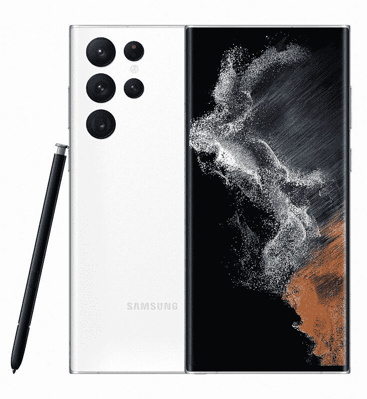

# 三星 Galaxy S22 系列支持开箱即用的 eSIM 双 SIM 卡

> 原文：<https://www.xda-developers.com/samsung-galaxy-s22-esim-dual-sim-support/>

# Galaxy S22 系列将在发布时支持带有 eSIM 的双 SIM 卡

三星 Galaxy S22 系列自带 eSIM 支持，这要归功于一个 UI 4.1，使双 SIM 卡支持也成为可能。请继续阅读！

美国是一个独特的市场，长期以来一直坚持在智能手机中支持物理和单 SIM 卡，即使世界其他地区已经发展到双 SIM 卡插槽(默认)和广泛的 e SIM 支持。但美国的情况也在慢慢改变。在美国新推出的[三星 Galaxy S22 系列](https://www.xda-developers.com/samsung-galaxy-s22-hands-on/)自带 eSIM 支持，解锁了诸如同一部手机上的两个网络等优势。

正如我们从[手中的](https://www.xda-developers.com/samsung-galaxy-s22-ultra-hands-on/)Galaxy S22 Ultra(未锁定)单元中可以确认的那样，用户将可以选择为设备添加 eSIM。

如果你还记得，上一代 Galaxy S21 系列在美国没有推出 eSIM 和双 SIM 卡支持。然而，随着该设备的一次 UI 4 更新，[地区的 eSIM 功能被添加到](https://www.xda-developers.com/galaxy-21-oneui-4-esim/)。对于 Galaxy S22 系列，我们可以确认 eSIM 以及随后的双 SIM 卡功能(物理 nano-SIM + eSIM)在美国的未锁定型号上可用。我们没有美国所有运营商的确认信息，但我们已经看到 Galaxy S21 系列的运营商版本在他们的一个 UI 4.0 更新中获得了这一功能。由于 Galaxy S22 系列推出了一个开箱即用的 UI 4.1，我们也对运营商版本持乐观态度。

借助 eSIM 功能，用户无需物理 SIM 卡即可将手机添加到网络中。对于电子即时消息有多大用处，人们意见不一，尤其是如果你经常使用手机的话。但考虑到它们为在带有 SIM 卡插槽的同一部手机上使用第二个网络提供了可能性，e SIM 成为不想运行两部手机的人的有效选择。它还使网络测试更容易，因为您可以为特定网络安装 eSIM 配置文件，并支付一小段时间(如一个月)的服务费用。

 <picture></picture> 

Samsung Galaxy S22

三星 Galaxy S22 是 2022 年的入门级旗舰产品，以适合许多口袋和预算的形式带来了顶级的性能和相机功能。

 <picture></picture> 

Samsung Galaxy S22 Plus

##### 三星 Galaxy S22 Plus

三星 Galaxy S22 Plus 是 2022 年的中期旗舰产品，在更大的外壳中为那些需要做更多事情的人带来了顶级的性能、显示和相机功能。

 <picture></picture> 

Samsung Galaxy S22 Ultra

三星 Galaxy S22 Ultra 是 2022 年的顶级旗舰产品，带来了顶级的性能、显示和相机功能以及 S Pen 功能，为高级用户提供了超级体验。